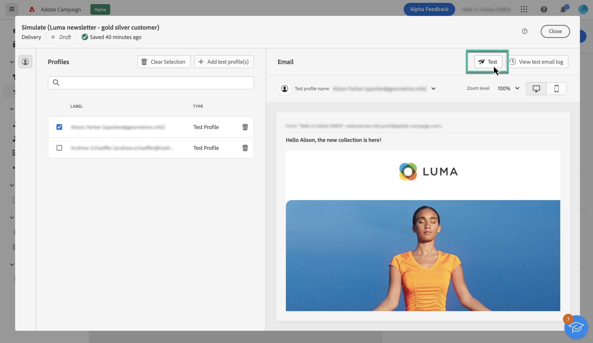
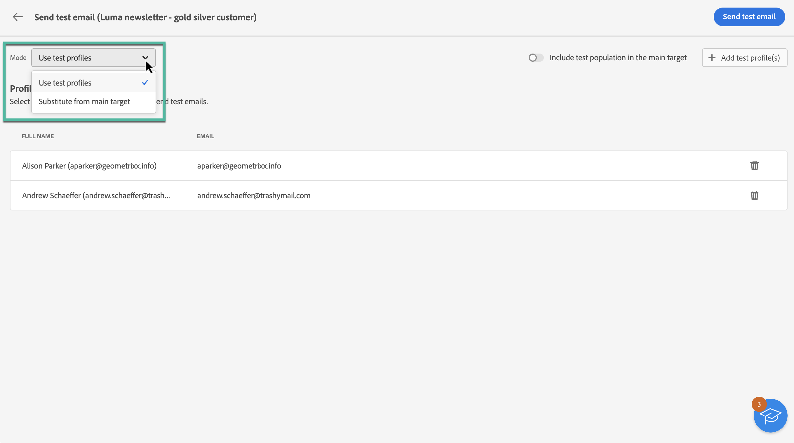
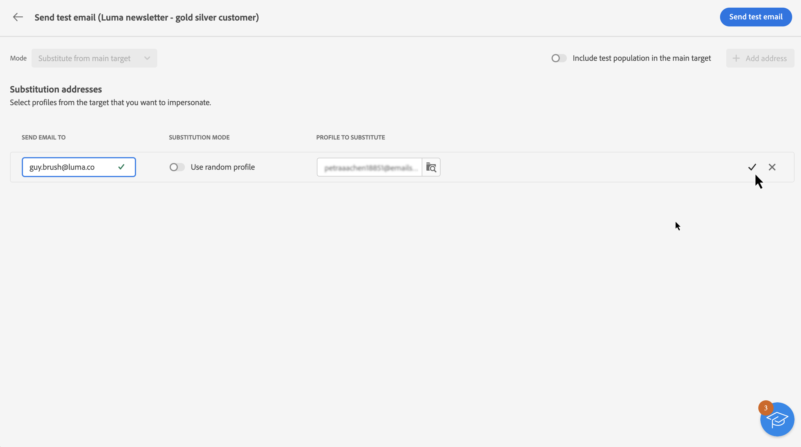
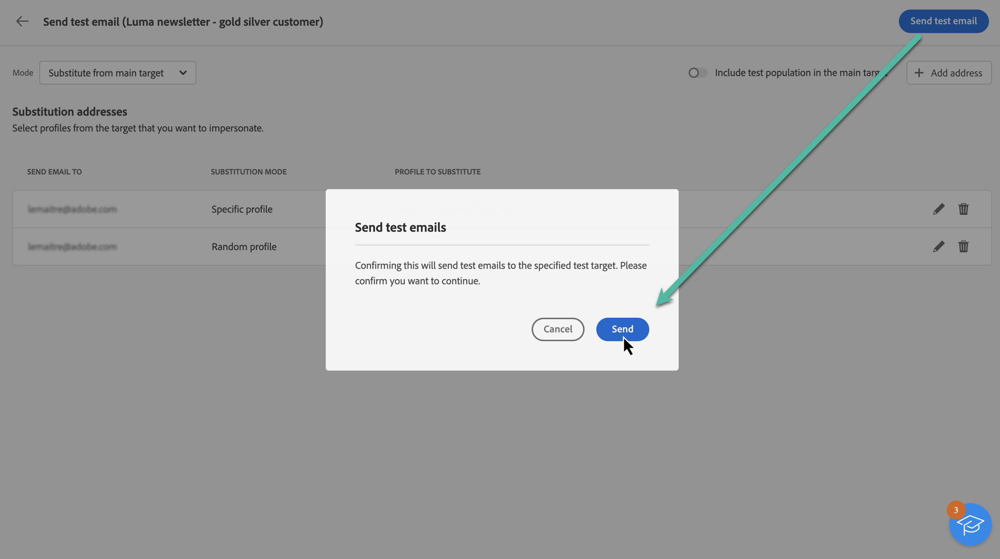
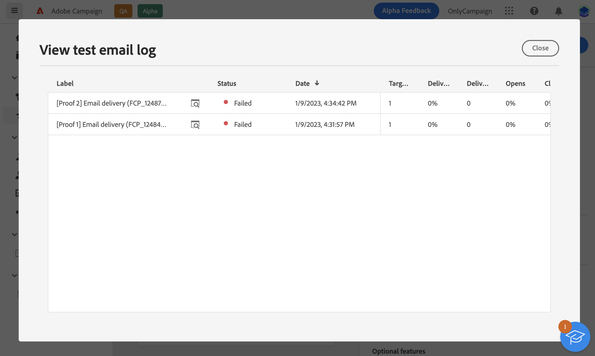
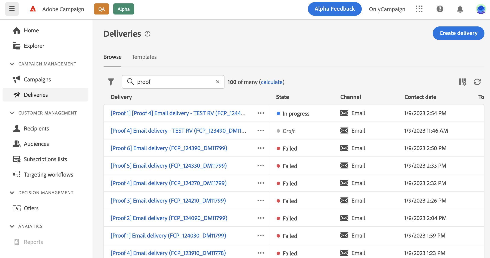

# Send test emails {#send-proofs}

Sending test emails is an important step in validating your email campaign and identifying potential issues. By sending test emails, you can check various elements such as links, opt-out links, images, and mirror pages, as well as detect any errors.

Test emails can be sent to two types of recipients: 

* **Test profiles**: send test emails to seed addresses, which are additional and fictitious recipients in the database. They can be created in Adobe Campaign console into the **[!UICONTROL Resources]** / **[!UICONTROL Campaign Management]** / **[!UICONTROL Seed addresses]** folder.
    
* **Substitution from main target**: send test emails to a specific email address while impersonating an existing profile. This allows you to experience the email as the recipients would, giving you an accurate representation of the message that the profile receives.

## Select the test recipients {#recipients}

1. Access the email content simulation screen, then click the **[!UICONTROL Test]** button.

    

1. Use the **[!UICONTROL Mode]** drop-down list to choose the type of recipients that receive the test email:

    * **Test profiles**: send the test email to seed addresses, which are additional and fictitious recipients in the database,
    
    * **Substitution from main target**: send the test email to a specific email address while impersonating an existing profile. This allows you to experience the email as the recipients would, giving you an accurate representation of the message that the profile will receive.

    

    >[!NOTE]
    >
    >By default, the **[!UICONTROL Test profiles]** mode is selected. If you have already selected profiles to preview the email in the content simulation screen, those profiles are pre-selected as test recipients. You can clear your selection and/or add additional recipients.

1. To send test emails to substitution profiles, choose the **[!UICONTROL Substitution from target]** mode then follow these steps:

    1. Click the **[!UICONTROL Add address]** button and specify the email address that receives the test email.

        You can enter any email address. This allows you to send test emails to any users, even if they are not users of Adobe Campaign V8.

    1. Select the profile from the target to use to send the test email. You can also let Adobe Campaign select a random profile from the target.

    1. Confirm the recipient and repeat the operation to add as many addresses as needed.

        

1. Once the test recipients have been selected, you can send the test email. [Learn how to send test emails](#send)

    >[!NOTE]
    >
    >If you want to send the final email message to the recipients of the test email, enable the **[!UICONTROL Include test population in the main target]** option on.

## Send the test email {#send}

To send the test email to the selected recipients, click **[!UICONTROL Send test email]** then confirm the sending.

Send as many test emails as necessary until you have finalized the content of your delivery. Once this is done, you can send the email to the main target. [Learn how to prepare and send your email](../monitor/prepare-send.md)

## Access sent test emails {#access-proofs}

Once the test emails have been sent, you can access dedicated logs from the **[!UICONTROL View test email log]** button.

These logs allow you to access all the test emails sent for the selected delivery, and to visualize specific statistics related to their sending. [Learn how to monitor delivery logs](../monitor/delivery-logs.md)

You can also access sent test emails from the deliveries list, like any delivery.

