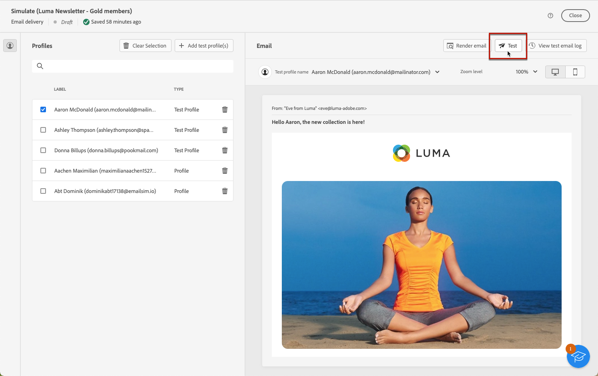
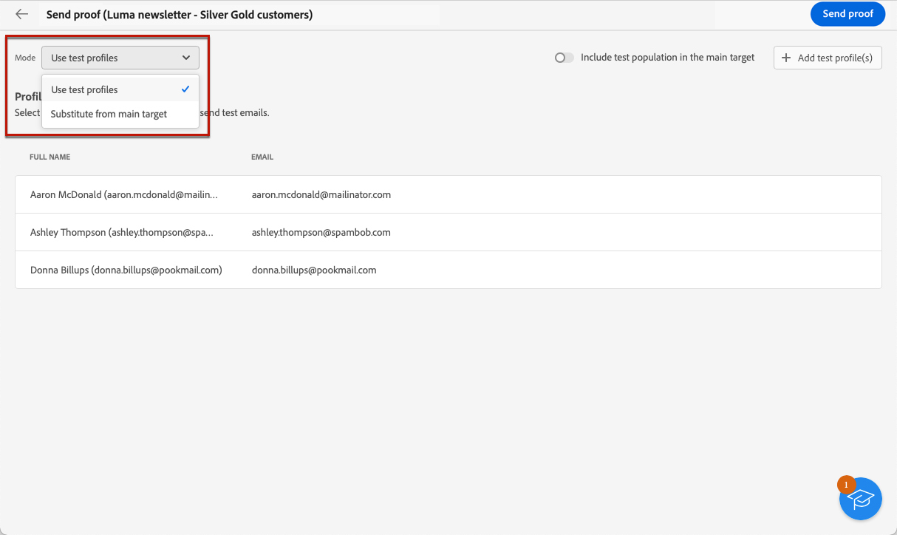
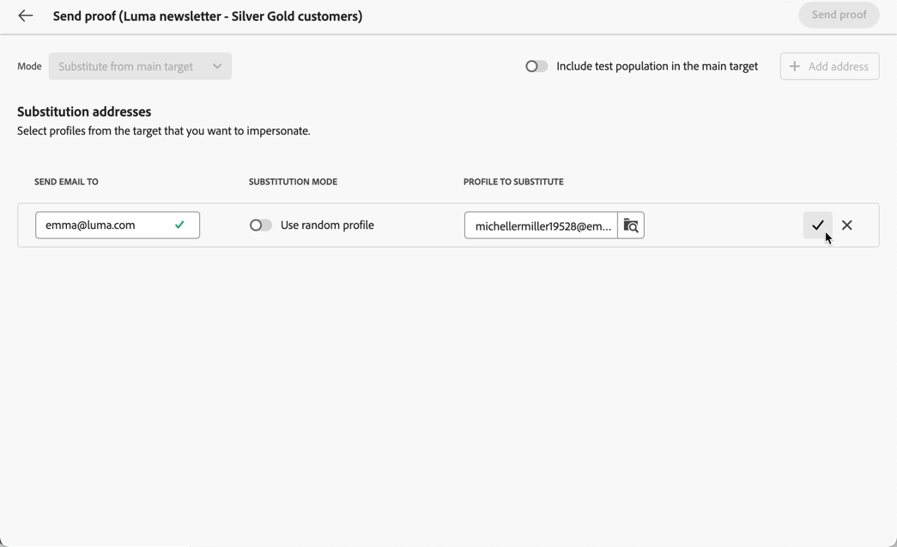
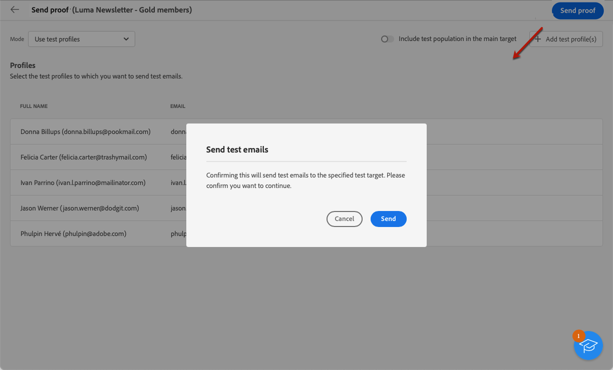
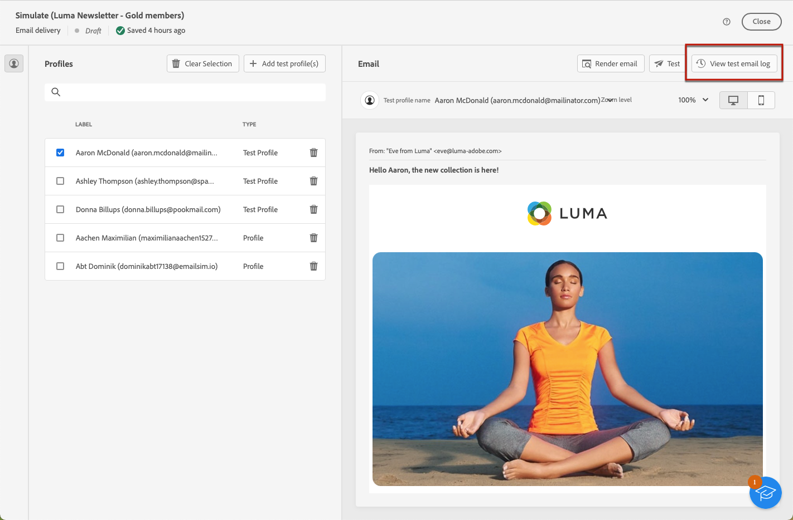
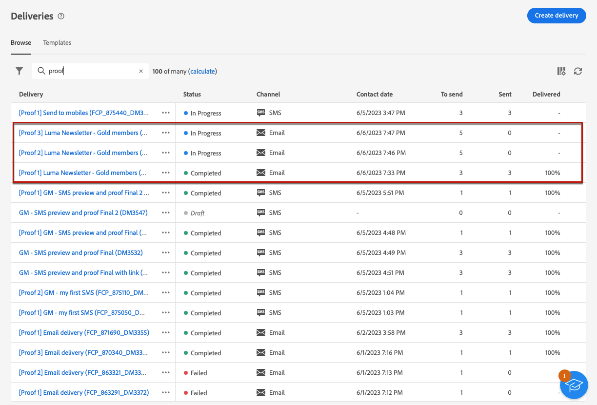

# 傳送測試電子郵件 {#send-test-emails}

**[!UICONTROL Adobe Campaign]** 可讓您在將訊息傳送給主要對象之前先測試訊息。

傳送測試電子郵件是驗證電子郵件行銷活動和識別潛在問題的重要步驟。

測試的收件者可檢查各種元素，例如連結、退出連結、影像和映象頁面，並偵測轉譯、內容、個人化設定和電子郵件設定中的任何錯誤。

## 選取測試收件者 {#test-recipients}

測試電子郵件可以傳送給兩種收件者類型：

* **測試設定檔**  — 將測試電子郵件傳送至種子地址，這些地址是資料庫中其他虛構的收件者。 它們可以在以下位置建立： [!DNL Campaign] 主控台進入 **[!UICONTROL 資源]** > **[!UICONTROL Campaign Management]** > **[!UICONTROL 種子地址]** 資料夾。 [了解更多](https://experienceleague.adobe.com/docs/campaign-classic/using/sending-messages/using-seed-addresses/creating-seed-addresses.html){target="_blank"}

* **從主要目標替代**  — 模擬現有設定檔時，將測試電子郵件傳送至特定電子郵件地址。 這可讓您如同收件者一樣體驗電子郵件，可精準呈現設定檔所接收的訊息。

若要選取電子郵件測試的收件者，請遵循下列步驟。

1. 存取電子郵件 [編輯內容](../content/edit-content.md) 畫面或 [電子郵件設計工具](../content/get-started-email-designer.md)，然後按一下 **[!UICONTROL 模擬內容]** 按鈕。

1. 按一下 **[!UICONTROL 測試]** 按鈕。

   

1. 使用&#x200B;**[!UICONTROL 模式]**&#x200B;下拉式清單選擇會收到測試電子郵件的收件者類型：

   * **測試設定檔** 將目標定位為虛構的收件者

   * **從主要目標替代** 顯示現有設定檔中的資料時，將測試傳送至特定電子郵件地址。

   

   >[!NOTE]
   >
   >根據預設， **[!UICONTROL 使用測試設定檔]** 模式已選取。 如果您已選取設定檔在內容模擬畫面中預覽電子郵件，這些設定檔將被預先選取為測試收件者。您可以清除選取和/或新增其他收件者。

1. 若要傳送測試電子郵件至替代設定檔，請選擇 **[!UICONTROL 從目標替代]** 模式，然後按照以下步驟操作：

   1. 按一下「**[!UICONTROL 新增地址]**」按鈕並指定接收測試電子郵件的電子郵件地址。

      您可以輸入任何電子郵件地址。這可讓您傳送測試電子郵件給任何使用者，即使他們不是的使用者 [!DNL Adobe Campaign].

   1. 從目標中選取要用作代用的設定檔。 您也可以讓 [!DNL Adobe Campaign] 從目標中選取隨機設定檔。 來自所選設定檔的設定檔資料將顯示在測試電子郵件中。

   1. 確認收件者並重複操作以新增所需數量的地址。

      

1. 選取測試收件者後，您可以 [傳送測試電子郵件](#send-test).

   >[!NOTE]
   >
   >若要同時傳送最終電子郵件訊息給測試電子郵件的收件者，請選取 **[!UICONTROL 在主要目標中包含測試族群]** 選項。

## 傳送測試電子郵件 {#send-test}

若要將測試電子郵件傳送給選取的收件者，請遵循下列步驟。

1. 按一下 **[!UICONTROL 傳送測試電子郵件]**.

1. 確認傳送。

   

1. 視需要多次傳送測試電子郵件，直到您最終確定傳遞內容。

完成此操作後，您可以 [準備並傳送您的電子郵件](../monitor/prepare-send.md) 至主要目標。

## 存取已傳送的測試電子郵件 {#access-proofs}

傳送測試電子郵件後，您可以從「**[!UICONTROL 檢視測試電子郵件記錄]**」按鈕存取專屬記錄。

這些記錄可讓您存取為選取的傳遞傳送的所有測試電子郵件，並視覺化與其傳送作業相關的特定統計資料。[了解如何監控傳遞記錄](../monitor/delivery-logs.md)

您也可以從以下位置存取已傳送的測試電子郵件： [傳遞清單](../msg/gs-messages.md)，與任何傳送一樣。

