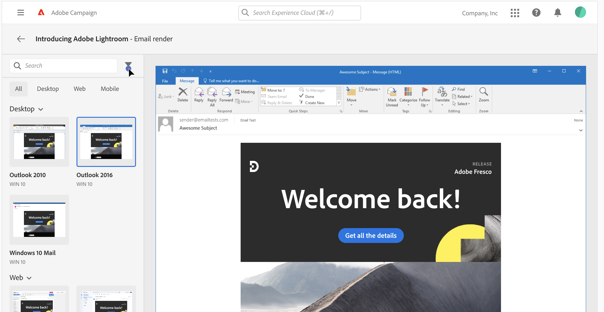

# Test the email rendering {#rendering}

Before sending your email, make sure that your message is displayed to the recipients in an optimal way on a variety of web clients, web mails and devices.

To do this, Adobe Campaign allows you to preview the sent message in the different contexts in which it may be received and check the compatibility in major desktops and applications (webmail, message service, mobile, etc.).

To test the email rendering, follow these steps:

1. Access the email content creation screen, then click **[!UICONTROL Simulate content]**.

1. Click the **[!UICONTROL Render email]** button.

    The left pane provides various desktop, mobile and web-based email clients. Select the desired email client to display a preview of your email in the right pane. 

    

    >[!NOTE]
    >
    >The email clients list provides a sample of the major mail clients. Additional email clients are available from the filter button next to the top search bar.
