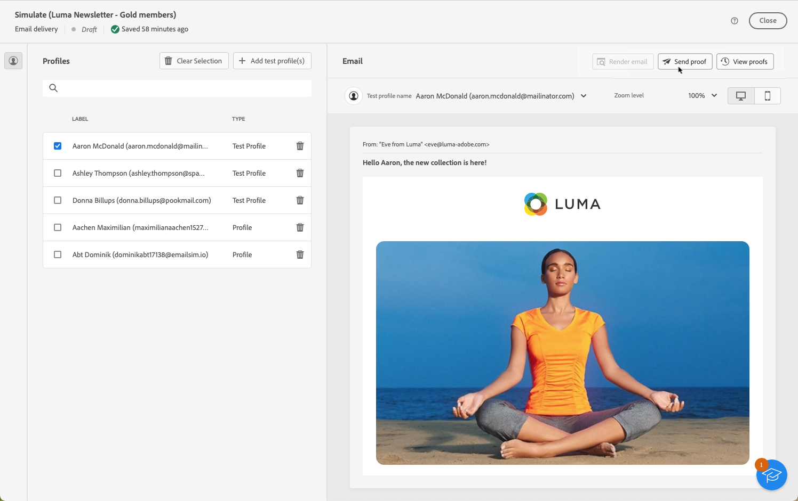
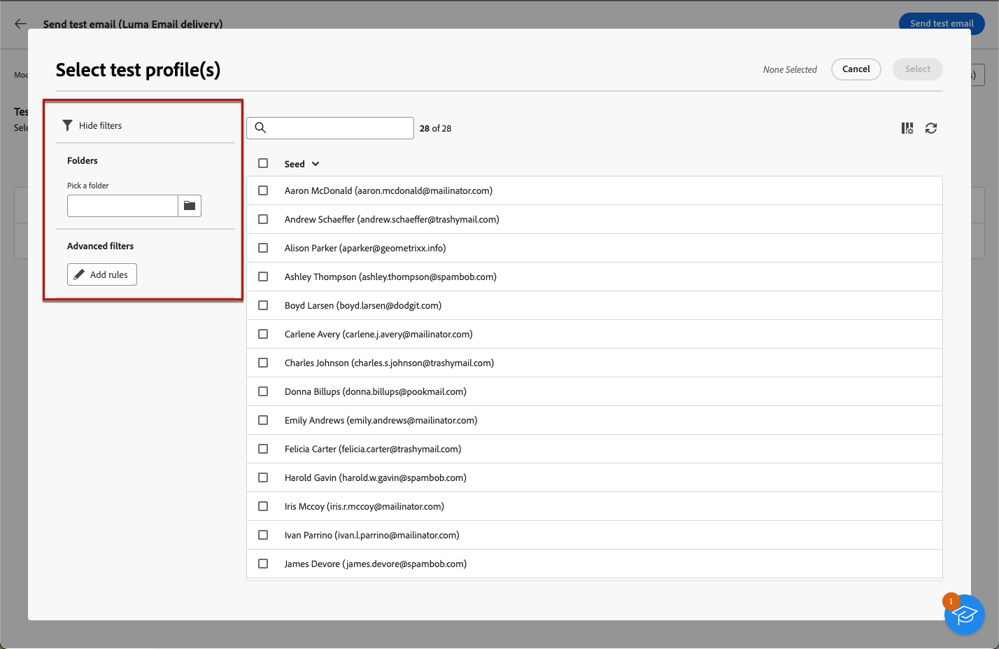
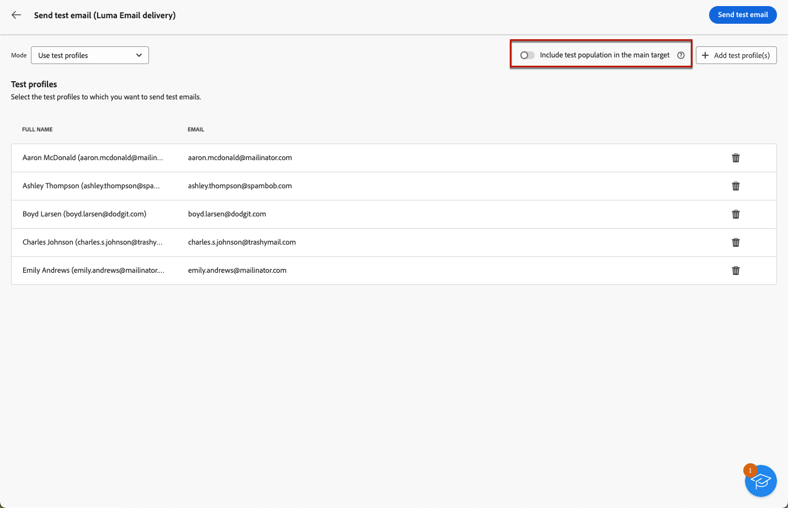
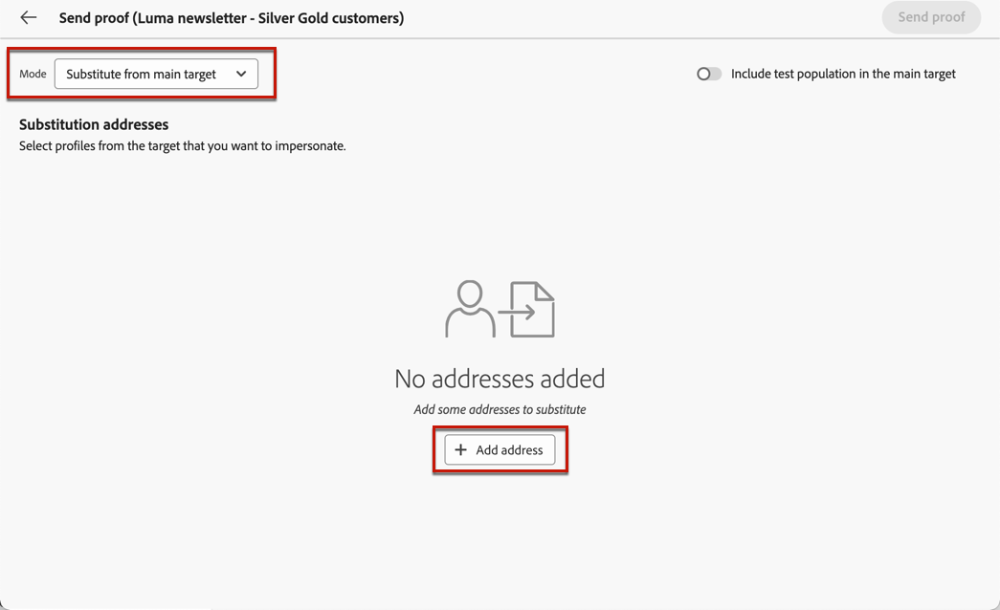
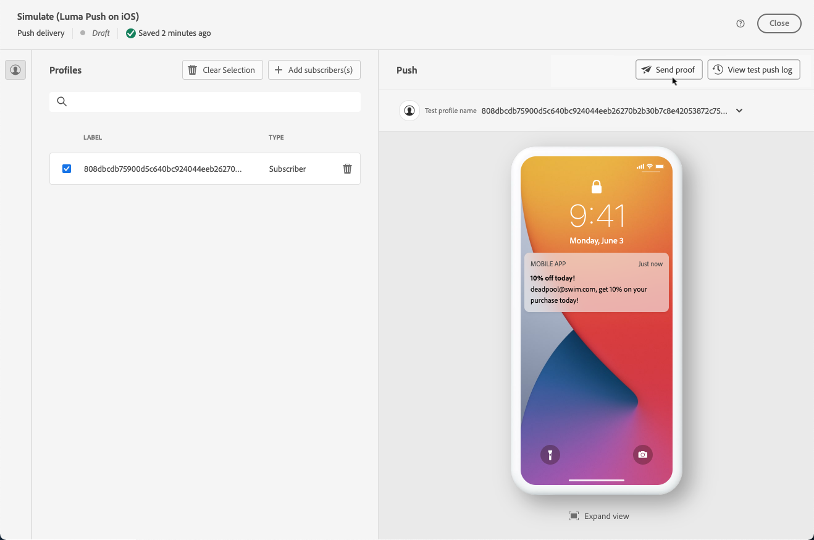
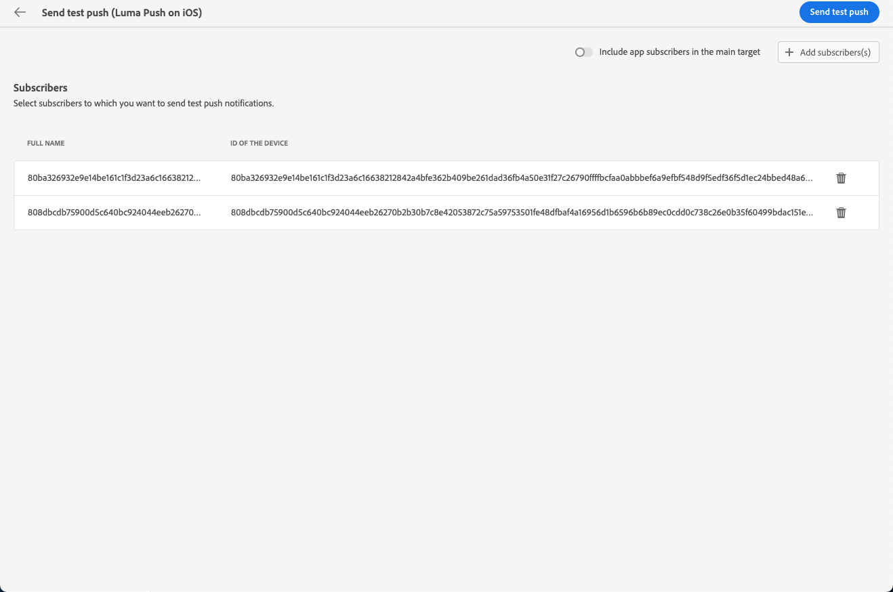

# 傳送校樣 {#send-test-deliveries}

>[!CONTEXTUALHELP]
>id="acw_email_preview_mode"
>title="預覽模式"
>abstract="將測試群體納入主要目標，以預覽和測試訊息。"

>[!CONTEXTUALHELP]
>id="acw_deliveries_additional_proof_target"
>title="其他校樣目標"
>abstract="這些規則只能在用戶端主控台變更。"

定義訊息內容後，您可以傳送校樣到測試設定檔，以預覽和測試訊息。 如果您已插入個人化內容，您可以使用測試設定檔資料檢查此內容在訊息中的顯示方式。

若要偵測訊息內容或個人化設定中可能出現的錯誤，請先傳送校樣至測試設定檔，再傳送給目標對象。 每次進行變更時都應傳送校樣，以驗證最新內容。 傳送校樣是驗證行銷活動和識別潛在問題的重要步驟。 校樣收件者可以檢查各種元素，例如連結、選擇退出連結、影像或映象頁面，並偵測轉譯、內容、個人化設定和傳遞設定中的任何錯誤。

## 模擬測試設定檔的內容 {#simulate-content-test-deliveries}

>[!CONTEXTUALHELP]
>id="acw_email_preview_option_test_target"
>title="測試群體"
>abstract="選取測試群體模式。"

在傳送校樣之前，請務必定義傳送的目標對象。 [了解更多](../audience/add-audience.md)

若要開始測試訊息內容：

1. 編輯傳送的內容。
1. 按一下&#x200B;**[!UICONTROL 模擬內容]**&#x200B;按鈕。
1. 按一下&#x200B;**[!UICONTROL 傳送校樣]**&#x200B;按鈕以傳送校樣。

   {zoomable="yes"}

1. 選取您的校訂收件者。

   根據訊息通道，校樣可以傳送給下列型別的收件者：

   * 對於簡訊與電子郵件，您可以使用[測試設定檔](#test-profiles)，這些設定檔是資料庫中特定的其他收件者。 您也可以使用主要目標[模式的](#substitution-profiles)替代，這會將證明傳送至電子郵件測試地址或電話號碼，並使用現有設定檔的個人化資料。 這可讓您以收件者的方式體驗訊息，讓您精確呈現設定檔將收到的內容。

   * 對於推播訊息，您可以使用[訂閱者](#subscribers)，這是新增到資料庫的虛擬訂閱者。 已在[!DNL Campaign]主控台中建立。 深入瞭解[Campaign v8 （使用者端主控台）檔案](https://experienceleague.adobe.com/docs/campaign/campaign-v8/audience/add-profiles/test-profiles.html?lang=zh-Hant){target="_blank"}

   每種模式的詳細設定如下。

## 使用測試輪廓 {#test-profiles}

>[!CONTEXTUALHELP]
>id="acw_deliveries_simulate_test_mode"
>title="校訂的目標"
>abstract="如果想要在發送到主要目標之前測試您的傳遞，可以上傳第二個檔案做為「校訂的目標」。"

>[!CONTEXTUALHELP]
>id="acw_deliveries_simulate_test_upload"
>title="上傳設定檔"
>abstract="如果想要透過和已經用於主要目標不同的集合測試您的傳遞，則可以上傳包含其他設定檔的第二個檔案。"

>[!CONTEXTUALHELP]
>id="acw_deliveries_simulate_test_sample"
>title="範本檔案"
>abstract="檔案格式必須與原始檔案相同。 支援的檔案格式：txt、csv。檔案大小上限：15MB。使用第一行作為欄標題。"

>[!CONTEXTUALHELP]
>id="acw_sms_preview_option_app_target"
>title="將測試輪廓納入主要客群"
>abstract="啟用此選項也可將最終訊息傳送給校樣收件者。"

測試設定檔是資料庫中的其他收件者。 它們是從&#x200B;**[!UICONTROL 客戶管理]** > **[!UICONTROL 設定檔]**&#x200B;功能表建立的。 [了解更多](../audience/test-profiles.md#create-test-profiles)

將校樣傳送至測試設定檔的步驟已詳述如下。

1. 從傳遞的內容中，按一下&#x200B;**[!UICONTROL 模擬內容]**&#x200B;按鈕，以及&#x200B;**[!UICONTROL 傳送校樣]**&#x200B;按鈕。

1. 從&#x200B;**[!UICONTROL 模式]**&#x200B;下拉式清單中，選擇&#x200B;**[!UICONTROL 測試設定檔]**，將目標設定為將接收校樣或簡訊傳遞的虛擬收件者。

   {zoomable="yes"}

1. 如果您已選取設定檔以在內容模擬畫面中[預覽訊息](preview-content.md)，則會預先選取這些設定檔作為校樣收件者。 您可以使用&#x200B;**[!UICONTROL 新增測試設定檔]**&#x200B;按鈕來清除您的選擇和/或新增其他收件者。

1. 瀏覽測試設定檔或設定檔清單時，您可以使用篩選器來縮小搜尋範圍。 例如，您可以定義規則以尋找所有具有&#x200B;**[!UICONTROL 潛在客戶]**&#x200B;狀態的測試設定檔。 瞭解如何使用[查詢模型工具](../query/query-modeler-overview.md)來新增規則。

   {zoomable="yes"}

1. 若要也傳送最終訊息給校訂的收件者，請選取&#x200B;**[!UICONTROL 在主要目標中包含測試母體]**&#x200B;選項。

   {zoomable="yes"}

1. 選取測試設定檔後，您可以[傳送校樣](#send-test)。

## 替代設定檔資料 {#substitution-profiles}

使用設定檔替代將校樣傳送至特定電子郵件地址或電話號碼，同時顯示[!DNL Adobe Campaign]資料庫現有設定檔的資料。 只有在已定義傳送的對象時，才能選取此模式。

若要從主要目標取代設定檔資料，請遵循下列步驟：

1. 從傳遞的內容中，按一下&#x200B;**[!UICONTROL 模擬內容]**&#x200B;按鈕，以及&#x200B;**[!UICONTROL 傳送校樣]**&#x200B;按鈕。

1. 從&#x200B;**[!UICONTROL 模式]**&#x200B;下拉式清單中，選擇&#x200B;**[!UICONTROL 從主要目標]**&#x200B;替代，以在顯示現有設定檔的資料時，將校樣傳送至特定的電子郵件地址或電話號碼。

   >[!CAUTION]
   >
   >如果您尚未為您的傳遞選取[對象](../audience/about-recipients.md)，**[!UICONTROL 從主要目標]**&#x200B;替代選項將會呈現灰色，而且您將無法選取替代設定檔。 此外，即使已選取目標對象，對於週期性型別傳送，此選項仍會呈現灰色，因為主要傳送是範本。

1. 按一下&#x200B;**[!UICONTROL 新增地址]**&#x200B;按鈕，並指定將接收校訂的電子郵件地址或電話號碼。

   {zoomable="yes"}

   >[!NOTE]
   >
   >您可以輸入任何電子郵件地址或電話號碼。 這可讓您傳送校樣給任何收件者，即使他們不是[!DNL Adobe Campaign]的使用者亦然。

1. 從您為傳送定義的目標中選取設定檔，以用作替代。 您也可以讓[!DNL Adobe Campaign]從目標中選取隨機設定檔。 來自所選設定檔的設定檔資料將顯示在校樣中。

1. 確認收件者並重複作業，視需要新增電子郵件地址或電話號碼。

   {zoomable="yes"}

1. 若要也傳送最終訊息給校訂的收件者，請選取&#x200B;**[!UICONTROL 在主要目標中包含測試母體]**&#x200B;選項。

1. 選取替代設定檔後，您可以[傳送證明](#send-test)。

## 傳送校樣給應用程式訂閱者 {#subscribers}

使用推播通知進行設計時，校樣只能傳送給您的應用程式訂閱者。 請依照下列步驟進行選取。

1. 從推播傳遞的內容中，按一下&#x200B;**[!UICONTROL 模擬內容]**&#x200B;按鈕，以及&#x200B;**[!UICONTROL 傳送校樣]**&#x200B;按鈕。

   {zoomable="yes"}

1. 如果您已在內容模擬畫面中選取[預覽傳遞](preview-content.md)的訂閱者，則會預先選取這些設定檔作為測試訂閱者。

   您可以使用專用按鈕清除您的選擇和/或新增其他訂閱者。

   {zoomable="yes"}

1. 若要將最終推播通知傳送給測試訂閱者，請選取&#x200B;**[!UICONTROL 在主要目標中包含測試母體]**&#x200B;選項。

1. 選取訂閱者後，您可以[傳送校樣](#send-test)。

## 傳送證明 {#send-test}

若要將校樣傳送給所選收件者，請遵循下列步驟。

1. 按一下&#x200B;**[!UICONTROL 傳送校樣]**&#x200B;按鈕。

1. 確認傳送。

   {zoomable="yes"}

1. 傳送所需數量的校樣，直到您完成傳送內容為止。

完成後，您可以準備並傳送傳遞至主要目標。 請在以下專屬章節中瞭解如何操作：

* [傳送您的電子郵件](../monitor/prepare-send.md)
* [傳送推播通知](../push/send-push.md#send-push)
* [傳送簡訊傳遞](../sms/send-sms.md#send-sms)

## 存取已傳送的校樣 {#access-test-deliveries}

傳送校樣後，您可以從&#x200B;**[!UICONTROL 模擬內容]**&#x200B;畫面存取其記錄檔。

這些記錄可讓您存取針對所選傳送傳送的所有校樣，並視覺化與其傳送相關的特定統計資料。 [了解如何監控傳遞記錄](../monitor/delivery-logs.md)

{zoomable="yes"}

您也可以存取從[傳遞清單](../msg/gs-messages.md)傳送的校樣，就像任何傳遞一樣。

{zoomable="yes"}