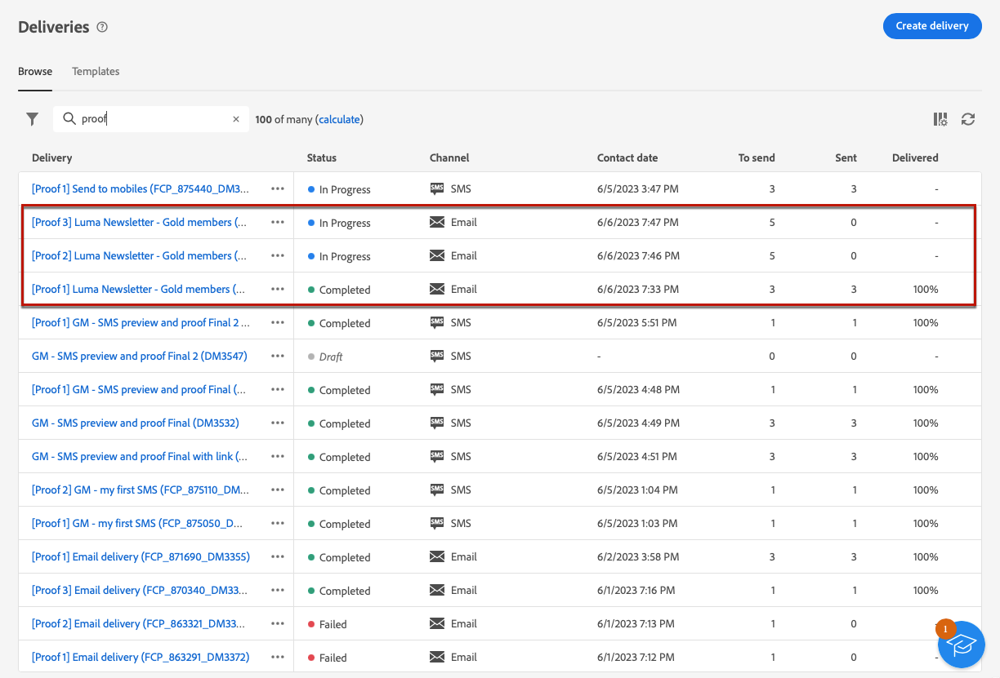

# 傳送測試傳遞 {#send-test-deliveries}

>[!CONTEXTUALHELP]
>id="acw_email_preview_mode"
>title="預覽模式"
>abstract="將測試母體納入主要目標，以預覽和測試訊息。"

**[!UICONTROL Adobe Campaign]** 可讓您在將訊息傳送給主要對象之前先測試訊息。

傳送測試傳送（先前稱為「校樣」）是驗證行銷活動和識別潛在問題的重要步驟。

測試的收件者可檢查各種元素，例如連結、退出連結、影像或映象頁面，並偵測轉譯、內容、個人化設定和傳送組態中的任何錯誤。

## 選取測試收件者 {#test-recipients}

>[!CONTEXTUALHELP]
>id="acw_email_preview_option_test_target"
>title="測試母體"
>abstract="選取測試母體模式。"

根據您使用的頻道，測試訊息可以傳送給三種型別的收件者：

* [測試設定檔](#test-profiles)  — 傳送 **測試電子郵件和簡訊** 種子地址，資料庫中的其他收件者。

  它們可在以下位置建立： [!DNL Campaign] 主控台進入 **[!UICONTROL 資源]** > **[!UICONTROL Campaign Management]** > **[!UICONTROL 種子地址]** 資料夾。 進一步瞭解 [Campaign v8 （主控台）檔案](https://experienceleague.adobe.com/docs/campaign/campaign-v8/audience/add-profiles/test-profiles.html){target="_blank"}

* [從主要目標替代](#substitution-profiles)  — 傳送 **測試電子郵件和簡訊** 模擬現有設定檔時，轉換為特定電子郵件地址或電話號碼。

  這可讓您以收件者的方式體驗訊息，讓您精確呈現設定檔將收到的內容。

* [訂閱者](#subscribers)  — 傳送 **測試推播通知** 新增至資料庫的虛擬訂閱者。

  就像測試設定檔一樣，它們可以在以下位置建立： [!DNL Campaign] 主控台進入 **[!UICONTROL 資源]** > **[!UICONTROL Campaign Management]** > **[!UICONTROL 種子地址]** 資料夾。 進一步瞭解 [Campaign v8 （主控台）檔案](https://experienceleague.adobe.com/docs/campaign/campaign-v8/audience/add-profiles/test-profiles.html){target="_blank"}

若要選取測試傳送的收件者，請根據您要使用的設定檔型別，依照下列步驟操作。

### 測試設定檔 {#test-profiles}

>[!CONTEXTUALHELP]
>id="acw_deliveries_simulate_test_mode"
>title="證明的目標"
>abstract="如果您要在傳送至主要目標之前測試您的傳遞，可以上傳第二個檔案作為「校樣的目標」。"

>[!CONTEXTUALHELP]
>id="acw_deliveries_simulate_test_upload"
>title="上傳設定檔"
>abstract="如果您想要使用與主要目標所用集合不同的集合來測試您的傳送，則可以上傳包含其他設定檔的第二個檔案。"

>[!CONTEXTUALHELP]
>id="acw_deliveries_simulate_test_sample"
>title="範本檔案"
>abstract="檔案的格式必須與原始檔案相同。 支援的檔案格式：txt、csv。檔案大小上限： 15MB。 使用第一行作為欄標題。"

1. 瀏覽至電子郵件或簡訊傳送的編輯內容畫面，然後按一下 **[!UICONTROL 模擬內容]** 按鈕。

1. 按一下 **[!UICONTROL 測試]** 按鈕。

   >[!NOTE]
   >
   >如果您已選取設定檔至 [預覽您的傳遞](preview-content.md)，即會列在左窗格中。

   

1. 從 **[!UICONTROL 模式]** 下拉式清單，選擇 **[!UICONTROL 測試設定檔]** 將目標定位將接收測試電子郵件或簡訊傳送的虛構收件者。

   

1. 如果您已選取設定檔至 [預覽訊息](preview-content.md) 在內容模擬畫面中，會預先選取這些設定檔作為測試收件者。 您可以使用「 」清除選擇和/或新增其他收件者 **[!UICONTROL 新增測試設定檔]** 按鈕。

   >[!NOTE]
   >
   >根據預設， **[!UICONTROL 使用測試設定檔]** 模式已選取。

1. 若要也傳送最終訊息給測試傳送的收件者，請選取 **[!UICONTROL 在主要目標中包含測試族群]** 選項。

1. 選取測試設定檔後，您可以 [傳送測試傳遞](#send-test).

### 替代設定檔 {#substitution-profiles}

若要在顯示資料時傳送測試電子郵件或簡訊至特定的電子郵件地址或電話號碼，資料來源為 [!DNL Campaign] 資料庫，使用替代設定檔。

1. 在傳送測試之前，請務必定義傳送的目標對象。 [了解更多](../audience/about-audiences.md)

1. 瀏覽至電子郵件或簡訊傳送的編輯內容畫面，然後按一下 **[!UICONTROL 模擬內容]** 按鈕。

1. 按一下 **[!UICONTROL 測試]** 按鈕。

   

1. 從 **[!UICONTROL 模式]** 下拉式清單，選擇 **[!UICONTROL 從主要目標替代]** 顯示現有設定檔資料時，將測試傳送至特定電子郵件地址或電話號碼。

   >[!CAUTION]
   >
   >如果您尚未選取 [對象](../audience/about-audiences.md) 對於您的傳遞， **[!UICONTROL 從主要目標替代]** 選項將會呈現灰色，且您將無法選取替代設定檔。

1. 按一下 **[!UICONTROL 新增地址]** 按鈕並指定要接收測試傳送的電子郵件地址或電話號碼。

   

   >[!NOTE]
   >
   >您可以輸入任何電子郵件地址或電話號碼。 這可讓您傳送測試傳遞給任何收件者，即使他們不是的使用者 [!DNL Adobe Campaign].

1. 從您為傳送定義的目標中選取設定檔，以用作替代。 您也可以讓 [!DNL Adobe Campaign] 從目標中選取隨機設定檔。 來自所選設定檔的設定檔資料將顯示在測試傳送中。

1. 確認收件者並重複作業，視需要新增電子郵件地址或電話號碼。

   

1. 若要也傳送最終訊息給測試傳送的收件者，請選取 **[!UICONTROL 在主要目標中包含測試族群]** 選項。

1. 選取替代設定檔後，您可以 [傳送測試傳遞](#send-test).

### 訂閱者 {#subscribers}

使用推播通知時，測試傳送只能傳送給訂閱者。 請依照下列步驟進行選取。

1. 瀏覽至傳送的編輯內容畫面，然後按一下 **[!UICONTROL 模擬內容]** 按鈕。

1. 按一下 **[!UICONTROL 測試]** 按鈕。

   

1. 如果您已選取訂閱者 [預覽傳遞](preview-content.md) 在內容模擬畫面中，會預先選取這些設定檔為測試訂閱者。

   您可以使用專用按鈕清除您的選擇和/或新增其他訂閱者。

   

1. 若要也傳送最終推播通知給測試訂閱者，請選取 **[!UICONTROL 在主要目標中包含測試族群]** 選項。

1. 選取訂閱者後，您可以 [傳送測試傳遞](#send-test).

## 傳送測試傳遞 {#send-test}

若要將測試傳送傳送傳送給選取的收件者，請遵循下列步驟。

1. 按一下 **[!UICONTROL 傳送測試]** 按鈕。

1. 確認傳送。

   

1. 傳送所需數量的測試，直到您完成傳送內容為止。

完成後，您可以準備並傳送傳遞至主要目標。 請在以下專屬章節中瞭解如何操作：

* [傳送您的電子郵件](../monitor/prepare-send.md)
* [傳送推播通知](../push/send-push.md#send-push)
* [傳送簡訊傳遞](../sms/send-sms.md#send-sms)

## 存取已傳送測試傳遞 {#access-proofs}

傳送測試傳送後，您就可以從存取專用記錄 **[!UICONTROL 檢視測試記錄]** 按鈕。

這些記錄可讓您存取針對所選傳送傳送的所有測試，並視覺化與其傳送相關的特定統計資料。 [了解如何監控傳遞記錄](../monitor/delivery-logs.md)

您也可以從存取已傳送的測試 [傳遞清單](../msg/gs-messages.md)，就像任何傳送一樣。

