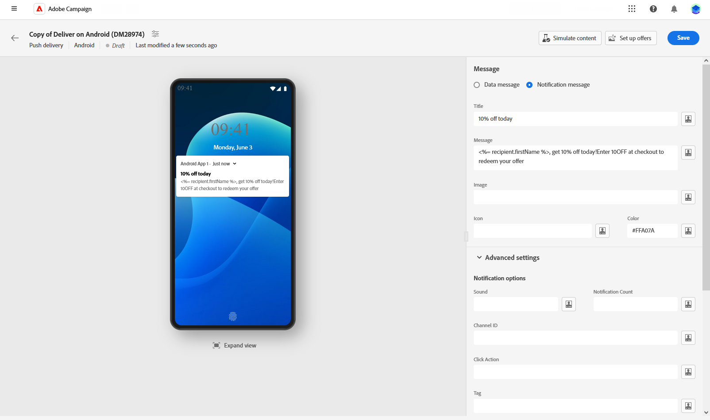
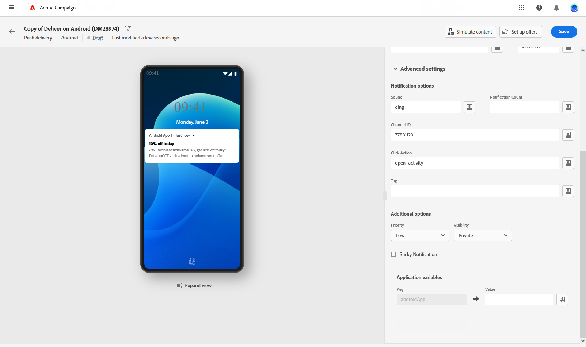
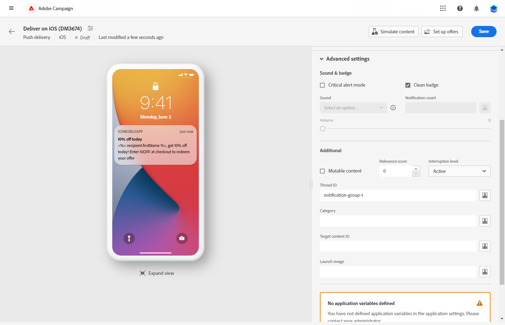

# 設計推播傳遞 {#content-push}

>[!CONTEXTUALHELP]
>id="acw_deliveries_push_android_content"
>title="推播 Android 內容"
>abstract="定義 Android 裝置的推播通知內容。若要開始撰寫訊息，請按一下「**編輯內容**」按鈕。"

>[!CONTEXTUALHELP]
>id="acw_deliveries_push_ios_content"
>title="推播 iOS 內容"
>abstract="定義 iOS 裝置的推播通知內容。若要開始撰寫訊息，請按一下「**編輯內容**」按鈕。"

## 定義通知的內容 {#push-message}

>[!CONTEXTUALHELP]
>id="acw_deliveries_push_ios_msg"
>title="推播 iOS 訊息"
>abstract="定義 iOS 裝置的推播通知內容。若要撰寫訊息，請按一下「**標題**」和「**訊息**」欄位。使用運算式編輯器來個人化資料並新增動態內容。若需要更多自訂設定，請前往「**進階設定**」區段。"

>[!CONTEXTUALHELP]
>id="acw_deliveries_push_android_msg"
>title="推播 Android 訊息"
>abstract="定義 Android 裝置的推播通知內容。若要撰寫訊息，請按一下「**標題**」和「**訊息**」欄位。使用運算式編輯器來個人化資料並新增動態內容。若要進一步個人化推播通知，您可以選擇要新增至推播通知的影像，以及要在設定檔裝置上顯示的通知圖示和圖示顏色。若需更多自訂設定，請前往「**進階設定**」區段。"

>[!CONTEXTUALHELP]
>id="acw_deliveries_push_ios_silent"
>title="iOS 的靜音通知"
>abstract="靜音推播模式允許將「靜音」通知傳送到行動應用程式。使用者不會發現有通知傳到。而是直接傳輸到應用程式。"

建立推播傳送後，請定義其內容。 引數和設定取決於行動作業系統：Android或iOS。 瀏覽下列標籤，瞭解如何針對每個作業系統撰寫訊息。

>[!BEGINTABS]

>[!TAB Android]

使用Firebase Cloud Messaging時，請選擇兩種型別的訊息：

* **[!UICONTROL 資料訊息]**&#x200B;已由使用者端應用程式處理。 這些訊息會直接傳送至行動應用程式，在裝置上產生和顯示Android通知。 資料訊息僅包含您的自訂應用程式變數。

  若要定義內容、個人化資料及新增動態內容，請按一下&#x200B;**[!UICONTROL 訊息]**&#x200B;欄位並使用運算式編輯器。 存取此編輯器以自訂您的訊息。
在&#x200B;**[!UICONTROL 應用程式變數]**&#x200B;功能表中，您的應用程式變數會自動新增。 這些變數可讓您定義通知行為。 例如，設定使用者啟動通知時顯示的特定應用程式畫面。

  {zoomable="yes"}

* **[!UICONTROL 通知訊息]**，由FCM SDK自動處理。 FCM會自動代表使用者端應用程式在使用者裝置上顯示訊息。 通知訊息包含預先定義的一組引數和選項，但仍可使用自訂應用程式變數進一步個人化。

  若要撰寫訊息，請按一下「**[!UICONTROL 標題]**」和「**[!UICONTROL 訊息]**」欄位。使用運算式編輯器來定義內容、個人化資料及新增動態內容。

  若要進一步個人化您的推播通知，請選擇要新增至推播通知的影像、要顯示在設定檔裝置上的通知圖示及其顏色。

  {zoomable="yes"}

>[!TAB iOS]

若要撰寫訊息，請按一下「**[!UICONTROL 標題]**」和「**[!UICONTROL 訊息]**」欄位。使用運算式編輯器來定義內容、個人化資料及新增動態內容。

您可以新增&#x200B;**[!UICONTROL Subtitle]**，這是iOS通知承載的subtitle引數的值。 請參閱本區段。

靜音推播模式允許將「靜音」通知傳送到行動應用程式。使用者不會發現有通知傳到。而是直接傳輸到應用程式。

{zoomable="yes"}

>[!ENDTABS]

## 推播通知進階設定 {#push-advanced}

>[!CONTEXTUALHELP]
>id="acw_deliveries_push_advanced_settings"
>title="推播通知的進階設定"
>abstract="定義推播通知的進階設定，例如其優先順序、相關的通知計數、應用程式變數等。"

>[!CONTEXTUALHELP]
>id="acw_deliveries_push_advanced_settings_critical"
>title="關鍵警報模式"
>abstract="即使在使用者的手機設定為專注模式或裝置靜音之下，啟用此選項仍可新增聲音至您的通知。這可確保使用者在任何情況下都能收到重要警示的通知。"

>[!CONTEXTUALHELP]
>id="acw_deliveries_push_advanced_settings_count"
>title="通知計數"
>abstract="使用此選項可設定直接顯示在應用程式圖示上的未讀通知數量。此讓使用者迅速查看待處理的通知數量。"

>[!CONTEXTUALHELP]
>id="acw_deliveries_push_advanced_settings_mutable"
>title="可變內容"
>abstract="使用此選項可讓行動應用程式下載相關通知的媒體內容。"

>[!CONTEXTUALHELP]
>id="acw_deliveries_push_advanced_settings_score"
>title="關聯性分數"
>abstract="設定 0 到 100 之間的關聯性計分，在通知摘要中安排通知的優先順序。分數愈高，表示通知愈重要。"

>[!CONTEXTUALHELP]
>id="acw_deliveries_push_advanced_settings_app_variables"
>title="應用程式變數"
>abstract="使用應用程式變數定義通知行為。這些變數完全可自訂，且可納入傳送到行動裝置的部分訊息承載。"

>[!CONTEXTUALHELP]
>id="acw_deliveries_push_advanced_settings_category"
>title="類別 ID"
>abstract="指定關於通知的類別 ID 名稱。這樣可以啟用動作按鈕的顯示，讓使用者無須開啟應用程式，直接從通知執行各種任務。"

進階選項取決於行動作業系統：Android或iOS。 瀏覽下列標籤，瞭解如何針對每個作業系統定義訊息的選項。

>[!BEGINTABS]

>[!TAB Android]

{zoomable="yes"}

| 參數 | 說明 |
|---------|---------|
| **[!UICONTROL 聲音]** | 設定裝置收到通知時播放的音效。 |
| **[!UICONTROL 通知計數]** | 設定直接在應用程式圖示上顯示的新未讀取資訊數目。 此讓使用者迅速查看待處理的通知數量。 |
| **[!UICONTROL 管道ID]** | 設定通知的頻道ID。 在收到具有此管道ID的任何通知之前，應用程式必須建立具有此管道ID的管道。 |
| **[!UICONTROL 按一下動作]** | 定義與使用者點按您的通知相關聯的動作。 這會決定使用者與通知互動時的行為，例如開啟特定畫面或在應用程式中執行特定動作。 |
| **[!UICONTROL 標籤]** | 設定用來取代通知抽屜中現有通知的識別碼。 這有助於防止累積多個通知，並確保只顯示最新的相關通知。 |
| **[!UICONTROL 優先順序]** | 設定通知的優先順序層級，可以是預設、最低、低或高。 優先順序層級會決定通知的重要性和急迫性，影響其顯示方式以及是否可以略過某些系統設定。 如需詳細資訊，請參閱[FCM檔案](https://firebase.google.com/docs/reference/fcm/rest/v1/projects.messages#notificationpriority)。 |
| **[!UICONTROL 可見度]** | 設定通知的可見度等級，可為公開、私人或秘密。 可見度等級會決定通知內容在鎖定畫面和其他敏感區域上顯示的程度。 如需詳細資訊，請參閱[FCM檔案](https://firebase.google.com/docs/reference/fcm/rest/v1/projects.messages#visibility)。 |
| **[!UICONTROL 粘性]** | 啟動後，通知仍可見，即使使用者按一下它。  如果停用，當使用者與通知互動時，通知會自動解除。 粘性行為可讓重要通知在熒幕上持續較長時間。 |
| **[!UICONTROL 應用程式變數]** | 允許您定義通知行為。 這些變數完全可自訂，且可納入傳送到行動裝置的部分訊息承載。 |

>[!TAB iOS]

{zoomable="yes"}

| 參數 | 說明 |
|---------|---------|
| **[!UICONTROL 嚴重警示模式]** | 即使在使用者的手機設定為專注模式或裝置靜音之下，啟用此選項仍可新增聲音至您的通知。這可確保使用者注意到重要警報。 選取時，您可以使用「音量」等級列來調整通知的音量。 在橫條上方0到100之間的數字會反映您的設定。 |
| **[!UICONTROL 清潔徽章]** | 啟用此選項以重新整理應用程式圖示上顯示的徽章值。 這可確保徽章準確地反映新的未讀資訊的數量。 |
| **[!UICONTROL 通知計數]** | 設定將直接顯示在應用程式圖示上的數字，表示新的未讀取資訊的數量。 這可提供使用者的快速視覺參考。 |
| **[!UICONTROL 磁碟區]** | 音量從0到100。 |
| **[!UICONTROL 可變內容]** | 啟用此選項可允許行動應用程式下載與通知相關的媒體內容。 有關詳細資訊，請參閱 [Apple 開發人員文件](https://developer.apple.com/library/content/documentation/NetworkingInternet/Conceptual/RemoteNotificationsPG/ModifyingNotifications.html)。 |
| **[!UICONTROL 關聯性分數]** | 設定 0 到 100 之間的關聯性計分，在通知摘要中安排通知的優先順序。分數愈高，表示通知愈重要。 |
| **[!UICONTROL 中斷層級]** | <ul> <li>**[!UICONTROL 作用中]**：預設設定，系統會立即顯示通知、點亮熒幕，並可播放音效。 通知不會突破焦點模式。</li><li>**[!UICONTROL 被動]**：系統會將通知新增至通知清單，而不需開啟熒幕或播放音效。 通知不會突破焦點模式。</li><li>**[!UICONTROL 有時效性]**：系統立即顯示通知、讓熒幕亮起、可以播放聲音，並突破焦點模式。 此層級不需要Apple的特殊許可權。</li> <li>**[!UICONTROL 關鍵]**：系統立即顯示通知、讓熒幕亮起，並略過靜音切換或聚焦模式。 請注意，此層級需要Apple的特殊許可權。</ul> |
| **[!UICONTROL 執行緒ID]** | 用於將相關通知分組在一起的識別碼。 具有相同對話串ID的通知會在通知清單中整理為單一對話或對話串。 |
| **[!UICONTROL 類別]** | 指定關於通知的類別 ID 名稱。這樣可以啟用動作按鈕的顯示，讓使用者無須開啟應用程式，直接從通知執行各種任務。 |
| **[!UICONTROL 目標內容識別碼]** | 用來鎖定在開啟通知時要轉送的應用程式視窗的識別碼。 |
| **[!UICONTROL 啟動影像]** | 指定當使用者選擇從通知啟動您的應用程式時要顯示的啟動影像檔名稱。 將會顯示選取的影像，而非應用程式的一般啟動畫面。 |
| **[!UICONTROL 應用程式變數]** | 允許您定義通知行為。 這些變數完全可自訂，且可納入傳送到行動裝置的部分訊息承載。 |

>[!ENDTABS]

<!--Sounds must be included in the application and defined when the service is created. Refer to this section.-->
