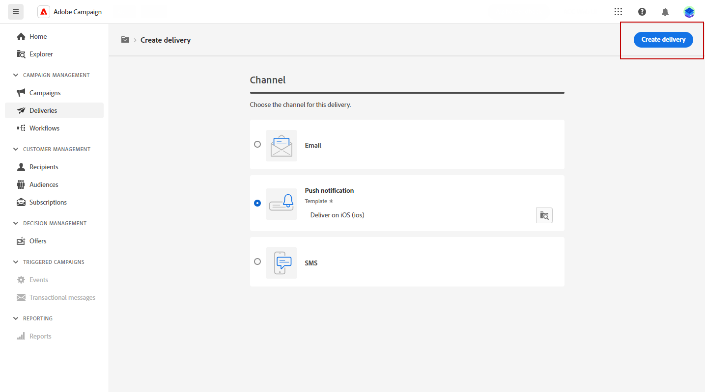
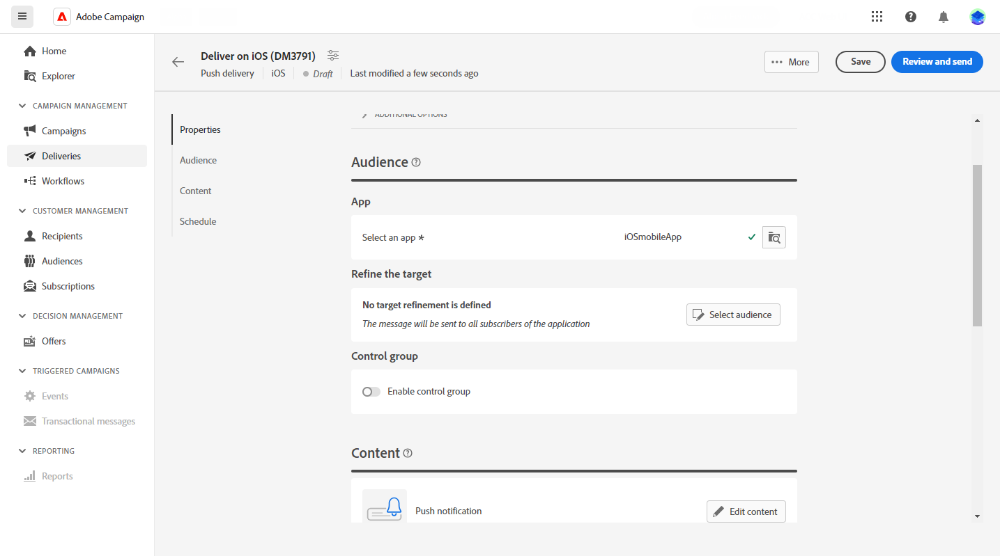
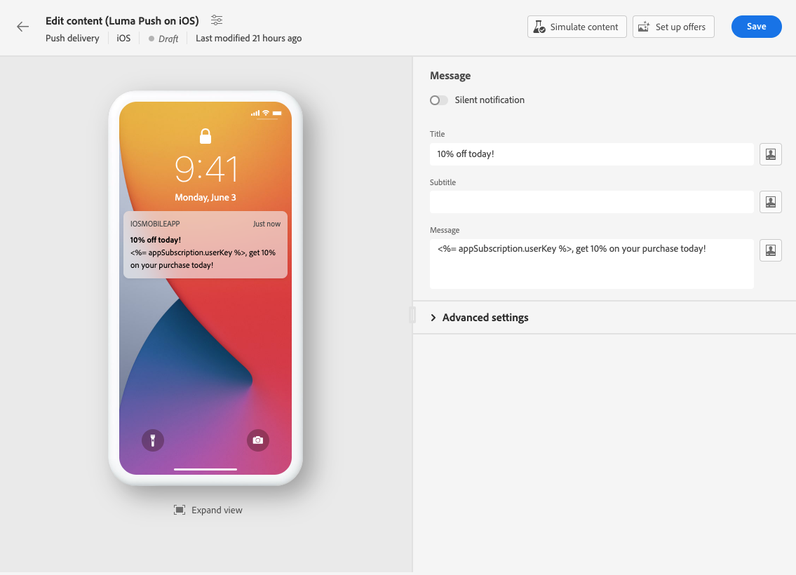
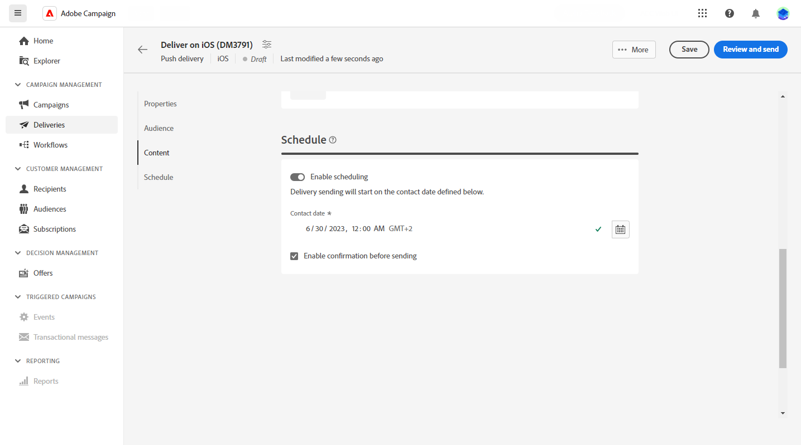
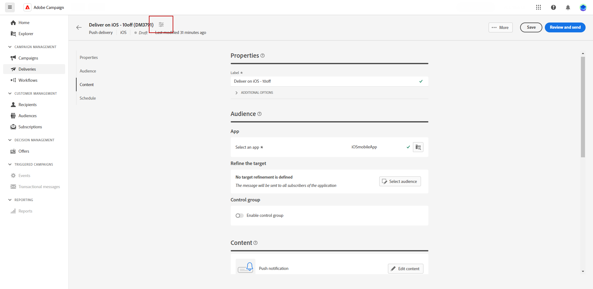

# 建立推播通知傳遞 {#create-push}

>[!CONTEXTUALHELP]
>id="acw_deliveries_push_audience"
>title="定義推播對象"
>abstract="選取推播訊息的最佳對象。"

>[!CONTEXTUALHELP]
>id="acw_push_notification_template"
>title="推播通知範本"
>abstract="選取推播通知範本以開始進行推播傳遞。"

>[!CONTEXTUALHELP]
>id="acw_deliveries_push_properties"
>title="推播傳遞屬性"
>abstract="管理推播傳遞屬性。"

1. 可從「**[!UICONTROL 傳遞]**」首頁，按一下「**[!UICONTROL 建立傳遞]**」。

1. 在 **[!UICONTROL 頻道]** 區段，選擇推播通知作為頻道，並根據選擇的作業系統選擇範本：Android或iOS。 [了解範本的詳細資訊](../msg/delivery-template.md)

1. 按一下「**[!UICONTROL 建立傳遞]**」按鈕以確認。

   

1. 進入一個傳遞的&#x200B;**[!UICONTROL 標籤]**，並存取「**[!UICONTROL 其他選項]**」下拉式清單。

   +++根據您的要求設定下列設定。
   * **[!UICONTROL 內部名稱]**：指派唯一識別碼給傳遞。
   * **[!UICONTROL 資料夾]**：將傳遞儲存在特定資料夾中。
   * **[!UICONTROL 傳遞代碼]**：使用您自己的命名慣例整理您的傳遞。
   * **[!UICONTROL 說明]**：提供傳遞的說明。
   * **[!UICONTROL 性質]**：指定電子郵件的性質以進行分類。
+++

1. 從 **[!UICONTROL 對象]** 功能表，選取您要用於此傳遞的應用程式。

1. 按一下「**[!UICONTROL 選取對象]**」按鈕，以鎖定現有對象或建立您自己的對象。[了解更多](../audience/about-audiences.md)

   請注意，依預設，您的推播通知將會傳送給應用程式的所有訂閱者。

   

1. 開啟&#x200B;**[!UICONTROL 啟用控制]**&#x200B;組選項，設定一個控制組來測量您的傳遞造成的影響，這可讓您將收到訊息的母體的行為和沒有收到訊息的聯絡人的行為進行比較。[了解更多](../audience/control-group.md)

1. 按一下 **[!UICONTROL 編輯內容]** 以開始設計推播通知的內容。 [了解更多](content-push.md)

   

   在此畫面中，您也可以 [模擬您的內容](../preview-test/preview-test.md) 和 [設定優惠方案](../content/offers.md).

1. 若要將您的傳遞安排在特定的日期和時間，請開啟「**[!UICONTROL 啟用排程]**」選項。在您開始進行傳遞後，訊息將在您為收件者定義的確切日期和時間自動傳送。

   

1. 按一下 **[!UICONTROL 設定傳遞設定]** 以存取與傳送範本相關的進階選項。 [了解更多](../advanced-settings/delivery-settings.md)

   
