# 設計 iOS 豐富的推播傳遞 {#rich-push}

>[!IMPORTANT]
>
>在設計豐富推送通知之前，您必須先設定V2聯結器。 如需詳細程式，請參閱[此頁面](https://experienceleague.adobe.com/en/docs/campaign-classic/using/sending-messages/sending-push-notifications/configure-the-mobile-app/configuring-the-mobile-application)。

## 定義通知的內容 {#push-message}

建立推播傳送後，您可以使用下列其中一個範本來定義其內容：

* **預設**&#x200B;可讓您傳送包含簡單圖示和隨附影像的通知。

* **基本**&#x200B;可以在您的通知中包含文字、影像和按鈕。

* **輪播**&#x200B;可讓您傳送包含文字和多個影像的通知，讓使用者可以滑動瀏覽。

* **計時器**&#x200B;在通知中包含即時倒數計時器。

瀏覽以下標籤，進一步瞭解如何個人化這些範本。

>[!BEGINTABS]

>[!TAB 預設]

1. 從&#x200B;**[!UICONTROL 範本]**&#x200B;下拉式清單中，選取&#x200B;**[!UICONTROL 預設]**。

   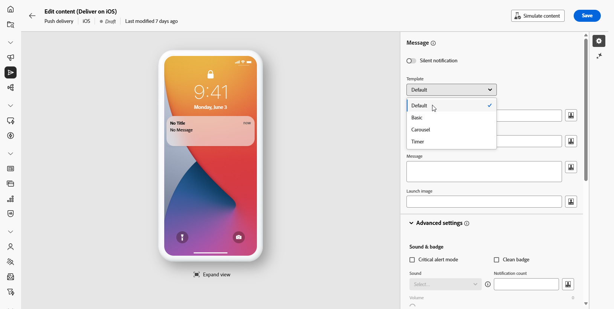

1. 在&#x200B;**[!UICONTROL 標題]**&#x200B;欄位中，輸入您要在通知中心可用通知清單中顯示的標題標籤。

   此欄位可讓您定義iOS通知承載的&#x200B;**title**&#x200B;引數值。

1. 選擇性地新增&#x200B;**[!UICONTROL Subtitle]**，其對應至iOS通知承載的&#x200B;**subtitle**&#x200B;引數。

1. 在&#x200B;**[!UICONTROL 訊息]**&#x200B;欄位中輸入訊息的內容。

1. 使用運算式編輯器來定義內容、個人化資料及新增動態內容。 [了解更多](../personalization/personalize.md)

   

1. 若要進一步個人化您的推播通知，您可以選擇要新增至推播通知的&#x200B;**[!UICONTROL 啟動影像]** URL。

1. 從&#x200B;**[!UICONTROL 進階設定]**&#x200B;下拉式清單，瀏覽至&#x200B;**[!UICONTROL 聲音與徽章]**&#x200B;標籤，以自訂其他設定，例如通知的聲音與徽章選項。 [了解更多](#sound-badge)

   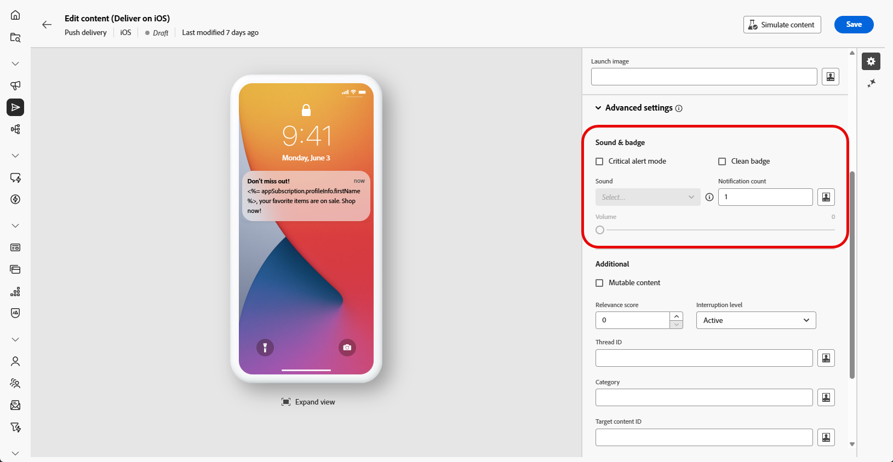

1. 如需進一步自訂，請探索推播通知可用的&#x200B;**[!UICONTROL 其他]**&#x200B;選項。 [了解更多](#push-advanced)

   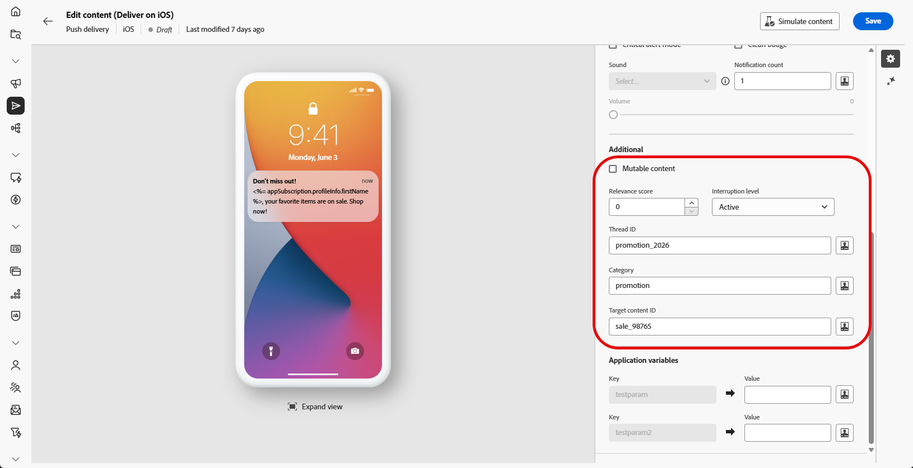

1. 從&#x200B;**[!UICONTROL 應用程式變數]**&#x200B;功能表，會自動新增您的&#x200B;**[!UICONTROL 應用程式變數]**。 它們可讓您定義通知行為，例如，您可以設定當使用者啟動通知時顯示的特定應用程式畫面。

定義訊息內容後，您可以使用測試訂閱者來預覽及測試訊息。

>[!TAB 基本]

1. 從&#x200B;**[!UICONTROL 範本]**&#x200B;下拉式清單中，選取&#x200B;**[!UICONTROL 基本]**。

   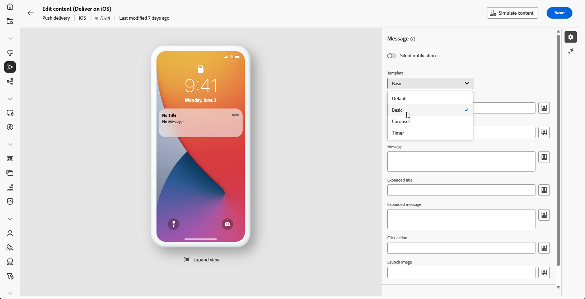

1. 若要撰寫訊息，請在&#x200B;**[!UICONTROL 標題]**、**[!UICONTROL 展開標題]**、**[!UICONTROL 訊息]**&#x200B;和&#x200B;**[!UICONTROL 展開訊息]**&#x200B;欄位中輸入您的文字。

   **[!UICONTROL 訊息]**&#x200B;文字會顯示在收合的檢視中，而展開通知時會顯示&#x200B;**[!UICONTROL 展開訊息]**。

   

1. 使用運算式編輯器來定義內容、個人化資料及新增動態內容。 [了解更多](../personalization/personalize.md)

1. 選擇性地新增&#x200B;**[!UICONTROL Subtitle]**，其對應至iOS通知承載的&#x200B;**subtitle**&#x200B;引數。

1. 新增定義與使用者點按您的通知相關聯的&#x200B;**[!UICONTROL 點按動作]**&#x200B;的URL。 這會決定使用者與通知互動時的行為，例如開啟特定畫面或在應用程式中執行特定動作。

1. 若要進一步個人化您的推播通知，您可以選擇要新增至推播通知的&#x200B;**[!UICONTROL 啟動影像]** URL。

1. 從&#x200B;**[!UICONTROL 進階設定]**&#x200B;下拉式清單，瀏覽至&#x200B;**[!UICONTROL 聲音與徽章]**&#x200B;標籤，以自訂其他設定，例如通知的聲音與徽章選項。 [了解更多](#sound-badge)

   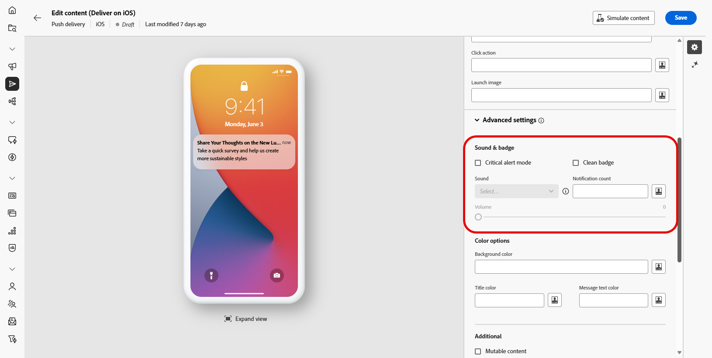

1. 在&#x200B;**[!UICONTROL 色彩選項]**&#x200B;功能表中，輸入&#x200B;**[!UICONTROL 通知背景色彩]**、**[!UICONTROL 通知背景色彩]**&#x200B;和&#x200B;**[!UICONTROL 訊息文字色彩]**&#x200B;的十六進位色彩代碼。

   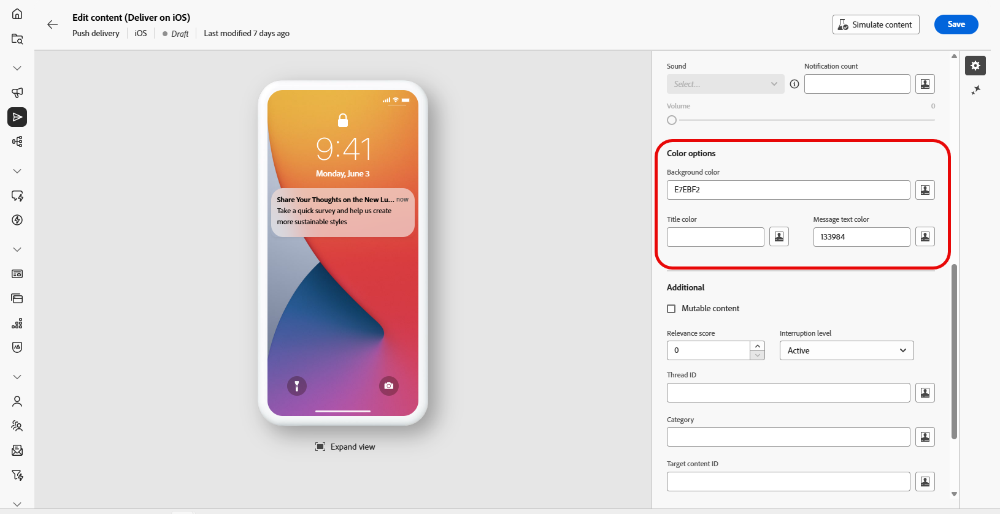

1. 如需進一步自訂，請探索推播通知可用的&#x200B;**[!UICONTROL 其他]**&#x200B;選項。 [了解更多](#push-advanced)

1. 從&#x200B;**[!UICONTROL 應用程式變數]**&#x200B;功能表，會自動新增您的&#x200B;**[!UICONTROL 應用程式變數]**。 它們可讓您定義通知行為，例如，您可以設定當使用者啟動通知時顯示的特定應用程式畫面。

定義訊息內容後，您可以使用測試訂閱者來預覽及測試訊息。

>[!TAB 輪播]

1. 從&#x200B;**[!UICONTROL 範本]**&#x200B;下拉式清單中，選取&#x200B;**[!UICONTROL 輪播]**。

   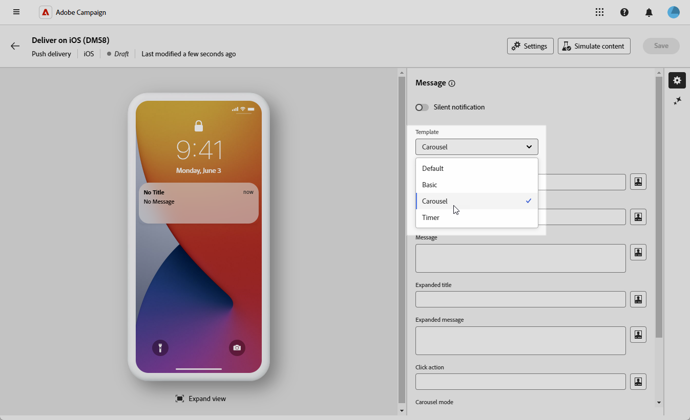

1. 若要撰寫訊息，請在&#x200B;**[!UICONTROL 標題]**、**[!UICONTROL 展開標題]**、**[!UICONTROL 訊息]**&#x200B;和&#x200B;**[!UICONTROL 展開訊息]**&#x200B;欄位中輸入您的文字。

   **[!UICONTROL 訊息]**&#x200B;文字會顯示在收合的檢視中，而展開通知時會顯示&#x200B;**[!UICONTROL 展開訊息]**。

   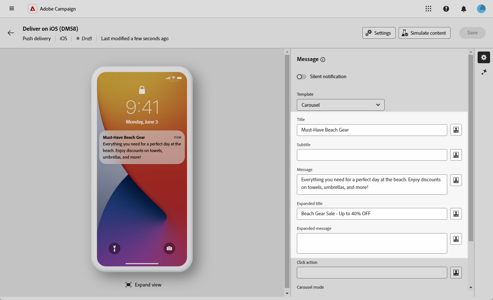

1. 使用運算式編輯器來定義內容、個人化資料及新增動態內容。 [了解更多](../personalization/personalize.md)

1. 選擇性地新增&#x200B;**[!UICONTROL Subtitle]**，其對應至iOS通知承載的&#x200B;**subtitle**&#x200B;引數。

1. 新增定義與使用者點按您的通知相關聯的&#x200B;**[!UICONTROL 點按動作]**&#x200B;的URL。 這會決定使用者與通知互動時的行為，例如開啟特定畫面或在應用程式中執行特定動作。

1. 選擇&#x200B;**[!UICONTROL 輪播]**&#x200B;的運作方式：

   * **[!UICONTROL 自動]**：以投影片形式自動循環顯示影像，以預先定義的間隔轉換。
   * **[!UICONTROL 手動]**：可讓使用者在幻燈片之間手動滑動，以瀏覽影像。

1. 按一下&#x200B;**[!UICONTROL 新增影像]**，然後輸入您的&#x200B;**[!UICONTROL 影像]** URL、**[!UICONTROL 文字]**&#x200B;和&#x200B;**[!UICONTROL 動作URI]**。

   請確定您至少包含三個影像，最多包含五個影像。

   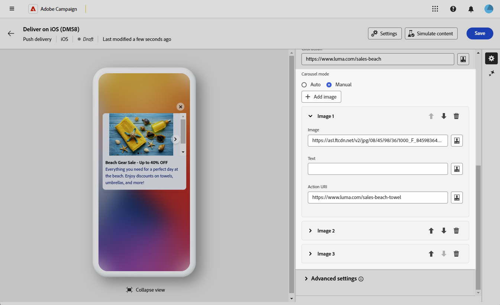

1. 使用向下和向上箭頭處理影像的順序。

1. 從&#x200B;**[!UICONTROL 進階設定]**&#x200B;下拉式清單，瀏覽至&#x200B;**[!UICONTROL 聲音與徽章]**&#x200B;標籤，以自訂其他設定，例如通知的聲音與徽章選項。 [了解更多](#sound-badge)

1. 在&#x200B;**[!UICONTROL 色彩選項]**&#x200B;功能表中，輸入&#x200B;**[!UICONTROL 通知背景色彩]**、**[!UICONTROL 通知背景色彩]**&#x200B;和&#x200B;**[!UICONTROL 訊息文字色彩]**&#x200B;的十六進位色彩代碼。

   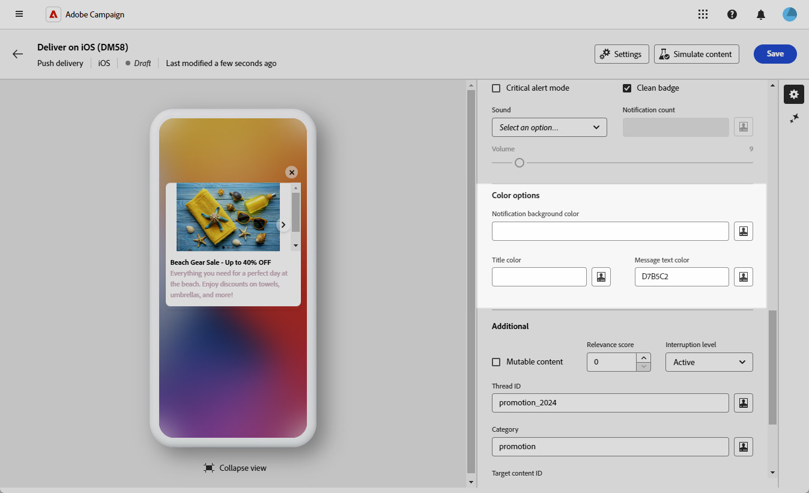

1. 如需進一步自訂，請探索推播通知可用的&#x200B;**[!UICONTROL 其他]**&#x200B;選項。 [了解更多](#push-advanced)

1. 從&#x200B;**[!UICONTROL 應用程式變數]**&#x200B;功能表，會自動新增您的&#x200B;**[!UICONTROL 應用程式變數]**。 它們可讓您定義通知行為，例如，您可以設定當使用者啟動通知時顯示的特定應用程式畫面。

定義訊息內容後，您可以使用測試訂閱者來預覽及測試訊息。

>[!TAB 計時器]

1. 從&#x200B;**[!UICONTROL 通知型別]**&#x200B;下拉式清單中，選取&#x200B;**[!UICONTROL 計時器]**。

   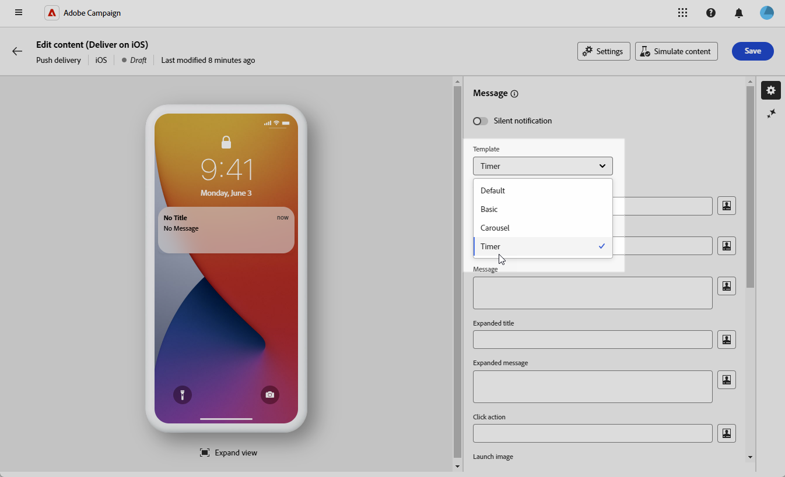

1. 若要撰寫訊息，請在&#x200B;**[!UICONTROL 標題]**、**[!UICONTROL 展開標題]**、**[!UICONTROL 訊息]**&#x200B;和&#x200B;**[!UICONTROL 展開訊息]**&#x200B;欄位中輸入您的文字。

   **[!UICONTROL 訊息]**&#x200B;文字會顯示在收合的檢視中，而展開通知時會顯示&#x200B;**[!UICONTROL 展開訊息]**。

   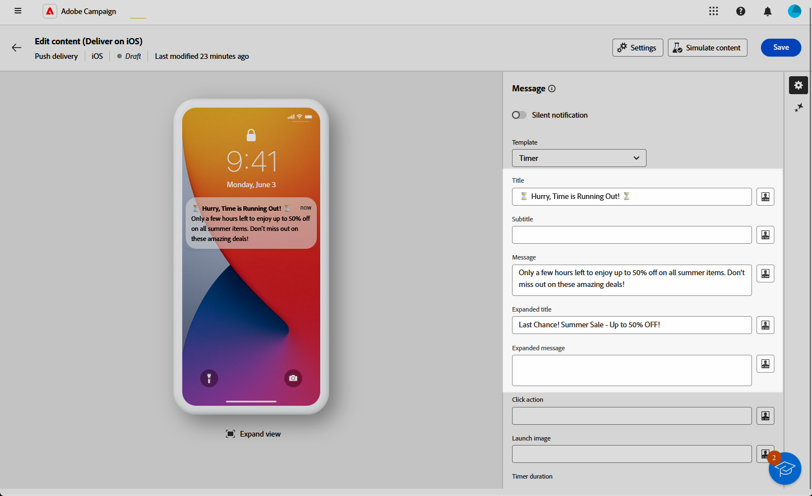

1. 使用運算式編輯器來定義內容、個人化資料及新增動態內容。 [了解更多](../personalization/personalize.md)

1. 選擇性地新增&#x200B;**[!UICONTROL Subtitle]**，其對應至iOS通知承載的&#x200B;**subtitle**&#x200B;引數。

1. 新增定義與使用者點按您的通知相關聯的&#x200B;**[!UICONTROL 點按動作]**&#x200B;的URL。 這會決定使用者與通知互動時的行為，例如開啟特定畫面或在應用程式中執行特定動作。

1. 若要進一步個人化您的推播通知，您可以選擇要新增至推播通知的&#x200B;**[!UICONTROL 啟動影像]** URL。

1. 將您的&#x200B;**[!UICONTROL 計時器持續時間]** （以秒為單位）或&#x200B;**[!UICONTROL 計時器結束時間戳記]**&#x200B;設定為特定紀元時間戳記。

   

1. 在&#x200B;**[!UICONTROL 替代標題]**、**[!UICONTROL 替代訊息]**&#x200B;和&#x200B;**[!UICONTROL 替代啟動影像]**&#x200B;欄位中，輸入計時器過期後顯示的文字和影像。

   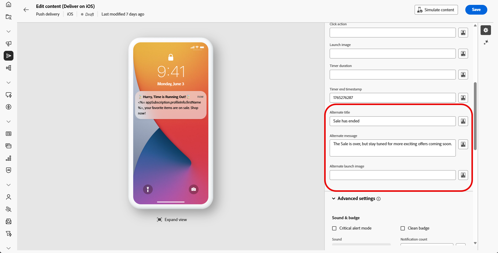

1. 從&#x200B;**[!UICONTROL 進階設定]**&#x200B;下拉式清單，瀏覽至&#x200B;**[!UICONTROL 聲音與徽章]**&#x200B;標籤，以自訂其他設定，例如通知的聲音與徽章選項。 [了解更多](#sound-badge)

1. 在&#x200B;**[!UICONTROL 色彩選項]**&#x200B;功能表中，輸入&#x200B;**[!UICONTROL 通知背景色彩]**、**[!UICONTROL 通知背景色彩]**&#x200B;和&#x200B;**[!UICONTROL 訊息文字色彩]**&#x200B;的十六進位色彩代碼。

1. 如需進一步自訂，請探索推播通知可用的&#x200B;**[!UICONTROL 其他]**&#x200B;選項。 [了解更多](#push-advanced)

1. 從&#x200B;**[!UICONTROL 應用程式變數]**&#x200B;功能表，會自動新增您的&#x200B;**[!UICONTROL 應用程式變數]**。 它們可讓您定義通知行為，例如，您可以設定當使用者啟動通知時顯示的特定應用程式畫面。

定義訊息內容後，您可以使用測試訂閱者來預覽及測試訊息。

>[!ENDTABS]

## 推播通知進階設定 {#push-advanced}

### 聲音和徽章選項 {#sound-badge}

| 參數 | 說明 |
|---------|---------|
| **[!UICONTROL 嚴重警示模式]** | 啟用此選項可將聲音新增至您的通知，即使使用者的電話已設定為焦點模式或iPhone已靜音。 |
| **[!UICONTROL 清潔徽章]** | 啟用此選項以重新整理徽章值。 |
| **[!UICONTROL 聲音]** | 設定裝置收到通知時播放的音效。 |
| **[!UICONTROL 通知計數]** | 設定用於直接在應用程式圖示上顯示新未讀取資訊的數字。 |
| **[!UICONTROL 磁碟區]** | 將音量從0設定為100。 聲音必須包含在應用程式中，並在建立服務時定義。 |

### 顏色選項 {#color}

| 參數 | 說明 |
|---------|---------|
| **[!UICONTROL 通知背景色彩]** | 使用十六進位色彩代碼設定通知背景的色彩。 |
| **[!UICONTROL 標題顏色]** | 使用十六進位色彩代碼設定標題的色彩。 |
| **[!UICONTROL 訊息文字色彩]** | 使用十六進位色彩代碼設定文字的色彩。 |

### 進階選項 {#notification-options}

| 參數 | 說明 |
|---------|---------|
| **[!UICONTROL 可變內容]** | 啟用此選項可允許行動應用程式下載媒體內容。 |
| **[!UICONTROL 關聯性分數]** | 將關聯性分數從0設定為100。 系統會使用此選項來排序通知摘要中的通知。 |
| **[!UICONTROL 中斷層級]** | <ul><li>作用中：依預設設定，系統會立即顯示通知、開啟熒幕，並可播放音效。 通知不會突破焦點模式。</li><li>被動：系統會將通知新增至通知清單，而不需開啟熒幕或播放音效。 通知不會突破焦點模式。</li><li> 有時效性：系統立即顯示通知、讓熒幕亮起、播放聲音並突破焦點模式。 此層級不需要Apple的特殊許可權。</li><li>嚴重：系統會立即顯示通知、讓熒幕亮起，並略過靜音切換或聚焦模式。 請注意，此層級需要Apple的特殊許可權。</li></ul> |
| **[!UICONTROL 執行緒ID]** | 設定用來將相關通知分組在一起的識別碼。 |
| **[!UICONTROL 類別]** | 設定將顯示動作按鈕的類別ID名稱。 這些通知可讓使用者以更快的方式回應通知，執行不同的工作，而不需在應用程式中開啟或導覽。 |
| **[!UICONTROL 目標內容識別碼]** | 設定識別碼，用來在開啟通知時鎖定要轉送的應用程式視窗。 |
