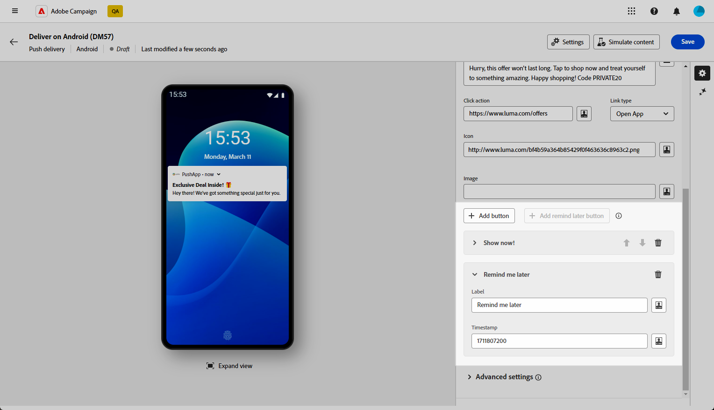
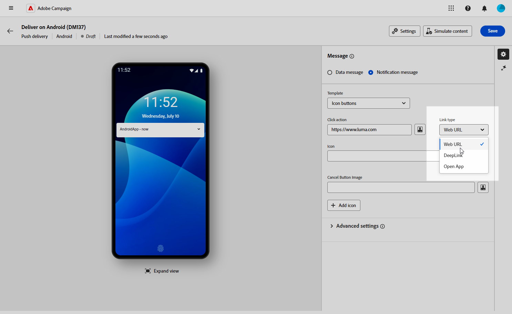
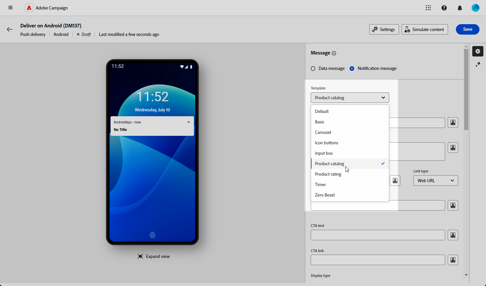
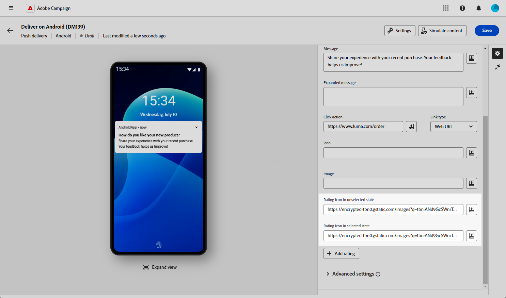
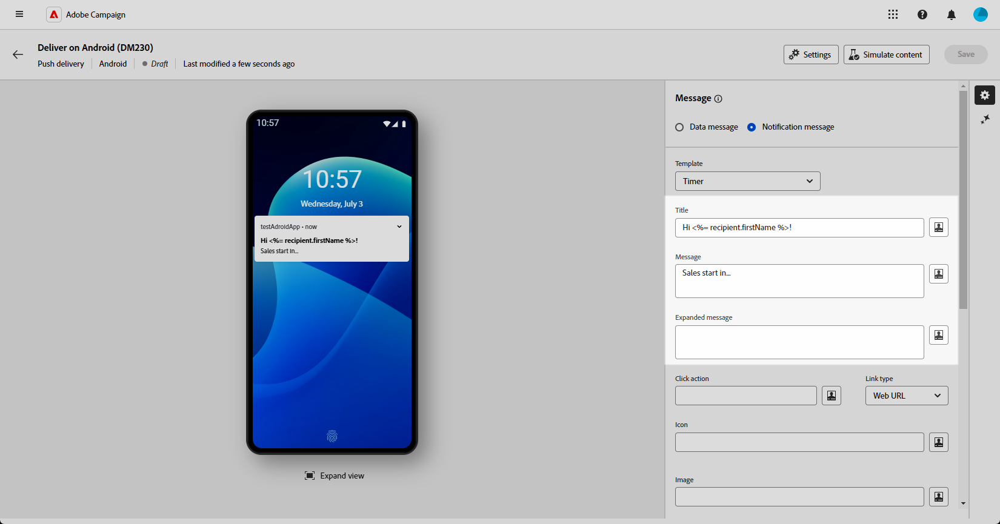

# 設計 Android 豐富的推播傳遞 {#rich-push}

>[!CONTEXTUALHELP]
>id="acw_deliveries_push_remind_later"
>title="稍後提醒按鈕"
>abstract="「**稍後提醒**」按鈕會提供排程提醒選項。時間戳記欄位需要一個表示 epoch (以秒為單位) 的值。"

>[!IMPORTANT]
>
>* 此功能需要更新到 Campaign v8.6.3 <!--or v8.7.2-->。若要了解更多資訊，請參閱 Campaign v8 用戶端主控台[發行說明](https://experienceleague.adobe.com/zh-hant/docs/campaign/campaign-v8/releases/release-notes){target="_blank"}。
>
>* 在設計豐富推送通知之前，您必須先設定V2聯結器。 如需詳細程式，請參閱[此頁面](https://experienceleague.adobe.com/en/docs/campaign-classic/using/sending-messages/sending-push-notifications/configure-the-mobile-app/configuring-the-mobile-application-android#configuring-external-account-android){target="_blank"}。

使用Firebase Cloud Messaging時，您可以選擇兩種型別的訊息：

* **[!UICONTROL 資料訊息]**&#x200B;已由使用者端應用程式處理。 這些訊息會直接傳送至行動應用程式，在裝置上產生和顯示Android通知。 資料訊息僅包含您的自訂應用程式變數。

* **[!UICONTROL 通知訊息]**，由FCM SDK自動處理。 FCM會自動代表使用者端應用程式在使用者裝置上顯示訊息。 通知訊息包含預先定義的一組引數和選項，但仍可使用自訂應用程式變數進一步個人化。

在Android頁面上傳遞的{zoomable="yes"}

## 定義通知的內容 {#push-message}

建立推播傳送後，您可以使用下列其中一個範本來定義其內容：

* **預設**&#x200B;可讓您傳送包含簡單圖示和隨附影像的通知。

* **基本**&#x200B;可以在您的通知中包含文字、影像和按鈕。

* **輪播**&#x200B;可讓您傳送包含文字和多個影像的通知，讓使用者可以滑動瀏覽。

* **圖示按鈕**&#x200B;可讓您傳送包含圖示和對應影像的通知。

* **輸入方塊**&#x200B;會直接透過通知收集使用者輸入和回饋。

* **產品目錄**&#x200B;會顯示各種產品影像。

* **產品評等**&#x200B;可讓使用者提供意見反應並評等產品。

* **計時器**&#x200B;在通知中包含即時倒數計時器。

* **零擋板**&#x200B;會使用整個背景表面來顯示影像，文字會無縫重疊。

瀏覽以下標籤，進一步瞭解如何個人化這些範本。

>[!BEGINTABS]

>[!TAB 預設]

1. 從&#x200B;**[!UICONTROL 範本]**&#x200B;下拉式清單中，選取&#x200B;**[!UICONTROL 預設]**。

   

1. 若要撰寫訊息，請在&#x200B;**[!UICONTROL 標題]**&#x200B;和&#x200B;**[!UICONTROL 訊息]**&#x200B;欄位中輸入文字。

   

1. 使用運算式編輯器來定義內容、個人化資料及新增動態內容。 [了解更多](../personalization/personalize.md)

1. 定義與使用者點按通知相關的&#x200B;**[!UICONTROL 點按動作]**。 這會決定使用者與通知互動時的行為，例如開啟特定畫面或在應用程式中執行特定動作。

1. 若要進一步個人化您的推播通知，您可以選擇要新增至推播通知的&#x200B;**[!UICONTROL 影像]** URL，以及要在設定檔裝置上顯示的通知&#x200B;**[!UICONTROL 圖示]**。

   

1. 設定推播通知的&#x200B;**[!UICONTROL 進階設定]**。 [了解更多](#push-advanced)

定義訊息內容後，您可以使用測試訂閱者來預覽及測試訊息。

>[!TAB 基本]

1. 從&#x200B;**[!UICONTROL 範本]**&#x200B;下拉式清單中，選取&#x200B;**[!UICONTROL 基本]**。

   

1. 若要撰寫訊息，請在&#x200B;**[!UICONTROL 標題]**、**[!UICONTROL 訊息]**&#x200B;和&#x200B;**[!UICONTROL 展開訊息]**&#x200B;欄位中輸入您的文字。

   **[!UICONTROL 訊息]**&#x200B;文字會顯示在收合的檢視中，而展開通知時會顯示&#x200B;**[!UICONTROL 展開訊息]**。

   

1. 使用運算式編輯器來定義內容、個人化資料及新增動態內容。 [了解更多](../personalization/personalize.md)

1. 新增定義與使用者點按您的通知相關聯的&#x200B;**[!UICONTROL 點按動作]**&#x200B;的URL。 這會決定使用者與通知互動時的行為，例如開啟特定畫面或在應用程式中執行特定動作。

1. 選取您新增至&#x200B;**[!UICONTROL 點按動作]**&#x200B;欄位之URL的&#x200B;**[!UICONTROL 連結型別]**：

   * **[!UICONTROL 網頁URL]**：網頁URL會將使用者導向至線上內容。 按一下後，它們會提示裝置的預設網頁瀏覽器開啟並導覽至指定的URL。

   * **[!UICONTROL 深層連結]**：深層連結是引導使用者前往應用程式內特定區段的URL，即使應用程式已關閉。 按一下即可顯示對話方塊，讓使用者從能夠處理連結的各種應用程式中進行選擇。

   * **[!UICONTROL 開啟應用程式]**：開啟應用程式URL可讓您直接連線到應用程式中的內容。 它可讓您的應用程式繞過消除歧義對話方塊，將其自身建立為特定連結型別的預設處理常式。

   如需如何處理Android應用程式連結的詳細資訊，請參閱[Android開發人員檔案](https://developer.android.com/training/app-links)。

   

1. 若要進一步個人化您的推播通知，您可以選擇要新增至推播通知的&#x200B;**[!UICONTROL 影像]** URL，以及要在設定檔裝置上顯示的通知&#x200B;**[!UICONTROL 圖示]**。

1. 按一下「**[!UICONTROL 新增」按鈕]**&#x200B;並填寫下列欄位：

   * **[!UICONTROL 標籤]**：按鈕上顯示的文字。
   * **[!UICONTROL 連結URI]**：指定按一下按鈕時要執行的URI。
   * **[!UICONTROL 連結型別]**：連結型別&#x200B;**[!UICONTROL 網頁URL]**、**[!UICONTROL 深層連結]**&#x200B;或&#x200B;**[!UICONTROL 開啟應用程式]**。

   您可以選擇在推播通知中包含最多三個按鈕。 如果您選擇稍後再提醒&#x200B;**[!UICONTROL 按鈕]**，則最多只能包含兩個按鈕。

   

1. 按一下&#x200B;**[!UICONTROL 稍後新增提醒]**&#x200B;按鈕，將稍後提醒選項新增至推播通知。 輸入&#x200B;**[!UICONTROL 標籤]**&#x200B;和&#x200B;**[!UICONTROL 時間戳記]**。

   Timestamp欄位需要代表epoch （以秒為單位）的值。

   

1. 設定推播通知的&#x200B;**[!UICONTROL 進階設定]**。 [了解更多](#push-advanced)

定義訊息內容後，您可以使用測試訂閱者來預覽及測試訊息。

>[!TAB 輪播]

1. 從&#x200B;**[!UICONTROL 範本]**&#x200B;下拉式清單中，選取&#x200B;**[!UICONTROL 輪播]**。

   

1. 若要撰寫訊息，請在&#x200B;**[!UICONTROL 標題]**、**[!UICONTROL 訊息]**&#x200B;和&#x200B;**[!UICONTROL 展開訊息]**&#x200B;欄位中輸入您的文字。

   **[!UICONTROL 訊息]**&#x200B;文字會顯示在收合的檢視中，而展開通知時會顯示&#x200B;**[!UICONTROL 展開訊息]**。

   

1. 使用運算式編輯器來定義內容、個人化資料及新增動態內容。 [了解更多](../personalization/personalize.md)

1. 新增定義與使用者點按您的通知相關聯的&#x200B;**[!UICONTROL 點按動作]**&#x200B;的URL。 這會決定使用者與通知互動時的行為，例如開啟特定畫面或在應用程式中執行特定動作。

1. 選取您新增至&#x200B;**[!UICONTROL 點按動作]**&#x200B;欄位之URL的&#x200B;**[!UICONTROL 連結型別]**：

   * **[!UICONTROL 網頁UR]**L：網頁URL會將使用者導向至線上內容。 按一下後，它們會提示裝置的預設網頁瀏覽器開啟並導覽至指定的URL。

   * **[!UICONTROL 深層連結]**：深層連結是引導使用者前往應用程式內特定區段的URL，即使應用程式已關閉。 按一下即可顯示對話方塊，讓使用者從能夠處理連結的各種應用程式中進行選擇。

   * **[!UICONTROL 開啟應用程式]**：開啟應用程式URL可讓您直接連線到應用程式中的內容。 它可讓您的應用程式繞過消除歧義對話方塊，將其自身建立為特定連結型別的預設處理常式。

   如需如何處理Android應用程式連結的詳細資訊，請參閱[Android開發人員檔案](https://developer.android.com/training/app-links)。

   

1. 若要進一步個人化您的推播通知，您可以選擇通知的&#x200B;**[!UICONTROL 圖示]**&#x200B;顯示在您設定檔的裝置上。

1. 選擇&#x200B;**[!UICONTROL 輪播]**&#x200B;的運作方式：

   * **[!UICONTROL 自動]**：以投影片形式自動循環顯示影像，以預先定義的間隔轉換。
   * **[!UICONTROL 手動]**：可讓使用者在幻燈片之間手動滑動，以瀏覽影像。

     啟用&#x200B;**[!UICONTROL 影片]**&#x200B;選項，在主投影片旁加入上一個和下一個影像的預覽。

1. 按一下&#x200B;**[!UICONTROL 新增影像]**，然後輸入影像URL與文字。

   請確定您至少包含三個影像，最多包含五個影像。

   

1. 使用向下和向上箭頭處理影像的順序。

1. 設定推播通知的&#x200B;**[!UICONTROL 進階設定]**。 [了解更多](#push-advanced)

定義訊息內容後，您可以使用測試訂閱者來預覽及測試訊息。

>[!TAB 圖示按鈕]

1. 從&#x200B;**[!UICONTROL 範本]**&#x200B;下拉式清單中，選取&#x200B;**[!UICONTROL 圖示按鈕]**。

   

1. 新增定義與使用者點按您的通知相關聯的&#x200B;**[!UICONTROL 點按動作]**&#x200B;的URL。 這會決定使用者與通知互動時的行為，例如開啟特定畫面或在應用程式中執行特定動作。

1. 選取您新增至&#x200B;**[!UICONTROL 點按動作]**&#x200B;欄位之URL的&#x200B;**[!UICONTROL 連結型別]**：

   * **[!UICONTROL 網頁URL]**：網頁URL會將使用者導向至線上內容。 按一下後，它們會提示裝置的預設網頁瀏覽器開啟並導覽至指定的URL。

   * **[!UICONTROL 深層連結]**：深層連結是引導使用者前往應用程式內特定區段的URL，即使應用程式已關閉。 按一下即可顯示對話方塊，讓使用者從能夠處理連結的各種應用程式中進行選擇。

   * **[!UICONTROL 開啟應用程式]**：開啟應用程式URL可讓您直接連線到應用程式中的內容。 它可讓您的應用程式繞過消除歧義對話方塊，將其自身建立為特定連結型別的預設處理常式。

   如需如何處理Android應用程式連結的詳細資訊，請參閱[Android開發人員檔案](https://developer.android.com/training/app-links)。

   

1. 若要進一步個人化您的推播通知，您可以選擇通知的&#x200B;**[!UICONTROL 圖示]**&#x200B;顯示在您設定檔的裝置上。

1. 新增&#x200B;**[!UICONTROL 取消按鈕影像]**&#x200B;的URL。

1. 按一下&#x200B;**[!UICONTROL 新增圖示]**&#x200B;並輸入您的&#x200B;**影像URL**、**[!UICONTROL 連結URI]**&#x200B;並選擇您的&#x200B;**[!UICONTROL 連結型別]**。

   請確定您至少包含三個圖示，最多包含五個圖示。

   

1. 使用向下和向上箭頭處理影像的順序。

1. 設定推播通知的&#x200B;**[!UICONTROL 進階設定]**。 [了解更多](#push-advanced)

   

定義訊息內容後，您可以使用測試訂閱者來預覽及測試訊息。

>[!TAB 輸入方塊]

1. 從&#x200B;**[!UICONTROL 通知型別]**&#x200B;下拉式清單中，選取&#x200B;**[!UICONTROL 輸入方塊]**。

   

1. 若要撰寫訊息，請在&#x200B;**[!UICONTROL 標題]**、**[!UICONTROL 訊息]**&#x200B;和&#x200B;**[!UICONTROL 展開訊息]**&#x200B;欄位中輸入您的文字。

   **[!UICONTROL 訊息]**&#x200B;文字會顯示在收合的檢視中，而展開通知時會顯示&#x200B;**[!UICONTROL 展開訊息]**。

   

1. 使用動態個人化欄位來定義內容、個人化資料並新增動態內容。 [了解更多](../personalization/personalize.md)

1. 新增定義與使用者點按您的通知相關聯的&#x200B;**[!UICONTROL 點按動作]**&#x200B;的URL。 這會決定使用者與通知互動時的行為，例如開啟特定畫面或在應用程式中執行特定動作。

1. 選取您新增至&#x200B;**[!UICONTROL 點按動作]**&#x200B;欄位之URL的&#x200B;**[!UICONTROL 連結型別]**：

   * **[!UICONTROL 網頁URL]**：網頁URL會將使用者導向至線上內容。 按一下後，它們會提示裝置的預設網頁瀏覽器開啟並導覽至指定的URL。

   * **[!UICONTROL 深層連結]**：深層連結是引導使用者前往應用程式內特定區段的URL，即使應用程式已關閉。 按一下即可顯示對話方塊，讓使用者從能夠處理連結的各種應用程式中進行選擇。

   * **[!UICONTROL 開啟應用程式]**：開啟應用程式URL可讓您直接連線到應用程式中的內容。 它可讓您的應用程式繞過消除歧義對話方塊，將其自身建立為特定連結型別的預設處理常式。

   如需如何處理Android應用程式連結的詳細資訊，請參閱[Android開發人員檔案](https://developer.android.com/training/app-links)。

1. 若要進一步個人化您的推播通知，您可以選擇要新增至推播通知的&#x200B;**[!UICONTROL 影像]** URL，以及要在設定檔裝置上顯示的通知&#x200B;**[!UICONTROL 圖示]**。

1. 為您的&#x200B;**輸入方塊**&#x200B;填入下列選項：

   * **[!UICONTROL 輸入接收者名稱]**：輸入輸入接收者的名稱或識別碼。
   * **[!UICONTROL 輸入文字]**：輸入&#x200B;**輸入方塊**&#x200B;的文字。
   * **[!UICONTROL 意見回饋文字]**：輸入要在回覆後顯示的文字。
   * **[!UICONTROL 意見回饋影像]**：新增回覆後所顯示影像的URL。

   

1. 設定推播通知的&#x200B;**[!UICONTROL 進階設定]**。 [了解更多](#push-advanced)

定義訊息內容後，您可以使用測試訂閱者來預覽及測試訊息。

>[!TAB 產品目錄]

1. 從&#x200B;**[!UICONTROL 通知型別]**&#x200B;下拉式清單中，選取&#x200B;**[!UICONTROL 產品目錄]**。

   

1. 若要撰寫訊息，請在&#x200B;**[!UICONTROL 標題]**&#x200B;和&#x200B;**[!UICONTROL 訊息]**&#x200B;欄位中輸入文字。

   

1. 使用動態個人化欄位來定義內容、個人化資料並新增動態內容。 [了解更多](../personalization/personalize.md)

1. 新增定義與使用者點按您的通知相關聯的&#x200B;**[!UICONTROL 點按動作]**&#x200B;的URL。 這會決定使用者與通知互動時的行為，例如開啟特定畫面或在應用程式中執行特定動作。

1. 選取您新增至&#x200B;**[!UICONTROL 點按動作]**&#x200B;欄位之URL的&#x200B;**[!UICONTROL 連結型別]**：

   * **[!UICONTROL 網頁URL]**：網頁URL會將使用者導向至線上內容。 按一下後，它們會提示裝置的預設網頁瀏覽器開啟並導覽至指定的URL。

   * **[!UICONTROL 深層連結]**：深層連結是引導使用者前往應用程式內特定區段的URL，即使應用程式已關閉。 按一下即可顯示對話方塊，讓使用者從能夠處理連結的各種應用程式中進行選擇。

   * **[!UICONTROL 開啟應用程式]**：開啟應用程式URL可讓您直接連線到應用程式中的內容。 它可讓您的應用程式繞過消除歧義對話方塊，將其自身建立為特定連結型別的預設處理常式。

   如需如何處理Android應用程式連結的詳細資訊，請參閱[Android開發人員檔案](https://developer.android.com/training/app-links)。

1. 若要進一步個人化您的推播通知，您可以選擇通知的&#x200B;**[!UICONTROL 圖示]**&#x200B;顯示在您設定檔的裝置上。

1. 輸入您的&#x200B;**點按動作文字**&#x200B;和&#x200B;**影像**。

1. 在「水準」或「垂直」之間選擇您的&#x200B;**[!UICONTROL 顯示型別]**。

1. 填寫您的&#x200B;**[!UICONTROL 目錄]**&#x200B;專案資訊。

   請確定您至少包含三個專案，最多包含五個專案。

   

1. 使用向下和向上箭頭處理影像的順序。

1. 設定推播通知的&#x200B;**[!UICONTROL 進階設定]**。 [了解更多](#push-advanced)

定義訊息內容後，您可以使用測試訂閱者來預覽及測試訊息。

>[!TAB 產品評等]

1. 從&#x200B;**[!UICONTROL 通知型別]**&#x200B;下拉式清單中，選取&#x200B;**[!UICONTROL 產品評等]**。

   

1. 若要撰寫訊息，請在&#x200B;**[!UICONTROL 標題]**、**[!UICONTROL 訊息]**&#x200B;和&#x200B;**[!UICONTROL 展開訊息]**&#x200B;欄位中輸入您的文字。

   **[!UICONTROL 訊息]**&#x200B;文字會顯示在收合的檢視中，而展開通知時會顯示&#x200B;**[!UICONTROL 展開訊息]**。

   

1. 新增定義與使用者點按您的通知相關聯的&#x200B;**[!UICONTROL 點按動作]**&#x200B;的URL。 這會決定使用者與通知互動時的行為，例如開啟特定畫面或在應用程式中執行特定動作。

1. 選取您新增至&#x200B;**[!UICONTROL 點按動作]**&#x200B;欄位之URL的&#x200B;**[!UICONTROL 連結型別]**：

   * **[!UICONTROL 網頁URL]**：網頁URL會將使用者導向至線上內容。 按一下後，它們會提示裝置的預設網頁瀏覽器開啟並導覽至指定的URL。

   * **[!UICONTROL 深層連結]**：深層連結是引導使用者前往應用程式內特定區段的URL，即使應用程式已關閉。 按一下即可顯示對話方塊，讓使用者從能夠處理連結的各種應用程式中進行選擇。

   * **[!UICONTROL 開啟應用程式]**：開啟應用程式URL可讓您直接連線到應用程式中的內容。 它可讓您的應用程式繞過消除歧義對話方塊，將其自身建立為特定連結型別的預設處理常式。

   如需如何處理Android應用程式連結的詳細資訊，請參閱[Android開發人員檔案](https://developer.android.com/training/app-links)。

1. 若要進一步個人化您的推播通知，您可以選擇要新增至推播通知的&#x200B;**[!UICONTROL 影像]** URL，以及要在設定檔裝置上顯示的通知&#x200B;**[!UICONTROL 圖示]**。

1. 新增處於未選取狀態的&#x200B;**[!UICONTROL 評等圖示]**&#x200B;以及處於選取狀態的&#x200B;]**個URL中的**[!UICONTROL &#x200B;評等圖示。

   

1. 按一下&#x200B;**[!UICONTROL 新增評等]**，然後輸入您的&#x200B;**[!UICONTROL 連結URI]**&#x200B;和&#x200B;**[!UICONTROL 連結型別]**。

   請確定您包含最少三個評等，最多五個評等。

   

1. 使用向下和向上箭頭處理影像的順序。

1. 設定推播通知的&#x200B;**[!UICONTROL 進階設定]**。 [了解更多](#push-advanced)

定義訊息內容後，您可以使用測試訂閱者來預覽及測試訊息。

>[!TAB 計時器]

1. 從&#x200B;**[!UICONTROL 通知型別]**&#x200B;下拉式清單中，選取&#x200B;**[!UICONTROL 計時器]**。

   

1. 若要撰寫訊息，請在&#x200B;**[!UICONTROL 標題]**&#x200B;和&#x200B;**[!UICONTROL 訊息]**&#x200B;欄位中輸入文字。

   使用動態個人化欄位來定義內容、個人化資料並新增動態內容。 [了解更多](../personalization/personalize.md)

   

1. 新增定義與使用者點按您的通知相關聯的&#x200B;**[!UICONTROL 點按動作]**&#x200B;的URL。 這會決定使用者與通知互動時的行為，例如開啟特定畫面或在應用程式中執行特定動作。

1. 選取您新增至&#x200B;**[!UICONTROL 點按動作]**&#x200B;欄位之URL的&#x200B;**[!UICONTROL 連結型別]**：

   * **[!UICONTROL 網頁URL]**：網頁URL會將使用者導向至線上內容。 按一下後，它們會提示裝置的預設網頁瀏覽器開啟並導覽至指定的URL。

   * **[!UICONTROL 深層連結]**：深層連結是引導使用者前往應用程式內特定區段的URL，即使應用程式已關閉。 按一下即可顯示對話方塊，讓使用者從能夠處理連結的各種應用程式中進行選擇。

   * **[!UICONTROL 開啟應用程式]**：開啟應用程式URL可讓您直接連線到應用程式中的內容。 它可讓您的應用程式繞過消除歧義對話方塊，將其自身建立為特定連結型別的預設處理常式。

   如需如何處理Android應用程式連結的詳細資訊，請參閱[Android開發人員檔案](https://developer.android.com/training/app-links)。

   

1. 若要進一步個人化您的推播通知，您可以選擇要新增至推播通知的&#x200B;**[!UICONTROL 影像]** URL，以及要在設定檔裝置上顯示的通知&#x200B;**[!UICONTROL 圖示]**。

1. 將您的&#x200B;**[!UICONTROL 計時器持續時間]** （以秒為單位）或&#x200B;**[!UICONTROL 計時器結束時間戳記]**&#x200B;設定為特定紀元時間戳記。

   

1. 在&#x200B;**[!UICONTROL 替代標題]**、**[!UICONTROL 替代訊息]**、**[!UICONTROL 替代展開訊息]**&#x200B;和&#x200B;**[!UICONTROL 替代啟動影像]**&#x200B;欄位中，輸入計時器過期後顯示的文字和影像。

   

1. 設定推播通知的&#x200B;**[!UICONTROL 進階設定]**。 [了解更多](#push-advanced)

定義訊息內容後，您可以使用測試訂閱者來預覽及測試訊息。

>[!TAB 零擋板]

1. 從&#x200B;**[!UICONTROL 通知型別]**&#x200B;下拉式清單中，選取&#x200B;**[!UICONTROL 零擋板]**。

   

1. 若要撰寫訊息，請在&#x200B;**[!UICONTROL 標題]**、**[!UICONTROL 訊息]**&#x200B;和&#x200B;**[!UICONTROL 展開訊息]**&#x200B;欄位中輸入您的文字。

   **[!UICONTROL 訊息]**&#x200B;文字會顯示在收合的檢視中，而展開通知時會顯示&#x200B;**[!UICONTROL 展開訊息]**。

   

1. 使用動態個人化欄位來定義內容、個人化資料並新增動態內容。 [了解更多](../personalization/personalize.md)

1. 新增定義與使用者點按您的通知相關聯的&#x200B;**[!UICONTROL 點按動作]**&#x200B;的URL。 這會決定使用者與通知互動時的行為，例如開啟特定畫面或在應用程式中執行特定動作。

1. 選取您新增至&#x200B;**[!UICONTROL 點按動作]**&#x200B;欄位之URL的&#x200B;**[!UICONTROL 連結型別]**：

   * **[!UICONTROL 網頁URL]**：網頁URL會將使用者導向至線上內容。 按一下後，它們會提示裝置的預設網頁瀏覽器開啟並導覽至指定的URL。

   * **[!UICONTROL 深層連結]**：深層連結是引導使用者前往應用程式內特定區段的URL，即使應用程式已關閉。 按一下即可顯示對話方塊，讓使用者從能夠處理連結的各種應用程式中進行選擇。

   * **[!UICONTROL 開啟應用程式]**：開啟應用程式URL可讓您直接連線到應用程式中的內容。 它可讓您的應用程式繞過消除歧義對話方塊，將其自身建立為特定連結型別的預設處理常式。

   如需如何處理Android應用程式連結的詳細資訊，請參閱[Android開發人員檔案](https://developer.android.com/training/app-links)。

1. 若要進一步個人化您的推播通知，您可以選擇要新增至推播通知的&#x200B;**[!UICONTROL 影像]** URL，以及要在設定檔裝置上顯示的通知&#x200B;**[!UICONTROL 圖示]**。

   

1. 選擇通知的&#x200B;**[!UICONTROL 摺疊通知樣式]**，無論通知主要顯示影像或文字。

1. 設定推播通知的&#x200B;**[!UICONTROL 進階設定]**。 [了解更多](#push-advanced)

定義訊息內容後，您可以使用測試訂閱者來預覽及測試訊息。

>[!ENDTABS]

## 推播通知進階設定 {#push-advanced}

{zoomable="yes"}

| 參數 | 說明 |
|---------|---------|
| **[!UICONTROL 圖示色彩]** | 使用十六進位色彩代碼設定圖示的色彩。 |
| **[!UICONTROL 標題顏色]** | 使用十六進位色彩代碼設定標題的色彩。 |
| **[!UICONTROL 訊息文字色彩]** | 使用十六進位色彩代碼設定訊息文字的色彩。 |
| **[!UICONTROL 計時器色彩]** | 使用十六進位色彩代碼設定計時器的色彩。 |
| **[!UICONTROL 通知背景色彩]** | 使用十六進位色彩代碼設定通知背景的色彩。 |
| **[!UICONTROL 聲音]** | 設定裝置收到通知時播放的音效。 |
| **[!UICONTROL 通知計數]** | 設定直接在應用程式圖示上顯示的新未讀取資訊數目。 此讓使用者迅速查看待處理的通知數量。 |
| **[!UICONTROL 管道ID]** | 設定通知的頻道ID。 在收到具有此管道ID的任何通知之前，應用程式必須建立具有此管道ID的管道。 |
| **[!UICONTROL 標籤]** | 設定用來取代通知抽屜中現有通知的識別碼。 這有助於防止累積多個通知，並確保只顯示最新的相關通知。 |
| **[!UICONTROL 優先順序]** | 設定通知的優先順序層級，可以是預設、最低、低或高。 優先順序層級會決定通知的重要性和急迫性，影響其顯示方式以及是否可以略過某些系統設定。 如需詳細資訊，請參閱[FCM檔案](https://firebase.google.com/docs/reference/fcm/rest/v1/projects.messages#notificationpriority)。 |
| **[!UICONTROL 可見度]** | 設定通知的可見度等級，可為公開、私人或秘密。 可見度等級會決定通知內容在鎖定畫面和其他敏感區域上顯示的程度。 如需詳細資訊，請參閱[FCM檔案](https://firebase.google.com/docs/reference/fcm/rest/v1/projects.messages#visibility)。 |
| **[!UICONTROL 粘性通知]** | 啟動後，通知仍可見，即使使用者按一下它。  如果停用，當使用者與通知互動時，通知會自動解除。 粘性行為可讓重要通知在熒幕上持續較長時間。 |
| **[!UICONTROL 應用程式變數]** | 允許您定義通知行為。 這些變數完全可自訂，且可納入傳送到行動裝置的部分訊息承載。 |