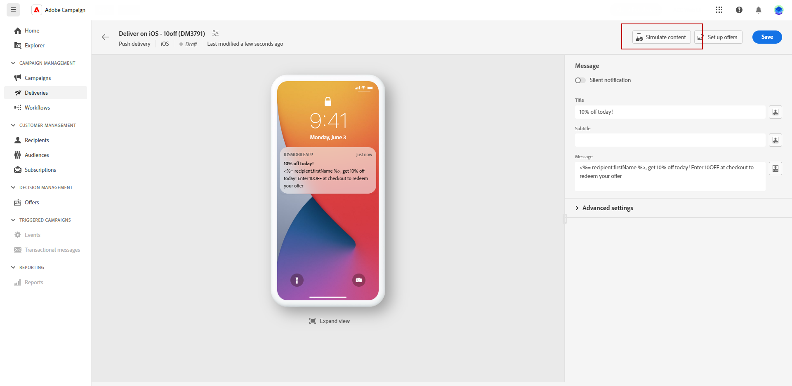
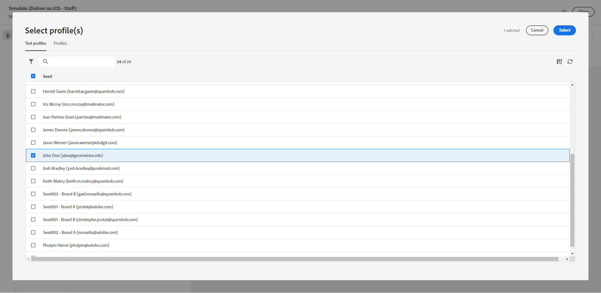
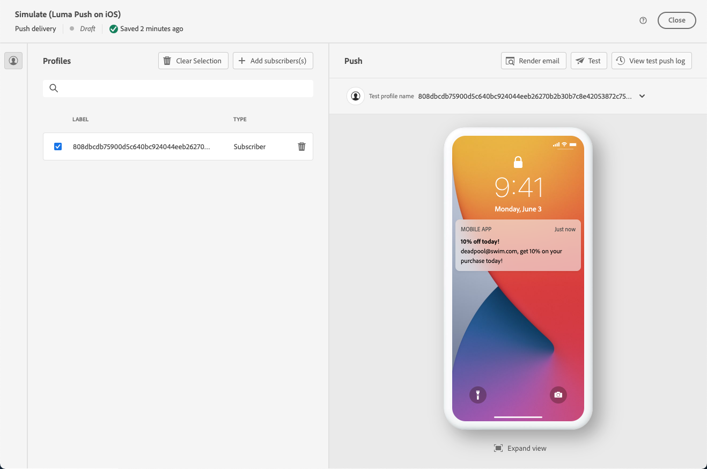
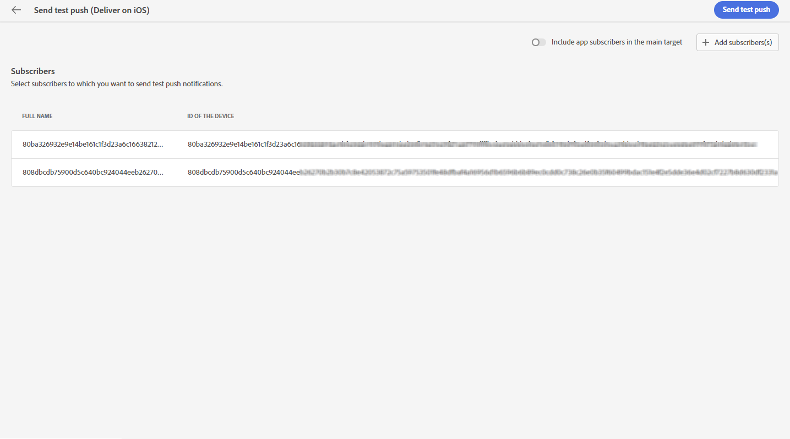
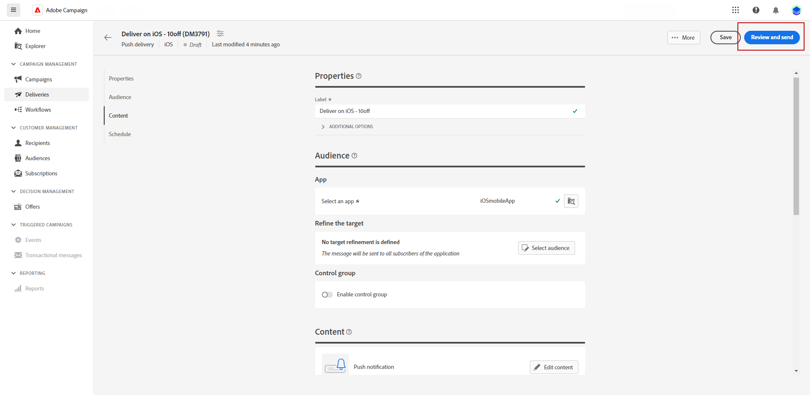
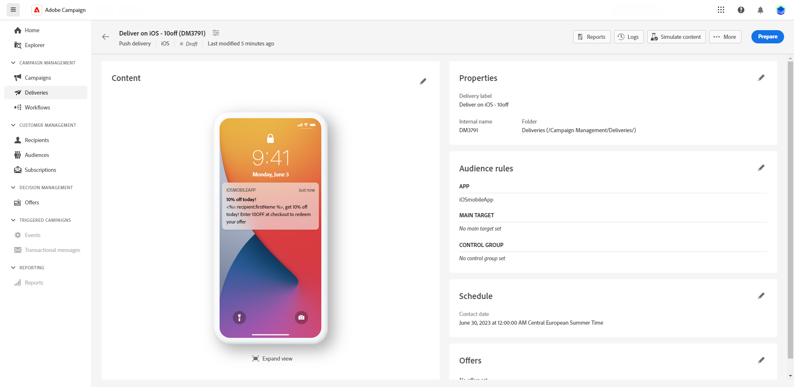
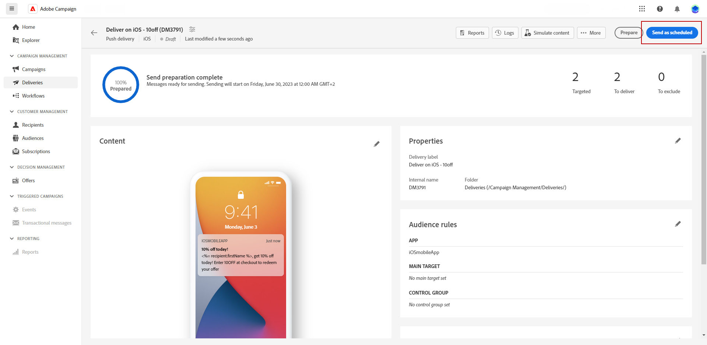

# 預覽並傳送推播傳遞 {#send-push-delivery}

## 預覽推播通知傳遞 {#preview-push}

定義訊息內容後，請使用測試訂閱者來預覽及測試訊息。 如果包含個人化內容，請使用測試設定檔資料來檢查此內容在訊息中的顯示方式。 這可確保訊息正確呈現，並適當納入個人化元素。

預覽推播通知的主要步驟如下。 如需如何預覽傳遞的詳細資訊，請參閱[本節](../preview-test/preview-content.md)。

1. 從您的傳遞內容頁面，使用&#x200B;**[!UICONTROL 模擬內容]**&#x200B;來預覽您的個人化內容。

   {zoomable="yes"}

1. 按一下&#x200B;**[!UICONTROL 新增訂閱者]**&#x200B;以選取一或多個設定檔，以便在推播通知內容中預覽其資料。

   <!--Once your test subscribers are selected, click **[!UICONTROL Select]**.
    {zoomable="yes"}-->

1. 在右窗格中，尋找推播通知的預覽，其中個人化元素會以所選設定檔的資料動態取代。

   {zoomable="yes"}

檢閱並傳送推播通知給您的對象。

## 測試推播通知傳遞 {#test-push}

使用&#x200B;**Adobe Campaign**，先傳送校樣給主要對象。 此步驟會驗證您的傳遞並識別任何問題。

測試設定檔作為證明收件者。 他們檢閱及驗證連結、影像和個人化等元件和設定，確保最佳效能並偵測錯誤。 此程式會在到達主要對象前精簡及最佳化您的推播通知。 [瞭解如何傳送校樣](../preview-test/test-deliveries.md#subscribers)。

{zoomable="yes"}

## 傳送推播通知傳遞 {#send-push}

1. 個人化您的推播通知內容後，從您的&#x200B;**[!UICONTROL 傳遞]**&#x200B;頁面按一下&#x200B;**[!UICONTROL 檢閱與傳送]**。

   {zoomable="yes"}

1. 按一下&#x200B;**[!UICONTROL 準備]**&#x200B;並監視提供的進度和統計資料。

   如果發生錯誤，請參閱記錄檔功能表以取得有關失敗的詳細資訊。

   {zoomable="yes"}

1. 按一下&#x200B;**[!UICONTROL 傳送]**&#x200B;以繼續最後的傳送程式，以傳送訊息。

1. 按一下&#x200B;**[!UICONTROL 傳送]**&#x200B;以確認傳送動作。

   如果已排程推播傳遞，請按一下&#x200B;**[!UICONTROL 依排程傳送]**&#x200B;按鈕。 在[本節](../msg/gs-messages.md#schedule-the-delivery-sending)中進一步瞭解傳遞排程。

   {zoomable="yes"}

傳送傳遞後，從傳遞頁面追蹤關鍵績效指標(KPI)資料，並從&#x200B;**[!UICONTROL 記錄檔]**&#x200B;功能表追蹤資料。

開始使用內建報告測量訊息的影響。 [了解更多](../reporting/push-report.md)。