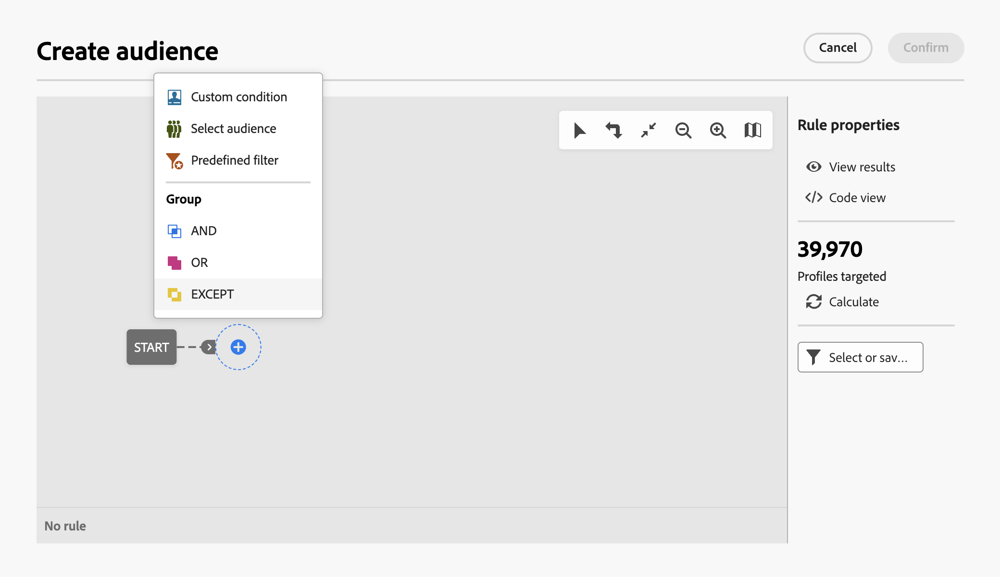
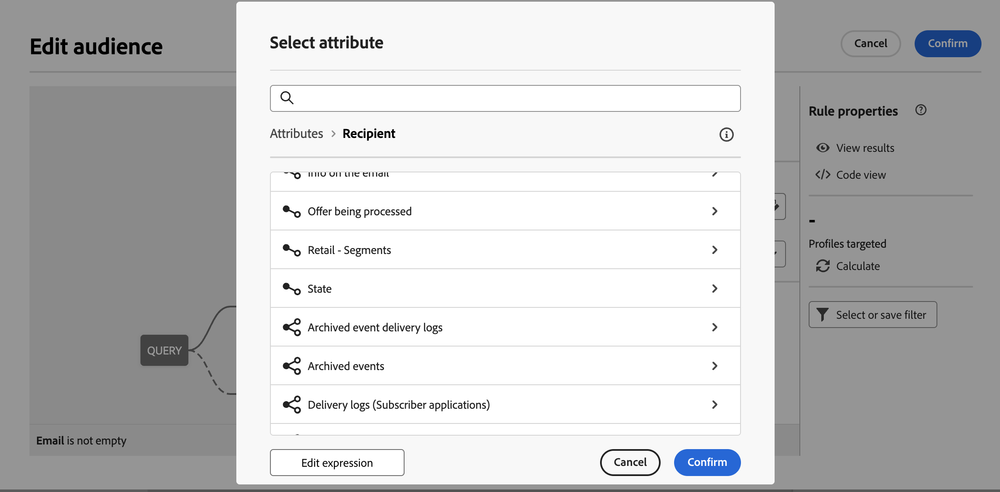
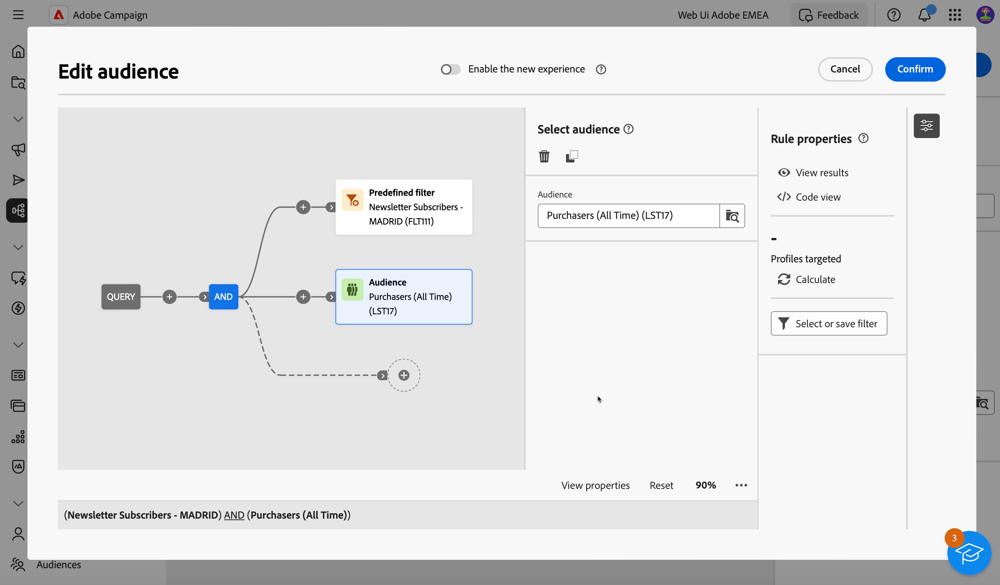
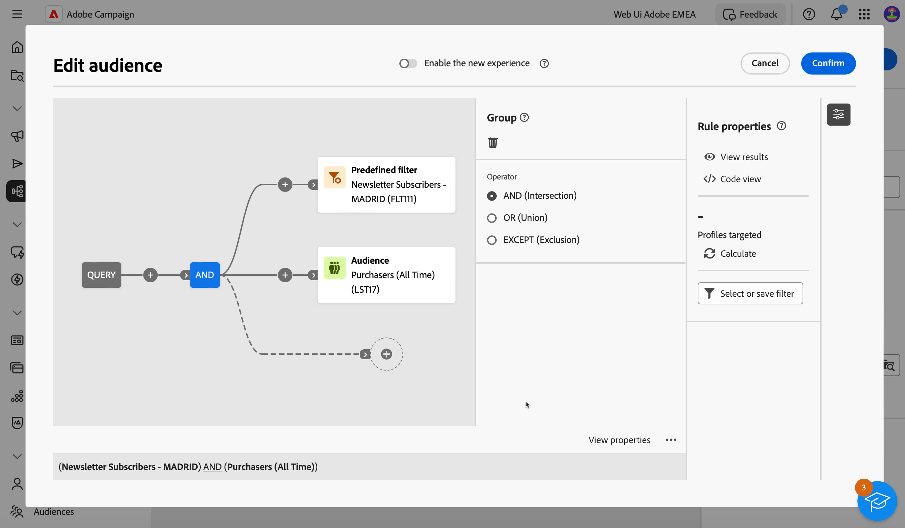

# 建置您的第一個查詢 {#build-query}

若要開始建立查詢，請根據您要執行的動作，從您選擇的位置存取查詢建模器。 「查詢建模工具」會以空白畫布開啟。 按一下+按鈕以新增查詢的第一個節點。

您可以新增兩種型別的元素：

* 篩選元件（自訂條件、選取對象、預先定義的篩選器）可讓您建立自己的規則、選取對象或預先定義的篩選器，以縮小查詢範圍。

  範例 *訂閱體育電子報的收件者*. *住在紐約的收件者*， *住在舊金山的收件者*

* 群組運運算元(AND、OR、EXCEPT)可讓您將圖表中的篩選元件群組在一起，以符合您的需求。

  範例： *訂閱「運動」電子報的收件者&#x200B;**和**住在紐約的人&#x200B;**或**舊金山*.

以下提供如何新增及組合篩選元件和群組運運算元的詳細步驟。

## 新增篩選元件

篩選元件可讓您使用下列專案來縮小查詢範圍：

* **自訂條件**：使用資料庫和進階運算式的屬性來建立您自己的條件，以篩選您的查詢。
* **受眾**：使用現有對象篩選查詢。
* **預先定義的篩選器**：使用現有的預先定義篩選器來篩選查詢。

### 設定自訂條件

>[!CONTEXTUALHELP]
>id="acw_orchestration_querymodeler_customcondition"
>title="自訂條件"
>abstract="自訂條件"

若要使用自訂條件篩選查詢，請執行下列步驟：

1. 按一下所需節點上的+按鈕，然後選取 **[!UICONTROL 自訂條件]**.
1. 自訂條件屬性窗格會在右側開啟。 在「屬性」欄位中，從資料庫中選取要用來建立條件的屬性。

   可用屬性代表Campaign資料庫中的所有欄位，包括連結至「收件者」表格的表格欄位。

   

   >[!NOTE]
   >
   >「編輯運算式」按鈕可讓您運用Campaign Web運算式編輯器，使用資料庫和協助程式函式的欄位，手動定義運算式。

1. 從下拉式清單中選取要套用的運運算元。

   +++可用運運算元清單

   >[!NOTE]
   >
   >下拉式清單中的可用運運算元取決於所選屬性的資料型別。

   | 操作員 | 用途 | 範例 |
   |  ---  |  ---  |  ---  |
   | 等於 | 傳回與第二個「值」欄中所輸入資料相同的結果。 | 姓氏(@lastName)等於&#39;Jones&#39;，只會傳回姓氏為Jones的收件者。 |
   | 不等於 | 傳回所有與輸入值不相同的值。 | 等於&#39;English&#39;的語言(@language) |
   | 大於 | 傳回大於輸入值的值。 | 年齡(@age)大於50</strong>，會傳回所有大於&#39;50&#39;的值，即&#39;51&#39;、&#39;52&#39;等 |
   | 小於 | 傳回小於輸入值的值。 | 在「DaysAgo(100)」之前的建立日期(@created)</strong>，會傳回在100天前建立的所有收件者。 |
   | 大於或等於 | 傳回等於或大於輸入值的所有值。 | 年齡(@age)大於或等於「30」</strong>，會傳回年齡在30歲或以上的所有收件者。 |
   | 小於或等於 | 傳回等於或小於輸入值的所有值。 | 年齡(@age)小於或等於「60」</strong>，會傳回年齡在60歲或以下的所有收件者。 |
   | 包含在 | 傳回指定值中包含的結果。 這些值必須以逗號分隔。 | 出生日期(@birthDate)包含在「12/10/1979,12/10/1984」中，將傳回這些日期之間出生的收件者。 |
   | 不在 | 其運作方式與「包含於」運運算元類似。 在此，我們要根據輸入的值排除收件者。 | 出生日期(@birthDate)不包含在&#39;12/10/1979,12/10/1984&#39;中。 和上一個範例不同，系統不會傳回這些日期內出生的收件者。 |
   | 是空的 | 在此案例中，我們要尋找的結果符合第二個「值」欄中的空白值。 | 行動裝置(@mobilePhone)為空白會傳回所有沒有行動號碼的收件者。 |
   | 不是空的 | 與Is empty運運算元相反的運作方式。 不需要在第二個「值」欄中輸入資料。 | 電子郵件(@email)不是空的。 |
   | 開頭為 | 傳回以輸入值開頭的結果。 | 帳戶# (@account)以「32010」開頭。 |
   | 開頭不是 | 傳回不是以輸入值開頭的結果 | 帳戶# (@account)的開頭不是「20」 |
   | 包含 | 傳回至少包含輸入值的結果。 | 電子郵件網域(@domain)包含「郵件」</strong>，將會傳回所有包含&#39;mail&#39;的網域名稱。 所以也會傳回&#39;gmail.com&#39;網域。 |
   | 不包含 | 傳回不包含輸入值的結果。 | 電子郵件網域(@domain)不包含「vo」</strong>. 在此情況下，將不會傳回包含&#39;vo&#39;的網域名稱。 &#39;voila.fr&#39;網域名稱不會出現在結果中。 |
   | 類似 | Like與Contains運運算元非常類似。 它可讓您在值中插入%萬用字元。 | 姓氏(@lastName)類似&#39;Jon%s&#39;。 在此處，萬一運運算元忘了&#39;n&#39;與&#39;s&#39;之間的遺漏字母，萬一使用萬用字元作為&quot;joker&quot;來尋找名稱&quot;Jones&quot;。 |
   | Not like | Like與Contains運運算元非常類似。 它可讓您在值中插入%萬用字元。 | 姓氏(@lastName)不像&#39;Smi%h&#39;。 在此，將不會傳回姓氏為&#39;Smi%h&#39;的收件者。 |

+++

1. 在「值」欄位中，選取預期值。

   您也可以運用Campaign網頁運算式編輯器，使用資料庫和協助程式函式的欄位，手動定義運算式。 若要這麼做，請按一下編輯運算式按鈕。

   *範例：查詢傳回21歲或以上的所有設定檔*

   

<!--
querying linked tables
collect additional information on the targeted population, e.g. contract numbers, subscriptions to newsletters or origin.
Select the type of data you want to add. This can be data belonging to the filtering dimension or data stored in linked tables. Select the table which contains the information you want to collect and click Next.

aggregates: Define a calculation mode for the field to be added, such as an aggregate for example.-->

### 選取對象

>[!CONTEXTUALHELP]
>id="acw_orchestration_querymodeler_selectaudience"
>title="選取對象"
>abstract="選取對象"

若要使用現有對象篩選查詢，請執行下列步驟：

1. 按一下所需節點上的+按鈕，然後選取 **[!UICONTROL 選取對象]**.

1. 選取對象屬性窗格會在右側開啟。 選取您要用來篩選查詢的對象。

   *範例：查詢傳回屬於「節日出席者」對象的所有設定檔*

   

### 使用預先定義的篩選器

>[!CONTEXTUALHELP]
>id="acw_orchestration_querymodeler_predefinedfilter"
>title="預先定義的篩選器"
>abstract="預先定義的篩選器"

若要使用預先定義的篩選器來篩選查詢，請執行下列步驟：

1. 按一下所需節點上的+按鈕，然後選取 **[!UICONTROL 預先定義的篩選器]**.

1. 選取對象屬性窗格會在右側開啟。 從自訂篩選器清單或我的最愛選取預先定義的篩選器。

   *範例：查詢傳回與「非作用中客戶」預先定義篩選器對應的所有設定檔。*

   

## 結合篩選元件與運運算元

>[!CONTEXTUALHELP]
>id="acw_orchestration_querymodeler_group"
>title="群組"
>abstract="群組"

將篩選元件新增至查詢時，會在查詢畫布上自動建立新轉變，而新的篩選元件會透過AND運運算元連結至第一個篩選元件。 這表示來自這兩個篩選元件的結果會合併到查詢結果中。

在此範例中，新的對象型別篩選元件已新增到畫布。 它會自動新增至新轉變上，並以AND運運算元連結至預先定義的篩選型別條件。 在此情況下，查詢結果會包含以「Madridians」預先定義篩選條件為目標的收件者，以及屬於「折扣獵手」對象的收件者。

若要變更用來將篩選條件連結在一起的運運算元，請按一下該運運算元，然後在中選取所需的運運算元。您可以按一下該運運算元，然後從右側開啟的「群組」窗格中選取所需的運運算元，以變更運運算元。

可用的運運算元包括：

* AND （交集）：結合輸出轉變中所有篩選元件的結果。
* OR （聯集）：包含來自出站轉變中至少一個篩選元件的結果。
* EXCEPT （排除）：排除出站轉變中所有篩選元件的結果。

## 檢查並驗證您的查詢

>[!CONTEXTUALHELP]
>id="acw_orchestration_querymodeler_ruleproperties"
>title="規則屬性"
>abstract="規則屬性"

在畫布中建立查詢後，您可以使用右側的「規則屬性」窗格來檢查查詢。 可用的操作如下：

* **檢視結果：** 顯示查詢後產生的資料。
* **程式碼檢視**：顯示SQL中查詢的程式碼型版本。
* **計算**：更新並顯示查詢目標的記錄數。
* **選取或儲存篩選器**：選取要在畫布中使用的現有預先定義篩選器，或將查詢儲存為預先定義篩選器，以供日後重複使用。 [瞭解如何使用預先定義的篩選器](../get-started/predefined-filters.md)

  >[!IMPORTANT]
  >
  >從「規則屬性」窗格中選取預先定義的篩選器，以選取的篩選器取代畫布中建立的查詢。
