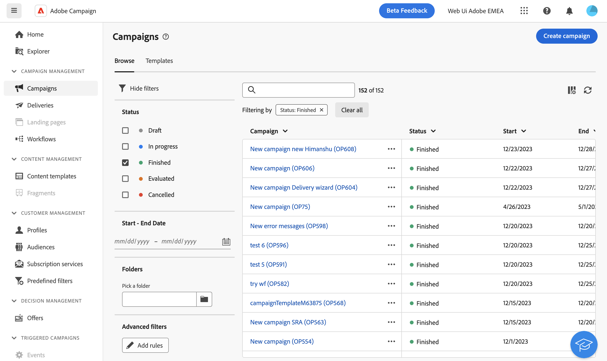

# 篩選清單 {#filter-lists}

Adobe Campaign Web在每個物件清單中提供篩選器，可讓您根據特定的內容條件篩選資訊。 例如，您可以根據狀態、管道、聯絡日期或資料夾對傳遞進行篩選。您也可以隱藏測試。

## 套用篩選器{#apply}

若要將篩選器套用至清單，請按一下 **[!UICONTROL 顯示篩選器]** 位於清單左上角、搜尋列旁的按鈕。

篩選器窗格隨即開啟，顯示所選清單的可用篩選器。 例如，您可以依行銷活動的狀態、開始和結束日期或儲存資料夾來篩選行銷活動，而訂閱服務清單則可依其頻道和儲存資料夾來篩選。

{width="70%" align="left" zoomable="yes"}

若要根據您自己的條件來篩選清單，請建立自訂篩選器。 若要這麼做，請瀏覽至篩選器窗格的底部，然後按一下 **新增規則** 按鈕。 [瞭解如何建立自訂篩選器](#custom)

篩選器一旦套用至清單，就會顯示在搜尋列下方。 您可以隨時移除個別篩選器，或按一下 **全部清除** 按鈕。

## 建立自訂篩選器 {#custom}

自訂篩選器可讓您根據自己的特定條件來調整清單。 它們是使用Campaign查詢模型工具所設計。 若要建立自訂篩選器，請遵循下列步驟：

1. 開啟篩選器窗格，然後按一下 **新增規則** 位於窗格底部的按鈕。
1. 查詢建模器隨即開啟。 定義並結合您的篩選條件以符合您的需求。 有關如何使用查詢建模器的詳細資訊，請參閱 [本節](../query/query-modeler-overview.md).

   以下範例顯示自訂篩選器，其設計為在行銷活動清單中顯示SMS行銷活動，由執行或瑜伽部門的操作者執行。

   {width="70%" align="left" zoomable="yes"}

1. 設定自訂篩選器後，請按一下 **[!UICONTROL 確認]** 以將其套用至清單。
