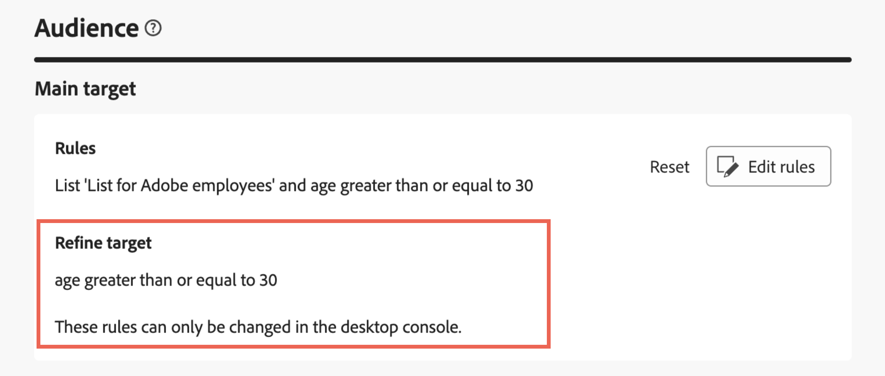
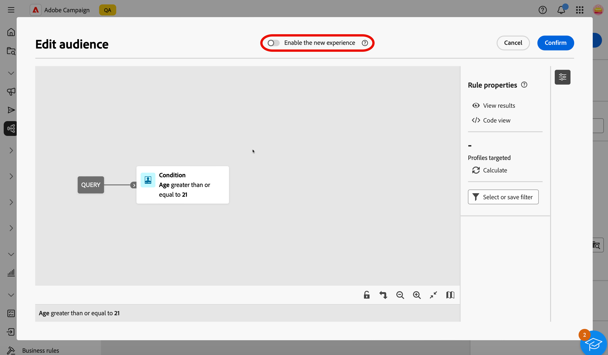

# 使用查詢建模工具 {#segment-builder}

>[!CONTEXTUALHELP]
>id="acw_homepage_welcome_rn1"
>title="全新的規則產生器"
>abstract="您現在可以使用新的規則產生器，協助您在改進的使用者介面中定義複雜的條件。您可以視需要從舊的規則產生器切換到新的規則產生器。"
>additional-url="https://experienceleague.adobe.com/docs/campaign-web/v8/release-notes/release-notes.html?lang=zh-hant" text="請參閱版本注意事項"

>[!CONTEXTUALHELP]
>id="acw_homepage_learning_card5"
>title="新的查詢建模工具"
>abstract="Adobe Campaign Web 具有查詢建模工具，可簡化篩選資料庫的流程，以根據各種不同的條件選取特定目標。這包括進階運算式和運算子的使用。查詢建模工具適用於每個您需要定義篩選資料的規則的環境。"

>[!CONTEXTUALHELP]
>id="acw_orchestration_querymodeler_querymessage"
>title="查詢建模工具"
>abstract="為收件者或資料庫中的任何其他目標市場選擇維度定義篩選條件。利用 Adobe Experience Platform 對象，進一步縮小目標對象範圍並充分發揮行銷活動的影響力。"

>[!CONTEXTUALHELP]
>id="acw_deliveries_refine_target"
>title="調整目標"
>abstract="這些規則只能在用戶端主控台變更。"

Adobe Campaign Web使用者介面具有查詢建模工具，可簡化根據各種條件篩選資料庫的程式。 這可確保在使用者端主控台中建立的查詢完全相容，促進到Web使用者介面的無縫轉換。

此外，查詢模組化工具還能有效率地管理非常複雜和冗長的查詢，提供增強的彈性和精確度。 它也支援條件內的預先定義篩選器，讓使用者能夠輕鬆調整查詢，同時利用進階運算式和運運算元實現全面的受眾目標定位和細分策略。

## 存取查詢模型工具

查詢建模工具適用於每個您需要定義篩選資料的規則的環境。

| 使用情況 | 範例 |
|  ---  |  ---  |
| **定義對象**：指定您要在訊息或工作流程中定位的母體，輕鬆建立根據您的需求量身打造的新對象。 [瞭解如何建立對象](../audience/one-time-audience.md) | {zoomable="yes"}{width="200" align="center" zoomable="yes"} [顯示如何存取對象建立介面的影像] |
| **自訂工作流程活動**：在工作流程活動中套用規則，例如&#x200B;**分割**&#x200B;和&#x200B;**調解**，以符合您的特定需求。 [進一步瞭解工作流程活動](../workflows/activities/about-activities.md) | {zoomable="yes"}{width="200" align="center" zoomable="yes"} [顯示如何存取工作流程自訂選項的影像] |
| **預先定義的篩選器**：建立預先定義的篩選器，這些篩選器可在各種篩選作業期間作為捷徑，無論您是使用資料清單還是建立傳遞的對象。 [瞭解如何使用預先定義的篩選器](../get-started/predefined-filters.md) | {zoomable="yes"}{width="200" align="center" zoomable="yes"} [顯示如何存取預先定義之篩選器的影像] |
| **篩選報表資料**：新增規則以篩選報表中顯示的資料。 [瞭解如何使用報告](../reporting/gs-reports.md) | {zoomable="yes"}{width="200" align="center" zoomable="yes"} [顯示如何篩選報表中資料的影像] |
| **自訂清單**：建立自訂規則，以篩選顯示在清單中的資料，例如收件者或傳遞清單。 [瞭解如何篩選清單](../get-started/list-filters.md#list-built-in-filters) | {zoomable="yes"}{width="200" align="center" zoomable="yes"} [顯示如何自訂清單篩選器的影像] |
| **建置條件式內容**：建立條件來定義應該向不同收件者顯示的內容，確保個人化和相關的傳訊，讓電子郵件內容成為動態內容。 [瞭解如何建立條件式內容](../personalization/conditions.md) | {width="200" align="center" zoomable="yes"} [顯示如何建立條件式內容的影像] |

>[!NOTE]
>
>存取在已套用規則的使用者端主控台中建立的物件時（例如對象或預先定義的篩選器），可能會顯示&#x200B;**[!UICONTROL Refine target]**&#x200B;區段。 這表示已設定其他引數來調整規則目標。 這些引數只能在主控台中修改。
>
>{zoomable="yes"}

## 查詢建模工具介面 {#interface}

查詢模型工具會提供您建立查詢的中央畫布，以及提供查詢相關資訊的右窗格。

>[!IMPORTANT]
>
>可以使用全新的查詢建模器介面。 全新的規則產生器擁有簡化的介面，讓您更輕鬆地建立查詢。 若要切換至此體驗，請按一下右上角的切換按鈕。 您可以隨時返回傳統查詢建模器，只要按回切換鍵以停用新介面即可。 您可以在此新介面中套用與查詢建模程式相同的原則。
>{zoomable="yes"}切換的影像

>[!CONTEXTUALHELP]
>id="acw_rule_builder_switch_button"
>title="新的規則產生器體驗"
>abstract="使用此切換功能，可在傳統查詢建模工具和新的規則產生器體驗之間切換。新的規則產生器具有簡化且直覺的介面，可讓您更輕鬆地建置查詢。"

{zoomable="yes"}

### 中央畫布 {#canvas}

查詢建模器中央畫布是您新增和組合不同元件以建立查詢的位置。 [瞭解如何建立查詢](build-query.md)

>[!BEGINTABS]

>[!TAB 傳統查詢模型工具]

位於畫布右下角的工具列提供可輕鬆操控查詢元件和導覽畫布的選項：

* **多重選取模式**：選取多個篩選元件，以複製並貼至您選擇的位置。
* **旋轉**：垂直切換畫布。
* **符合熒幕大小**：調整畫布縮放等級以符合熒幕。
* **縮小** / **放大**：縮小或放大畫布。
* **顯示地圖**：開啟畫布的快照，顯示您目前的位置。

>[!TAB 新規則產生器體驗]

位於畫布右上角的工具列提供可輕鬆操控查詢元件和導覽畫布的選項：

* **向上移動選取範圍**：將元件向上移動一列。
* **將選取範圍往下移**：將元件往下移動一列。
* **群組選擇**：將兩個元件放入群組中。
* **取消群組選擇**：將單一群組的元件分開。
* **全部展開**：展開所有群組。
* **全部收合**：收合所有群組。
* **移除所有**：移除所有群組和元件。

>[!ENDTABS]

### 規則屬性窗格 {#rule-properties}

在右側，**[!UICONTROL 規則屬性]**&#x200B;窗格會提供您查詢的相關資訊。 它可讓您執行各種作業來檢查查詢，並確保查詢符合您的需求。 建立查詢以建立對象時，會顯示此窗格。 [瞭解如何檢查及驗證您的查詢](build-query.md#check-and-validate-your-query)
