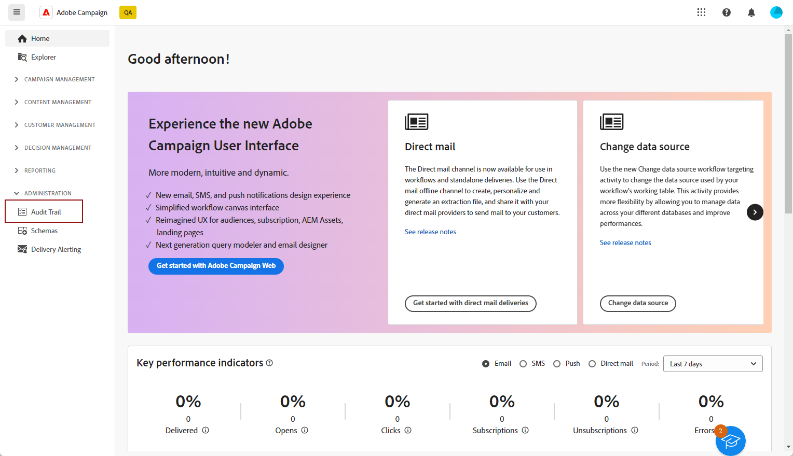
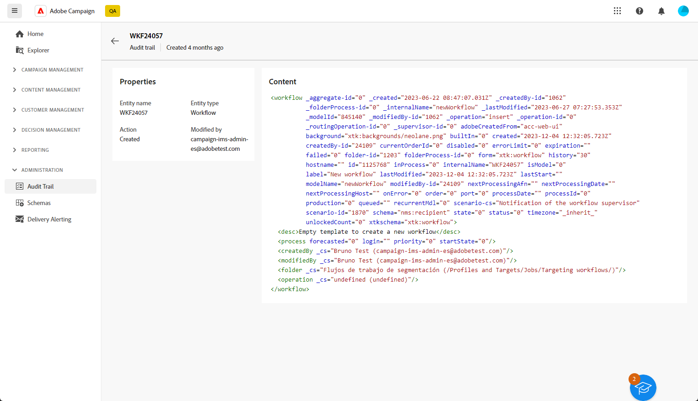

# 稽核軌跡{#audit-trail}

>[!CONTEXTUALHELP]
>id="acw_homepage_welcome_rn1"
>title="稽核軌跡"
>abstract="新的稽核軌跡功能提供對Adobe Campaign執行個體已進行即時的所有動作和事件的詳細時間順序記錄。"
>additional-url="https://experienceleague.adobe.com/docs/campaign-web/v8/release-notes/release-notes.html?lang=zh-Hant" text="請參閱版本注意事項"

在Adobe Campaign網頁使用者介面中， **[!UICONTROL 稽核軌跡]** 功能可讓使用者完全瞭解對例項內重要圖元所做的所有修改，通常是對例項的順利操作產生重大影響的修改。

>[!IMPORTANT]
>
>* Adobe Campaign Web使用者介面不會稽核使用者許可權、範本、個人化或行銷活動中所做的變更。
>* 稽核軌跡只能由執行個體的管理員管理。

**[!UICONTROL 稽核軌跡]** 功能會持續即時記錄Adobe Campaign例項內發生的動作和事件的詳細記錄。 它提供一種便利的方法，可存取按時間順序排列的資料記錄，並解決以下查詢：工作流程的狀態、要修改它們的最新個人，或使用者在執行個體內執行的活動。

+++ 深入瞭解稽核軌跡可用實體

* **來源結構描述稽核軌跡** 可讓您在Campaign V8使用者端主控台中監視活動以及最近對結構描述所做的修改。

  如需結構描述的詳細資訊，請參閱 [Campaign v8檔案](https://experienceleague.adobe.com/en/docs/campaign/campaign-v8/developer/shemas-forms/schemas).

* **工作流程稽核軌跡** 可讓您追蹤活動及最近對工作流程所做的變更，包括其目前狀態，例如：

   * 開始
   * 暫停
   * 停止
   * 重新啟動
   * 清除等於動作清除歷史記錄
   * 模擬在模擬模式下等於動作「開始」的專案
   * 立即喚醒等於動作執行擱置中的工作
   * 無條件停止

  如需工作流程的詳細資訊，請參閱本 [頁面](../workflows/gs-workflows.md).

* **選項稽核軌跡** 可讓您監視活動以及最近對Campaign V8中的選項所做的修改。

  如需選項的詳細資訊，請參閱本節 [頁面](https://experienceleague.adobe.com/en/docs/campaign-classic/using/installing-campaign-classic/appendices/configuring-campaign-options).

* **傳遞稽核軌跡** 可讓您檢查活動和對傳送進行的最後修改。

  如需傳送的詳細資訊，請參閱此 [頁面](../msg/gs-deliveries.md).

* **外部帳戶** 可讓您檢查對Campaign V8中的外部帳戶所做的修改，這些修改由技術流程（如技術工作流程或行銷活動工作流程）使用。

  如需外部帳戶的詳細資訊，請參閱此 [頁面](https://experienceleague.adobe.com/en/docs/campaign/campaign-v8/config/configuration/external-accounts).

* **傳遞對應** 可讓您監視活動以及最近對Campaign V8中的傳送對應進行的修改。

  如需傳遞對應的詳細資訊，請參閱此 [頁面](https://experienceleague.adobe.com/en/docs/campaign/campaign-v8/audience/add-profiles/target-mappings).

* **網頁應用程式** 可讓您檢查Campaign V8中對Web表單所做的修改，該表單用於建立具有輸入和選擇欄位的頁面，並且可能包括來自資料庫的資料。

  如需網頁應用程式的詳細資訊，請參閱本節 [頁面](https://experienceleague.adobe.com/en/docs/campaign/campaign-v8/content/webapps).

* **選件** 可讓您檢查活動和對優惠方案進行的最後修改。

  如需優惠方案的詳細資訊，請參閱本節 [頁面](../msg/offers.md).

* **運運算元** 可讓您監視活動以及最近在Campaign V8中對運運算元進行的修改。

  如需運運算元的詳細資訊，請參閱此 [頁面](https://experienceleague.adobe.com/en/docs/campaign/campaign-v8/offers/interaction-settings/interaction-operators).

+++

## 存取稽核軌跡 {#accessing-audit-trail}

若要存取執行個體的 **[!UICONTROL 稽核軌跡]**：

1. 在 **[!UICONTROL 管理]** 功能表，選取 **[!UICONTROL 稽核軌跡]** .

   

1. 此 **[!UICONTROL 稽核軌跡]** 視窗會開啟，其中含有您的實體清單。 Adobe Campaign Web使用者介面會稽核工作流程、選項、傳送和結構的建立、編輯和刪除動作。

   選取其中一個實體以深入瞭解最後的修改。

1. 此 **[!UICONTROL 稽核實體]** 視窗會提供所選實體的詳細資訊，例如：

   * **[!UICONTROL 型別]** ：工作流程、選項、傳送或結構描述。
   * **[!UICONTROL 實體]** ：活動的內部名稱。
   * **[!UICONTROL 修改者]** ：上次修改此實體之人員的使用者名稱。
   * **[!UICONTROL 動作]** ：此實體上執行的最後一個動作，已建立、已修改或已刪除。
   * **[!UICONTROL 修改日期]** ：此實體上個動作執行的日期。

   程式碼區塊會針對實體中的確切變更提供詳細資訊。

   

