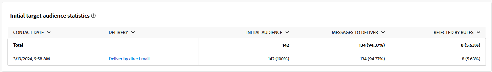
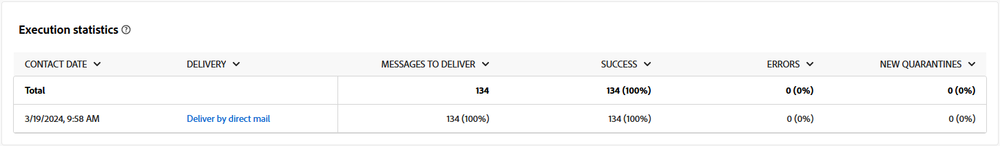
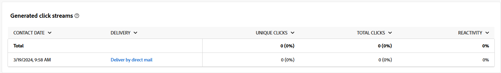

# 外部傳遞管道的行銷活動報告 {#campaign-reports-direct-mail}

每個行銷活動報告都會分成不同的Widget，詳細說明行銷活動的成功和錯誤。 對於外部傳遞管道，報表和量度詳情如下。 在[此頁面](campaign-reports.md)中瞭解如何存取您的行銷活動報告。

下列報表會在直接郵件的內容中說明。 此外，它也可用於客服中心和自訂外部管道。

## 傳遞摘要 {#delivery-summary-direct}

### 傳遞概觀 {#delivery-overview-direct}

>[!CONTEXTUALHELP]
>id="acw_campaign_reporting_delivery_overview_direct_mail"
>title="傳遞概觀"
>abstract="**傳遞概觀**&#x200B;提供了關鍵績效指標 (KPI)，可讓您深入了解訪客與每次直接郵件傳遞的互動情況。這些量度概述如下。"

**[!UICONTROL 傳遞總覽]**&#x200B;提供關鍵效能量度(KPI)，提供深入分析訪客與每個直接郵件傳遞的互動。 這些量度概述如下。

{zoomable="yes"}{align="center"}

+++進一步瞭解傳遞概述量度。

* **[!UICONTROL 要傳遞的訊息]**：傳遞準備期間處理的訊息總數。

* **[!UICONTROL 已傳遞]**：與已傳送訊息總數相關的成功傳送訊息數。

* **[!UICONTROL 錯誤]**：傳遞與自動傳回處理期間累積的錯誤總數，與已傳送的訊息總數相關。

* **[!UICONTROL 點按總數]**：在傳遞中至少點按一次的不同收件者總數。

+++

### 初始目標對象統計資料 {#delivery-summary-direct-initial-target}

>[!CONTEXTUALHELP]
>id="acw_campaign_reporting_target_audience_direct_mail"
>title="初始目標對象統計資料"
>abstract="收件者資料和訊息資訊顯示在&#x200B;**初始目標對象統計資料**&#x200B;表格中，反映了傳遞準備分析。"

**[!UICONTROL 初始目標對象統計資料]**&#x200B;表格會顯示與收件者相關的資料。 量度會在傳遞準備期間計算，並顯示初始對象、要傳送的訊息數，以及排除的收件者數。

{zoomable="yes"}

+++進一步瞭解初始目標對象統計量度。

* **[!UICONTROL 初始對象]**：目標收件者的總數。

* **[!UICONTROL 要傳遞的訊息]**：傳遞準備後要傳遞的訊息總數。

* **[!UICONTROL 被規則拒絕]**：在套用規則時，分析期間忽略的地址總數，例如遺失的地址、隔離的地址或封鎖清單上的地址。

+++

### 執行統計資料 {#delivery-summary-direct-exec-stats}

>[!CONTEXTUALHELP]
>id="acw_campaign_reporting_execution_statistics_direct_mail"
>title="傳遞統計資料"
>abstract="**執行統計資料**&#x200B;表格詳細說明直接郵件傳遞成功以及發生的錯誤。"

**[!UICONTROL 執行統計資料]**&#x200B;表格提供每個直接郵件傳送成功的明細，其詳細度量如下所述。

+++進一步瞭解傳遞統計量度。

* **[!UICONTROL 要傳遞的訊息]**：傳遞準備後要傳遞的訊息總數。

* **[!UICONTROL 成功]**：已成功處理的訊息數目，與要傳遞的訊息數目相關。

* **[!UICONTROL 錯誤]**：在傳遞和自動復原處理期間累積的錯誤總數，與要傳遞的訊息數目相關。

* **[!UICONTROL 新隔離]**：與要傳送的訊息數目相關的傳送失敗後（例如，使用者不明、無效的網域）被隔離的地址總數。

+++

### 產生的點按資料流 {#click-streams}

>[!CONTEXTUALHELP]
>id="acw_campaign_reporting_clicks_direct_mail"
>title="產生的點按資料流"
>abstract="**產生的點按資料流**&#x200B;資料表顯示收件者如何與您的傳遞互動的相關可用資料。"

{zoomable="yes"}{align="center"}

**產生的點按資料流**&#x200B;表格說明了無法從目標設定檔排除的使用者設定檔接收訊息的原因。

+++深入瞭解產生的點選串流測量結果。

* **[!UICONTROL 不重複點按]**：在傳遞中至少點選一次的不同收件者總數。

* **[!UICONTROL 點按總數]**：傳遞中連結的點按總數。

* **[!UICONTROL 反應性]**：點選傳遞的目標收件者數目與開啟傳遞的目標收件者預估數目之間的比率。

+++