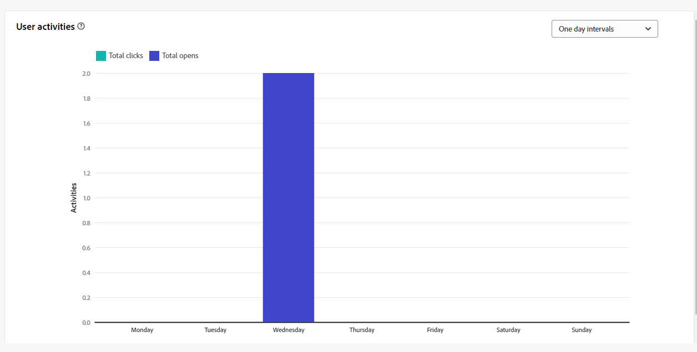

# 電子郵件頻道的行銷活動報告 {#campaign-reports-email-channel}

每個行銷活動報告都會分成不同的Widget，詳細說明行銷活動的成功和錯誤。 有關電子郵件管道，報表和量度詳情如下。 在[此頁面](campaign-reports.md)中瞭解如何存取您的行銷活動報告。

## 傳遞摘要 {#delivery-summary-email}

>[!CONTEXTUALHELP]
>id="acw_campaign_reporting_deliveries_overview"
>title="傳遞概觀"
>abstract="**傳遞概觀**&#x200B;可提供關鍵績效指標 (KPI)，其中包含訪客參與電子郵件傳遞的詳細資訊。"

### 傳遞概觀 {#delivery-summary-email-ovv}

**[!UICONTROL 傳遞總覽]**&#x200B;報告提供關鍵績效指標(KPI)，可提供訪客如何與您的電子郵件傳遞互動的詳細資訊。 量度詳情如下。

{zoomable="yes"}

+++進一步瞭解電子郵件促銷活動報告度量。

* **[!UICONTROL 要傳遞的訊息]**：傳遞準備期間處理的訊息總數。

* **[!UICONTROL 已傳遞]**：與已傳送訊息總數相關的成功傳送訊息數。

* **[!UICONTROL 退信]**：傳遞期間累積的錯誤總數，以及相對於已傳送訊息總數，的自動傳回處理。

* **[!UICONTROL 總開啟次數]**：目標收件者開啟郵件至少一次的總數。

* **[!UICONTROL 點按總數]**：在傳遞中至少點按一次的不同收件者總數。

+++

### 初始目標對象統計資料 {#delivery-summary-email-initial-target}

>[!CONTEXTUALHELP]
>id="acw_campaign_reporting_deliveries_target"
>title="初始目標對象統計資料"
>abstract="初始目標對象統計資料表可顯示與您收件者相關的資料。"

**[!UICONTROL 初始目標對象統計資料]**&#x200B;表格會顯示與收件者相關的資料。 量度詳情如下。

{zoomable="yes"}

+++進一步瞭解電子郵件促銷活動報告度量。

* **[!UICONTROL 初始對象]**：目標收件者的總數。

* **[!UICONTROL 要傳遞的訊息]**：傳遞準備後要傳遞的訊息總數。

* **[!UICONTROL 被規則拒絕]**：套用規則時分析期間忽略的位址總數：位址遺失、被隔離、在封鎖清單上等。

+++

### 執行統計資料 {#delivery-summary-email-exec-stats}

>[!CONTEXTUALHELP]
>id="acw_campaign_reporting_email_exec_stats"
>title="執行統計資料"
>abstract="**執行統計資料**&#x200B;資料表詳細說明您的傳遞成功：要傳遞的訊息、成功、錯誤和新隔離。"

**[!UICONTROL 執行統計資料]**&#x200B;資料表詳細說明您的傳送是否成功。 量度詳情如下。

{zoomable="yes"}

+++進一步瞭解電子郵件促銷活動報告度量。

* **[!UICONTROL 要傳遞的訊息]**：傳遞準備後要傳遞的訊息總數。

* **[!UICONTROL 成功]**：已順利處理的訊息數與要傳遞的訊息數有關。

* **[!UICONTROL 錯誤]**：傳遞期間累積的錯誤總數，以及相對於要傳遞的訊息數的自動復原處理次數。

* **[!UICONTROL 新隔離]**：在傳送失敗（使用者不明、網域無效）之後被隔離的地址總數，與要傳送的訊息數目相關。

  電子郵件錯誤型別列在[Adobe Campaign v8 （使用者端主控台）檔案](https://experienceleague.adobe.com/docs/campaign/campaign-v8/send/failures/delivery-failures.html#email-error-types){target="_blank"}中。

+++

### 反應統計資料 {#delivery-summary-email-reaction-stats}

>[!CONTEXTUALHELP]
>id="acw_campaign_reporting_email_reaction_stats"
>title="反應統計資料"
>abstract="**反應統計資料**&#x200B;資料表顯示有關您傳遞之收件者活動的可用資料：開啟數、訂閱數、取消訂閱數、點按鏡像頁面連結。"

**[!UICONTROL 回應統計資料]**&#x200B;表格包含您傳遞的收件者活動可用資料。 量度詳情如下。

{zoomable="yes"}

+++進一步瞭解電子郵件促銷活動報告度量。

* **[!UICONTROL 唯一開啟次數]**：至少開啟過一次訊息的目標收件者總數。

* **[!UICONTROL 總開啟次數]**：此網域已開啟郵件至少一次的不同目標收件者數目。

* **[!UICONTROL 取消訂閱]**：在相關期間內點選取消訂閱的收件者人數。

* **[!UICONTROL 映象頁面]**：點按映象頁面連結的收件者人數。

* **[!UICONTROL 轉寄]**：點按後轉寄電子郵件的收件者人數。
+++

### 產生的點按資料流 {#delivery-summary-email-click-streams}

>[!CONTEXTUALHELP]
>id="acw_campaign_reporting_email_click_streams"
>title="產生的點按資料流"
>abstract="**產生的點按資料流**&#x200B;資料表顯示收件者如何與您的傳遞互動的相關可用資料。"

**[!UICONTROL 產生的點按資料流]**&#x200B;表格會顯示收件者與傳遞互動的相關資料。 量度詳情如下。

{zoomable="yes"}

+++進一步瞭解電子郵件促銷活動報告度量。

* **[!UICONTROL 不重複點按]**：在傳遞中至少點選一次的不重複收件者總數。

* **[!UICONTROL 點按總數]**：傳遞中連結的點按總數。

* **[!UICONTROL 反應性]**：已點按傳遞的目標收件者數目與已開啟傳遞的目標收件者預估數目之間的比率。

+++

## 無法傳遞的項目 {#non-deliverables-email}

### 依類型的錯誤劃分 {#delivery-summary-email-breakdown-per-type}

>[!CONTEXTUALHELP]
>id="acw_campaign_reporting_error_type"
>title="依類型的錯誤劃分"
>abstract="**依類型的錯誤劃分**&#x200B;資料表和圖表包含發生的每個錯誤類型的可用資料：使用者未知、郵箱已滿、網域無效等。"

每個型別&#x200B;**[!UICONTROL 資料表和圖表的]**&#x200B;錯誤劃分包含每個網域型別可能遇到的錯誤的可用資料。 量度詳情如下。

此報告中顯示的錯誤會觸發隔離程式。 如需隔離管理的詳細資訊，請參閱[Campaign v8 （使用者端主控台）檔案](https://experienceleague.adobe.com/docs/campaign/campaign-v8/campaigns/send/failures/delivery-failures.html){target="_blank"}。

{zoomable="yes"}

+++進一步瞭解電子郵件促銷活動報告度量。

* **[!UICONTROL 使用者不明]**：傳送期間產生錯誤型別，指出電子郵件地址無效。

* **[!UICONTROL 無效的網域]**：傳送傳遞時產生錯誤型別，指出電子郵件地址的網域錯誤或不存在。

* **[!UICONTROL 信箱已滿]**：在五次傳遞嘗試後產生的錯誤型別，表示收件者的收件匣包含太多郵件。

* **[!UICONTROL 帳戶已停用]**：傳送傳遞時產生錯誤型別，表示地址已不存在。

* **[!UICONTROL 已拒絕]**：當IAP （網際網路存取提供者）拒絕位址時產生的錯誤型別，例如在套用安全性規則（反垃圾郵件軟體）之後。

* **[!UICONTROL 無法連線]**：訊息發佈字串中發生的錯誤型別：SMTP轉送上的事件、暫時無法連線網域等

* **[!UICONTROL 未連線]**：錯誤型別表示收件者的行動電話在傳送時已關閉或與網路中斷連線。

+++

### 依網域的錯誤劃分 {#delivery-summary-email-breakdown-per-domain}

>[!CONTEXTUALHELP]
>id="acw_campaign_reporting_error_domain"
>title="依網域的錯誤劃分"
>abstract="**依網域的錯誤劃分**&#x200B;資料表和圖表顯示根據每個網域發生的每個錯誤類型的可用資料。"

每個網域&#x200B;**[!UICONTROL 資料表和圖表的]**&#x200B;錯誤劃分包含每個網域可能遇到的錯誤的可用資料。 量度通常與上面詳述的每種型別&#x200B;**[!UICONTROL 資料表和圖表的]**&#x200B;錯誤劃分有關。

## 追蹤指標 {#tracking-indicators-email}

### 傳遞統計資料 {#delivery-summary-email-statistics}

>[!CONTEXTUALHELP]
>id="acw_delivery_campaign_delivery_statistics_summary"
>title="傳遞統計資料"
>abstract="**傳遞統計資料**&#x200B;圖表詳細說明傳遞成功以及發生的錯誤。"

**[!UICONTROL 傳遞統計資料]**&#x200B;量度提供關鍵績效指標(KPI)，可提供已傳送電子郵件之可用資料的詳細資訊。 量度詳情如下。

{zoomable="yes"}

+++進一步瞭解電子郵件促銷活動報告度量。

* **[!UICONTROL 要傳遞的訊息數]**：已順利處理的訊息數與要傳遞的訊息數有關。

* **[!UICONTROL 唯一開啟次數]**：至少開啟過一次訊息的目標收件者總數。

* **[!UICONTROL 總開啟次數]**：此網域已開啟郵件至少一次的不同目標收件者數目。

* **[!UICONTROL 點選退出連結]**：點選取消訂閱連結的次數。

* **[!UICONTROL 點選映象連結的次數]**：點選映象頁面連結的次數。

* **[!UICONTROL 轉送次數估計]**：目標收件者轉送的電子郵件數量估計。
+++

### 開啟及點進率 {#delivery-summary-open-rate}

>[!CONTEXTUALHELP]
>id="acw_campaign_reporting_open_clickthrough"
>title="開啟及點進率"
>abstract="**開啟及點進率**&#x200B;表格顯示與您的傳遞相關的收件者參與度的資料。"

**[!UICONTROL 開啟及點進率]**&#x200B;表格會顯示與收件者相關的資料。 量度詳情如下。

{zoomable="yes"}

+++ 進一步瞭解電子郵件促銷活動報告度量。

* **[!UICONTROL 已傳送]**：已傳送的訊息總數。

* **[!UICONTROL 投訴]**：此網域被收件者回報為不想要的訊息數目和百分比。

* **[!UICONTROL 唯一開啟次數]**：此網域中至少開啟過一次訊息的不同目標收件者數目和百分比。

* **[!UICONTROL 不重複點按]**：至少點按一次相同傳遞的不同目標收件者數目和百分比。

* **[!UICONTROL 原始反應性]**：與開啟傳遞至少一次的收件者人數相比，至少點選一次傳遞的收件者人數的百分比。

+++

## URL 和點擊流量 {#url-email}

>[!CONTEXTUALHELP]
>id="acw_campaign_reporting_urls_clickstreams"
>title="URL 和點擊流量"
>abstract="**URL 和點按資料流**&#x200B;報告提供可詳細說明傳遞期間點按次數最多的 URL 的關鍵績效指標 (KPI)。"

**[!UICONTROL URL和點選串流]**&#x200B;報告提供關鍵績效指標(KPI)，可提供傳遞期間點選次數最多的URL的詳細資訊。 量度詳情如下。

{zoomable="yes"}

+++ 進一步瞭解電子郵件促銷活動報告度量。

* **[!UICONTROL 反應性]**：已點按傳遞的目標收件者數目與已開啟傳遞的目標收件者預估數目之間的比率。

* **[!UICONTROL 不重複點按]**：在傳遞中至少點選一次的不同收件者總數。

* **[!UICONTROL 點按總數]**：傳遞中連結的點按總數。

* **[!UICONTROL 平台平均值]**：此平均比率顯示在每個比率（反應性、不同點按和累計點按）下，是針對過去六個月傳送的傳遞進行計算。 系統只會考慮具有相同型別和相同通道的傳送。 校訂已排除。

+++

### 造訪量最高的前 10 個連結 {#top10-campaign-report-email}

>[!CONTEXTUALHELP]
>id="acw_campaign_reporting_urls_clickstreams_top10"
>title="造訪量最高的前 10 個連結"
>abstract="**造訪量最高的前 10 個連結**&#x200B;圖表和資料表包含每個連結收件者行為的可用資料。"

**[!UICONTROL 前10個最常造訪的連結]**&#x200B;圖表和表格包含每個連結的收件者行為可用資料。 量度詳情如下。

{zoomable="yes"}

+++進一步瞭解電子郵件促銷活動報告度量。

* **[!UICONTROL 點按]**：傳遞中連結的點按總數。

* **[!UICONTROL Percentage]**：與傳遞互動的使用者百分比。

+++

### 特定期間的點按劃分 {#campaign-report-email-breakdown-clicks}

>[!CONTEXTUALHELP]
>id="acw_delivery_campaign_urls_click_breakdown"
>title="特定期間的點按劃分"
>abstract="**特定期間的點按劃分**&#x200B;圖表顯示每個連結收件者行為的可用資料。"

**[!UICONTROL 隨著時間點選的劃分]**&#x200B;圖表包含每個連結的收件者行為可用資料。

{zoomable="yes"}

## 使用者活動 {#user-activities-email}

>[!CONTEXTUALHELP]
>id="acw_campaign_reporting_user_activities"
>title="使用者活動"
>abstract="**使用者活動**&#x200B;圖以圖表的形式顯示開啟和點按數的劃分。"

**[!UICONTROL 使用者活動]**&#x200B;報告會以圖表形式顯示開啟和點按的劃分。 此報表的量度詳情如下。

{zoomable="yes"}{align="center"}

+++深入瞭解電子郵件傳遞報告度量。

* **[!UICONTROL 點按]**：傳遞中連結的點按總數。

* **[!UICONTROL 開啟]**：此網域已開啟郵件至少一次的不同目標收件者數目。

+++
