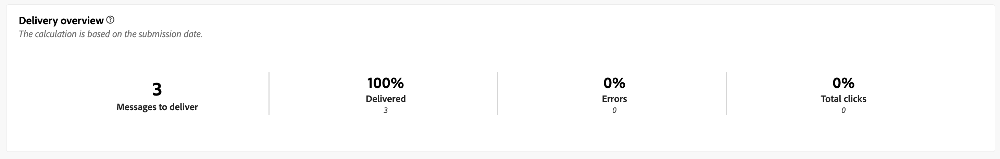
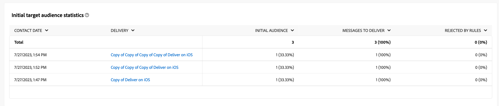
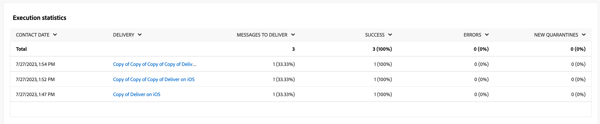
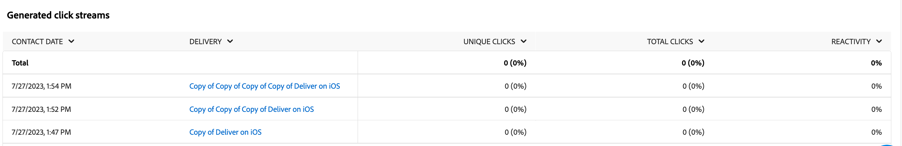

# 推播頻道的行銷活動報表 {#campaign-reports-push-channel}

每個行銷活動報告都會分成不同的Widget，詳細說明行銷活動的成功和錯誤。 推播管道的報表和量度詳情如下。 在[此頁面](campaign-reports.md)中瞭解如何存取您的行銷活動報告。

## 傳遞摘要 {#delivery-summary-push}

>[!CONTEXTUALHELP]
>id="acw_campaign_reporting_push_deliveries_overview"
>title="傳遞概觀"
>abstract="**傳遞概觀**&#x200B;報告可提供關鍵績效指標 (KPI)，其中包含訪客參與推播通知傳遞的詳細資訊。"

**[!UICONTROL 傳遞總覽]**&#x200B;報告提供關鍵績效指標(KPI)，可提供訪客如何與您的推播通知傳遞互動的詳細資訊。 量度詳情如下。

{zoomable="yes"}

+++進一步瞭解推播行銷活動報告量度。

* **[!UICONTROL 要傳遞的訊息]**：傳遞準備期間處理的訊息總數。

* **[!UICONTROL 已傳遞]**：與已傳送訊息總數相關的成功傳送訊息數。

* **[!UICONTROL 錯誤]**：傳遞期間累積的錯誤總數，以及相對於已傳送訊息總數，的自動傳回處理。

* **[!UICONTROL 點按總數]**：在傳遞中至少點按一次的不同收件者總數。

+++

### 初始目標客群統計資料 {#delivery-summary-push-initial-target}

>[!CONTEXTUALHELP]
>id="acw_campaign_reporting_push_target"
>title="初始目標客群統計資料"
>abstract="**初始目標客群統計資料**&#x200B;表可顯示與您收件者相關的資料"

**[!UICONTROL 初始目標對象統計資料]**&#x200B;表格會顯示與收件者相關的資料。 量度詳情如下。

{zoomable="yes"}

+++進一步瞭解推播行銷活動報告量度。

* **[!UICONTROL 初始對象]**：目標收件者的總數。

* **[!UICONTROL 要傳遞的訊息]**：傳遞準備後要傳遞的訊息總數。

* **[!UICONTROL 被規則拒絕]**：套用規則時分析期間忽略的位址總數：位址遺失、被隔離、在封鎖清單上等。

+++

### 執行統計資料 {#delivery-summary-push-exec-stats}

>[!CONTEXTUALHELP]
>id="acw_campaign_reporting_push_exec_stats"
>title="執行統計資料"
>abstract="**執行統計資料**&#x200B;資料表詳細說明您的傳遞成功：要傳遞的訊息、成功、錯誤和新隔離。"

**[!UICONTROL 執行統計資料]**&#x200B;資料表詳細說明您的傳送是否成功。 量度詳情如下。

{zoomable="yes"}

+++進一步瞭解推播行銷活動報告量度。

* **[!UICONTROL 要傳遞的訊息]**：傳遞準備後要傳遞的訊息總數。

* **[!UICONTROL 成功]**：已順利處理的訊息數與要傳遞的訊息數有關。

* **[!UICONTROL 錯誤]**：傳遞期間累積的錯誤總數，以及相對於要傳遞的訊息數的自動復原處理次數。

* **[!UICONTROL 新隔離]**：傳送失敗後被隔離的地址總數（註冊無效、郵件拒絕、裝載錯誤等） 相對於要傳遞的訊息數量。

  推播通知錯誤型別列在[Adobe Campaign v8 （使用者端主控台）檔案](https://experienceleague.adobe.com/docs/campaign/campaign-v8/send/failures/delivery-failures.html#push-error-types){target="_blank"}中。

+++

### 產生的點按資料流 {#delivery-summary-push-click-streams}

>[!CONTEXTUALHELP]
>id="acw_campaign_reporting_push_click_streams"
>title="產生的點按資料流"
>abstract="**產生的點按資料流**&#x200B;資料表顯示收件者如何與您的傳遞互動的相關可用資料。"

**[!UICONTROL 產生的點按資料流]**&#x200B;表格會顯示收件者與傳遞互動的相關資料。 量度詳情如下。

{zoomable="yes"}

+++進一步瞭解推播行銷活動報告量度。

* **[!UICONTROL 不重複點按]**：在傳遞中至少點選一次的不同收件者總數。

* **[!UICONTROL 點按總數]**：傳遞中連結的點按總數。

* **[!UICONTROL 反應性]**：已點按傳遞的目標收件者數目與已開啟傳遞的目標收件者預估數目之間的比率。

+++
