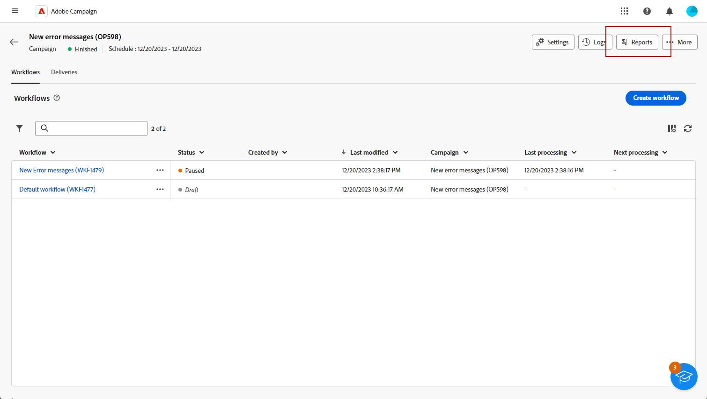
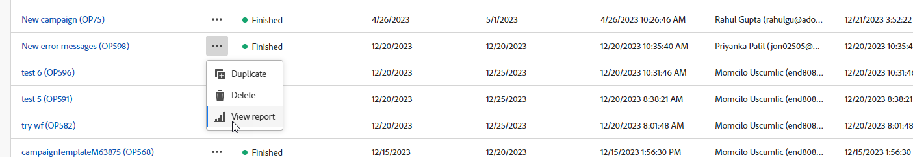
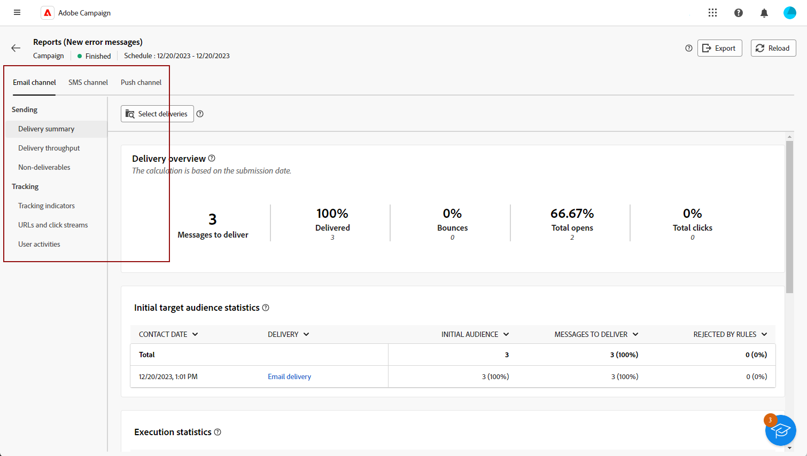
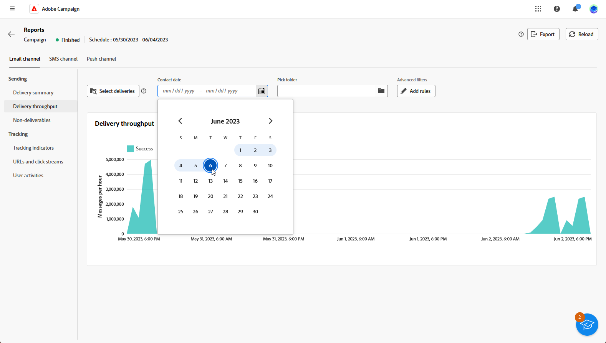

# 開始使用行銷活動報告 {#campaign-reports}

<!-- CAN BE REMOVED___
>[!CONTEXTUALHELP]
>id="acw_campaign_reporting_sending"
>title="Reporting Sending"
>abstract="The Sending tab within your report provides in-depth insights into your visitors' interactions with your deliveries and any potential errors they may have encountered."

>[!CONTEXTUALHELP]
>id="acw_campaign_reporting_tracking"
>title="Reporting tracking"
>abstract="The Tracking tab within your report offers valuable data, including recipient behavior per link, breakdown of opens and clicks, as well as detailed information about the most frequently clicked URLs during a delivery."
-->

此 **行銷活動報表** 提供您網站的 **行銷活動**，整合與不同傳送相關的所有相關資訊。 這些報告會針對每個管道的每次傳遞績效進行全面分析：成功率、對象參與度和其他基本量度。它們可讓您評估行銷活動的整體有效性和影響。

各管道的完整報表和相關量度清單可在下列頁面取得：

* [電子郵件行銷活動頻道](campaign-reports-email.md)
* [簡訊行銷活動頻道](campaign-reports-sms.md)
* [推播行銷活動頻道](campaign-reports-push.md)

## 管理您的報告儀表板 {#manage-reports}

若要存取及管理您的行銷活動報告，請遵循下列步驟：

1. 導覽至 **[!UICONTROL 行銷活動]** 功能表。 按一下 **報表** 按鈕（從行銷活動控制面板）。

   

   或者，您可以使用三個點 **更多動作** 按一下行銷活動清單中行銷活動名稱旁的按鈕，然後選取 **[!UICONTROL 檢視報告]**.

   

1. 從左側選單中，從清單中選取報表，並導覽至標籤，以顯示每個管道的資料。

   

1. 從您的儀表板，按一下 **[!UICONTROL 選取傳遞]** 如果您想要鎖定行銷活動中包含的一項特定傳送。

1. 在 **[!UICONTROL 傳遞總處理能力]** 功能表，選擇 **開始** 和 **[!UICONTROL 結束時間]** 以鎖定特定資料。

   

1. 從 **[!UICONTROL 挑選資料夾]** 欄位，選取是否要從特定資料夾定位傳送或行銷活動。

   您也可以選取 **[!UICONTROL 新增規則]** 以開始建立查詢，進而更妥善地篩選報表資料。 [瞭解如何使用查詢模型工具](../query/query-modeler-overview.md)

   

1. 從 **[!UICONTROL URL和點按流量]**，您也可以選擇 **[!UICONTROL 最常造訪的連結]** 或 **[!UICONTROL 時段]**.

   此 **[!UICONTROL 檢視方式]** 選項可讓您篩選URL、標籤或類別。
