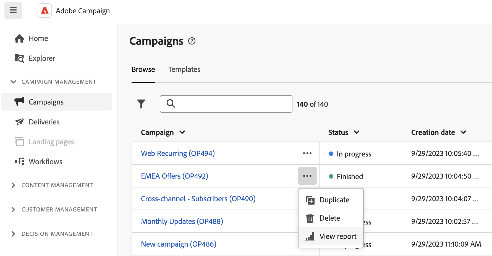

# 開始使用行銷活動報告 {#campaign-reports}

<!-- CAN BE REMOVED___
>[!CONTEXTUALHELP]
>id="acw_campaign_reporting_sending"
>title="Reporting Sending"
>abstract="The Sending tab within your report provides in-depth insights into your visitors' interactions with your deliveries and any potential errors they may have encountered."

>[!CONTEXTUALHELP]
>id="acw_campaign_reporting_tracking"
>title="Reporting tracking"
>abstract="The Tracking tab within your report offers valuable data, including recipient behavior per link, breakdown of opens and clicks, as well as detailed information about the most frequently clicked URLs during a delivery."
-->

若要存取行銷活動報表，請按一下 **報表** 按鈕（從行銷活動控制面板）。

或者，您可以使用三個點 **更多動作** 按鈕來設定促銷活動清單中促銷活動名稱的旁邊，如下所示：

{width="50%" align="left" zoomable="yes"}

行銷活動報告分為不同的Widget，詳細說明行銷活動的成功和錯誤。

各管道的完整報表和相關量度清單可在下列頁面取得：

* [電子郵件通道](campaign-reports-email.md)
* [簡訊管道](campaign-reports-sms.md)
* [推播管道](campaign-reports-push.md)
