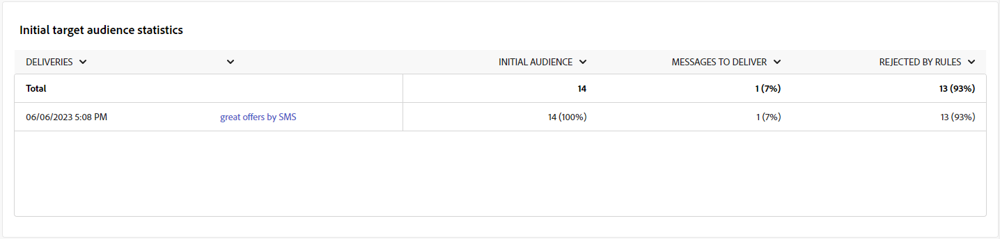
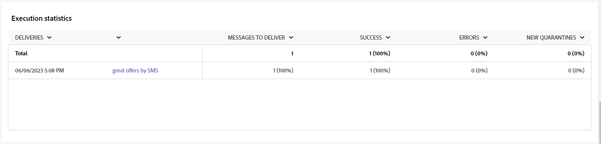
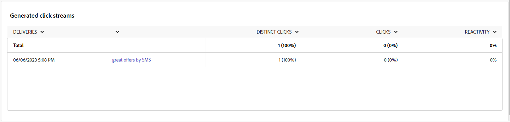

# 行銷活動報表 {#campaign-reports}

行銷活動報告分為不同的Widget，詳細說明行銷活動的成功與錯誤。

Campaign報告頁面會顯示以下標籤：

* [電子郵件通道](#email-channel)
* [簡訊管道](#sms-channel)
* [推播管道](#push-channel)

若要存取您的Campaign報表，請從您的行銷活動控制面板按一下「報表」 。

## 電子郵件管道 {#email-channel}

### 傳遞摘要 {#delivery-summary-email}

* **[!UICONTROL 傳遞概述]** 提供關鍵績效指標(KPI)，用於提供有關訪客如何參與電子郵件傳送的詳細資訊。

  

  +++進一步瞭解電子郵件行銷活動報告量度。

   * **[!UICONTROL 已傳送總數]**：傳遞分析期間處理的訊息總數。

   * **[!UICONTROL 已傳遞]**：成功傳送的訊息數，與已傳送訊息總數相關。

   * **[!UICONTROL 彈回數]**：與已傳送訊息總數相關的傳送和自動傳回處理期間累計的錯誤總數。

   * **[!UICONTROL 不同開啟次數]**：至少開啟過一次訊息的目標收件者總數。

   * **[!UICONTROL 不同點按次數]**：在傳遞中至少點選一次的不同收件者總數。

+++

* **[!UICONTROL 初始目標對象統計資料]** 表格會顯示與收件者相關的資料：

  

  +++進一步瞭解電子郵件行銷活動報告量度。

   * **[!UICONTROL 初始對象]**：目標收件者總數。

   * **[!UICONTROL 要傳遞的訊息]**：傳遞分析後要傳遞的訊息總數。

   * **[!UICONTROL 被規則拒絕]**：套用規則時分析期間忽略的地址總數：地址遺失、隔離、列入封鎖清單等。

+++

* **[!UICONTROL 執行統計資料]** 表格詳細說明您的傳送是否成功。

  

  +++進一步瞭解電子郵件行銷活動報告量度。

   * **[!UICONTROL 要傳遞的訊息]**：傳遞分析後要傳遞的訊息總數。

   * **[!UICONTROL 成功]**：成功處理的訊息數與要傳送的訊息數相關。

   * **[!UICONTROL 錯誤]**：與要傳送的訊息數量相關的傳送和自動復原處理期間累計的錯誤總數。

   * **[!UICONTROL 新隔離]**：與要傳送的訊息數量相關的傳送失敗（使用者未知、無效的網域）後隔離的地址總數。

+++

* **[!UICONTROL 反應統計資料]** 表格包含您傳送之收件者活動的可用資料。

  

  +++進一步瞭解電子郵件行銷活動報告量度。

   * **[!UICONTROL 不同開啟次數]**：至少開啟過一次訊息的目標收件者總數。

   * **[!UICONTROL 開啟次數]**：此網域中至少開啟過一次訊息的不同目標收件者人數。

   * **[!UICONTROL 取消訂閱]**：在相關期間內點選取消訂閱的收件者人數。

   * **[!UICONTROL 映象頁面]**：點按映象頁面連結的收件者人數。

   * **[!UICONTROL 轉寄]**：點按後轉寄電子郵件的收件者人數。
+++

* **[!UICONTROL 產生的點按資料流]** 表格會顯示收件者與傳遞互動的相關資料。

  

  +++進一步瞭解電子郵件行銷活動報告量度。

   * **[!UICONTROL 不同點按次數]**：在傳遞中至少點選一次的不同收件者總數。

   * **[!UICONTROL 點按次數]**：傳遞中連結的點按總數。

   * **[!UICONTROL 反應性]**：已點按傳送的目標收件者人數與已開啟傳送的目標收件者估計人數的比率。

+++

### 無法傳遞的項目 {#non-deliverables-email}

* **[!UICONTROL 每種型別的錯誤劃分]** 和 **[!UICONTROL 每個網域的錯誤劃分]** 表格和圖形包含每個網域可能遇到的錯誤的可用資料。

  此報告中顯示的錯誤會觸發隔離程式。 如需隔離管理的詳細資訊，請參閱 [隔離管理](https://experienceleague.adobe.com/docs/campaign/campaign-v8/campaigns/send/failures/delivery-failures.html).

  

  +++進一步瞭解電子郵件行銷活動報告量度。

   * **[!UICONTROL 使用者不明]**：傳送期間產生的錯誤型別，表示電子郵件地址無效。

   * **[!UICONTROL 無效的網域]**：傳送傳遞時產生的錯誤型別，指出電子郵件地址的網域錯誤或不存在。

   * **[!UICONTROL 郵箱已滿]**：在嘗試傳送五次後產生的錯誤型別，以指出收件者的收件匣包含太多郵件。

   * **[!UICONTROL 帳戶已停用]**：傳送傳遞時產生的錯誤型別，用以指出地址已不存在。

   * **[!UICONTROL 已拒絕]**：當IAP （網際網路存取提供者）拒絕位址時產生的錯誤型別，例如在套用安全性規則（反垃圾郵件軟體）之後。

   * **[!UICONTROL 無法聯絡]**：訊息發佈字串中發生的錯誤型別：SMTP轉送上的事件、暫時無法連線網域等

   * **[!UICONTROL 未連線]**：錯誤型別，表示收件者的行動電話在傳送時已關閉或已中斷與網路的連線。

+++

### 追蹤指標 {#tracking-indicators-email}

* **[!UICONTROL 傳遞統計資料]** 提供關鍵績效指標(KPI)，用於提供關於已傳送電子郵件可用資料的詳細資訊。

  

  +++進一步瞭解電子郵件行銷活動報告量度。

   * **[!UICONTROL 成功]**：成功處理的訊息數與要傳送的訊息數相關。

   * **[!UICONTROL 不同開啟次數]**：至少開啟過一次訊息的目標收件者總數。

   * **[!UICONTROL 開啟次數]**：此網域中至少開啟過一次訊息的不同目標收件者人數。

   * **[!UICONTROL 選擇退出連結的點選次數]**：對取消訂閱連結的點按次數。

   * **[!UICONTROL 按一下映象連結]**：對映象頁面連結的點按次數。

   * **[!UICONTROL 轉送次數估計]**：目標收件者轉寄的電子郵件預估數量。
+++

* **[!UICONTROL 初始目標對象統計資料]** 表格會顯示與收件者相關的資料。

  

  +++進一步瞭解電子郵件行銷活動報告量度。

   * **[!UICONTROL 已傳送]**：已傳送的訊息總數。

   * **[!UICONTROL 申訴]**：此網域被回報為收件者不想要的訊息數。

   * **[!UICONTROL 開啟次數]**：此網域中至少開啟過一次訊息的不同目標收件者人數。

   * **[!UICONTROL 點按次數]**：至少點按一次相同傳遞的不同目標收件者人數。

   * **[!UICONTROL 原始反應性]**：與開啟傳遞至少一次的收件者人數相比，已至少點按一次傳遞的收件者人數的百分比。
+++

### URL 和點擊流量 {#url-email}

* **[!UICONTROL URL和點按資料流]** 提供關鍵績效指標(KPI)，可針對傳送期間點選次數最多的URL提供詳細資訊。

  

  +++進一步瞭解電子郵件行銷活動報告量度。

   * **[!UICONTROL 反應性]**：已點按傳送的目標收件者人數與已開啟傳送的目標收件者估計人數的比率。

   * **[!UICONTROL 不同點按次數]**：在傳遞中至少點選一次的不同收件者總數。

   * **[!UICONTROL 點按次數]**：傳遞中連結的點按總數。

   * **[!UICONTROL 平台平均值]** ：此平均比率顯示在每個比率（反應性、不同點按和累計點按）下，是針對過去六個月傳送的傳送進行計算。 系統只會考慮具有相同型別及相同管道的傳送。 校訂已排除。
+++

* **[!UICONTROL 前10個最常造訪的連結]** 圖表和表格包含每個連結的收件者行為可用資料。

  

  +++進一步瞭解電子郵件行銷活動報告量度。

   * **[!UICONTROL 點按次數]**：傳遞中連結的點按總數。

   * **[!UICONTROL 百分比]**：與傳送互動的使用者百分比。

+++

* **[!UICONTROL 一段時間內點選的劃分]** 圖表包含每個連結的收件者行為可用資料。

  

### 使用者活動 {#user-activities-email}

* **[!UICONTROL 使用者活動]** 以圖表的形式顯示開啟和點按的劃分。

  

  +++進一步瞭解電子郵件行銷活動報告量度。

   * **[!UICONTROL 點按次數]**：傳遞中連結的點按總數。

   * **[!UICONTROL 開啟次數]**：此網域中至少開啟過一次訊息的不同目標收件者人數。

+++

## 簡訊管道 {#sms-channel}

### 傳遞摘要 {#delivery-summary-sms}

* **[!UICONTROL 傳遞概述]** 提供關鍵績效指標(KPI)，用於提供有關訪客如何參與您的SMS傳送的詳細資訊。

  

  +++進一步瞭解簡訊行銷活動報告量度。

   * **[!UICONTROL 已傳送總數]**：傳遞分析期間處理的訊息總數。

   * **[!UICONTROL 已傳遞]**：成功傳送的訊息數，與已傳送訊息總數相關。

   * **[!UICONTROL 錯誤]**：與已傳送訊息總數相關的傳送和自動傳回處理期間累計的錯誤總數。

   * **[!UICONTROL 不同點按次數]**：在傳遞中至少點選一次的不同收件者總數。

+++

* **[!UICONTROL 初始目標對象統計資料]** 表格會顯示與收件者相關的資料：

  

  +++進一步瞭解簡訊行銷活動報告量度。

   * **[!UICONTROL 初始對象]**：目標收件者總數。

   * **[!UICONTROL 要傳遞的訊息]**：傳遞分析後要傳遞的訊息總數。

   * **[!UICONTROL 被規則拒絕]**：套用規則時分析期間忽略的地址總數：地址遺失、隔離、列入封鎖清單等。

+++

* **[!UICONTROL 執行統計資料]** 表格詳細說明您的傳送是否成功：

  

  +++進一步瞭解簡訊行銷活動報告量度。

   * **[!UICONTROL 要傳遞的訊息]**：傳遞分析後要傳遞的訊息總數。

   * **[!UICONTROL 成功]**：成功處理的訊息數與要傳送的訊息數相關。

   * **[!UICONTROL 錯誤]**：與要傳送的訊息數量相關的傳送和自動復原處理期間累計的錯誤總數。

   * **[!UICONTROL 新隔離]**：與要傳送的訊息數量相關的傳送失敗（使用者未知、無效的網域）後隔離的地址總數。

+++

* **[!UICONTROL 產生的點按資料流]** 表格會顯示收件者與傳遞互動的相關資料：

  

  +++進一步瞭解簡訊行銷活動報告量度。

   * **[!UICONTROL 不同點按次數]**：在傳遞中至少點選一次的不同收件者總數。

   * **[!UICONTROL 點按次數]**：傳遞中連結的點按總數。

   * **[!UICONTROL 反應性]**：已點按傳送的目標收件者人數與已開啟傳送的目標收件者估計人數的比率。

+++

## 推播管道 {#push-channel}

### 傳遞摘要 {#delivery-summary-push}

* **[!UICONTROL 傳遞概述]** 提供關鍵績效指標(KPI)，用於提供有關訪客如何參與推播通知傳送的詳細資訊。

  +++進一步瞭解推播行銷活動報告量度。

   * **[!UICONTROL 已傳送總數]**：傳遞分析期間處理的訊息總數。

   * **[!UICONTROL 已傳遞]**：成功傳送的訊息數，與已傳送訊息總數相關。

   * **[!UICONTROL 錯誤]**：與已傳送訊息總數相關的傳送和自動傳回處理期間累計的錯誤總數。

   * **[!UICONTROL 不同點按次數]**：在傳遞中至少點選一次的不同收件者總數。

+++

* **[!UICONTROL 初始目標對象統計資料]** 表格會顯示與收件者相關的資料：

  +++進一步瞭解推播行銷活動報告量度。

   * **[!UICONTROL 初始對象]**：目標收件者總數。

   * **[!UICONTROL 要傳遞的訊息]**：傳遞分析後要傳遞的訊息總數。

   * **[!UICONTROL 被規則拒絕]**：套用規則時分析期間忽略的地址總數：地址遺失、隔離、列入封鎖清單等。

+++

* **[!UICONTROL 執行統計資料]** 表格詳細說明您的傳送是否成功：

  +++進一步瞭解推播行銷活動報告量度。

   * **[!UICONTROL 要傳遞的訊息]**：傳遞分析後要傳遞的訊息總數。

   * **[!UICONTROL 成功]**：成功處理的訊息數與要傳送的訊息數相關。

   * **[!UICONTROL 錯誤]**：與要傳送的訊息數量相關的傳送和自動復原處理期間累計的錯誤總數。

   * **[!UICONTROL 新隔離]**：與要傳送的訊息數量相關的傳送失敗（使用者未知、無效的網域）後隔離的地址總數。

+++

* **[!UICONTROL 產生的點按資料流]** 表格會顯示收件者與傳遞互動的相關資料：

  +++進一步瞭解推播行銷活動報告量度。

   * **[!UICONTROL 不同點按次數]**：在傳遞中至少點選一次的不同收件者總數。

   * **[!UICONTROL 點按次數]**：傳遞中連結的點按總數。

   * **[!UICONTROL 反應性]**：已點按傳送的目標收件者人數與已開啟傳送的目標收件者估計人數的比率。

+++
