# 行銷活動報表 {#campaign-reports}

## 電子郵件管道 {#email-channel}

### 傳遞摘要 {#delivery-summary-email}

* **[!UICONTROL 傳遞概述]** 提供關鍵績效指標(KPI)，用於提供有關訪客如何參與電子郵件傳送的詳細資訊。

  +++進一步瞭解電子郵件行銷活動報告量度。

   * **[!UICONTROL 已傳送總數]**：傳遞分析期間處理的訊息總數。

   * **[!UICONTROL 已傳遞]**：成功傳送的訊息數，與已傳送訊息總數相關。

   * **[!UICONTROL 彈回數]**：與已傳送訊息總數相關的傳送和自動傳回處理期間累計的錯誤總數。

   * **[!UICONTROL 不同開啟次數]**：至少開啟過一次訊息的目標收件者總數。

   * **[!UICONTROL 不同點按次數]**：在傳遞中至少點選一次的不同收件者總數。

+++

  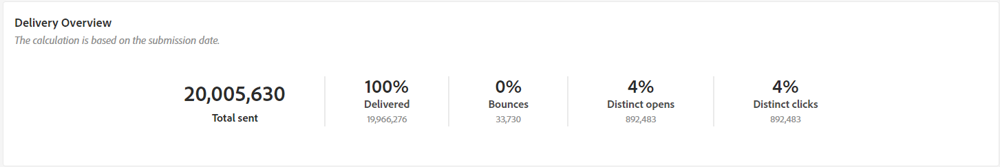

* **[!UICONTROL 初始目標對象統計資料]**

  +++進一步瞭解電子郵件行銷活動報告量度。

   * **[!UICONTROL 初始對象]**：目標收件者總數。

   * **[!UICONTROL 要傳遞的訊息]**：傳遞分析後要傳遞的訊息總數。

   * **[!UICONTROL 被規則拒絕]**：套用規則時分析期間忽略的地址總數：地址遺失、隔離、列入封鎖清單等。

+++

  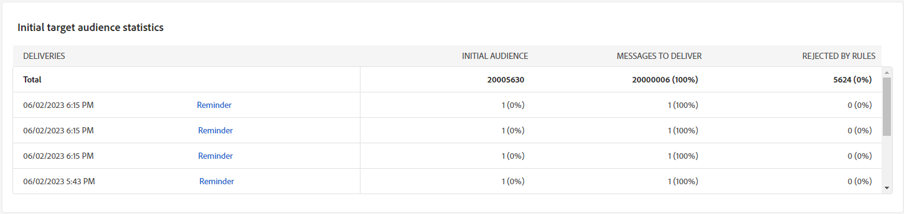

* **[!UICONTROL 執行統計資料]**

  +++進一步瞭解電子郵件行銷活動報告量度。

   * **[!UICONTROL 要傳遞的訊息]**：傳遞分析後要傳遞的訊息總數。

   * **[!UICONTROL 成功]**：成功處理的訊息數與要傳送的訊息數相關。

   * **[!UICONTROL 錯誤]**：與要傳送的訊息數量相關的傳送和自動復原處理期間累計的錯誤總數。

   * **[!UICONTROL 新隔離]**：與要傳送的訊息數量相關的傳送失敗（使用者未知、無效的網域）後隔離的地址總數。

+++

  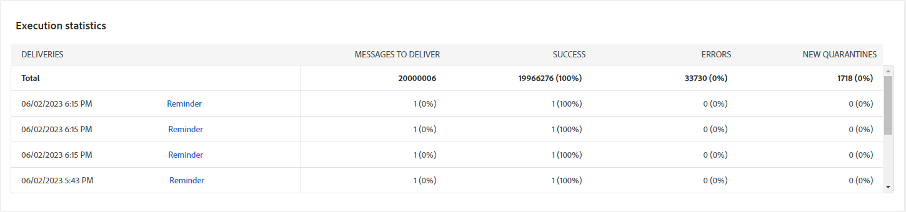

* **[!UICONTROL 反應統計資料]**

  +++進一步瞭解電子郵件行銷活動報告量度。

   * **[!UICONTROL 不同開啟次數]**：至少開啟過一次訊息的目標收件者總數。

   * **[!UICONTROL 開啟次數]**：此網域中至少開啟過一次訊息的不同目標收件者人數。

   * **[!UICONTROL 取消訂閱]**：在相關期間內點選取消訂閱的收件者人數。

   * **[!UICONTROL 映象頁面]**：點按映象頁面連結的收件者人數。

   * **[!UICONTROL 轉寄]**：點按後轉寄電子郵件的收件者人數。

  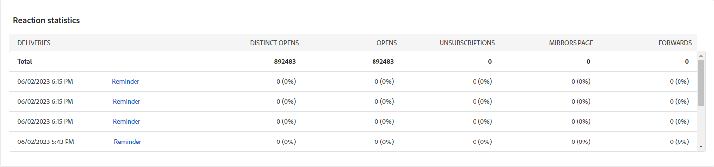
+++

* **[!UICONTROL 產生的點按資料流]**

  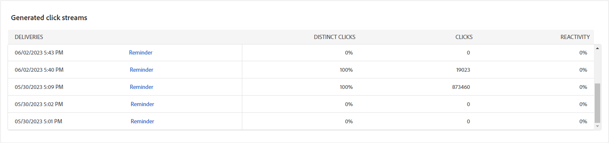

  +++進一步瞭解電子郵件行銷活動報告量度。

   * **[!UICONTROL 不同點按次數]**：在傳遞中至少點選一次的不同收件者總數。

   * **[!UICONTROL 點按次數]**：傳遞中連結的點按總數。

   * **[!UICONTROL 反應性]**：已點按傳送的目標收件者人數與已開啟傳送的目標收件者估計人數的比率。

+++

### 無法傳遞的項目 {#non-deliverables-email}

* **[!UICONTROL 每種型別的錯誤劃分]** 和 **[!UICONTROL 每個瀏覽器的錯誤劃分]**

  +++進一步瞭解電子郵件行銷活動報告量度。

   * **[!UICONTROL 錯誤]**：在傳送和自動反彈處理期間累計的錯誤總數，與要傳送的訊息數量相關。

   * **[!UICONTROL 貢獻]**：

   * **[!UICONTROL 劃分]**:

+++

  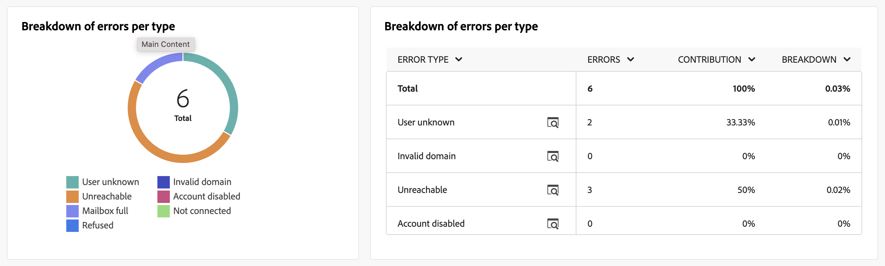

### 追蹤指標 {#tracking-indicators-email}

* **[!UICONTROL 傳遞統計資料]**

  +++進一步瞭解電子郵件行銷活動報告量度。

   * **[!UICONTROL 成功]**：成功處理的訊息數與要傳送的訊息數相關。

   * **[!UICONTROL 不同開啟次數]**：至少開啟過一次訊息的目標收件者總數。

   * **[!UICONTROL 開啟次數]**：此網域中至少開啟過一次訊息的不同目標收件者人數。

   * **[!UICONTROL 選擇退出連結的點選次數]**：對取消訂閱連結的點按次數。

   * **[!UICONTROL 按一下映象連結]**：對映象頁面連結的點按次數。

   * **[!UICONTROL 轉送次數估計]**：目標收件者轉寄的電子郵件預估數量。
+++

  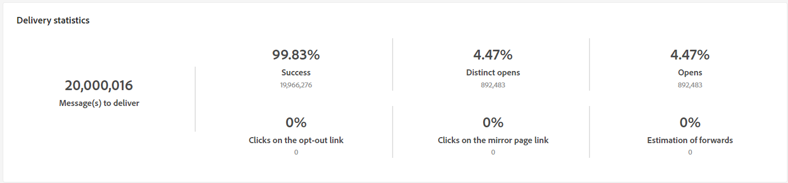

* **[!UICONTROL 開啟及點進率]**

  +++進一步瞭解電子郵件行銷活動報告量度。

   * **[!UICONTROL 已傳送]**：已傳送的訊息總數。

   * **[!UICONTROL 申訴]**：此網域被回報為收件者不想要的訊息數。

   * **[!UICONTROL 開啟次數]**：此網域中至少開啟過一次訊息的不同目標收件者人數。

   * **[!UICONTROL 點按次數]**：至少點按一次相同傳遞的不同目標收件者人數。

   * **[!UICONTROL 原始反應性]**：與開啟傳遞至少一次的收件者人數相比，已至少點按一次傳遞的收件者人數的百分比。
+++

  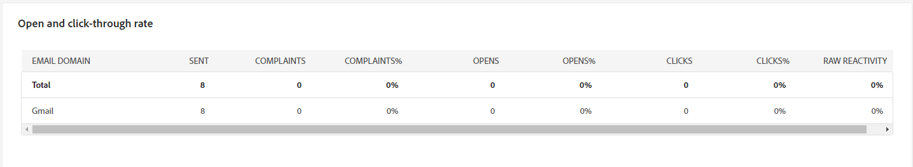

### URL 和點擊流量 {#url-email}

* **[!UICONTROL URL 和點按流]**

  +++進一步瞭解電子郵件行銷活動報告量度。

   * **[!UICONTROL 反應性]**：已點按傳送的目標收件者人數與已開啟傳送的目標收件者估計人數的比率。

   * **[!UICONTROL 不同點按次數]**：在傳遞中至少點選一次的不同收件者總數。

   * **[!UICONTROL 點按次數]**：傳遞中連結的點按總數。

+++

  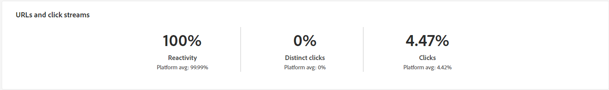

* **[!UICONTROL 造訪量最高的前 10 個連結]**

  +++進一步瞭解電子郵件行銷活動報告量度。

   * **[!UICONTROL 點按次數]**：傳遞中連結的點按總數。

   * **[!UICONTROL 百分比]**：與傳送互動的使用者百分比。

+++

  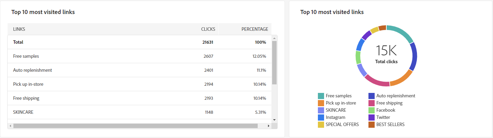

* **[!UICONTROL 一段時間內點選的劃分]**，點按次數

  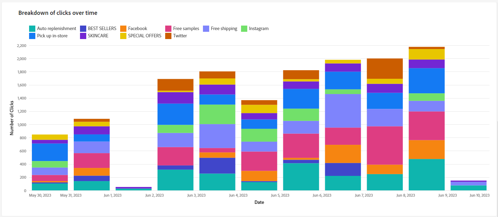

### 使用者活動 {#user-activities-email}

* **[!UICONTROL 使用者活動]**

   * **[!UICONTROL 點按次數]**：傳遞中連結的點按總數。

   * **[!UICONTROL 開啟次數]**：此網域中至少開啟過一次訊息的不同目標收件者人數。

+++

  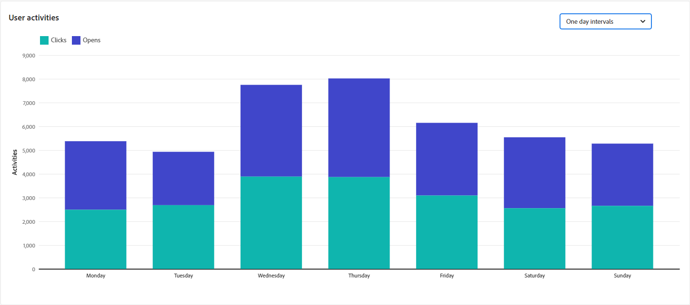

## 簡訊管道 {#sms-channel}

### 傳遞摘要 {#delivery-summary-sms}

* **[!UICONTROL 傳遞概述]** 提供關鍵績效指標(KPI)，用於提供有關訪客如何參與您的SMS傳送的詳細資訊。

  +++進一步瞭解簡訊行銷活動報告量度。

   * **[!UICONTROL 已傳送總數]**：傳遞分析期間處理的訊息總數。

   * **[!UICONTROL 已傳遞]**：成功傳送的訊息數，與已傳送訊息總數相關。

   * **[!UICONTROL 錯誤]**：與已傳送訊息總數相關的傳送和自動傳回處理期間累計的錯誤總數。

   * **[!UICONTROL 不同點按次數]**：在傳遞中至少點選一次的不同收件者總數。

+++

* **[!UICONTROL 初始目標對象統計資料]**

  +++進一步瞭解簡訊行銷活動報告量度。

   * **[!UICONTROL 初始對象]**：目標收件者總數。

   * **[!UICONTROL 要傳遞的訊息]**：傳遞分析後要傳遞的訊息總數。

   * **[!UICONTROL 被規則拒絕]**：套用規則時分析期間忽略的地址總數：地址遺失、隔離、列入封鎖清單等。

+++

* **[!UICONTROL 執行統計資料]**

  +++進一步瞭解簡訊行銷活動報告量度。

   * **[!UICONTROL 要傳遞的訊息]**：傳遞分析後要傳遞的訊息總數。

   * **[!UICONTROL 成功]**：成功處理的訊息數與要傳送的訊息數相關。

   * **[!UICONTROL 錯誤]**：與要傳送的訊息數量相關的傳送和自動復原處理期間累計的錯誤總數。

   * **[!UICONTROL 新隔離]**：與要傳送的訊息數量相關的傳送失敗（使用者未知、無效的網域）後隔離的地址總數。

+++

* **[!UICONTROL 產生的點按資料流]**

  +++進一步瞭解簡訊行銷活動報告量度。

   * **[!UICONTROL 不同點按次數]**：在傳遞中至少點選一次的不同收件者總數。

   * **[!UICONTROL 點按次數]**：傳遞中連結的點按總數。

   * **[!UICONTROL 反應性]**：已點按傳送的目標收件者人數與已開啟傳送的目標收件者估計人數的比率。

+++

## 推播管道 {#push-channel}

### 傳遞摘要 {#delivery-summary-push}

* **[!UICONTROL 傳遞概述]** 提供關鍵績效指標(KPI)，用於提供有關訪客如何參與推播通知傳送的詳細資訊。

  +++進一步瞭解推播行銷活動報告量度。

   * **[!UICONTROL 已傳送總數]**：傳遞分析期間處理的訊息總數。

   * **[!UICONTROL 已傳遞]**：成功傳送的訊息數，與已傳送訊息總數相關。

   * **[!UICONTROL 錯誤]**：與已傳送訊息總數相關的傳送和自動傳回處理期間累計的錯誤總數。

   * **[!UICONTROL 不同點按次數]**：在傳遞中至少點選一次的不同收件者總數。

+++

* **[!UICONTROL 初始目標對象統計資料]**

  +++進一步瞭解推播行銷活動報告量度。

   * **[!UICONTROL 初始對象]**：目標收件者總數。

   * **[!UICONTROL 要傳遞的訊息]**：傳遞分析後要傳遞的訊息總數。

   * **[!UICONTROL 被規則拒絕]**：套用規則時分析期間忽略的地址總數：地址遺失、隔離、列入封鎖清單等。

+++

* **[!UICONTROL 執行統計資料]**

  +++進一步瞭解推播行銷活動報告量度。

   * **[!UICONTROL 要傳遞的訊息]**：傳遞分析後要傳遞的訊息總數。

   * **[!UICONTROL 成功]**：成功處理的訊息數與要傳送的訊息數相關。

   * **[!UICONTROL 錯誤]**：與要傳送的訊息數量相關的傳送和自動復原處理期間累計的錯誤總數。

   * **[!UICONTROL 新隔離]**：與要傳送的訊息數量相關的傳送失敗（使用者未知、無效的網域）後隔離的地址總數。

+++

* **[!UICONTROL 產生的點按資料流]**

  +++進一步瞭解推播行銷活動報告量度。

   * **[!UICONTROL 不同點按次數]**：在傳遞中至少點選一次的不同收件者總數。

   * **[!UICONTROL 點按次數]**：傳遞中連結的點按總數。

   * **[!UICONTROL 反應性]**：已點按傳送的目標收件者人數與已開啟傳送的目標收件者估計人數的比率。

+++
