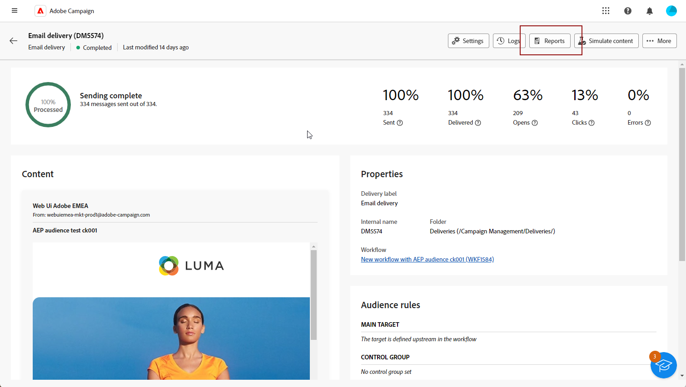
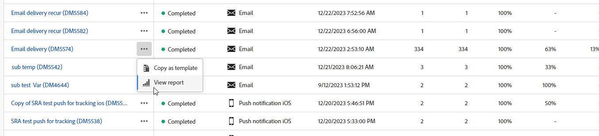
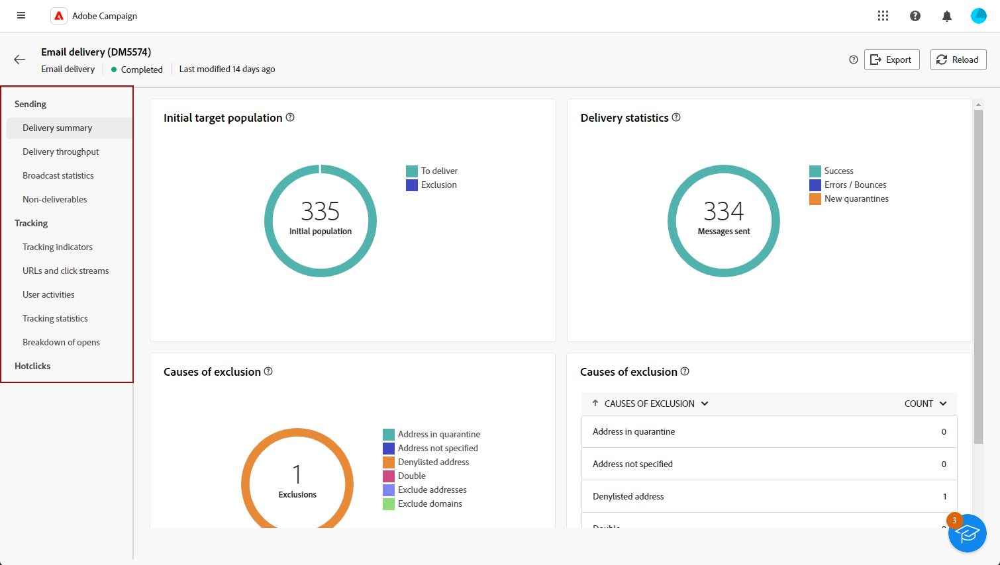
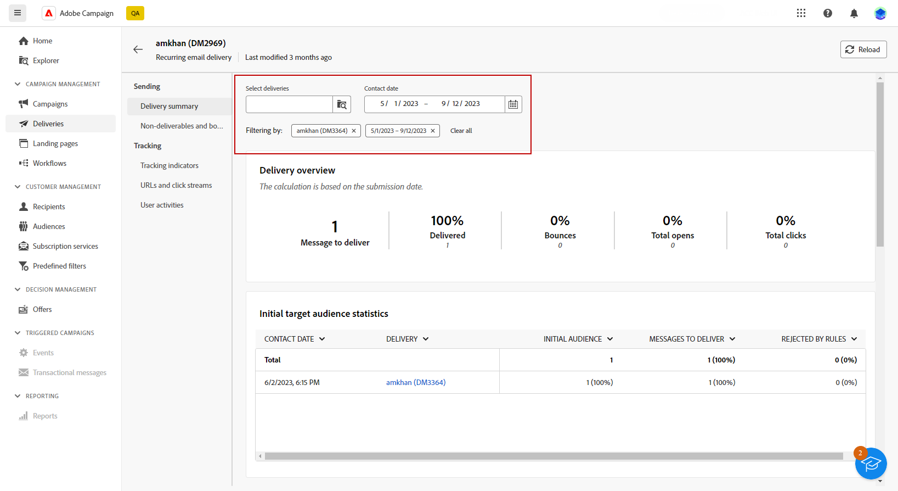
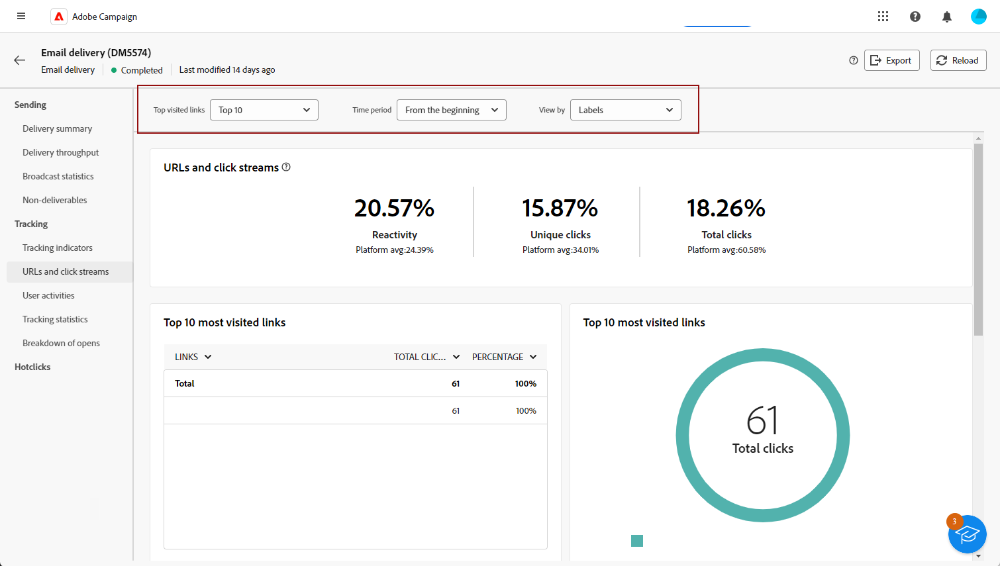

# 開始使用傳遞報告 {#reports}

>[!CONTEXTUALHELP]
>id="acw_campaign_reporting_deliveries_selection"
>title="傳遞的彙總報告"
>abstract="選取至少兩個傳遞，以顯示彙總的資料報告。"

**傳遞報告**&#x200B;提供了專門針對每個管道的&#x200B;**傳遞**&#x200B;的深入分析和資料。這些報告會提供有關您的個別傳遞的績效、有效性和成果的詳細資訊，為您提供全方位的概觀。

各管道的完整報表和相關量度清單可在下列頁面取得：

* [以電子郵件傳送報告](email-report.md)
* [簡訊傳遞報告](sms-report.md)
* [推播傳遞報告](push-report.md)
* [直接郵件傳遞報告](direct-mail.md)

## 管理您的報告儀表板 {#manage-reports}

Adobe Campaign 提供多種報告類型，每個傳遞均可存取。這些報告可讓您在內建儀表板測量和視覺化訊息的影響和效能。

若要顯示和管理報表，請遵循下列步驟：

1. 若要產生特定傳遞的報告，請導覽至 **[!UICONTROL 傳遞]** 功能表，並選取您要報告的傳送。

1. 從您的 **[!UICONTROL 傳遞]** 儀表板，按一下 **[!UICONTROL 報表]**.

   {zoomable=&quot;yes&quot;}

   或者，您可以使用三個點 **更多動作** 按鈕，然後選取「 」 **[!UICONTROL 檢視報告]**.

   {zoomable=&quot;yes&quot;}

1. 從左側選單，從清單選取報告。

   {zoomable=&quot;yes&quot;}

1. 如果您的傳送是週期性的，請按一下「 」，選取要報告的特定傳送 **[!UICONTROL 選取傳遞]**.

   您也可以選取「 」，將時段套用至報表 **[!UICONTROL 聯絡日期]**.

   {zoomable=&quot;yes&quot;}

1. 從 **[!UICONTROL URL和點按流量]**，您也可以選擇 **[!UICONTROL 最常造訪的連結]** 或 **[!UICONTROL 時段]**.

   此 **[!UICONTROL 檢視方式]** 選項可讓您篩選URL、標籤或類別。

   {zoomable=&quot;yes&quot;}
