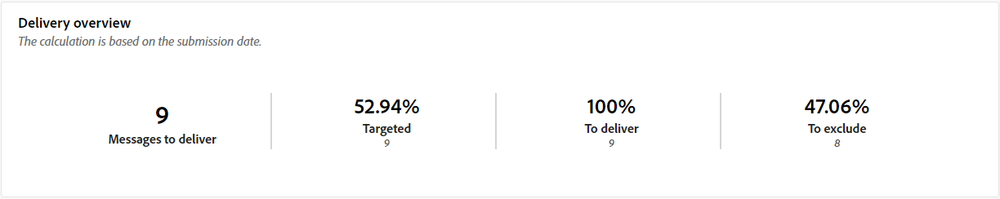
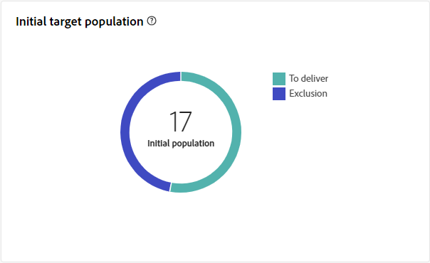
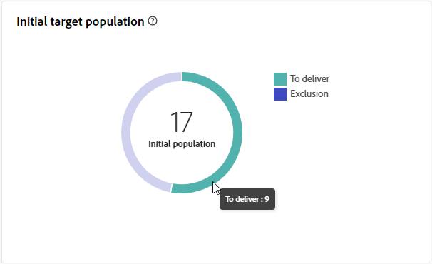
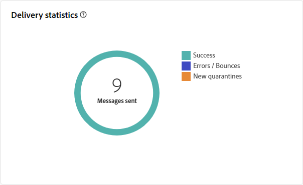
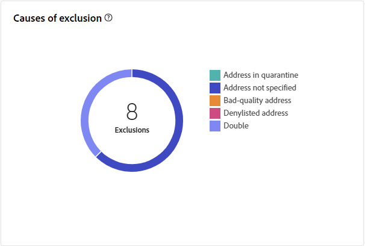
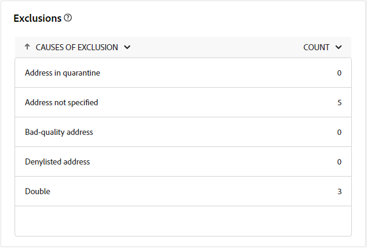

# 直接郵件傳遞報告 {#direct-mail-report}

此 **直接郵件傳遞報告** 提供直接郵件傳遞的特定全面見解和資料。 其中會提供有關您的個別傳遞的效能、效益和成果的詳細資訊，為您提供全方位的概觀。

## 傳遞摘要 {#delivery-summary-direct-mail}

### 傳遞概觀 {#delivery-overview-direct-mail}

>[!CONTEXTUALHELP]
>id="acw_delivery_reporting_delivery_overview_direct_mail"
>title="傳遞概觀"
>abstract="**傳遞概觀**&#x200B;提供了關鍵績效指標 (KPI)，可讓您深入了解訪客與每次直接郵件傳遞的互動情況。這些量度概述如下。"

此 **[!UICONTROL 傳遞概覽]** 提供訪客與每個直接郵件傳遞互動方式的詳細分析，並展示關鍵績效指標(KPI)。  這些量度概述如下。

{zoomable=&quot;yes&quot;}{align="center"}

+++進一步瞭解傳送概述量度。

* **[!UICONTROL 要傳遞的訊息]**：在傳送準備期間處理的訊息總數。

* **[!UICONTROL 已鎖定目標]**：符合直接郵件訊息目標設定檔資格的使用者設定檔數目。

* **[!UICONTROL 要排除]**：從目標設定檔中排除且不會收到直接郵件訊息的使用者設定檔數。
+++

### 初始目標族群 {#direct-mail-delivery-targeted-population}

>[!CONTEXTUALHELP]
>id="acw_delivery_reporting_initial_target_direct_mail"
>title="初始目標族群"
>abstract="**初始目標族群**&#x200B;圖表根據傳遞準備的結果顯示與收件者和訊息相關的資料。"

此 **[!UICONTROL 初始目標母體]** 圖表顯示與收件者相關的資料。 量度會在傳遞準備期間計算並顯示：初始對象、要傳送的訊息數、排除的收件者數。

{zoomable=&quot;yes&quot;}

將滑鼠移至圖表的一部分上以顯示確切的數字。

{zoomable=&quot;yes&quot;}

+++深入瞭解直接郵件傳遞報告度量。

* **[!UICONTROL 初始對象]**：目標收件者總數。

* **[!UICONTROL 要傳遞]**：準備傳送後要傳送的訊息總數。

* **[!UICONTROL 排除]**：從目標人口中排除的收件者總數。
+++

### 傳遞統計資料 {#direct-mail-delivery-stats}

>[!CONTEXTUALHELP]
>id="acw_delivery_reporting_delivery_statistics_summary_direct_mail"
>title="傳遞統計資料"
>abstract="**傳遞統計資料**&#x200B;圖表詳細說明直接郵件傳遞成功以及發生的錯誤。"

此 **[!UICONTROL 傳遞統計資料]** graph提供傳送績效的完整概觀，提供測量成功與效率的詳細量度。

{zoomable=&quot;yes&quot;}

+++進一步瞭解直接郵件行銷活動報告度量。

* **[!UICONTROL 已傳送訊息]**：準備傳送後要傳送的訊息總數。

* **[!UICONTROL 成功]**：成功處理的訊息數與要傳送的訊息數相關。

* **[!UICONTROL 錯誤]**：與要傳送的訊息數量相關的傳送和自動復原處理期間累計的錯誤總數。

* **[!UICONTROL 新隔離]**：與要傳送的訊息數量相關的傳送失敗（使用者未知、網域無效）後隔離的地址總數。

+++

### 排除的原因 {#direct-mail-delivery-exclusions}

>[!CONTEXTUALHELP]
>id="acw_delivery_reporting_causes_exclusion_direct_mail"
>title="傳遞排除原因"
>abstract="**排除原因**&#x200B;圖表顯示傳遞準備期間被拒絕之郵件的分佈，依每個規則進行分類。"

此 **[!UICONTROL 排除的原因]** 圖表提供在傳遞準備過程中訊息被拒絕背後原因的詳細劃分。 此劃分會根據各種規則進行整理，提供排除訊息因素的綜合檢視。 有關排除規則的詳情，請參閱 [Campaign v8 （主控台）檔案](https://experienceleague.adobe.com/docs/campaign/campaign-v8/send/failures/delivery-failures.html#email-error-types){_blank}.

{zoomable=&quot;yes&quot;}{align="center" zoomable="yes"}

+++深入瞭解排除量度發生的原因。

* **[!UICONTROL 隔離中的地址]**：將地址置於隔離區時產生的錯誤型別。

* **[!UICONTROL 未指定地址]**：傳送傳遞時產生的錯誤型別，用以指出地址不存在。

* **[!UICONTROL 品質不良的地址]**：郵寄地址品質評等太低時產生的錯誤型別。

* **[!UICONTROL 已加入封鎖清單的地址]**：執行傳遞時將收件者加入封鎖清單時產生的錯誤型別。

* **[!UICONTROL 兩次]**：收件者因金鑰值不唯一而被排除時產生的錯誤型別。

* **[!UICONTROL 控制組]**：收件者的地址是控制組的一部分。

* **[!UICONTROL 目標大小受限]**：收件者已達到傳遞大小上限。

+++

### 排除 {#direct-mail-exclusions}

>[!CONTEXTUALHELP]
>id="acw_delivery_reporting_exclusions_direct_mail"
>title="排除"
>abstract="**[!UICONTROL 排除]**&#x200B;表格依規則顯示傳遞準備過程中被拒絕之郵件的詳細劃分。"

此 **[!UICONTROL 排除專案]** 此表格提供傳送準備階段期間遭拒絕之訊息的深入劃分（依特定規則分類）。 此全方位的劃分可讓您清楚瞭解從傳送程式排除這些訊息的原因。

{zoomable=&quot;yes&quot;}{align="center" zoomable="yes"}

可用的量度與 [排除的原因](#direct-mail-delivery-exclusions) 如上所述。
