# 以電子郵件寄送傳遞報告  {#email-report}

此 **以電子郵件傳送報告** 提供電子郵件通道特定的全面見解和資料。 其中會提供有關您的個別傳遞的效能、效益和成果的詳細資訊，為您提供全方位的概觀。

## 傳遞摘要 {#delivery-summary-email}

>[!CONTEXTUALHELP]
>id="acw_delivery_reporting_sending_email"
>title="報告傳送"
>abstract="報告中的「**傳送**」標籤可讓您深入了解訪客與您傳遞的互動，以及他們可能遇到的任何潛在錯誤。"

### 初始目標族群 {#email-delivery-targeted-population}

>[!CONTEXTUALHELP]
>id="acw_delivery_reporting_initial_target"
>title="初始目標族群"
>abstract="此 **初始目標母體** 圖表會根據傳遞準備的結果，顯示與收件者和訊息相關的資料。"

此 **[!UICONTROL 初始目標母體]** 圖表顯示與收件者相關的資料。 量度會在傳遞準備期間計算並顯示：初始對象、要傳送的訊息數、排除的收件者數。

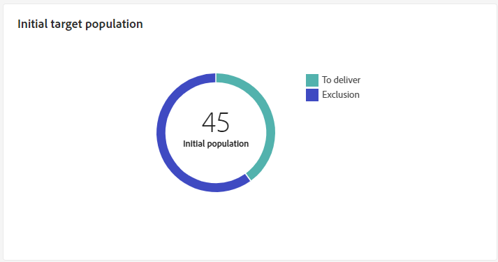{width="50%" align="left" zoomable="yes"}

將滑鼠移至圖表的一部分上以顯示確切的數字。

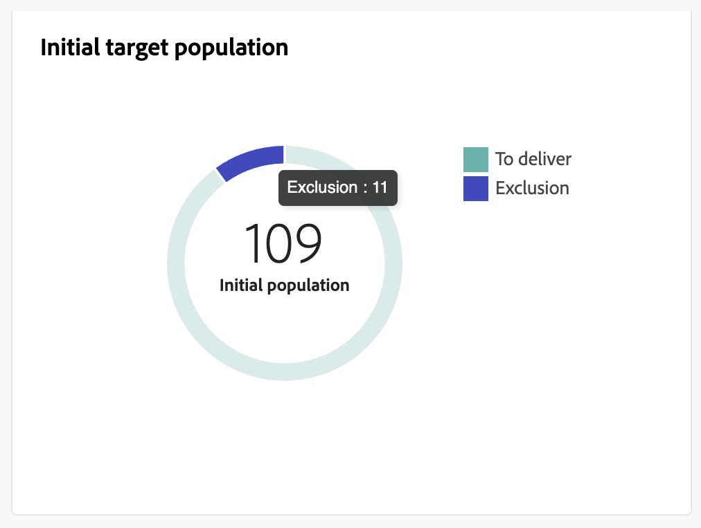{width="50%" align="left" zoomable="yes"}

+++進一步瞭解電子郵件傳送報告量度。

* **[!UICONTROL 初始對象]**：目標收件者總數。

* **[!UICONTROL 要傳遞]**：準備傳送後要傳送的訊息總數。

* **[!UICONTROL 排除]**：從目標人口中排除的收件者總數。
+++

### 傳遞統計資料 {#email-delivery-stats}

>[!CONTEXTUALHELP]
>id="acw_delivery_reporting_delivery_statistics_summary"
>title="傳遞統計資料"
>abstract="此 **傳遞統計資料** 圖表會詳細說明您的傳送成功與發生的錯誤。"

此 **[!UICONTROL 傳遞統計資料]** 圖表會詳細說明您的傳送是否成功。 量度詳情如下。

{width="50%" align="left" zoomable="yes"}

+++進一步瞭解電子郵件促銷活動報告量度。

* **[!UICONTROL 已傳送訊息]**：準備傳送後要傳送的訊息總數。

* **[!UICONTROL 成功]**：成功處理的訊息數與要傳送的訊息數相關。

* **[!UICONTROL 錯誤]**：與要傳送的訊息數量相關的傳送和自動復原處理期間累計的錯誤總數。

* **[!UICONTROL 新隔離]**：與要傳送的訊息數量相關的傳送失敗（使用者未知、網域無效）後隔離的地址總數。

+++

### 排除的原因  {#email-delivery-exclusions}

>[!CONTEXTUALHELP]
>id="acw_delivery_reporting_exclusion"
>title="傳遞統計資料"
>abstract="此 **排除的原因** 圖形與表格會依規則顯示傳遞準備期間拒絕的訊息劃分。"

此 **[!UICONTROL 排除的原因]** 圖形與表格會依規則顯示傳遞準備期間拒絕的訊息劃分。 有關排除規則的詳情，請參閱 [Campaign v8 （主控台）檔案](https://experienceleague.adobe.com/docs/campaign/campaign-v8/send/failures/delivery-failures.html#email-error-types){_blank}.

{align="center" zoomable="yes"}

+++進一步瞭解電子郵件傳送報告量度。

* **[!UICONTROL 使用者不明]**：傳送期間產生的錯誤型別，用以指出電子郵件地址無效。

* **[!UICONTROL 無效的網域]**：傳送傳遞時產生的錯誤型別，用以指出電子郵件地址的網域錯誤或不存在。

* **[!UICONTROL 郵箱已滿]**：在嘗試傳送五次後產生的錯誤型別，以指出收件者的收件匣包含太多訊息。

* **[!UICONTROL 帳戶已停用]**：傳送傳遞時產生的錯誤型別，用以指出地址已不存在。

* **[!UICONTROL 已拒絕]**：當IAP （網際網路存取提供者）拒絕位址時產生的錯誤型別，例如在套用安全性規則（反垃圾郵件軟體）之後。

* **[!UICONTROL 無法聯絡]**：訊息發佈字串中發生的錯誤型別：SMTP轉送上的事件、暫時無法連線網域等

* **[!UICONTROL 未連線]**：錯誤型別，表示收件者的行動電話在傳送時已關閉或已中斷與網路的連線。

+++

## 傳遞總處理能力 {#delivery-throughtput}

>[!CONTEXTUALHELP]
>id="acw_delivery_reporting_throughput_email"
>title="傳遞總處理能力"
>abstract="**傳遞輸送量**&#x200B;報告提供有關特定期間內整個平台傳遞輸送量的詳細資訊。"

此報表提供指定時間範圍內整個平台傳遞輸送量的詳細資訊。 用來測量訊息傳送速度的主要量度是每小時傳送的訊息數。

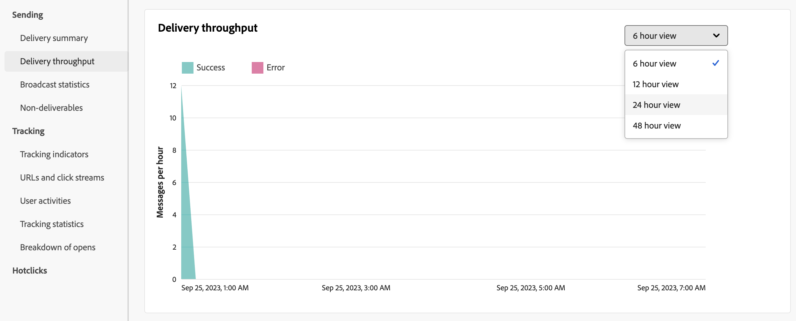{align="center" zoomable="yes"}

## 廣播統計資料 {#broadcast-statistics}

>[!CONTEXTUALHELP]
>id="acw_delivery_reporting_broadcast_statistics"
>title="廣播統計資料"
>abstract="此 **廣播統計資料** 報表包含每個網域可能遇到的錯誤的可用資料。"

**[!UICONTROL 廣播統計資料]**&#x200B;表包含每個網域可能發生之錯誤的可用資料。量度詳情如下。

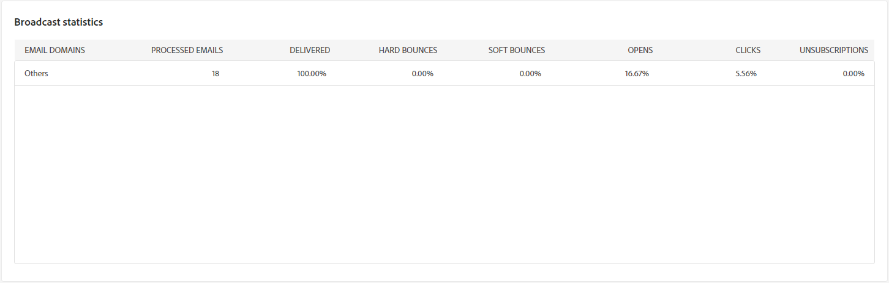{align="center" zoomable="yes"}

+++進一步瞭解電子郵件傳送報告量度。

* **[!UICONTROL 已處理的電子郵件]**：傳遞伺服器處理的訊息總數。

* **[!UICONTROL 已傳遞]**：成功處理的訊息數與已處理的訊息總數相比的百分比。

* **[!UICONTROL 硬跳出]**：與已處理的訊息總數相比的「硬」退信、永久錯誤（例如錯誤的電子郵件地址）數量百分比。

* **[!UICONTROL 軟退信]**：與處理的郵件總數相比的「軟」退信、暫時錯誤（例如完整收件匣）數量百分比

* **[!UICONTROL 開啟次數]**：與成功處理的訊息數相比，至少開啟過一次訊息的目標收件者人數的百分比。

* **[!UICONTROL 點按次數]**：與成功處理的訊息數相比，至少一次點按傳送的人員數百分比。

* **[!UICONTROL 取消訂閱]**：與成功處理的訊息數相比的取消訂閱連結點選次數百分比。
+++

## 無法傳遞的項目 {#non-deliverables-email}

### 依類型的錯誤劃分 {#email-delivery-breakdown-type}

>[!CONTEXTUALHELP]
>id="acw_delivery_reporting_error_type"
>title="依類型的錯誤劃分"
>abstract="此 **每種型別的錯誤劃分** 表格和圖表包含遇到的每種錯誤型別的可用資料：使用者不明、信箱已滿、網域無效等等。"

此 **[!UICONTROL 每種型別的錯誤劃分]** 表格和圖表包含可用於錯誤型別的資料。 量度詳情如下。

此報告中顯示的錯誤會觸發隔離程式。 有關隔離管理的詳細資訊，請參閱 [Campaign v8 （使用者端主控台）檔案](https://experienceleague.adobe.com/docs/campaign/campaign-v8/campaigns/send/failures/delivery-failures.html){target="_blank"}.

{align="left" zoomable="yes"}

+++進一步瞭解電子郵件傳送報告量度。

* **[!UICONTROL 使用者不明]**：傳送期間產生的錯誤型別，用以指出電子郵件地址無效。

* **[!UICONTROL 無效的網域]**：傳送傳遞時產生的錯誤型別，用以指出電子郵件地址的網域錯誤或不存在。

* **[!UICONTROL 郵箱已滿]**：在嘗試傳送五次後產生的錯誤型別，以指出收件者的收件匣包含太多訊息。

* **[!UICONTROL 帳戶已停用]**：傳送傳遞時產生的錯誤型別，用以指出地址已不存在。

* **[!UICONTROL 已拒絕]**：當IAP （網際網路存取提供者）拒絕位址時產生的錯誤型別，例如在套用安全性規則（反垃圾郵件軟體）之後。

* **[!UICONTROL 無法聯絡]**：訊息發佈字串中發生的錯誤型別：SMTP轉送上的事件、暫時無法連線網域等

* **[!UICONTROL 未連線]**：錯誤型別，表示收件者的行動電話在傳送時已關閉或已中斷與網路的連線。

+++

### 依網域的錯誤劃分 {#email-delivery-breakdown-domain}

>[!CONTEXTUALHELP]
>id="acw_delivery_reporting_error_domain"
>title="依網域的錯誤劃分"
>abstract="此 **每個網域的錯誤劃分** 表格和圖表會根據每個網域顯示遇到的每種錯誤型別的可用資料。"

此 **[!UICONTROL 每個網域的錯誤劃分]** 表格和圖表會顯示每個網域可能遇到的錯誤的可用資料。

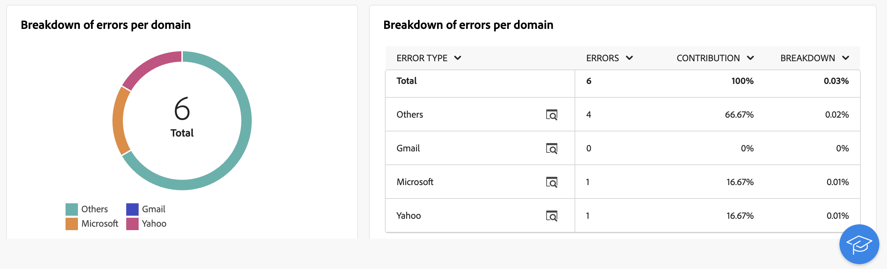{align="left" zoomable="yes"}

按一下每個網域名稱旁邊的圖示以檢視詳細資訊。

{align="left" zoomable="yes"}

可用的量度與 [依型別劃分錯誤](#email-delivery-breakdown-type) 如上所述。

## 追蹤指標 {#tracking-indicators-email}

>[!CONTEXTUALHELP]
>id="acw_delivery_reporting_tracking_email"
>title="報告追蹤"
>abstract="報告中的「**追蹤**」標籤可提供有價值的資料，包括每個連結的收件者行為、打開和點擊的詳細資料，以及傳遞過程中最常點擊的 URL 詳細資訊。"

### 傳遞統計資料  {#email-tracking-delivery-stats}

>[!CONTEXTUALHELP]
>id="acw_delivery_reporting_delivery_statistics_indicators"
>title=" 傳遞統計資料"
>abstract="此 **傳遞統計資料** 報告提供關鍵績效指標(KPI)，用於提供關於已傳送電子郵件可用資料的詳細資訊：成功、開啟、點按等。"

此 **[!UICONTROL 傳遞統計資料]** 報告提供關鍵績效指標(KPI)，可提供所傳送電子郵件可用資料的詳細資訊。 量度詳情如下。

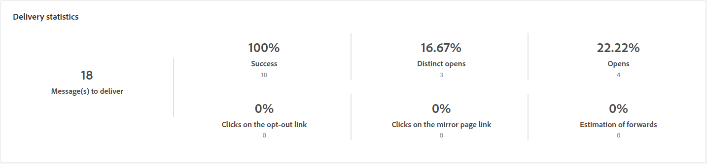{align="center"}

+++進一步瞭解電子郵件傳送報告量度。

* **[!UICONTROL 成功]**：成功處理的訊息數與要傳送的訊息數相關。

* **[!UICONTROL 不同開啟次數]**：至少開啟過一次訊息的目標收件者總數。

* **[!UICONTROL 開啟次數]**：此網域中至少開啟過一次訊息的不同目標收件者人數。

* **[!UICONTROL 在選擇退出連結上的點選次數]**：對取消訂閱連結的點按次數。

* **[!UICONTROL 按一下映象連結]**：點按映象頁面連結的次數。

* **[!UICONTROL 轉送次數估計]**：目標收件者轉寄的電子郵件預估數量。
+++

### 開啟及點進率 {#email-tracking-click-through}

>[!CONTEXTUALHELP]
>id="acw_delivery_reporting_open_clickthrough"
>title="開啟及點進率"
>abstract="**開啟及點進率**&#x200B;表格顯示與您的傳遞相關的收件者參與度的資料。"

此 **[!UICONTROL 開啟及點進率]** 表格會顯示與收件者相關的資料。 量度詳情如下。

{align="center"}

+++進一步瞭解電子郵件傳送報告量度。

* **[!UICONTROL 已傳送]**：已傳送的訊息總數。

* **[!UICONTROL 投訴]**：此網域被回報為收件者不想要的訊息數。

* **[!UICONTROL 開啟次數]**：此網域中至少開啟過一次訊息的不同目標收件者人數。

* **[!UICONTROL 點按次數]**：至少點按一次相同傳遞的不同目標收件者人數。

* **[!UICONTROL 原始反應度]**：與開啟傳送至少一次的收件者人數相比，已至少點按一次傳送的收件者人數的百分比。
+++

## URL 和點擊流量 {#url-email}

>[!CONTEXTUALHELP]
>id="acw_delivery_reporting_urls_clickstreams"
>title="URL 和點擊流量"
>abstract="此 **URL和點按流量** 報告提供關鍵績效指標(KPI)，可提供傳遞期間點選次數最多的URL的詳細資訊。"

此 **[!UICONTROL URL和點按流量]** 報告提供關鍵績效指標(KPI)，可提供傳遞期間點選次數最多的URL的詳細資訊。

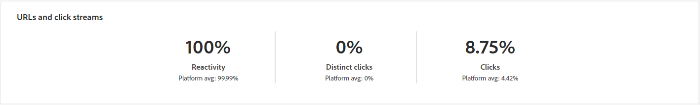{align="center"}

+++進一步瞭解電子郵件傳送報告量度。

* **[!UICONTROL 反應度]**：已點按傳送的目標收件者數目與已開啟傳送的目標收件者估計數目之間的比率。

* **[!UICONTROL 不同點按次數]**：在傳遞中至少點選一次的不同收件者總數。

* **[!UICONTROL 點按次數]**：傳遞中連結的點按總數。

* **[!UICONTROL 平台平均值]** ：此平均比率顯示在每個比率（反應性、不同點按和累計點按）下，是針對過去六個月傳送的傳送進行計算。 系統只會考慮具有相同型別和相同通道的傳送。 校訂已排除。

+++

### 造訪量最高的前 10 個連結 {#email-tracking-top10}

>[!CONTEXTUALHELP]
>id="acw_delivery_reporting_urls_clickstreams_top10"
>title="造訪量最高的前 10 個連結"
>abstract="此 **前10個最常造訪的連結** rgraph和表格包含每個連結的收件者行為可用資料。"

此 **[!UICONTROL 前10個最常造訪的連結]** 圖表和表格包含每個連結的收件者行為可用資料。

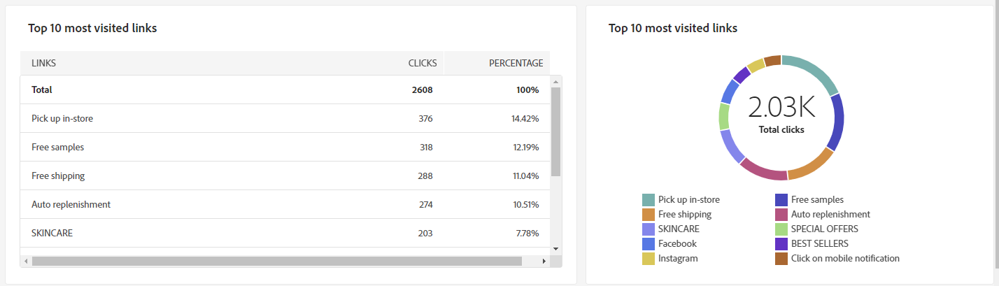{align="center"}

+++進一步瞭解電子郵件傳送報告量度。

* **[!UICONTROL 點按次數]**：傳遞中連結的點按總數。

* **[!UICONTROL 百分比]**：與傳送互動的使用者百分比。

+++

### 特定期間的點按劃分 {#email-tracking-breakdown-over-time}

>[!CONTEXTUALHELP]
>id="acw_delivery_reporting_urls_click_breakdown"
>title="特定期間的點按劃分"
>abstract="此 **一段時間內點按的劃分** 圖表顯示每個連結的收件者行為可用資料。"

此 **[!UICONTROL 一段時間內點按的劃分]** 圖表包含每個連結的收件者行為可用資料。

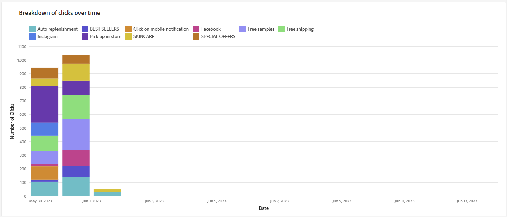{align="center"}

## 使用者活動 {#user-activities-email}

>[!CONTEXTUALHELP]
>id="acw_delivery_reporting_user_activities"
>title="使用者活動 Widget"
>abstract="**使用者活動**&#x200B;圖以圖表的形式顯示開啟和點按數的劃分。您可以選擇目標資料的時段：最近一天、最近一小時或最近 30 分鐘。"

此 **[!UICONTROL 使用者活動]** 報告會以圖表形式顯示開啟和點按的劃分。 您可以選擇目標資料的時段：最近一天、最近一小時或最近 30 分鐘。

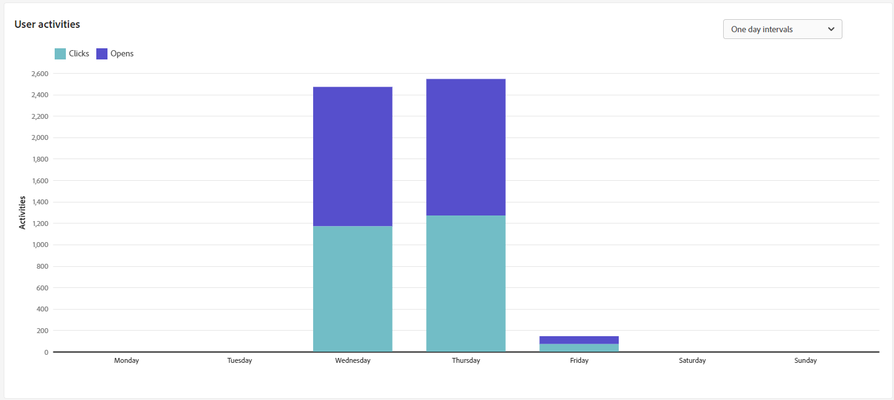{align="center"}

+++進一步瞭解電子郵件傳送報告量度。

* **[!UICONTROL 點按次數]**：傳遞中連結的點按總數。

* **[!UICONTROL 開啟次數]**：此網域中至少開啟過一次訊息的不同目標收件者人數。

+++

## 追蹤統計資料 {#tracking-statistics}

>[!CONTEXTUALHELP]
>id="acw_delivery_reporting_statistics"
>title="追蹤統計資料 Widget"
>abstract="**追蹤統計資料**&#x200B;圖表提供開啟和點按數的統計資料。您可以選擇特定時間段來目標定位資料。"

**[!UICONTROL 追蹤統計資料]**&#x200B;圖表提供開啟和點按數的統計資料。您可以選擇特定時間段來目標定位資料。

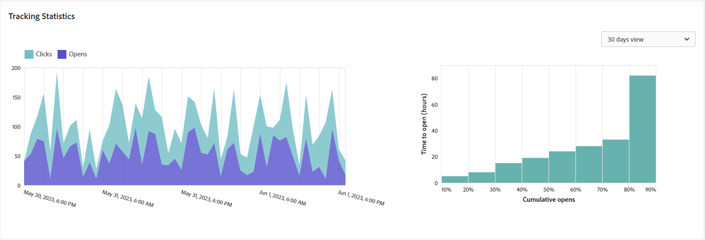{align="center"}

+++進一步瞭解電子郵件傳送報告量度。

* **[!UICONTROL 點按次數]**：傳遞中連結的點按總數。

* **[!UICONTROL 開啟次數]**：此網域中至少開啟過一次訊息的不同目標收件者人數。

+++

## 開啟次數的劃分 {#breakdown-opens}

### 依裝置開啟的劃分 {#breakdown-opens-devices}

>[!CONTEXTUALHELP]
>id="acw_delivery_reporting_breakdown_device"
>title="依裝置劃分"
>abstract="此 **依裝置劃分** 報表會依裝置顯示期間開啟的劃分。 每個類別有兩個圖表。第一個圖表顯示在電腦和行動裝置上的開啟數統計資料。第二個顯示每種裝置型別的確切數目和百分比。"

此 **依裝置劃分** 報表會依裝置顯示期間開啟的劃分：個人電腦、Android裝置、Apple裝置或其他。

每個類別有兩個圖表。第一個圖表顯示在電腦和行動裝置上的開啟數統計資料。第二個顯示每種裝置型別的確切數目和百分比。

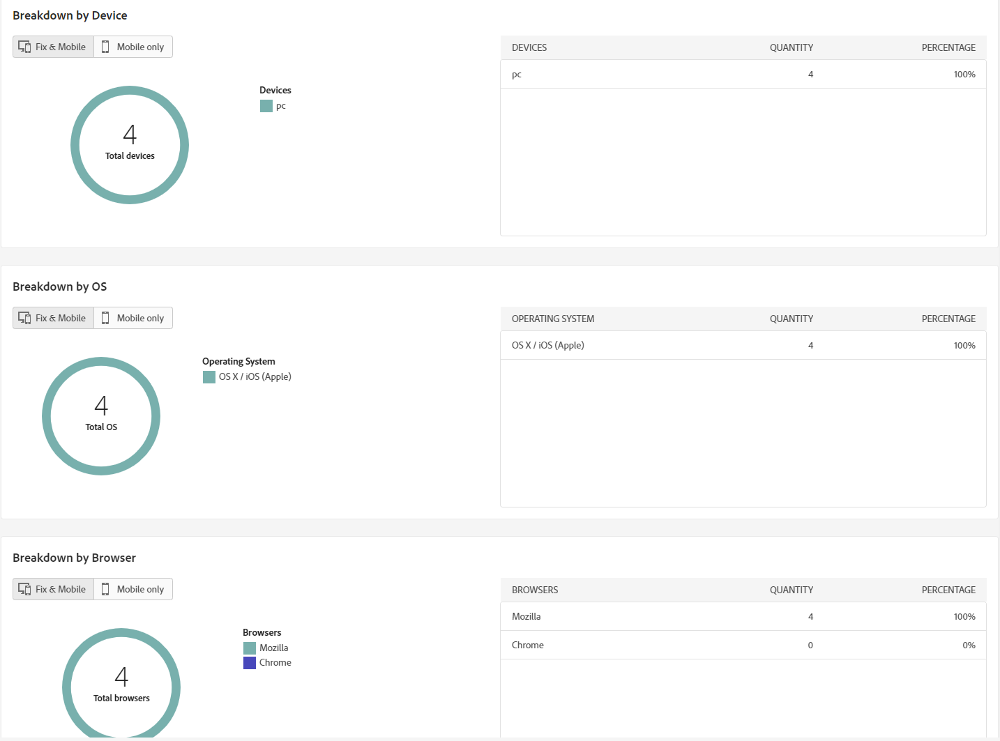{align="center"}

### 依作業系統開啟的劃分 {#breakdown-opens-os}

>[!CONTEXTUALHELP]
>id="acw_delivery_reporting_breakdown_os"
>title="依作業系統劃分"
>abstract="此 **依作業系統劃分** 報表會依作業系統顯示相關期間開啟的劃分。 第一個圖表顯示在電腦和行動裝置上的開啟數統計資料。第二個顯示每個作業系統的確切數目和百分比。"

此 **依作業系統劃分** 報表會顯示該期間依作業系統開啟的劃分：Windows系統、Android系統、iOS系統或其他。

每個類別有兩個圖表。第一個會顯示有關電腦和行動作業系統開啟的統計資料。 第二個顯示每個作業系統的確切數目和百分比。

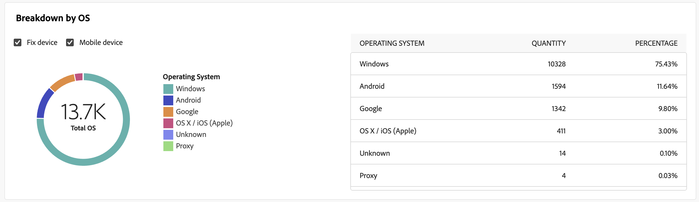{align="center"}

### 依瀏覽器開啟的劃分 {#breakdown-opens-browser}

>[!CONTEXTUALHELP]
>id="acw_delivery_reporting_breakdown_browser"
>title="依瀏覽器劃分"
>abstract="此 **依瀏覽器劃分** 顯示期間瀏覽器開啟的劃分。 第一個圖表顯示在電腦和行動裝置上的開啟數統計資料。第二個顯示每個瀏覽器的確切數目和百分比。"

此 **依瀏覽器劃分** 報表會顯示瀏覽器開啟的劃分： Chrome、Safari、Internet Explorer等。

每個類別有兩個圖表。第一個會顯示有關電腦和行動作業系統開啟的統計資料。 第二個顯示每個瀏覽器的確切數目和百分比。

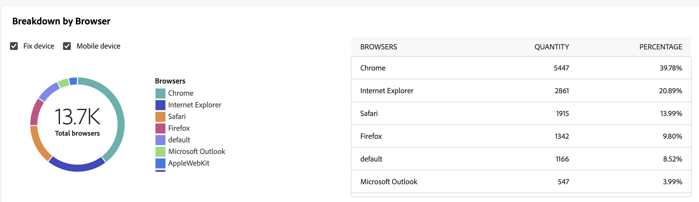{align="center"}

## 熱門點按 {#hotclicks}

>[!CONTEXTUALHELP]
>id="acw_delivery_reporting_hotclicks"
>title="熱點點按報告"
>abstract="**熱門點按**&#x200B;報告顯示電子郵件內容 (HTML 和/或文字) 以及每個連結的連結點按百分比。個人化區塊取消訂閱連結、鏡像頁面連結和優惠連結有計入總累計點按數，但不顯示在報告中。"

此報告顯示訊息內容 (HTML 和/或文字) 以及每個連結的連結點按百分比。個人化區塊取消訂閱連結、鏡像頁面連結和優惠連結有計入總累計點按數，但不顯示在報告中。

