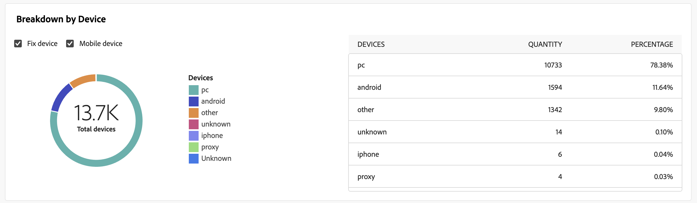

# 電子郵件傳遞報告 {#email-report}

此 **電子郵件傳遞報告** 提供電子郵件管道的完整見解和特定資料。 它提供有關您個別傳送的效能、成效和結果的詳細資訊，為您提供全面的總覽。

## 傳遞摘要 {#delivery-summary-email}

* **[!UICONTROL 初始目標對象統計資料]** 表格會顯示與收件者相關的資料：

  {align="left" zoomable="yes"}

  +++進一步瞭解電子郵件傳遞報告量度。

   * **[!UICONTROL 初始對象]**：目標收件者總數。

   * **[!UICONTROL 要傳遞]**：傳遞分析後要傳遞的訊息總數。

   * **[!UICONTROL 排除]**：從傳送的目標排除的訊息總數。
+++

* **[!UICONTROL 傳遞統計資料]** 表格詳細說明您的傳送是否成功。

  {align="left"}

  +++進一步瞭解電子郵件行銷活動報告量度。

   * **[!UICONTROL 已傳送訊息]**：傳遞分析後要傳遞的訊息總數。

   * **[!UICONTROL 成功]**：成功處理的訊息數與要傳送的訊息數相關。

   * **[!UICONTROL 錯誤]**：與要傳送的訊息數量相關的傳送和自動復原處理期間累計的錯誤總數。

   * **[!UICONTROL 新隔離]**：與要傳送的訊息數量相關的傳送失敗（使用者未知、無效的網域）後隔離的地址總數。

+++

* **[!UICONTROL 排除的原因]** 圖表和表格會依分析期間拒絕的訊息規則來顯示劃分。

  {align="center"}

  +++進一步瞭解電子郵件傳遞報告量度。

   * **[!UICONTROL 使用者不明]**：傳送期間產生的錯誤型別，表示電子郵件地址無效。

   * **[!UICONTROL 無效的網域]**：傳送傳遞時產生的錯誤型別，指出電子郵件地址的網域錯誤或不存在。

   * **[!UICONTROL 郵箱已滿]**：在嘗試傳送五次後產生的錯誤型別，以指出收件者的收件匣包含太多郵件。

   * **[!UICONTROL 帳戶已停用]**：傳送傳遞時產生的錯誤型別，用以指出地址已不存在。

   * **[!UICONTROL 已拒絕]**：當IAP （網際網路存取提供者）拒絕位址時產生的錯誤型別，例如在套用安全性規則（反垃圾郵件軟體）之後。

   * **[!UICONTROL 無法聯絡]**：訊息發佈字串中發生的錯誤型別：SMTP轉送上的事件、暫時無法連線網域等

   * **[!UICONTROL 未連線]**：錯誤型別，表示收件者的行動電話在傳送時已關閉或已中斷與網路的連線。

+++

## 傳遞總處理能力 {#delivery-throughtput}

此報表提供指定時間範圍內整個平台傳遞輸送量的詳細資訊。 用來測量訊息傳送速度的主要量度是每小時傳送的訊息數。

## 廣播統計資料 {#broadcast-statistics}

* **[!UICONTROL 廣播統計資料]** 表格包含每個網域可能遇到的錯誤的可用資料。

  {align="center"}

  +++進一步瞭解電子郵件傳遞報告量度。

   * **[!UICONTROL 已處理的電子郵件]**：傳遞伺服器處理的訊息總數。

   * **[!UICONTROL 已傳遞]**：成功處理的訊息數與已處理的訊息總數相比的百分比。

   * **[!UICONTROL 硬跳出]**：與已處理訊息總數相比的「硬」退信、永久錯誤（例如電子郵件地址錯誤）數量百分比。

   * **[!UICONTROL 軟退信]**：相對於已處理訊息總數的「軟」退信、暫時性錯誤（例如完整收件匣）數百分比

   * **[!UICONTROL 開啟次數]**：至少開啟過一次訊息的目標收件者人數，與成功處理的訊息數目相比的百分比。

   * **[!UICONTROL 點按次數]**：與成功處理的訊息數相比，已至少點按一次傳遞的人數百分比。

   * **[!UICONTROL 取消訂閱]**：取消訂閱連結的點選次數與成功處理的訊息數相比的百分比。
+++

## 傳遞失敗和退回次數 {#non-deliverables-email}

* **[!UICONTROL 每種型別的錯誤劃分]** 和 **[!UICONTROL 每個網域的錯誤劃分]** 表格和圖形包含每個網域可能遇到的錯誤的可用資料。

  此報告中顯示的錯誤會觸發隔離程式。 如需隔離管理的詳細資訊，請參閱 [Campaign v8 （主控台）檔案](https://experienceleague.adobe.com/docs/campaign/campaign-v8/campaigns/send/failures/delivery-failures.html){target="_blank"}.

  

  +++進一步瞭解電子郵件傳遞報告量度。

   * **[!UICONTROL 使用者不明]**：傳送期間產生的錯誤型別，表示電子郵件地址無效。

   * **[!UICONTROL 無效的網域]**：傳送傳遞時產生的錯誤型別，指出電子郵件地址的網域錯誤或不存在。

   * **[!UICONTROL 郵箱已滿]**：在嘗試傳送五次後產生的錯誤型別，以指出收件者的收件匣包含太多郵件。

   * **[!UICONTROL 帳戶已停用]**：傳送傳遞時產生的錯誤型別，用以指出地址已不存在。

   * **[!UICONTROL 已拒絕]**：當IAP （網際網路存取提供者）拒絕位址時產生的錯誤型別，例如在套用安全性規則（反垃圾郵件軟體）之後。

   * **[!UICONTROL 無法聯絡]**：訊息發佈字串中發生的錯誤型別：SMTP轉送上的事件、暫時無法連線網域等

   * **[!UICONTROL 未連線]**：錯誤型別，表示收件者的行動電話在傳送時已關閉或已中斷與網路的連線。

+++

## 追蹤指標 {#tracking-indicators-email}

* **[!UICONTROL 傳遞統計資料]** 提供關鍵績效指標(KPI)，用於提供關於已傳送電子郵件可用資料的詳細資訊。

  {align="center"}

  +++進一步瞭解電子郵件傳遞報告量度。

   * **[!UICONTROL 成功]**：成功處理的訊息數與要傳送的訊息數相關。

   * **[!UICONTROL 不同開啟次數]**：至少開啟過一次訊息的目標收件者總數。

   * **[!UICONTROL 開啟次數]**：此網域中至少開啟過一次訊息的不同目標收件者人數。

   * **[!UICONTROL 選擇退出連結的點選次數]**：對取消訂閱連結的點按次數。

   * **[!UICONTROL 按一下映象連結]**：對映象頁面連結的點按次數。

   * **[!UICONTROL 轉送次數估計]**：目標收件者轉寄的電子郵件預估數量。
+++

* **[!UICONTROL 開啟和點進率]** 表格會顯示與收件者相關的資料。

  {align="center"}

  +++進一步瞭解電子郵件傳遞報告量度。

   * **[!UICONTROL 已傳送]**：已傳送的訊息總數。

   * **[!UICONTROL 申訴]**：此網域被回報為收件者不想要的訊息數。

   * **[!UICONTROL 開啟次數]**：此網域中至少開啟過一次訊息的不同目標收件者人數。

   * **[!UICONTROL 點按次數]**：至少點按一次相同傳遞的不同目標收件者人數。

   * **[!UICONTROL 原始反應性]**：與開啟傳遞至少一次的收件者人數相比，已至少點按一次傳遞的收件者人數的百分比。
+++

## URL 和點擊流量 {#url-email}

* **[!UICONTROL URL和點按資料流]** 提供關鍵績效指標(KPI)，可針對傳送期間點選次數最多的URL提供詳細資訊。

  {align="center"}

  +++進一步瞭解電子郵件傳遞報告量度。

   * **[!UICONTROL 反應性]**：已點按傳送的目標收件者人數與已開啟傳送的目標收件者估計人數的比率。

   * **[!UICONTROL 不同點按次數]**：在傳遞中至少點選一次的不同收件者總數。

   * **[!UICONTROL 點按次數]**：傳遞中連結的點按總數。

   * **[!UICONTROL 平台平均值]** ：此平均比率顯示在每個比率（反應性、不同點按和累計點按）下，是針對過去六個月傳送的傳送進行計算。 系統只會考慮具有相同型別及相同管道的傳送。 校訂已排除。

+++

* **[!UICONTROL 前10個最常造訪的連結]** 圖表和表格包含每個連結的收件者行為可用資料。

  {align="center"}

  +++進一步瞭解電子郵件傳遞報告量度。

   * **[!UICONTROL 點按次數]**：傳遞中連結的點按總數。

   * **[!UICONTROL 百分比]**：與傳送互動的使用者百分比。

+++

* **[!UICONTROL 一段時間內點選的劃分]** 圖表包含每個連結的收件者行為可用資料。

  {align="center"}

## 使用者活動 {#user-activities-email}

* **[!UICONTROL 使用者活動]** 以圖表的形式顯示開啟和點按的劃分。 您可以選擇要將資料設為目標的時間段：前一天、一小時或30分鐘。

  {align="center"}

  +++進一步瞭解電子郵件傳遞報告量度。

   * **[!UICONTROL 點按次數]**：傳遞中連結的點按總數。

   * **[!UICONTROL 開啟次數]**：此網域中至少開啟過一次訊息的不同目標收件者人數。

+++

## 追蹤統計資料 {#tracking-statistics}

* **[!UICONTROL 追蹤統計資料]** graph提供開啟和點按的統計資料。 您可以選擇選取目標定位資料的特定時間範圍。

  {align="center"}

  +++進一步瞭解電子郵件傳遞報告量度。

   * **[!UICONTROL 點按次數]**：傳遞中連結的點按總數。

   * **[!UICONTROL 開啟次數]**：此網域中至少開啟過一次訊息的不同目標收件者人數。

+++

## 開啟次數的劃分 {#breakdown-opens}

此報表顯示相關期間內依作業系統、裝置和瀏覽器劃分的開啟次數。 每個類別有兩個圖表。第一個圖表顯示在電腦和行動裝置上的開啟數統計資料。第二個圖表僅顯示在行動裝置上的開啟數統計資料。您可以靈活地從 **[!UICONTROL 修正和行動]** 至專屬目標 **[!UICONTROL 僅限行動裝置]** 以取得更精確的目標定位。

{align="center"}

## 熱門點按 {#hotclicks}

此報告顯示訊息內容 (HTML 和/或文字) 以及每個連結的連結點按百分比。個人化區塊取消訂閱連結、鏡像頁面連結和優惠連結有計入總累計點按數，但不顯示在報告中。

