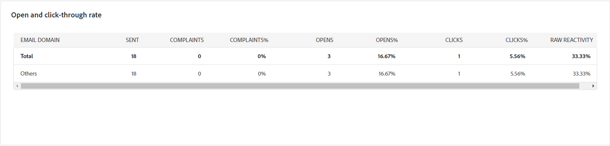

# 以電子郵件寄送傳遞報告  {#email-report}

**電子郵件傳遞報告**&#x200B;提供電子郵件通道特定的全面深入分析和資料。 其中會提供有關您的個別傳遞的效能、效益和成果的詳細資訊，為您提供全方位的概觀。

## 傳遞摘要 {#delivery-summary-email}

>[!CONTEXTUALHELP]
>id="acw_delivery_reporting_sending_email"
>title="報告傳送"
>abstract="報告中的「**傳送**」標籤可讓您深入了解訪客與您傳遞的互動，以及他們可能遇到的任何潛在錯誤。"

### 初始目標群體 {#email-delivery-targeted-population}

>[!CONTEXTUALHELP]
>id="acw_delivery_reporting_initial_target"
>title="初始目標群體"
>abstract="**初始目標群體**&#x200B;圖表根據傳遞準備的結果顯示與收件者和訊息相關的資料。"

**[!UICONTROL 初始目標母體]**&#x200B;圖表顯示與收件者相關的資料。 量度會在傳遞準備期間計算並顯示：初始對象、要傳送的訊息數、排除的收件者數。

{zoomable="yes"}

將滑鼠移至圖表的一部分上以顯示確切的數字。

{zoomable="yes"}

+++進一步瞭解電子郵件傳送報告量度。

* **[!UICONTROL 初始對象]**：目標收件者的總數。

* **[!UICONTROL 要傳遞]**：傳遞準備後要傳遞的訊息總數。

* **[!UICONTROL 排除]**：從目標母體排除的收件者總數。
+++

### 傳遞統計資料 {#email-delivery-stats}

>[!CONTEXTUALHELP]
>id="acw_delivery_reporting_delivery_statistics_summary"
>title="傳遞統計資料"
>abstract="**傳遞統計資料**&#x200B;圖表詳細說明傳遞成功以及發生的錯誤。"

**[!UICONTROL 傳遞統計資料]**&#x200B;圖表詳細說明您的傳遞是否成功。 量度詳情如下。

{zoomable="yes"}

+++進一步瞭解電子郵件促銷活動報告量度。

* **[!UICONTROL 已傳送的郵件]**：準備傳遞後要傳遞的郵件總數。

* **[!UICONTROL 成功]**：已順利處理的訊息數與要傳遞的訊息數有關。

* **[!UICONTROL 錯誤]**：傳遞期間累積的錯誤總數，以及相對於要傳遞的訊息數的自動復原處理次數。

* **[!UICONTROL 新隔離]**：在傳送失敗（使用者不明、網域無效）之後被隔離的地址總數，與要傳送的訊息數目相關。

+++

### 排除的原因  {#email-delivery-exclusions}

>[!CONTEXTUALHELP]
>id="acw_delivery_reporting_exclusion"
>title="傳遞排除原因"
>abstract="**排除的原因**&#x200B;圖表和資料表顯示傳遞準備期間遭拒訊息每個規則的劃分。"

**[!UICONTROL 排除原因]**&#x200B;圖形與表格會顯示傳遞準備期間拒絕之訊息的每條規則劃分。 排除規則在[Campaign v8 （主控台）檔案](https://experienceleague.adobe.com/docs/campaign/campaign-v8/send/failures/delivery-failures.html?lang=zh-Hant#email-error-types){_blank}中有詳細說明。

{zoomable="yes"}{align="center" zoomable="yes"}

+++進一步瞭解電子郵件傳送報告量度。

* **[!UICONTROL 使用者不明]**：傳送期間產生錯誤型別，指出電子郵件地址無效。

* **[!UICONTROL 無效的網域]**：傳送傳遞時產生錯誤型別，指出電子郵件地址的網域錯誤或不存在。

* **[!UICONTROL 信箱已滿]**：在五次傳遞嘗試後產生的錯誤型別，表示收件者的收件匣包含太多郵件。

* **[!UICONTROL 帳戶已停用]**：傳送傳遞時產生錯誤型別，表示地址已不存在。

* **[!UICONTROL 已拒絕]**：當IAP （網際網路存取提供者）拒絕位址時產生的錯誤型別，例如在套用安全性規則（反垃圾郵件軟體）之後。

* **[!UICONTROL 無法連線]**：訊息發佈字串中發生的錯誤型別：SMTP轉送上的事件、暫時無法連線網域等

* **[!UICONTROL 未連線]**：錯誤型別表示收件者的行動電話在傳送時已關閉或與網路中斷連線。

+++

## 傳遞總處理能力 {#delivery-throughtput}

>[!CONTEXTUALHELP]
>id="acw_delivery_reporting_throughput_email"
>title="傳遞總處理能力"
>abstract="**傳遞輸送量**&#x200B;報告提供有關特定期間內整個平台傳遞輸送量的詳細資訊。"

此報表提供指定時間範圍內整個平台傳遞輸送量的詳細資訊。 用於測量訊息傳遞速度的主要量度是每小時傳送的訊息數。

{zoomable="yes"}{align="center" zoomable="yes"}

## 廣播統計資料 {#broadcast-statistics}

>[!CONTEXTUALHELP]
>id="acw_delivery_reporting_broadcast_statistics"
>title="廣播統計資料"
>abstract="**廣播統計資料**&#x200B;報告包含每個網域可能發生之錯誤的可用資料。"

**[!UICONTROL 廣播統計資料]**&#x200B;表格包含每個網域可能發生的錯誤的可用資料。 量度詳情如下。

{zoomable="yes"}{align="center" zoomable="yes"}

+++進一步瞭解電子郵件傳送報告量度。

* **[!UICONTROL 已處理的電子郵件]**：傳遞伺服器已處理的郵件總數。

* **[!UICONTROL 已傳遞]**：已順利處理的訊息數目與已處理的訊息總數之間的百分比。

* **[!UICONTROL 硬退信]**： 「硬」退信、永久錯誤（例如錯誤的電子郵件地址）數量與已處理郵件總數之間的百分比。

* **[!UICONTROL 軟退件]**：「軟退件」、暫時性錯誤（例如完整收件匣）與已處理郵件總數之間的百分比

* **[!UICONTROL 開啟次數]**：與成功處理的郵件數目相比，至少開啟過一次郵件的目標收件者數目百分比。

* **[!UICONTROL 點按次數]**：與成功處理的訊息數相比，至少點按一次傳遞的人員數百分比。

* **[!UICONTROL 取消訂閱]**：取消訂閱連結的點按次數與成功處理的訊息數之間的百分比。
+++

## 無法傳遞的項目 {#non-deliverables-email}

### 依類型的錯誤劃分 {#email-delivery-breakdown-type}

>[!CONTEXTUALHELP]
>id="acw_delivery_reporting_error_type"
>title="依類型的錯誤劃分"
>abstract="**依類型的錯誤劃分**&#x200B;圖表包含發生的每個錯誤類型的可用資料：使用者未知、郵箱已滿、網域無效等。"

>[!CONTEXTUALHELP]
>id="acw_delivery_reporting_error_type_table"
>title="依類型的錯誤劃分"
>abstract=" **依類型的錯誤劃分**&#x200B;表格提供每種錯誤類型發生次數的全面劃分。"

每個型別&#x200B;**資料表和圖表的**&#x200B;錯誤劃分包含錯誤型別的可用資料。 量度詳情如下。

此報告中顯示的錯誤會觸發隔離程式。 如需隔離管理的詳細資訊，請參閱[Campaign v8 （使用者端主控台）檔案](https://experienceleague.adobe.com/docs/campaign/campaign-v8/campaigns/send/failures/delivery-failures.html?lang=zh-Hant){target="_blank"}。

{zoomable="yes"}{align="left" zoomable="yes"}

+++進一步瞭解電子郵件傳送報告量度。

* **[!UICONTROL 使用者不明]**：傳送期間產生錯誤型別，指出電子郵件地址無效。

* **[!UICONTROL 無效的網域]**：傳送傳遞時產生錯誤型別，指出電子郵件地址的網域錯誤或不存在。

* **[!UICONTROL 信箱已滿]**：在五次傳遞嘗試後產生的錯誤型別，表示收件者的收件匣包含太多郵件。

* **[!UICONTROL 帳戶已停用]**：傳送傳遞時產生錯誤型別，表示地址已不存在。

* **[!UICONTROL 已拒絕]**：當IAP （網際網路存取提供者）拒絕位址時產生的錯誤型別，例如在套用安全性規則（反垃圾郵件軟體）之後。

* **[!UICONTROL 無法連線]**：訊息發佈字串中發生的錯誤型別：SMTP轉送上的事件、暫時無法連線網域等

* **[!UICONTROL 未連線]**：錯誤型別表示收件者的行動電話在傳送時已關閉或與網路中斷連線。

+++

### 依網域的錯誤劃分 {#email-delivery-breakdown-domain}

>[!CONTEXTUALHELP]
>id="acw_delivery_reporting_error_domain"
>title="依網域的錯誤劃分"
>abstract="**依網域的錯誤劃分**&#x200B;圖表顯示根據每個網域發生的每個錯誤類型的可用資料。"

>[!CONTEXTUALHELP]
>id="acw_delivery_reporting_error_domain_table"
>title="依網域的錯誤劃分"
>abstract=" **依網域的錯誤劃分** 表格根據所使用網域提供每種錯誤發生次數的全面劃分。"

每個網域&#x200B;**表格和圖形的**&#x200B;錯誤劃分會顯示每個網域可能遇到的錯誤的可用資料。

{zoomable="yes"}{align="left" zoomable="yes"}

按一下每個網域名稱旁邊的圖示以檢視詳細資訊。

{zoomable="yes"}{align="left" zoomable="yes"}

可用的量度與上述[依型別](#email-delivery-breakdown-type)劃分的錯誤相同。

## 追蹤指標 {#tracking-indicators-email}

>[!CONTEXTUALHELP]
>id="acw_delivery_reporting_tracking_email"
>title="報告追蹤"
>abstract="報告中的「**追蹤**」標籤可提供有價值的資料，包括每個連結的收件者行為、打開和點擊的詳細資料，以及傳遞過程中最常點擊的 URL 詳細資訊。"

### 傳遞統計資料  {#email-tracking-delivery-stats}

>[!CONTEXTUALHELP]
>id="acw_delivery_reporting_delivery_statistics_indicators"
>title=" 傳遞統計資料"
>abstract="**傳遞統計資料**&#x200B;報告提供可詳細說明已傳送電子郵件可用資料的關鍵績效指標 (KPI)：成功、開啟數、點按數等。"

**[!UICONTROL 傳遞統計資料]**&#x200B;報告提供關鍵績效指標(KPI)，可提供已傳送電子郵件之可用資料的詳細資訊。 量度詳情如下。

{zoomable="yes"}{align="center"}

+++進一步瞭解電子郵件傳送報告量度。

* **[!UICONTROL 成功]**：已順利處理的訊息數與要傳遞的訊息數有關。

* **[!UICONTROL 不同開啟次數]**：至少開啟過一次訊息的目標收件者總數。

* **[!UICONTROL 開啟]**：此網域已開啟郵件至少一次的不同目標收件者數目。

* **[!UICONTROL 點選退出連結]**：點選取消訂閱連結的次數。

* **[!UICONTROL 點選映象連結的次數]**：點選映象頁面連結的次數。

* **[!UICONTROL 轉送次數估計]**：目標收件者轉送的電子郵件數量估計。
+++

### 開啟及點按率 {#email-tracking-click-through}

>[!CONTEXTUALHELP]
>id="acw_delivery_reporting_open_clickthrough"
>title="開啟及點進率"
>abstract="**開啟及點進率**&#x200B;表格顯示與您的傳遞相關的收件者參與度的資料。"

**[!UICONTROL 開啟及點進率]**&#x200B;表格會顯示與收件者相關的資料。 量度詳情如下。

{zoomable="yes"}{align="center"}

+++進一步瞭解電子郵件傳送報告量度。

* **[!UICONTROL 已傳送]**：已傳送的訊息總數。

* **[!UICONTROL 投訴]**：此網域被收件者回報為不想要的訊息數。

* **[!UICONTROL 開啟]**：此網域已開啟郵件至少一次的不同目標收件者數目。

* **[!UICONTROL 點按次數]**：至少點按一次相同傳遞的不同目標收件者數目。

* **[!UICONTROL 原始反應性]**：與開啟傳遞至少一次的收件者人數相比，至少點選一次傳遞的收件者人數的百分比。
+++

## URL 和點擊流量 {#url-email}

>[!CONTEXTUALHELP]
>id="acw_delivery_reporting_urls_clickstreams"
>title="URL 和點擊流量"
>abstract="**URL 和點按資料流**&#x200B;報告提供可詳細說明傳遞期間點按次數最多的 URL 的關鍵績效指標 (KPI)。"

**[!UICONTROL URL 和點按資料流]**&#x200B;報告提供可詳細說明傳遞期間點按次數最多的 URL 的關鍵績效指標 (KPI)。

{zoomable="yes"}{align="center"}

+++進一步瞭解電子郵件傳送報告量度。

* **[!UICONTROL 反應性]**：已點按傳遞的目標收件者數目與已開啟傳遞的目標收件者預估數目之間的比率。

* **[!UICONTROL 不同點按次數]**：在傳遞中至少點選一次的不同收件者總數。

* **[!UICONTROL 點按]**：傳遞中連結的點按總數。

* **[!UICONTROL 平台平均值]**：此平均比率顯示在每個比率（反應性、不同點按和累計點按）下，是針對過去六個月傳送的傳遞進行計算。 系統只會考慮具有相同型別和相同通道的傳送。 校訂已排除。

+++

### 造訪量最高的前 10 個連結 {#email-tracking-top10}

>[!CONTEXTUALHELP]
>id="acw_delivery_reporting_urls_clickstreams_top10"
>title="造訪量最高的前 10 個連結"
>abstract="**造訪量最高的前 10 個連結**&#x200B;圖表和資料表包含每個連結收件者行為的可用資料。"

**[!UICONTROL 造訪量最高的前 10 個連結]**&#x200B;圖表和資料表包含每個連結收件者行為的可用資料。

{zoomable="yes"}{align="center"}

+++進一步瞭解電子郵件傳送報告量度。

* **[!UICONTROL 點按]**：傳遞中連結的點按總數。

* **[!UICONTROL Percentage]**：與傳遞互動的使用者百分比。

+++

### 特定期間的點按劃分 {#email-tracking-breakdown-over-time}

>[!CONTEXTUALHELP]
>id="acw_delivery_reporting_urls_click_breakdown"
>title="特定期間的點按劃分"
>abstract="**特定期間的點按劃分**&#x200B;圖表顯示每個連結收件者行為的可用資料。"

**[!UICONTROL 隨著時間點選的劃分]**&#x200B;圖表包含每個連結的收件者行為可用資料。

{zoomable="yes"}{align="center"}

## 使用者活動 {#user-activities-email}

>[!CONTEXTUALHELP]
>id="acw_delivery_reporting_user_activities"
>title="使用者活動"
>abstract="**使用者活動**&#x200B;圖以圖表的形式顯示開啟和點按數的劃分。您可以選擇目標資料的時段：最近一天、最近一小時或最近 30 分鐘。"

**[!UICONTROL 使用者活動]**&#x200B;報告會以圖表形式顯示開啟和點按的劃分。 您可以選擇目標資料的時段：最近一天、最近一小時或最近 30 分鐘。

{zoomable="yes"}{align="center"}

+++進一步瞭解電子郵件傳送報告量度。

* **[!UICONTROL 點按]**：傳遞中連結的點按總數。

* **[!UICONTROL 開啟]**：此網域已開啟郵件至少一次的不同目標收件者數目。

+++

## 追蹤統計資料 {#tracking-statistics}

>[!CONTEXTUALHELP]
>id="acw_delivery_reporting_statistics"
>title="追蹤統計資料"
>abstract="**追蹤統計資料**&#x200B;圖表提供開啟和點按數的統計資料。您可以選擇特定時間段來目標市場選擇資料。"

**[!UICONTROL 追蹤統計資料]**&#x200B;圖表提供開啟和點按數的統計資料。您可以選擇特定時間段來目標市場選擇資料。

{zoomable="yes"}{align="center"}

+++進一步瞭解電子郵件傳送報告量度。

* **[!UICONTROL 點按]**：傳遞中連結的點按總數。

* **[!UICONTROL 開啟]**：此網域已開啟郵件至少一次的不同目標收件者數目。

+++

## 開啟次數的劃分 {#breakdown-opens}

### 依裝置開啟的劃分 {#breakdown-opens-devices}

>[!CONTEXTUALHELP]
>id="acw_delivery_reporting_breakdown_device"
>title="依裝置劃分"
>abstract="**依裝置劃分**&#x200B;報告顯示期間內依裝置的開啟數劃分。每個類別有兩個圖表。第一個圖表顯示在電腦和行動裝置上的開啟數統計資料。第二個圖表顯示每個裝置類型的確切數量和百分比。"

**依裝置劃分**&#x200B;報表會顯示該期間依裝置開啟的劃分：個人電腦、Android裝置、Apple裝置或其他。

每個類別有兩個圖表。第一個圖表顯示在電腦和行動裝置上的開啟數統計資料。第二個圖表顯示每個裝置類型的確切數量和百分比。

{zoomable="yes"}{align="center"}

### 依作業系統開啟的劃分 {#breakdown-opens-os}

>[!CONTEXTUALHELP]
>id="acw_delivery_reporting_breakdown_os"
>title="依作業系統劃分"
>abstract="**依作業系統劃分**&#x200B;報告顯示相關期間內依作業系統的開啟數劃分。第一個圖表顯示在電腦和行動裝置上的開啟數統計資料。第二個圖表顯示每個作業系統的確切數量和百分比。"

「**依作業系統劃分**」報表會顯示該期間依作業系統劃分的開啟次數：Windows系統、Android系統、iOS系統或其他。

每個類別有兩個圖表。第一個會顯示有關電腦和行動作業系統開啟的統計資料。 第二個顯示每個作業系統的確切數目和百分比。

{zoomable="yes"}{align="center"}

### 依瀏覽器開啟的劃分 {#breakdown-opens-browser}

>[!CONTEXTUALHELP]
>id="acw_delivery_reporting_breakdown_browser"
>title="依瀏覽器劃分"
>abstract="**依瀏覽器劃分**&#x200B;顯示期間內依瀏覽器的開啟數劃分。第一個圖表顯示在電腦和行動裝置上的開啟數統計資料。第二個圖表顯示每個瀏覽器的確切數量和百分比。"

**依瀏覽器劃分**&#x200B;報表會顯示依瀏覽器開啟的劃分： Chrome、Safari、Internet Explorer等。

每個類別有兩個圖表。第一個會顯示有關電腦和行動作業系統開啟的統計資料。 第二個圖表顯示每個瀏覽器的確切數量和百分比。

{zoomable="yes"}{align="center"}

## 熱門點按 {#hotclicks}

>[!CONTEXTUALHELP]
>id="acw_delivery_reporting_hotclicks"
>title="熱門點按報告"
>abstract="**熱門點按**&#x200B;報告顯示電子郵件內容 (HTML 和/或文字) 以及每個連結的連結點按百分比。個人化區塊取消訂閱連結、鏡像頁面連結和產品建議連結有計入總累計點按數，但不顯示在報告中。"

此報告顯示訊息內容 (HTML 和/或文字) 以及每個連結的連結點按百分比。個人化區塊取消訂閱連結、鏡像頁面連結和產品建議連結有計入總累計點按數，但不顯示在報告中。

{zoomable="yes"}