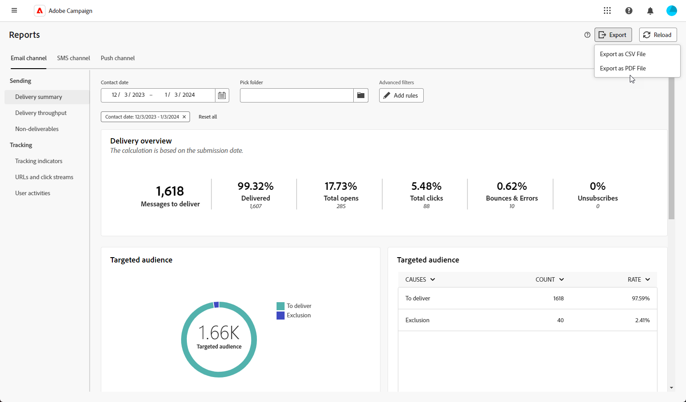

# 匯出您的報告 {#export-reports}

>[!CONTEXTUALHELP]
>id="acw_reporting_email_exportation"
>title="匯出您的報告"
>abstract="按一下「**匯出**」按鈕將這些量度匯出為 PDF 或 CSV 格式，讓您可以分享或列印。"

您可以將報表匯出為PDF或CSV格式，讓您可共用、操作或列印報表。

1. 在報表中按一下&#x200B;**[!UICONTROL 匯出]**，然後選取&#x200B;**[!UICONTROL 匯出為PDF檔案]**&#x200B;或&#x200B;**[!UICONTROL 匯出為CSV檔案]**。

   {zoomable="yes"}

1. 找到您要儲存檔案的資料夾，視需要重新命名，然後按一下[儲存]。****

您的報表現在可以在PDF或CSV檔案中檢視或共用。