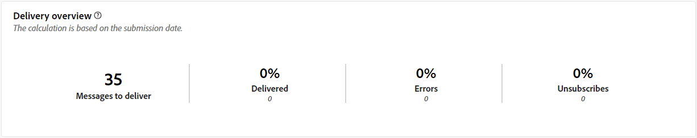
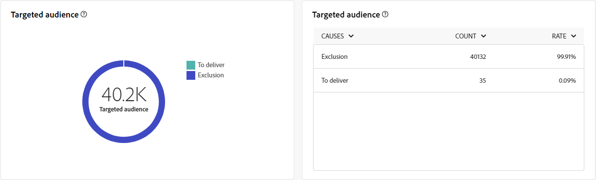
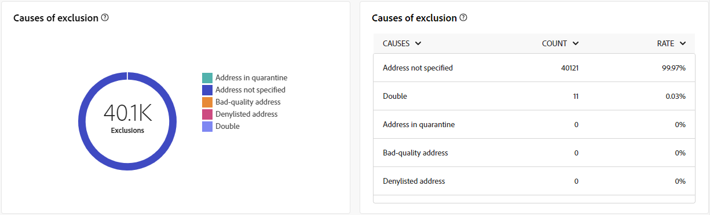

# 直接郵件通道的全域報告 {#global-report-direct}

直接郵件全域報表為使用者提供管道層級的流量和參與量度的完整總覽。

瀏覽至&#x200B;**[!UICONTROL 報表]**&#x200B;區段內的&#x200B;**[!UICONTROL 報表]**&#x200B;功能表。 您可以根據報表日期、資料夾或規則來篩選資料。 [了解更多](global-reports.md)

## 傳遞摘要 {#delivery-summary-direct}

### 傳遞概觀 {#delivery-overview-direct}

>[!CONTEXTUALHELP]
>id="acw_global_reporting_delivery_overview_direct_mail"
>title="傳遞概觀"
>abstract="**傳遞概觀**&#x200B;提供了關鍵績效指標 (KPI)，可讓您深入了解訪客與每次直接郵件傳遞的互動情況。這些量度概述如下。"

**[!UICONTROL 傳遞概觀]**&#x200B;提供了關鍵績效指標 (KPI)，可讓您深入了解訪客與每次直接郵件傳遞的互動情況。這些量度概述如下。

{zoomable="yes"}{align="center"}

+++進一步瞭解傳送概述量度。

* **[!UICONTROL 要傳遞的訊息]**：傳遞準備期間處理的訊息總數。

* **[!UICONTROL 已傳遞]**：與已傳送訊息總數相關的成功傳送訊息數。

* **[!UICONTROL 錯誤]**：傳遞期間累積的錯誤總數，以及相對於已傳送訊息總數，的自動傳回處理。

* **[!UICONTROL 取消訂閱]**：點選取消訂閱的收件者人數。
+++

### 目標對象 {#delivery-summary-direct-initial-target}

>[!CONTEXTUALHELP]
>id="acw_global_reporting_target_audience_direct_mail_graph"
>title="目標對象"
>abstract="收件者資料和訊息資訊顯示在&#x200B;**目標對象**&#x200B;圖表中，反映了傳遞準備分析。"

>[!CONTEXTUALHELP]
>id="acw_global_reporting_target_audience_direct_mail_table"
>title="目標對象"
>abstract="**目標對象**&#x200B;表格根據傳遞準備程序的結果提供了收件者和對應訊息的詳細劃分。"

**[!UICONTROL 目標對象]**&#x200B;的表格和圖表會展示與收件者相關的資料，其詳細量度如下。

{zoomable="yes"}{align="center"}

+++深入瞭解鎖定目標對象量度。

* **[!UICONTROL 目標對象]**：目標收件者總數。

* **[!UICONTROL 要傳遞的訊息]**：傳遞準備後要傳遞的訊息總數。

* **[!UICONTROL 排除]**：套用規則時，分析期間忽略的地址總數：地址遺失、隔離、封鎖清單等。

+++

### 傳遞統計資料 {#delivery-summary-direct-exec-stats}

>[!CONTEXTUALHELP]
>id="acw_global_reporting_delivery_statistics_summary_direct_mail_graph"
>title="傳遞統計資料"
>abstract="**傳遞統計資料**&#x200B;圖表可讓您深入了解直接郵件傳遞的有效性，包括成功傳遞和任何發生的錯誤。"

>[!CONTEXTUALHELP]
>id="acw_global_reporting_delivery_statistics_summary_direct_mail_table"
>title="傳遞統計資料"
>abstract="**傳遞統計資料**&#x200B;表格詳細說明直接郵件傳遞成功以及發生的錯誤。"

**[!UICONTROL 傳遞統計資料]**&#x200B;圖表和表格提供每個直接郵件傳遞成功的明細，明細量度概述如下。

+++進一步瞭解傳遞統計量度。

* **[!UICONTROL 要傳遞的訊息]**：傳遞準備後要傳遞的訊息總數。

* **[!UICONTROL 成功]**：已順利處理的訊息數與要傳遞的訊息數有關。

* **[!UICONTROL 錯誤/退信]**：傳遞期間累積的錯誤總數，以及相對於要傳遞的訊息數的自動復原處理次數。

* **[!UICONTROL 新隔離]**：在傳送失敗（使用者不明、網域無效）之後被隔離的地址總數，與要傳送的訊息數目相關。

+++

### 排除的原因 {#causes-exclusion}

>[!CONTEXTUALHELP]
>id="acw_global_reporting_exclusions_direct_mail_table"
>title="排除"
>abstract="**排除原因**&#x200B;表格依規則顯示傳遞準備過程中被拒絕之郵件的詳細劃分。"

>[!CONTEXTUALHELP]
>id="acw_global_reporting_causes_exclusion_direct_mail_graph"
>title="排除的原因"
>abstract="**排除原因**&#x200B;圖表顯示傳遞準備期間被拒絕之郵件的分佈，依每個規則進行分類。"

{zoomable="yes"}{align="center"}

排除專案圖表和表格說明了從目標設定檔排除的使用者設定檔無法接收訊息的原因。

+++深入瞭解排除量度發生的原因。

* **[!UICONTROL 隔離中的地址]**：將地址置於隔離中時產生錯誤型別。

* **[!UICONTROL 未指定地址]**：傳送傳遞時產生錯誤型別，指出地址不存在。

* **[!UICONTROL 品質不良的地址]**：當郵寄地址品質評等太低時產生的錯誤型別。

* **[!UICONTROL 已加入封鎖清單的地址]**：執行傳遞時，收件者已加入封鎖清單時產生錯誤型別。

* **[!UICONTROL Double]**：收件者因索引鍵值不唯一而被排除時產生的錯誤型別。

* **[!UICONTROL 控制組]**：收件者的地址是控制組的一部分。

* **[!UICONTROL 目標大小受限]**：已達收件者的傳遞大小上限。

+++
