# 電子郵件通道的全域報告 {#global-report-direct}

全域報表為使用者提供管道層級的流量和參與量度的完整總覽。

瀏覽至&#x200B;**[!UICONTROL 報表]**&#x200B;區段內的&#x200B;**[!UICONTROL 報表]**&#x200B;功能表。 您可以根據報表日期、資料夾或規則來篩選資料。 [了解更多](global-reports.md)

## 傳遞摘要 {#delivery-summary-email}

### 傳遞概觀 {#delivery-overview-email}

>[!CONTEXTUALHELP]
>id="acw_global_reporting_deliveries_overview_email"
>title="傳遞概觀"
>abstract=" **傳遞概觀**&#x200B;提供了關鍵績效指標 (KPI)，可深入了解您的對象如何與您傳送的電子郵件傳遞和行銷活動進行互動。"

**[!UICONTROL 傳遞總覽]**&#x200B;提供關鍵效能量度(KPI)，提供訪客與每個電子郵件傳遞互動的深入分析。 這些量度概述如下。

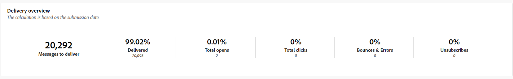{zoomable="yes"}{align="center"}

+++進一步瞭解傳送概述量度。

* **[!UICONTROL 要傳遞的訊息]**：傳遞準備期間處理的訊息總數。

* **[!UICONTROL 已傳遞]**：與已傳送訊息總數相關的成功傳送訊息數。

* **[!UICONTROL 總開啟次數]**：目標收件者開啟郵件至少一次的總數。

* **[!UICONTROL 點按總數]**：在傳遞中至少點按一次的收件者總數。

* **[!UICONTROL 退回與錯誤]**：傳遞期間累積的錯誤總數，以及相對於已傳送訊息的總數的自動傳回處理次數。

* **[!UICONTROL 取消訂閱]**：點選取消訂閱的收件者人數。
+++

### 目標對象 {#delivery-summary-email-initial-target}

>[!CONTEXTUALHELP]
>id="acw_global_reporting_target_audience_email"
>title="初始目標對象統計資料"
>abstract="**目標對象**&#x200B;表格和圖表提供了有關收件者參與的見解，幫助您評估行銷活動和傳遞的有效性。"

**[!UICONTROL 目標對象]**&#x200B;的表格和圖表會展示與收件者相關的資料，其詳細量度如下。

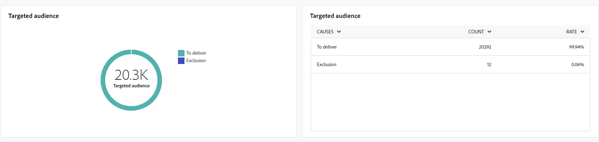{zoomable="yes"}{align="center"}

+++深入瞭解鎖定目標對象量度。

* **[!UICONTROL 目標對象]**：目標收件者總數。

* **[!UICONTROL 要傳遞的訊息]**：傳遞準備後要傳遞的訊息總數。

* **[!UICONTROL 排除]**：套用規則時，分析期間忽略的地址總數：地址遺失、隔離、封鎖清單等。

+++

### 傳遞統計資料 {#delivery-summary-email-delivery-stats}

>[!CONTEXTUALHELP]
>id="acw_global_reporting_email_delivery_stats"
>title="傳遞統計資料"
>abstract=" **傳遞統計資料**&#x200B;圖表和表格概述了關鍵量度，包括成功傳遞、錯誤和新隔離，提供了評估傳遞效能的簡明概觀。"

**[!UICONTROL 傳遞統計資料]**&#x200B;表格提供每個電子郵件傳遞成功的明細，包含下列詳細量度。

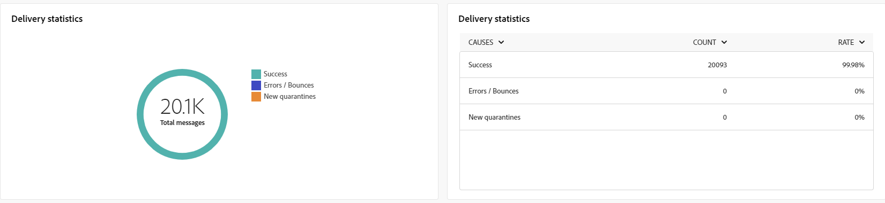{zoomable="yes"}{align="center"}

+++進一步瞭解傳遞統計量度。

* **[!UICONTROL 要傳遞的訊息]**：傳遞準備後要傳遞的訊息總數。

* **[!UICONTROL 成功]**：已順利處理的訊息數與要傳遞的訊息數有關。

* **[!UICONTROL 錯誤/退信]**：傳遞期間累積的錯誤總數，以及相對於要傳遞的訊息數的自動復原處理次數。

* **[!UICONTROL 新隔離]**：在傳送失敗（使用者不明、網域無效）之後被隔離的地址總數，與要傳送的訊息數目相關。

+++

### 排除的原因 {#causes-exclusion}

>[!CONTEXTUALHELP]
>id="acw_global_reporting_exclusion_email"
>title="排除的原因"
>abstract="**排除的原因**&#x200B;圖表和表格說明了傳遞準備期間郵件遭拒的具體原因，並按規則提供了詳細的劃分。"

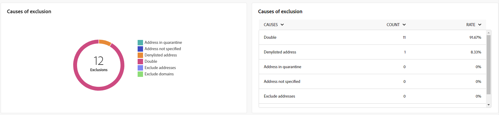{zoomable="yes"}{align="center"}

排除專案圖表和表格說明了從目標設定檔排除的使用者設定檔無法接收訊息的原因。

電子郵件錯誤型別列在[Adobe Campaign v8 （使用者端主控台）檔案](https://experienceleague.adobe.com/docs/campaign/campaign-v8/send/failures/delivery-failures.html#email-error-types){target="_blank"}中。

## 傳遞總處理能力 {#delivery-throughput}

>[!CONTEXTUALHELP]
>id="acw_global_reporting_throughput_email"
>title="傳遞總處理能力"
>abstract="此&#x200B;**傳遞總輸送量**&#x200B;提供對傳遞總輸送量的全面洞察，突顯指定時間範圍內的成功率和錯誤率。"

{zoomable="yes"}{align="center"}

「傳送輸送量」報表提供傳送流程效率的深入分析，詳細說明指定時間範圍內的成功和錯誤率。

+++進一步瞭解傳送輸送量量度。

* **[!UICONTROL 成功]**：已順利處理的訊息數與要傳遞的訊息數有關。

* **[!UICONTROL 錯誤]**：傳遞期間累積的錯誤總數，以及相對於要傳遞的訊息數的自動復原處理次數。

+++

## 無法傳遞的項目 {#non-deliverables-email}

### 依類型的錯誤劃分 {#delivery-summary-email-breakdown-per-type}

>[!CONTEXTUALHELP]
>id="acw_global_reporting_error_type_email"
>title="依類型的錯誤劃分"
>abstract="詳細說明&#x200B;**依類型的錯誤劃分**&#x200B;的表格和圖表包含有關在此過程中遇到的各種錯誤類型的資訊，包括使用者未知、郵箱已滿、無效的網域等。"

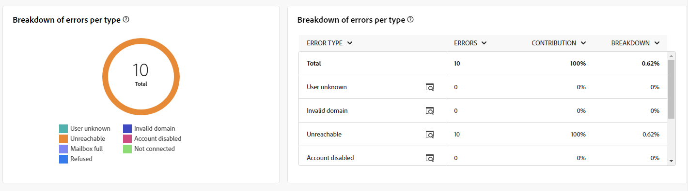{zoomable="yes"}{align="center"}

每個型別&#x200B;]**資料表與圖表的**[!UICONTROL &#x200B;錯誤劃分會顯示與不同網域中可能發生的錯誤相關的資料，具體量度如下。

此報告中顯示的錯誤會觸發隔離程式。 如需隔離管理的詳細資訊，請參閱[Campaign v8 （使用者端主控台）檔案](https://experienceleague.adobe.com/docs/campaign/campaign-v8/campaigns/send/failures/delivery-failures.html){target="_blank"}。

+++深入瞭解每個型別量度的錯誤劃分。

* **[!UICONTROL 使用者不明]**：傳送期間產生錯誤型別，指出電子郵件地址無效。

* **[!UICONTROL 無效的網域]**：傳送傳遞時產生錯誤型別，指出電子郵件地址的網域錯誤或不存在。

* **[!UICONTROL 信箱已滿]**：在五次傳遞嘗試後產生的錯誤型別，表示收件者的收件匣包含太多郵件。

* **[!UICONTROL 帳戶已停用]**：傳送傳遞時產生錯誤型別，表示地址已不存在。

* **[!UICONTROL 已拒絕]**：當IAP （網際網路存取提供者）拒絕位址時產生的錯誤型別，例如在套用安全性規則（反垃圾郵件軟體）之後。

* **[!UICONTROL 無法連線]**：訊息發佈字串中發生的錯誤型別：SMTP轉送上的事件、暫時無法連線網域等

* **[!UICONTROL 未連線]**：錯誤型別表示收件者的行動電話在傳送時已關閉或與網路中斷連線。

+++

### 依網域的錯誤劃分 {#delivery-summary-email-breakdown-per-domain}

>[!CONTEXTUALHELP]
>id="acw_global_reporting_error_domain_email"
>title="依網域的錯誤劃分"
>abstract="說明&#x200B;**依網域的錯誤劃分**&#x200B;的表格和圖表顯示了與遇到的每種錯誤類型相對應的資料，並按特定網域進行分類。"

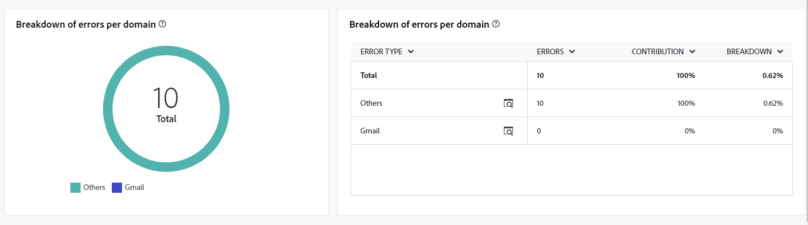{zoomable="yes"}{align="center"}

每個網域&#x200B;]**資料表和圖表的**[!UICONTROL &#x200B;錯誤劃分可顯示與每個網域中潛在錯誤相關的資料。 量度通常與上面詳述的每種型別&#x200B;]**資料表和圖表的**[!UICONTROL &#x200B;錯誤劃分有關。

## 追蹤指標 {#tracking-indicators-email}

### 傳遞統計資料 {#delivery-summary-email-statistics}

>[!CONTEXTUALHELP]
>id="acw_global_delivery_statistics_summary_email"
>title="傳遞統計資料"
>abstract="**傳遞統計資料**&#x200B;關鍵績效指標 (KPI) 全面概述您的傳遞和行銷活動績效，提供有關成功傳遞、遇到的錯誤和使用者參與的見解。"

**[!UICONTROL 傳遞統計資料]**&#x200B;量度提供關鍵績效指標(KPI)，提供有關每個電子郵件傳遞相關資料的詳細資訊。 這些量度的進一步詳細資訊如下。

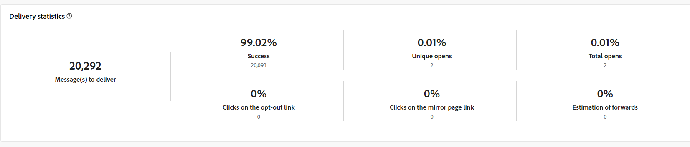{zoomable="yes"}{align="center"}

+++進一步瞭解傳遞統計量度。

* **[!UICONTROL 要傳遞的訊息]**：傳遞準備期間處理的訊息總數。

* **[!UICONTROL 成功]**：已順利處理的訊息數與要傳遞的訊息數有關。

* **[!UICONTROL 唯一開啟次數]**：至少開啟過一次訊息的目標收件者總數。

* **[!UICONTROL 總開啟次數]**：此網域已開啟郵件至少一次的不同目標收件者數目。

* **[!UICONTROL 點選退出連結]**：點選取消訂閱連結的次數。

* **[!UICONTROL 點選映象連結的次數]**：點選映象頁面連結的次數。

* **[!UICONTROL 轉送次數估計]**：目標收件者轉送的電子郵件數量估計。
+++

### 開啟及點進率 {#delivery-summary-open-rate}

>[!CONTEXTUALHELP]
>id="acw_global_reporting_open_clickthrough_email"
>title="開啟及點進率"
>abstract="**開啟及點進率**&#x200B;表格顯示了收件者對您的傳遞的參與度，展示了開啟率和點進率資料，以獲得快速且富有洞察力的概觀。"

**[!UICONTROL 開啟及點進率]**&#x200B;表格會顯示與收件者相關的資料。 量度詳情如下。

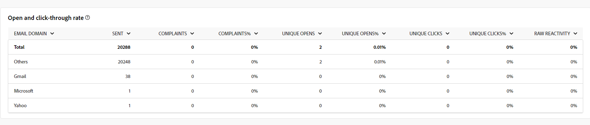{zoomable="yes"}{align="center"}

+++進一步瞭解「開啟」和「點進」比率量度。

* **[!UICONTROL 已傳送]**：已傳送的訊息總數。

* **[!UICONTROL 投訴]**：此網域被收件者回報為不想要的訊息數目和百分比。

* **[!UICONTROL 唯一開啟次數]**：此網域中至少開啟過一次訊息的不同目標收件者數目和百分比。

* **[!UICONTROL 不重複點按]**：至少點按一次相同傳遞的不同目標收件者數目和百分比。

* **[!UICONTROL 原始反應性]**：與開啟傳遞至少一次的收件者人數相比，至少點選一次傳遞的收件者人數的百分比。
+++

## URL 和點擊流量 {#url-email}

### URL 和點按資料流 KPI {#url-email-kpis}

>[!CONTEXTUALHELP]
>id="acw_global_reporting_urls_clickstreams_email"
>title="URL 和點擊流量"
>abstract="**URL 和點按資料流**&#x200B;報告提供了重要的關鍵績效指標 (KPI)，詳細說明傳遞期間點擊次數最多的 URL。"

**[!UICONTROL URL和點按資料流]**&#x200B;報告提供關鍵績效指標(KPI)，可針對傳遞期間收到最多點按次數的URL提供詳細的深入分析。 量度詳情如下。

{zoomable="yes"}{align="center"}

+++進一步瞭解URL和點選串流量度。

* **[!UICONTROL 反應性]**：已點按傳遞的目標收件者數目與已開啟傳遞的目標收件者預估數目之間的比率。

* **[!UICONTROL 不重複點按]**：在傳遞中至少點選一次的不同收件者總數。

* **[!UICONTROL 點按總數]**：傳遞中連結的點按總數。

* **[!UICONTROL 平台平均值]** ：此平均比率顯示在每個比率（反應性、不同點按和累計點按）下，是針對過去六個月傳送的傳遞進行計算。 系統只會考慮具有相同型別和相同通道的傳送。 校訂已排除。
+++

### 造訪量最高的前 10 個連結 {#top10-global-report-email}

>[!CONTEXTUALHELP]
>id="acw_global_reporting_top10_email"
>title="造訪量最高的前 10 個連結"
>abstract="**造訪量最高的 10 個連結**&#x200B;圖表和表格顯示了收件者與每個連結互動的全面資料。"

**[!UICONTROL 前10個最常造訪的連結]**&#x200B;圖表和表格包含每個連結的收件者行為可用資料。 量度詳情如下。

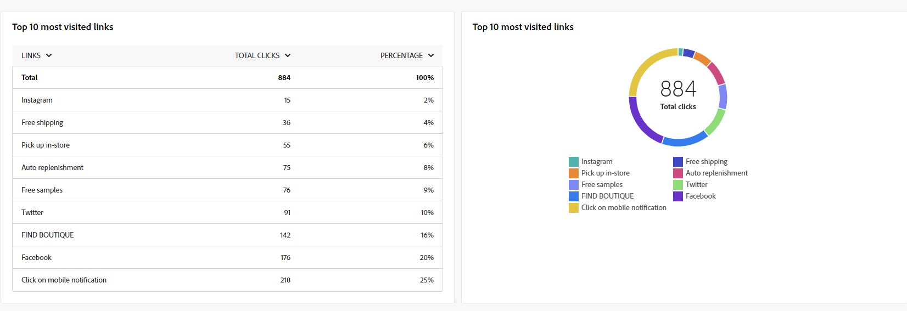{zoomable="yes"}{align="center"}

+++進一步瞭解前10個最常造訪的連結量度。

* **[!UICONTROL 點按總數]**：傳遞中連結的點按總數。

* **[!UICONTROL Percentage]**：與傳遞互動的使用者百分比。

+++

### 特定期間的點按劃分 {#global-report-email-breakdown-clicks}

>[!CONTEXTUALHELP]
>id="acw_global_reporting_urls_click_breakdown_email"
>title="特定期間的點按劃分"
>abstract="**特定期間的點按劃分**&#x200B;圖表提供了收件者在指定時間範圍內如何與連結互動的完整檢視。"

**[!UICONTROL 隨著時間點選的劃分]**&#x200B;圖表包含每個連結的收件者行為可用資料。

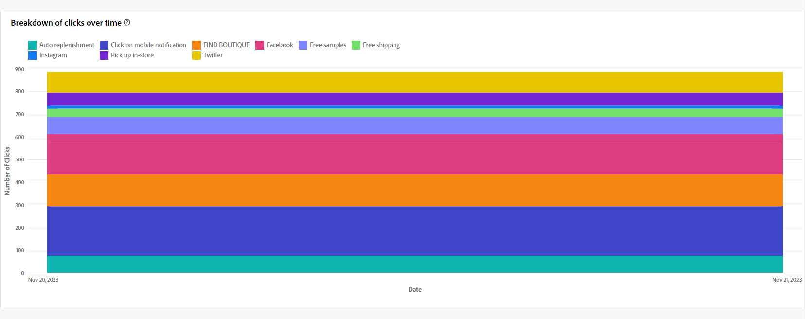{zoomable="yes"}{align="center"}

## 使用者活動 {#user-activities-email}

>[!CONTEXTUALHELP]
>id="acw_global_reporting_user_activities_email"
>title="使用者活動"
>abstract="**使用者活動**&#x200B;的圖形表示提供了收件者互動的詳細劃分，透過資訊豐富的圖表格式描繪了開啟和點按數。"

**[!UICONTROL 使用者活動]**&#x200B;報告會以圖表形式顯示開啟和點按的劃分。 此報表的量度詳情如下。

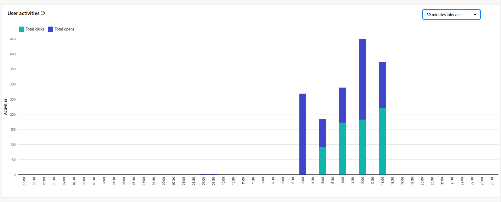{zoomable="yes"}{align="center"}

+++進一步瞭解使用者活動量度。

* **[!UICONTROL 點按總數]**：傳遞中連結的點按總數。

* **[!UICONTROL 總開啟次數]**：此網域已開啟郵件至少一次的不同目標收件者總數。

+++
