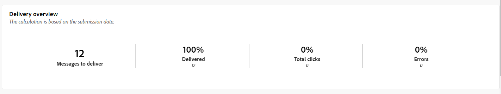
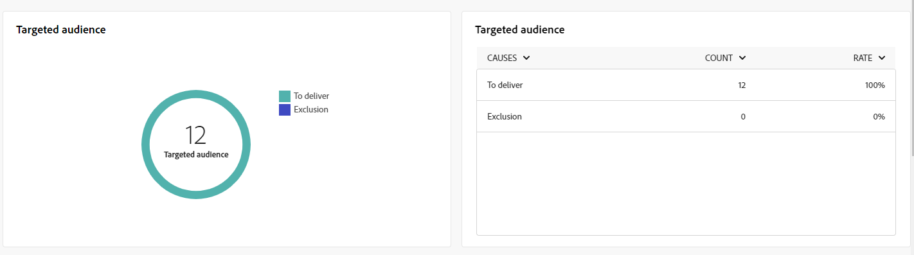
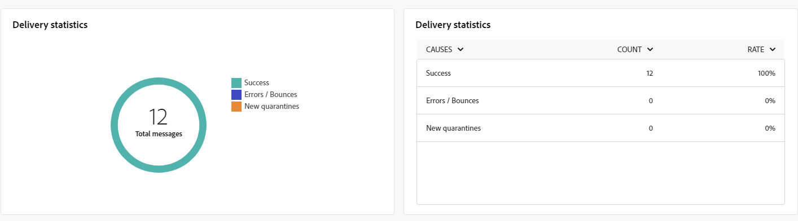
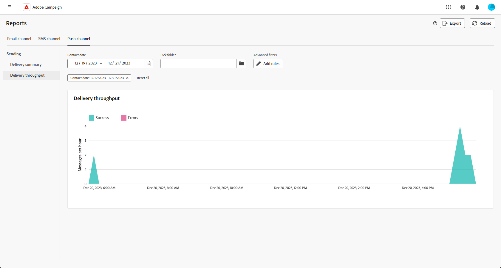

# 推播通道的全域報表 {#campaign-reports-push}

「全域」報表為使用者提供管道層級流量和參與量度的完整總覽。

導覽至 **[!UICONTROL 報表]** 功能表中的 **[!UICONTROL 報告]** 區段。 您可以根據報表日期、資料夾或規則來篩選資料。 [了解更多](global-reports.md)

## 傳遞摘要 {#delivery-summary-push}

### 傳遞概觀 {#delivery-overview-push}

>[!CONTEXTUALHELP]
>id="acw_push_global_report_overview"
>title="推播傳遞概觀"
>abstract="推播 **傳遞概覽** KPI可徹底檢查推播傳送，提供詳細的深入分析和特定資料。 它會提供有關傳遞效能、有效性和結果的完整細節。"

此 **[!UICONTROL 傳遞概覽]** 報告提供關鍵績效指標(KPI)，用於提供關於訪客如何參與每個推播通知傳送的詳細資訊。 量度詳情如下。

+++進一步瞭解傳送概述量度。

* **[!UICONTROL 要傳遞的訊息]**：在傳送準備期間處理的訊息總數。

* **[!UICONTROL 已傳遞]**：成功傳送的訊息數，與已傳送訊息總數相關。

* **[!UICONTROL 點按總數]**：在傳遞中至少點選一次的不同收件者總數。

* **[!UICONTROL 錯誤]**：與已傳送訊息總數相關的傳送和自動回訪處理期間累計的錯誤總數。

+++

### 目標對象 {#delivery-summary-push-initial-target}

>[!CONTEXTUALHELP]
>id="acw_global_reporting_push_targeted_audience"
>title="推播目標族群"
>abstract="此 **目標母體** 圖形和表格會顯示與您的推送訊息對象相關的資料，呈現有關要傳送的訊息和排除專案的資訊。"

此 **[!UICONTROL 目標對象]** 表格和圖表會顯示每個已傳送推播通知傳遞的收件者相關資料。 量度詳情如下。

+++深入瞭解鎖定目標對象量度。

* **[!UICONTROL 目標對象]**：目標收件者總數。

* **[!UICONTROL 要傳遞的訊息]**：準備傳送後要傳送的訊息總數。

* **[!UICONTROL 排除]**：套用規則時分析期間忽略的地址總數：地址遺失、已隔離、已加入封鎖清單等。

+++

### 傳遞統計資料 {#delivery-summary-push-exec-stats}

>[!CONTEXTUALHELP]
>id="acw_global_reporting_push_delivery_stats"
>title="推播傳遞統計資料"
>abstract="此 **整體統計資料** 報告提供有關已傳送推播通知的資訊，包括成功率、錯誤和隔離。"

此 **[!UICONTROL 傳遞統計資料]** 表格詳細說明每個推播通知傳送的成功情況。 量度詳情如下。

+++進一步瞭解傳遞統計量度。

* **[!UICONTROL 訊息總數]**：準備傳送後要傳送的訊息總數。

* **[!UICONTROL 成功]**：成功處理的訊息數與要傳送的訊息數相關。

* **[!UICONTROL 錯誤/退回]**：與要傳送的訊息數量相關的傳送和自動復原處理期間累計的錯誤總數。

* **[!UICONTROL 新隔離]**：傳送失敗後隔離的地址總數（無效註冊、訊息拒絕、裝載錯誤，例如） 相對於要傳遞的訊息數量。

  推播通知錯誤型別列於 [Adobe Campaign v8 （使用者端主控台）檔案](https://experienceleague.adobe.com/docs/campaign/campaign-v8/send/failures/delivery-failures.html#push-error-types){target="_blank"}.

+++

### 排除的原因 {#causes-exclusion}

>[!CONTEXTUALHELP]
>id="acw_global_reporting_push_exclusion"
>title="排除的推播原因"
>abstract="此 **排除的原因** 圖表和表格說明阻止使用者設定檔接收推播通知的各種原因。"

此 **[!UICONTROL 排除的原因]** 圖形和表格會顯示使用者設定檔（從目標設定檔排除）無法接收訊息的原因。

推播通知錯誤型別列於 [Adobe Campaign v8 （使用者端主控台）檔案](https://experienceleague.adobe.com/docs/campaign/campaign-v8/send/failures/delivery-failures.html#push-error-types){target="_blank"}.

## 傳遞總處理能力 {#delivery-throughput-sms}

>[!CONTEXTUALHELP]
>id="acw_global_reporting_throughput_push"
>title="傳遞輸送量報告"
>abstract="此 **傳遞總處理能力** 報表會顯示指定時間範圍內整個平台之推播通知傳遞輸送量的詳細資訊。"

此 **[!UICONTROL 傳遞總處理能力]** 報表提供推播通知傳送系統有效性的全面深入分析，提供指定期間成功和錯誤率的詳細摘要。

