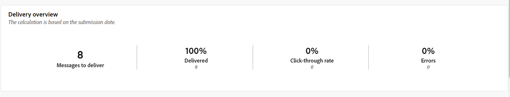
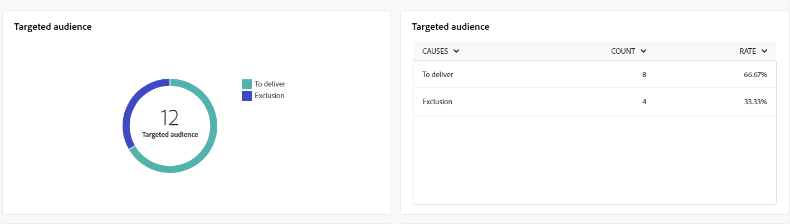
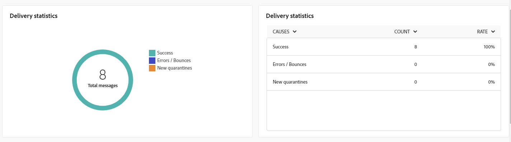
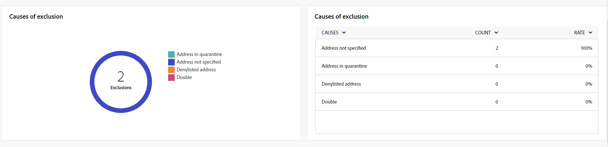
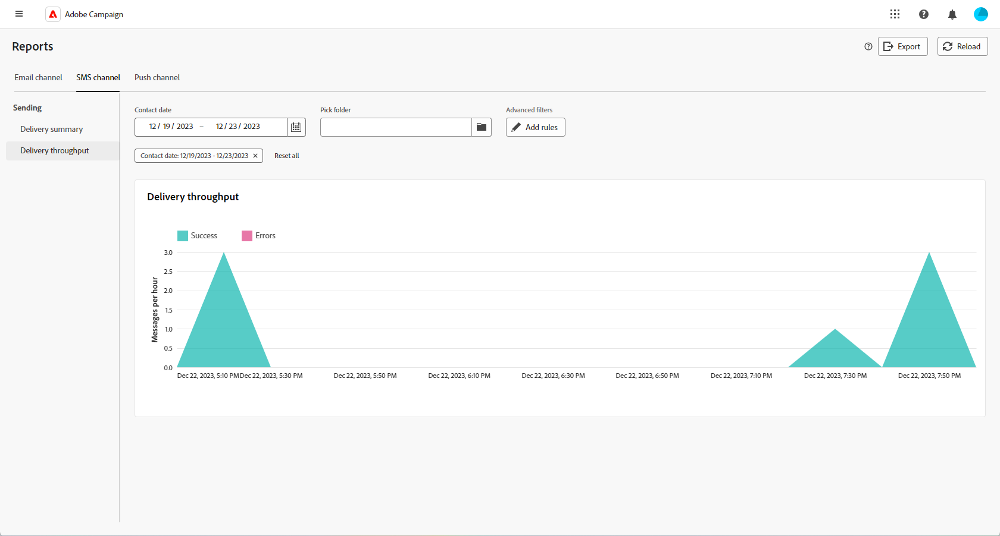

# 簡訊通道的全域報告 {#campaign-reports-sms}

全域報表為使用者提供管道層級的流量和參與量度的完整總覽。

瀏覽至&#x200B;**[!UICONTROL 報表]**&#x200B;區段內的&#x200B;**[!UICONTROL 報表]**&#x200B;功能表。 您可以根據報表日期、資料夾或規則來篩選資料。 [了解更多](global-reports.md)

## 傳遞摘要 {#delivery-summary-sms}

### 傳遞概觀 {#delivery-overview-sms}

>[!CONTEXTUALHELP]
>id="acw_sms_global_report_overview"
>title="SMS 傳遞概觀"
>abstract=" **SMS 傳遞概觀** KPI 提供了 SMS 傳遞的全面摘要，提供詳細的見解和具體資料。它提供有關傳遞的績效、成效和結果的全面資訊。"

**[!UICONTROL 傳遞概覽]**&#x200B;報告提供全面的關鍵績效指標(KPI)，深入分析訪客與每個SMS傳遞的互動模式。 以下為下列量度。

{zoomable="yes"}

+++進一步瞭解傳遞概述量度。

* **[!UICONTROL 要傳遞的訊息]**：傳遞準備期間處理的訊息總數。

* **[!UICONTROL 已傳遞]**：相對於已傳送訊息總數，已順利傳送的訊息百分比。

* **[!UICONTROL 點進率]**：至少在傳遞中點進一次的不同收件者百分比。

* **[!UICONTROL 錯誤]**：傳遞與自動傳回處理期間累積的錯誤百分比（相對於已傳送的訊息總數）。

+++

### 目標對象 {#delivery-summary-sms-initial-target}

>[!CONTEXTUALHELP]
>id="acw_global_reporting_sms_targeted_audience"
>title="SMS 目標群體"
>abstract="**目標群體**&#x200B;圖表和表格顯示與您的簡訊客群相關的資料，包括要傳遞和排除之訊息的相關資訊。"

針對每個已傳送的SMS傳遞，**[!UICONTROL 目標對象]**&#x200B;表格和圖表會顯示與收件者相關的資料。 量度詳情如下。

{zoomable="yes"}

+++深入瞭解鎖定目標對象量度。

* **[!UICONTROL 目標對象]**：目標收件者總數。

* **[!UICONTROL 要傳遞的訊息]**：傳遞準備後要傳遞的訊息總數。

* **[!UICONTROL 排除]**：套用規則時，如位址遺失、被隔離或加入封鎖清單時，分析期間忽略的位址總數。

+++

### 傳遞統計資料 {#delivery-summary-sms-exec-stats}

>[!CONTEXTUALHELP]
>id="acw_global_reporting_sms_delivery_stats"
>title="簡訊傳遞統計資料"
>abstract="**傳遞統計資料**&#x200B;報告提供了對傳送的簡訊的全面見解，提供了各種指標的詳細資訊，例如成功率、錯誤發生次數和被隔離的對象。透過這份詳細的簡報，可以全面檢查簡訊傳遞過程的整體績效和結果。"

**[!UICONTROL 傳遞統計資料]**&#x200B;表格詳細說明每次SMS傳遞的成功情況。 量度詳情如下。

{zoomable="yes"}

+++進一步瞭解傳遞統計量度。

* **[!UICONTROL 訊息總數]**：傳遞準備後要傳遞的訊息總數。

* **[!UICONTROL 成功]**：已成功處理的訊息數目，與要傳遞的訊息數目相關。

* **[!UICONTROL 錯誤/退信]**：傳遞與自動復原處理期間累積的錯誤總數，與要傳遞的訊息數目相關。

* **[!UICONTROL 新隔離]**：與要傳送的訊息數目相關的傳送失敗後（例如，使用者不明、無效的網域）被隔離的地址總數。

  SMS錯誤型別列在[Adobe Campaign v8 （使用者端主控台）檔案](https://experienceleague.adobe.com/docs/campaign/campaign-v8/send/failures/delivery-failures.html?lang=zh-Hant#sms-quarantines){target="_blank"}中。

+++

### 排除的原因 {#causes-exclusion}

>[!CONTEXTUALHELP]
>id="acw_global_reporting_sms_exclusions"
>title="簡訊排除的原因"
>abstract="**「排除原因」**&#x200B;圖表和表格說明阻止使用者設定檔接收簡訊推播通知的多種原因。"

排除原因&#x200B;**[!UICONTROL 圖形與表格會顯示從目標設定檔中排除的使用者設定檔無法接收簡訊傳送的原因。]**

錯誤型別列於[Adobe Campaign v8 （使用者端主控台）檔案](https://experienceleague.adobe.com/docs/campaign/campaign-v8/send/failures/delivery-failures.html?lang=zh-Hant#email-error-types){target="_blank"}中。

{zoomable="yes"}

## 傳遞總處理能力 {#delivery-throughput-sms}

>[!CONTEXTUALHELP]
>id="acw_global_reporting_throughput_sms"
>title="簡訊傳遞輸送量"
>abstract="**傳遞輸送量**&#x200B;報告提供了有關簡訊傳遞系統效率的廣泛見解，詳細概述了指定時間範圍內的成功率和錯誤率。"

{zoomable="yes"}

**[!UICONTROL 傳遞輸送量]**&#x200B;報告提供有關SMS訊息傳遞系統有效性的全面深入分析，提供指定期間成功率和錯誤率的詳細摘要。