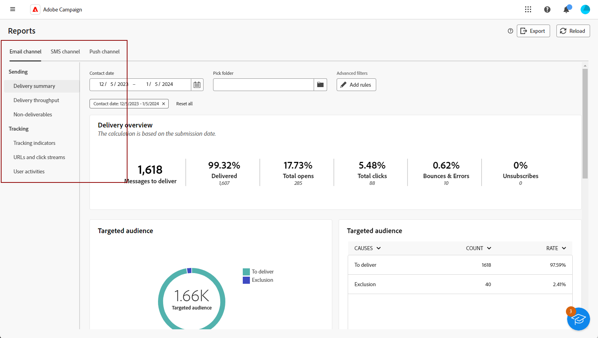
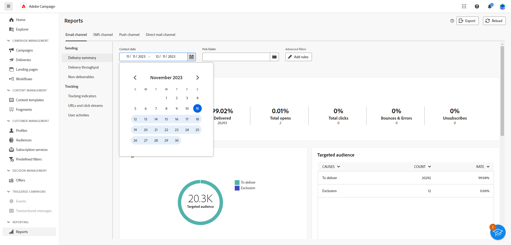
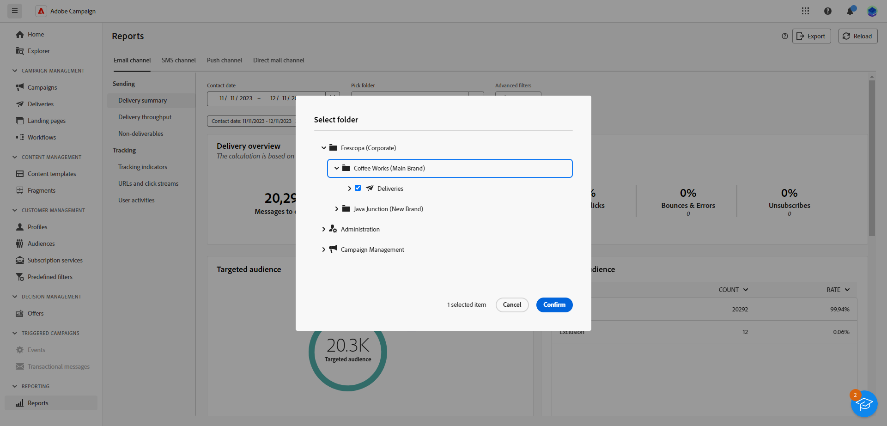

# 開始使用全域報告 {#global-report-gs}

>[!CONTEXTUALHELP]
>id="acw_campaign_reporting_global_report"
>title="全域報告 "
>abstract="全域報告是分析行銷活動績效的強大有效方法。這些報告會為您的行銷活動提供每個頻道關鍵流量和參與量度的整合檢視。"

**全域報告**&#x200B;是一種有效的工具，可為行銷活動執行個體中的每個管道提供流量和參與量度的整合性總體摘要。這些報告是由各種 Widget 所組成，每個 Widget 都提供有關您的行銷活動或傳遞績效的獨特觀點。

關鍵績效指標(KPI)會每小時重新整理一次，以確保獲得最新的深入分析。 依預設，會篩選資料以涵蓋過去30天，提供您行銷活動和傳遞績效的最新及相關觀點。

各管道的完整報表和相關量度清單可在下列頁面取得：

* [以電子郵件傳送全域報告](global-report-email.md)
* [SMS全域報告](global-report-sms.md)
* [推播全域報告](global-report-push.md)
* [直接郵件全域報告](global-report-direct.md)

## 管理您的報告儀表板 {#manage-reports}

若要存取及管理全域報告，請遵循下列步驟：

1. 導覽至 **[!UICONTROL 報表]** 功能表中的 **[!UICONTROL 報告]** 區段。

1. 在左側功能表中，從清單中選取報表，並導覽至標籤，以顯示每個管道的資料。

   {zoomable=&quot;yes&quot;}

1. 從您的控制面板中，選擇 **開始** 和 **[!UICONTROL 結束時間]** 以鎖定特定資料。

   {zoomable=&quot;yes&quot;}

1. 從 **[!UICONTROL 挑選資料夾]** 欄位，選取是否要從特定資料夾定位傳送或行銷活動。

   {zoomable=&quot;yes&quot;}

1. 按一下 **[!UICONTROL 新增規則]** 以開始建立查詢，進而更妥善地篩選報表資料。 [瞭解如何使用查詢模型工具](../query/query-modeler-overview.md)

1. 從 **[!UICONTROL URL和點按流量]**，您也可以選擇 **[!UICONTROL 最常造訪的連結]** 或 **[!UICONTROL 時段]**.

   此 **[!UICONTROL 檢視方式]** 選項可讓您篩選URL、標籤或類別。
