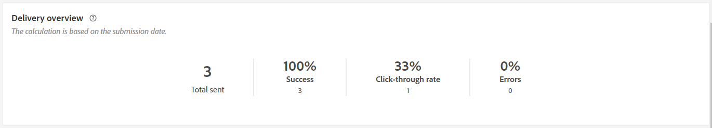
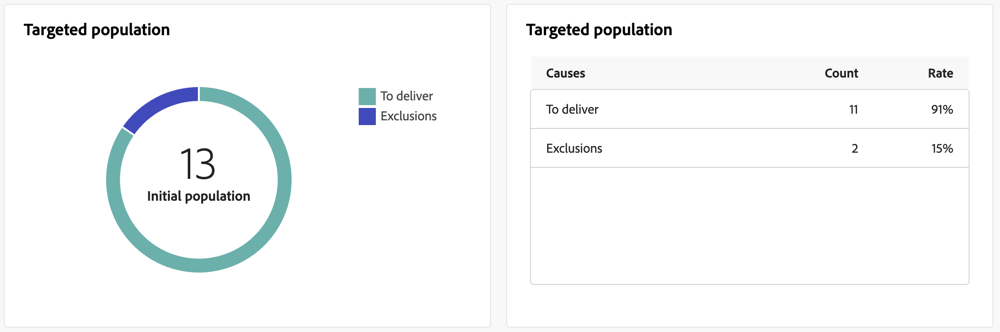
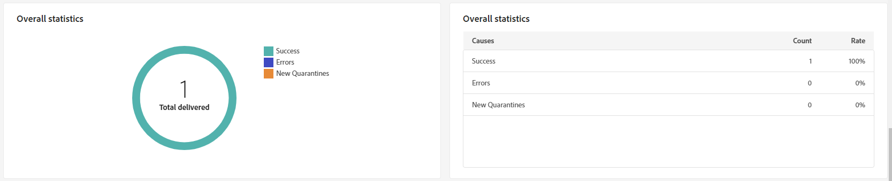
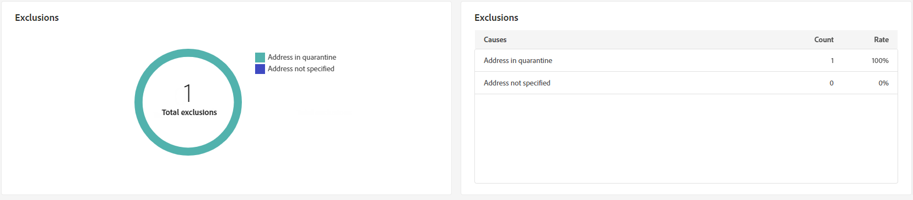

# 推播傳遞報告 {#push-report}

>[!CONTEXTUALHELP]
>id="acw_delivery_reporting_sending_push"
>title="報告傳送"
>abstract="報告中的「**傳送**」標籤可讓您深入了解訪客與您傳遞的互動，以及他們可能遇到的任何潛在錯誤。"

此 **推播傳遞報告** 提供推送管道的完整概觀，提供廣泛的深入分析和特定資料。 它提供關於每個傳送的效能、有效性和結果的全面資訊。

## 推播摘要 {#push-summary}

### 傳遞概觀 {#push-delivery-overview}

>[!CONTEXTUALHELP]
>id="acw_push_report_overview"
>title="推播傳遞概觀"
>abstract="**推播傳遞概觀**&#x200B;呈現推播傳遞的全面概觀，提供廣泛的深入解析和特定資料。它提供有關傳遞的績效、成效和結果的全面資訊。"

此 **[!UICONTROL 傳遞概覽]** 報表提供關鍵績效指標(KPI)，用於提供有關訪客如何與您的推送訊息互動的詳細資訊。

+++進一步瞭解推播傳送報告量度。

* **[!UICONTROL 已傳送總數]**：在傳送準備期間處理的訊息總數。

* **[!UICONTROL 已傳遞]**：成功傳送的訊息數，與已傳送訊息總數相關。

* **[!UICONTROL 點按次數]**：與推送訊息互動的收件者總數。

* **[!UICONTROL 錯誤]**：在傳送期間發生且無法傳送至設定檔的錯誤總數。

+++

### 目標族群 {#push-delivery-targeted-population}

>[!CONTEXTUALHELP]
>id="acw_delivery_reporting_push_targeted_population"
>title="推播目標族群"
>abstract="**目標族群**&#x200B;圖表和資料表顯示與您的推播傳訊對象相關的資料：要傳遞的訊息和排除項目。"

此 **目標母體** 圖表和表格會顯示與您的對象相關的資料：要傳送的訊息和排除專案。 量度詳情如下。

+++進一步瞭解推播傳送報告量度。

* **[!UICONTROL 要傳遞]**：在傳送準備期間處理的訊息總數。

* **[!UICONTROL 排除專案]**：已從分析中排除的設定檔數。

+++

### 整體統計資料 {#push-delivery-overall}

>[!CONTEXTUALHELP]
>id="acw_delivery_reporting_push_overall_stats"
>title="推播整體統計資料"
>abstract="**整體統計資料**&#x200B;報告顯示已傳送的推播通知的資料：成功、錯誤和隔離。"

此 **整體統計資料** 報表會顯示已傳送推播通知的資料：成功、錯誤和隔離。 量度詳情如下。

+++進一步瞭解推播傳送報告量度。

* **[!UICONTROL 成功]**：成功處理的訊息數。

* **[!UICONTROL 錯誤]**：傳送期間發生且無法傳送訊息至特定設定檔的錯誤總數。

* **[!UICONTROL 新隔離]**：已排除並新增至隔離的設定檔數。

+++

### 排除 {#push-delivery-exclusions}

>[!CONTEXTUALHELP]
>id="acw_delivery_reporting_push_exclusions"
>title="推播排除"
>abstract="**排除**&#x200B;圖表和資料表顯示各種理由，禁止從目標設定檔中排除的使用者設定檔接收訊息。"

此 **[!UICONTROL 排除專案]** 圖形和表格會顯示阻止使用者設定檔（從目標設定檔中排除）接收訊息的各種原因。 有關排除規則的詳情，請參閱 [Campaign v8 （主控台）檔案](https://experienceleague.adobe.com/docs/campaign/campaign-v8/send/failures/delivery-failures.html#push-error-types){_blank}.

## 傳遞總處理能力 {#delivery-throughput}

>[!CONTEXTUALHELP]
>id="acw_delivery_reporting_throughput_push"
>title="傳遞輸送量報告"
>abstract="傳遞輸送量報告提供有關特定期間內整個平台傳遞輸送量的詳細資訊。"

此 **傳遞總處理能力** 報表提供指定時間範圍內整個平台傳遞輸送量的詳細資訊。 用於測量訊息傳遞速度的主要量度是每小時傳送的訊息數。

