# Delivery reports {#reports}

<!--
detail delivery reports and how to access them

same content as in v7 (excepted for the navigation that is similar to AJO
-->

Adobe Campaign offers several types of reports, accessible for each delivery. These reports allow you to measure and visualize the impact and performances of your messages in a built-in dashboard.

To display reports, follow these steps:

1. Access your email delivery and click the **Report** button.

    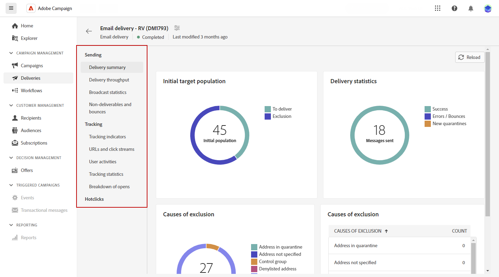

1. From the left menu, select a report from the list.

    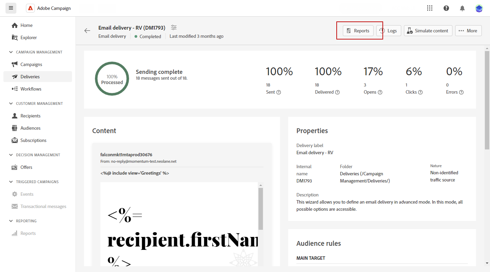{width="70%" align="left"}

## Sending

* **Delivery summary**: This report provides all the main information on the delivery. Target population, Causes of exclusion, Delivery statistics.

    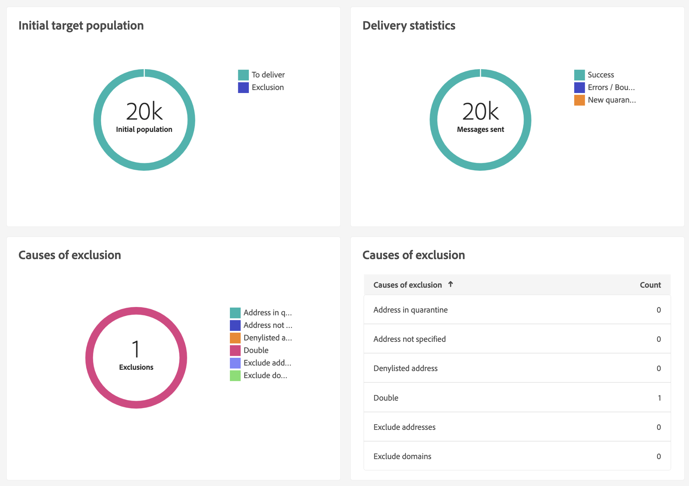

* **Delivery throughput**: This report contains information on the delivery throughput for a given period. To measure the speed at which the messages are delivered, the criteria are the number of messages sent per hour and the size of the messages (in bits per second). In the example below, the first graph shows the successful deliveries in blue, and the number of erroneous deliveries in orange.

    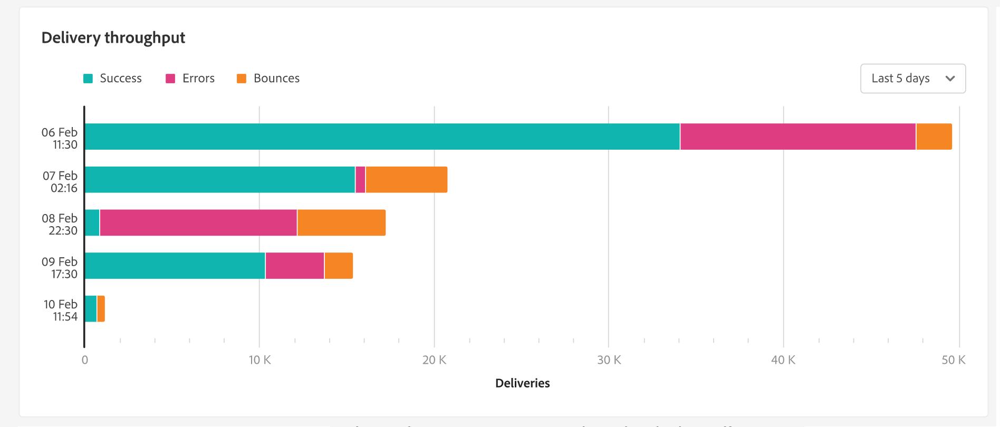

* **Broadcast statistics**: This report shows the breakdown by internet domain, of all messages processed and sent, of hard and soft bounces, opens, clicks and unsubscriptions.

    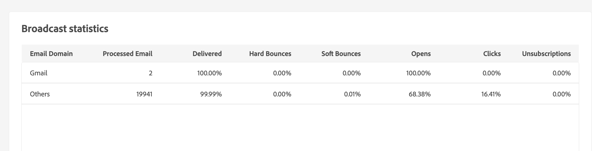

* **Non-deliverables and bounces**: This report shows the breakdown of non-deliverables as well as a breakdown of bounces per internet domain.

    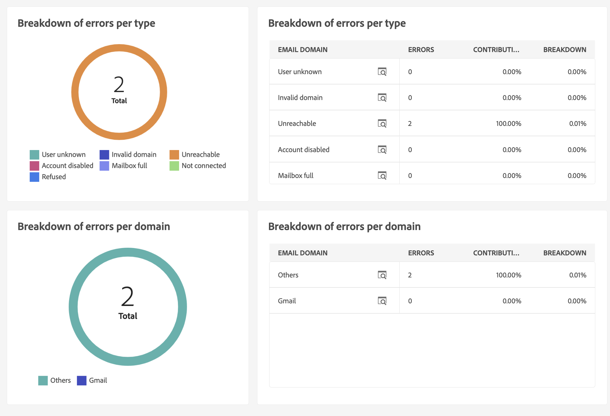

## Tracking

* **Tracking indicators**: This report combines the key indicators for tracking the behavior of recipients upon receiving the delivery. It gives access to delivery and reception statistics, open and click-through rates, generated click streams, web tracking as well as sharing activities to social networks.

    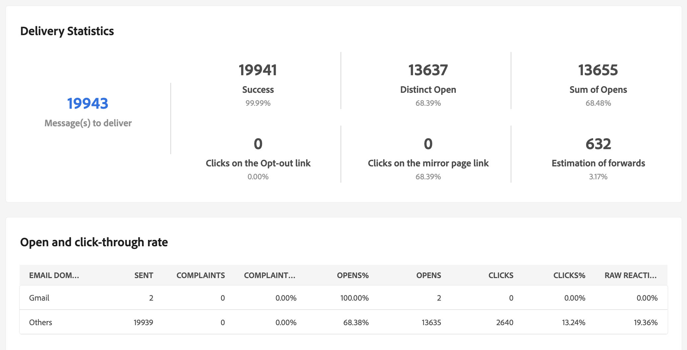

* **URLs and click streams**: This report shows the list of pages visited following a delivery.

    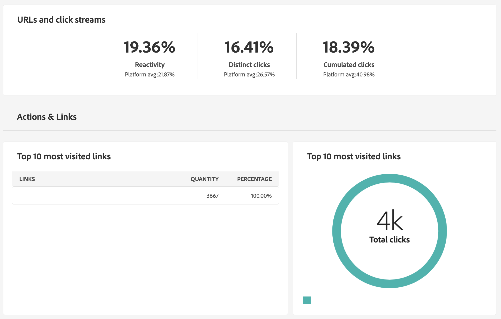

* **User Activities**: This report shows the breakdown of opens and clicks per half-hour, hour or day, in the form of a chart.

    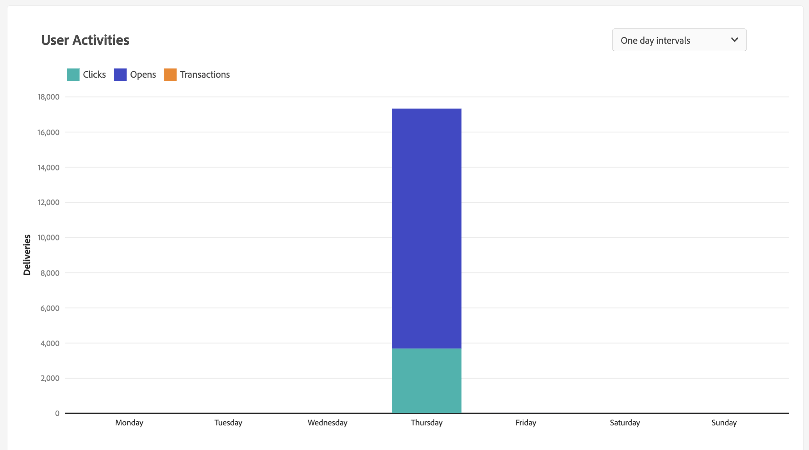

* **Tracking Statistics**: This report provides statistics on opens and clicks.

    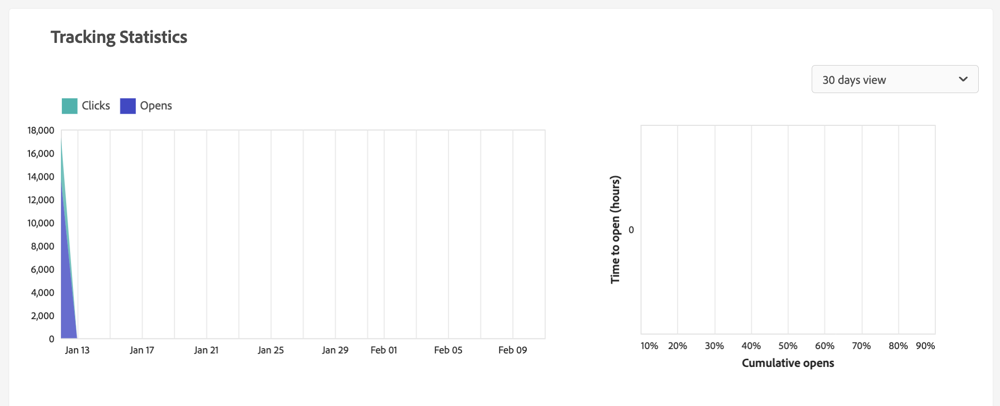

* **Breakdown of opens**: This report shows the breakdown of opens by operating system, device and browser for the period concerned. For each category, two charts are used. The first displays statistics regarding opens on a computer and mobile devices. The second displays statistics relating only to opens on mobile devices.

    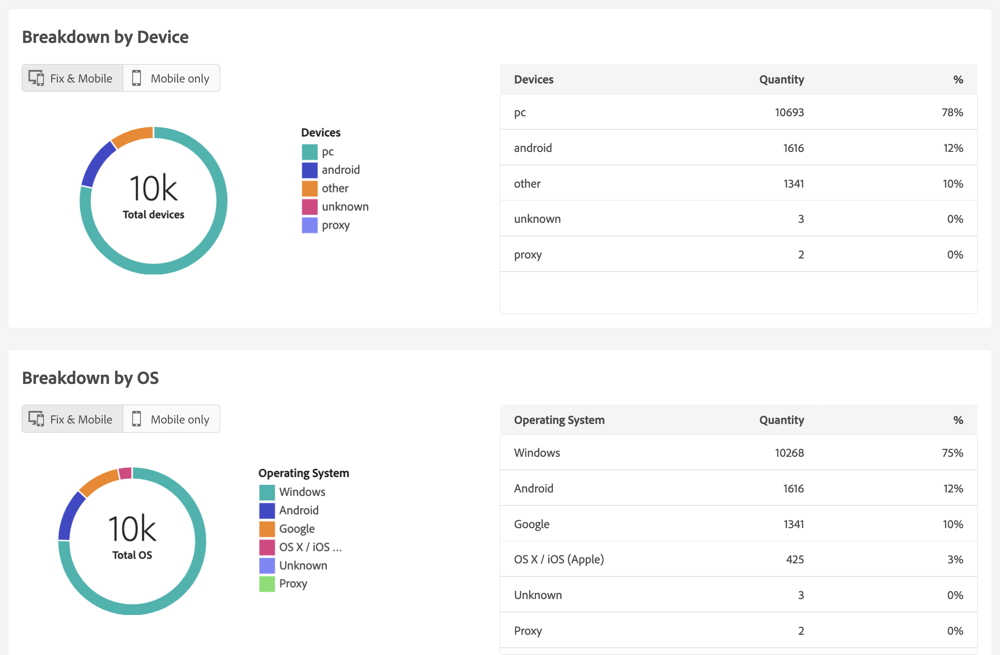

## Hotclicks

This report shows the message content (HTML and/or text) with, on each link, the percentage of clicks on links. Personalization blocks unsubscription links, mirror page links and offer links are taken into account in the total cumulated clicks but are not displayed in the report.

