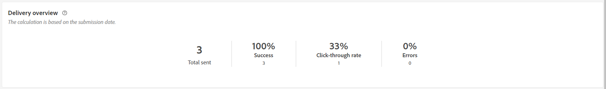
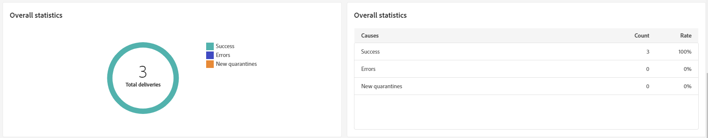
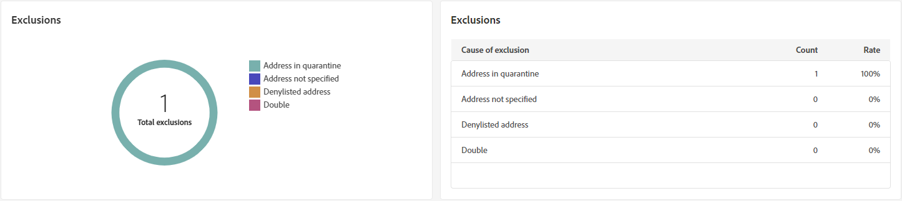
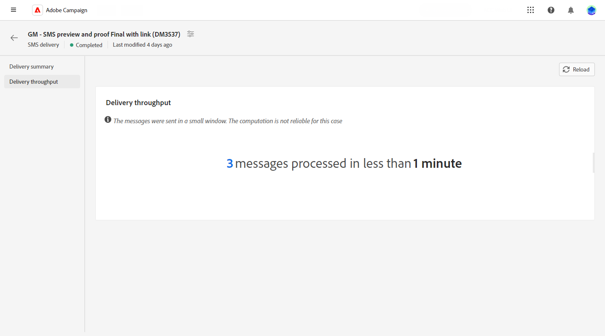

# 簡訊傳遞報告 {#sms-report}

>[!CONTEXTUALHELP]
>id="acw_delivery_reporting_sending_sms"
>title="報告傳送"
>abstract="報告中的「**傳送**」標籤可讓您深入了解訪客與您傳遞的互動，以及他們可能遇到的任何潛在錯誤。"

**SMS 傳遞總覽** 呈現 SMS 傳遞的全面概觀，提供廣泛的深入見解和特定資料。它提供有關傳遞的績效、成效和結果的全面資訊。

## 傳遞摘要 {#delivery-summary}

>[!CONTEXTUALHELP]
>id="acw_sms_report_overview"
>title="SMS 傳遞總覽"
>abstract="**SMS 傳遞總覽** 呈現 SMS 傳遞的全面概觀，提供廣泛的深入見解和特定資料。它提供有關傳遞的績效、成效和結果的全面資訊。"

### 傳遞總覽 {#sms-delivery-overview}

此 **[!UICONTROL 傳遞概覽]** 報告提供關鍵績效指標(KPI)，以提供有關成功和錯誤率，以及訪客如何與您的SMS訊息互動的詳細資訊。

+++進一步瞭解SMS傳送報告量度。

* **[!UICONTROL 已傳送總數]**：在傳遞準備期間處理的訊息百分比與總數。

* **[!UICONTROL 成功]**：與已傳送訊息總數相關的成功傳送訊息的百分比和數目。

* **[!UICONTROL 點進率]**：與您SMS傳送中所含連結互動的使用者百分比和人數。

* **[!UICONTROL 錯誤]**：在傳送期間發生且無法傳送至設定檔的錯誤百分比和總數。

+++

### 目標族群 {#sms-delivery-targeted-population}

>[!CONTEXTUALHELP]
>id="acw_delivery_reporting_sms_targeted_population"
>title="SMS 目標族群"
>abstract="**目標族群**&#x200B;圖表和資料表顯示與您的 SMS 對象相關的資料：要傳遞的訊息和排除項目。"

此 **目標母體** 圖表和表格會顯示與您的對象相關的資料。 量度詳情如下。

+++進一步瞭解SMS傳送報告量度。

* **[!UICONTROL 要傳遞]**：在準備傳送期間處理的訊息總數和百分比。

* **[!UICONTROL 排除專案]**：已從分析中排除的設定檔數目和百分比率。
+++

### 整體統計資料 {#sms-delivery-overall}

>[!CONTEXTUALHELP]
>id="acw_delivery_reporting_sms_overall_stats"
>title="推播整體統計資料"
>abstract="**整體統計資料**&#x200B;報告顯示已傳送的 SMS 的資料：成功、錯誤和隔離。"

此 **整體統計資料** 報表會顯示已傳送SMS訊息的資料。 量度詳情如下。

+++進一步瞭解SMS傳送報告量度。

* **[!UICONTROL 成功]**：成功處理的訊息數目和百分比。

* **[!UICONTROL 錯誤]**：傳送期間發生錯誤的總數和百分比，導致訊息無法傳送至特定設定檔。

* **[!UICONTROL 新隔離]**：已排除並新增至隔離的設定檔數目和百分比率。
+++

### 排除 {#sms-delivery-exclusions}

>[!CONTEXTUALHELP]
>id="acw_delivery_reporting_sms_exclusions"
>title="SMS 整體統計資料"
>abstract="**排除**&#x200B;圖表和資料表顯示各種理由，禁止從目標設定檔中排除的使用者設定檔接收訊息。"

此 **[!UICONTROL 排除專案]** 圖形和表格會顯示使用者設定檔（從目標設定檔排除）無法接收訊息的原因。 有關排除規則的詳情，請參閱 [Campaign v8 （主控台）檔案](https://experienceleague.adobe.com/docs/campaign/campaign-v8/send/failures/delivery-failures.html#sms-quarantines){_blank}.

## 傳遞總處理能力 {#delivery-throughput}

>[!CONTEXTUALHELP]
>id="acw_delivery_reporting_throughput_sms"
>title="傳遞輸送量選單"
>abstract="傳遞輸送量報告提供有關特定期間內整個平台傳遞輸送量的詳細資訊。"

此報表提供指定時間範圍內整個平台傳遞輸送量的詳細資訊。 用來測量訊息傳送速度的主要量度是每小時傳送的訊息數。

