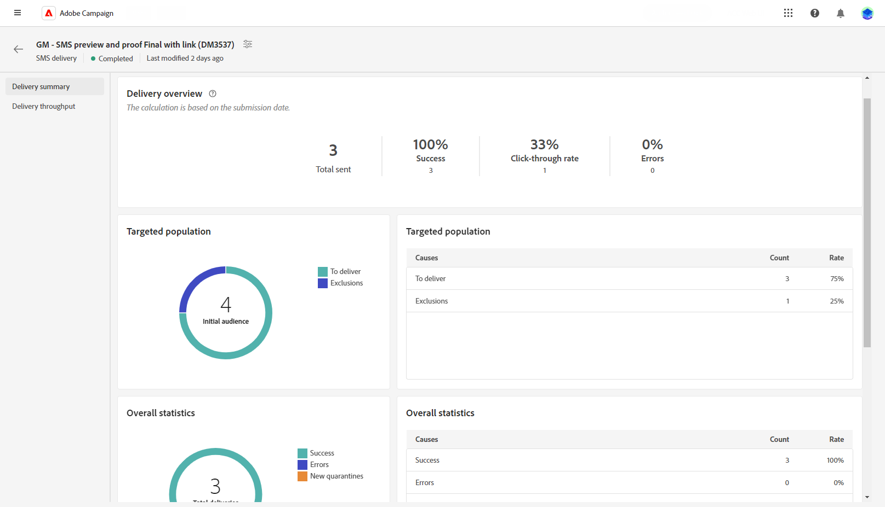

# 簡訊傳遞報告 {#report}

>[!CONTEXTUALHELP]
>id="acw_sms_report_overview"
>title="簡訊報告摘要"
>abstract="探索簡訊傳遞的報告量度。"

## 傳遞摘要 {#delivery-summary}

* **[!UICONTROL 傳遞概覽]** 提供關鍵績效指標(KPI)，用於提供有關訪客如何與您的SMS訊息互動的詳細資訊。 這些KPI包括：

   * **[!UICONTROL 已傳送總數]**：傳遞分析期間處理的訊息總數。

   * **[!UICONTROL 成功]**：成功傳送的訊息數，與已傳送訊息總數相關。

   * **[!UICONTROL 點進率]**：與SMS傳送中所包含連結互動的使用者百分比。

   * **[!UICONTROL 錯誤]**：傳送期間發生且無法傳送至設定檔的錯誤總數。

* **目標母體** 圖表和表格會顯示與您的對象相關的資料：

   * **[!UICONTROL 要傳遞]**：傳遞分析期間處理的訊息總數。

   * **[!UICONTROL 排除專案]**：已從分析中排除的設定檔數。

* **整體統計資料** 針對已傳送的SMS訊息顯示資料，包括：

   * **[!UICONTROL 成功]**：成功處理的訊息數。

   * **[!UICONTROL 錯誤]**：傳送期間發生導致訊息無法傳送至特定設定檔的錯誤總數。

   * **[!UICONTROL 新隔離]**：已排除並新增至隔離的設定檔數目。

* **[!UICONTROL 排除專案]** 圖表和表格會顯示阻止使用者設定檔（從目標設定檔中排除）接收訊息的各種原因。
