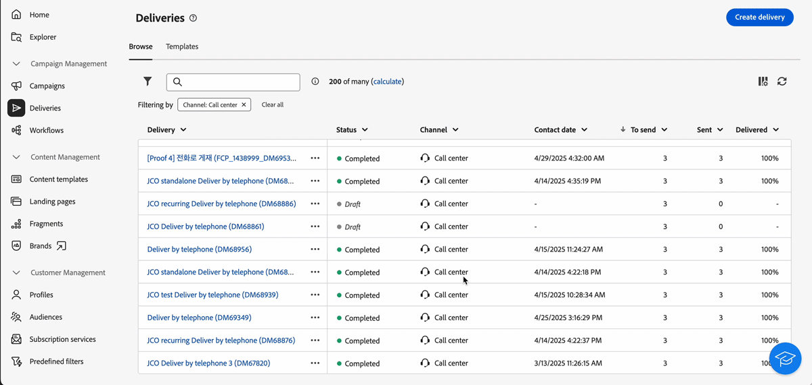
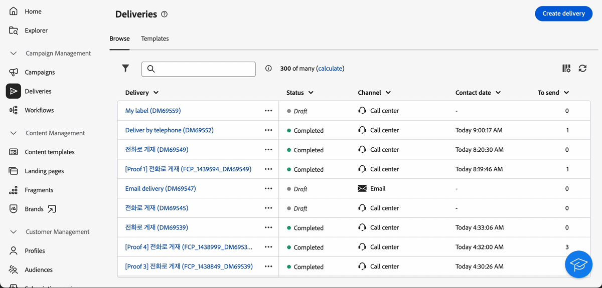
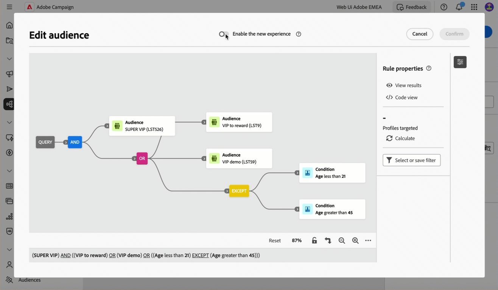
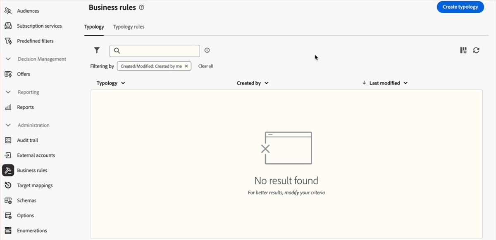
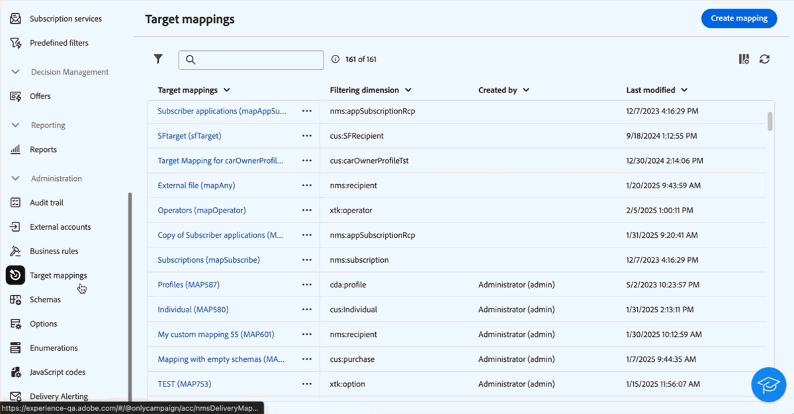
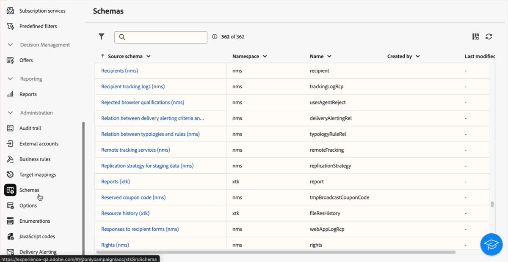
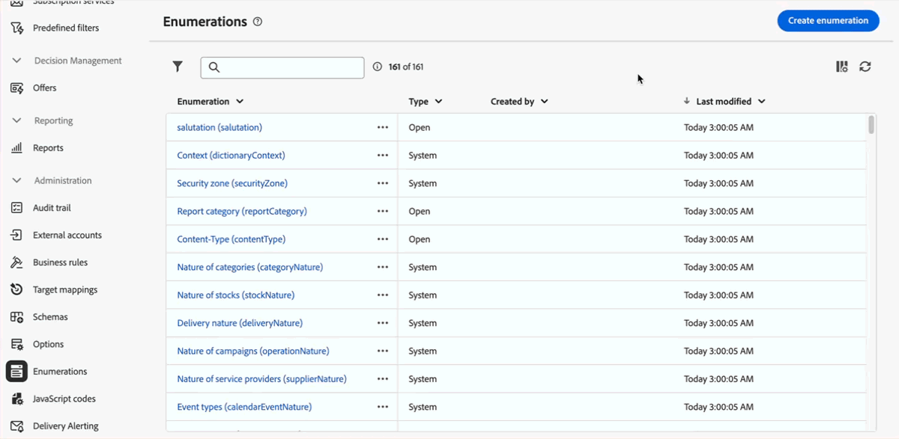
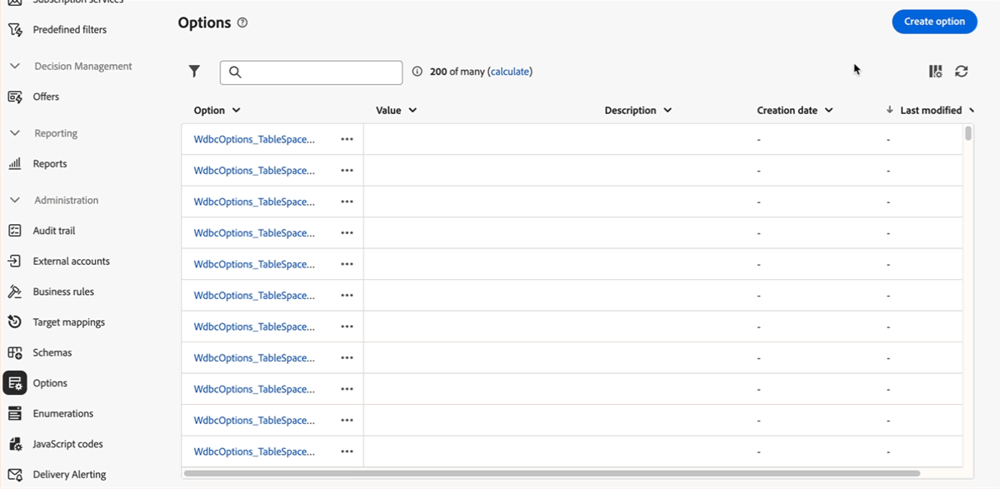
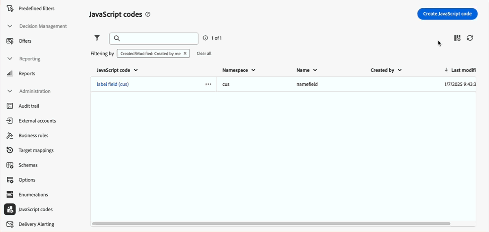

# 2025 年發行說明 {#2025-release}

此頁面列出了 **2025 年版本**&#x200B;的所有變更和改進。最新的發行說明可以在[此頁面](release-notes.md)找到。

## 2025 年 9 月版 {#25-9-release}

_2025 年 9 月 23 日_

下列功能將從 9 月版開始提供。

<table>
<thead>
<tr>
<th><strong>API 傳遞的自訂管道</strong> </th>
</tr>
</thead>
<tbody>
<tr>
<td>

您現在可以直接從 Adobe Campaign Web 使用者介面中，根據自訂 API 管道來協調和執行傳遞。這些傳遞可以是獨立的，也可以是工作流程的一部分。自訂 API 管道的設定是在控制台中執行。

如需詳細資訊，請參閱<a href="../call-center/gs-custom-channel.md">詳細說明文件</a>。

</td>
</tr>
</tbody>
</table>

<table>
<thead>
<tr>
<th><strong>外部帳戶製作</strong> </th>
</tr>
</thead>
<tbody>
<tr>
<td>

身為 Campaign 管理員，您現在可以從 Campaign Web 使用者介面中設定與外部系統的新連線。您也可以檢視、更新和管理現有的外部帳戶。

如需詳細資訊，請參閱<a href="../administration/create-external-account.md">詳細說明文件</a>。

</td>
</tr>
</tbody>
</table>

<table>
<thead>
<tr>
<th><strong>電子郵件內容鎖定</strong> </th>
</tr>
</thead>
<tbody>
<tr>
<td>

Campaign 現在允許您透過鎖定整個範本或特定結構和元件，來鎖定電子郵件範本中的內容。這樣做可讓您避免無意間編輯或刪除內容，並更能掌控範本自訂，進而提高電子郵件行銷活動的效率和可靠性。

如需詳細資訊，請參閱<a href="../content/content-locking.md">詳細說明文件</a>。

</td>
</tr>
</tbody>
</table>

<!--table>
<thead>
<tr>
<th><strong>Integration with Adobe GenStudio</strong> </th>  LA? sort? Juliette
</tr>
</thead>
<tbody>
<tr>
<td>

To enhance marketing efficiency and to maintain brand consistency, you can now seamlessly integrate GenStudio for Performance Marketing experiences with Campaign. This enables you to leverage GenStudio's AI-power content creation alongside Campaign's advanced orchestration capabilities.

For more information, refer to the detailed documentation.

</td>
</tr>
</tbody>
</table-->

<!--table>
<thead>
<tr>
<th><strong>Dark mode support in the Email designer</strong> </th> -> pas sept, modifier composant... -> Juliette
</tr>
</thead>
<tbody>
<tr>
<td>

The Email Designer now offers the ability to switch to dark mode view, where you can additionally define specific custom settings. Note that the final rendering depends on the recipient's email client, and not all email clients support dark mode.

For more information, refer to the detailed documentation.

</td>
</tr>
</tbody>
</table-->

<!--table>>
<thead>
<tr>
<th><strong>Multilingual capabilities for transactional messaging and push notifications (LA)</strong> </th> 
</tr>
</thead>
<tbody>
<tr>
<td>

You can now send multiple transactional messages and push notifications in different languages in Adobe Campaign Web User Interface. The Multilingual delivery feature allows you to choose the default language of your delivery as well as the different languages in which the delivery can be sent. You can also preview these deliveries in the languages you have chosen.

Note: this capability is only available for a set of organizations (Limited Availability), and will be rolled out globally in a future release.

For more information, refer to the detailed documentation.

</td>
</tr>
</tbody>
</table-->

<!--table>
<thead>
<tr>
<th><strong>Profile enrichment in Transactional Messages (LA)</strong> </th> 
</tr>
</thead>
<tbody>
<tr>
<td>

This capability allows you to personalize transactional messages (Email, SMS, Push) by linking Adobe Campaign database fields to the message content. You can select target mappings, enrichment columns, and a reconciliation key to ensure accurate, real-time personalization while maintaining performance thresholds.

Note: this capability is only available for a set of organizations (Limited Availability), and will be rolled out globally in a future release.

For more information, refer to the detailed documentation.

</td>
</tr>
</tbody>
</table-->

<!--table>
<thead>
<tr>
<th><strong>Dynamic reporting for transactional messaging (LA)</strong> </th> 
</tr>
</thead>
<tbody>
<tr>
<td>

Note: this capability is only available for a set of organizations (Limited Availability), and will be rolled out globally in a future release.

For more information, refer to the detailed documentation.

</td>
</tr>
</tbody>
</table-->

### 功能改善 {#25-9-improvements}

* 已新增一組新的運算子供電子郵件設計工具的條件式內容功能設定條件時使用。
* 此篩選維度現在可在&#x200B;**建立客群**&#x200B;工作流程活動中使用。若要檢視或變更，請按一下目標選擇維度旁的圖示。[了解更多](../workflows/activities/build-audience.md#build-audience-configuration)。
<!--

NEO-84915 Stop button for deliveries???? ->>> met pas, juste bouton ajouté dans webUI meme comportement que console. bleu, marche, marche pas.
NEO-90345 WebUI - Extended operators for dynamic content ->>>> deja mis
NEO-88858 WebUI - Send proof from execution recurring delivery -> bug
NEO-89777 Content locking on create email template -> juliette
NEO-90365 Multi-lingual – Identify fields editable from variants???? -> fix pour SMS
query activity -> query ds workflow fitleting dimentsion 

-->

## 2025 月 8 月版 {#25-8-release}

此版本隨附一系列的錯誤修正，包括：

* 設定檔複製流程已改進，以和用戶端主控台的行為相符，確保在兩個介面之間提供一致的體驗。這會修正可能導致無法建立複製輪廓的問題。

* 傳遞設定畫面中的&#x200B;**[!UICONTROL 電子郵件密件副本]**&#x200B;選項，現在可與 Momentum (增強型 MTA) 搭配使用。此功能之前僅適用於用戶端主控台。

## 2025 年 7 月版 {#25-7-release}

### 新功能 {#25-7-features}

下列功能將從 7 月版開始提供。

<!--table>
<thead>
<tr>
<th><strong>Multilingual email and SMS</strong> </th>
</tr>
</thead>
<tbody>
<tr>
<td>

You can now send multiple email and SMS deliveries in different languages in Adobe Campaign Web UI. The multilingual delivery feature allows you to choose the default language of your delivery as well as the different languages in which the delivery can be sent. You can also preview these deliveries in the languages you have chosen.

For Multilingual email, your server must be upgraded to 8.8.1 minimum. Refer to the Client Console <a href="https://experienceleague.adobe.com/docs/campaign/campaign-v8/releases/release-notes.html" target="_blank">release notes</a>.

For more information, refer to the <a href="../email/edit-content.md#multilingual-delivery">detailed documentation</a>.

</td>
</tr>
</tbody>
</table-->

<!--table>
<thead>
<tr>
<th><strong>Custom channel for API deliveries</strong> </th>
</tr>
</thead>
<tbody>
<tr>
<td>

You can now, directly from Adobe Campaign Web UI, orchestrate and execute deliveries based on custom API channels. These deliveries can be standalone or part of a workflow. The configuration of the custom API channel is performed in the console.

For more information, refer to the detailed documentation.

</td>
</tr>
</tbody>
</table-->

<table>
<thead>
<tr>
<th><strong>在電子郵件設計工具中支援自訂 CSS</strong> </th>
</tr>
</thead>
<tbody>
<tr>
<td>

在設計電子郵件時，您現在可以在電子郵件設計工具中直接新增自己的自訂 CSS。此功能可讓您套用進階和特定的樣式，從而獲得更大的靈活性並控制內容的外觀。

如需詳細資訊，請參閱<a href="../email/custom-css.md">詳細說明文件</a>。

</td>
</tr>
</tbody>
</table>

<table>
<thead>
<tr>
<th><strong>品牌</strong> </th>
</tr>
</thead>
<tbody>
<tr>
<td>

您現在可以建立和自訂自己的品牌，以在整個通訊過程中清楚地定義您的視覺和語言識別。透過品牌一致性分數，您可以收到即時回饋，以了解您的內容對您的品牌基調、風格和方針的反映程度，協助您在傳送的每則訊息中始終保持一致的品牌形象。

如需詳細資訊，請參閱<a href="../content/brands.md">詳細說明文件</a>。

</td>
</tr>
</tbody>
</table>

<table>
<thead>
<tr>
<th><strong>傳遞警報</strong> </th>
</tr>
</thead>
<tbody>
<tr>
<td>

「傳送警報」功能是警報管理系統，可讓一組使用者自動接收包含其傳送執行資訊的通知。

如需詳細資訊，請參閱<a href="../msg/delivery-alerting.md">詳細說明文件</a>。

</td>
</tr>
</tbody>
</table>

<!--table>
<thead>
<tr>
<th><strong>Landing pages improvements</strong> </th>
</tr>
</thead>
<tbody>
<tr>
<td>

The following improvements to landing pages are now available:

<ul>
    <li>You can now reference a default subscription/unsubscription landing page when configuring a service. When designing an email, if you define a link to that landing page, users submitting the landing page form are automatically subscribed to or unsubscribed from this service. <a href="../audience/manage-services.md#create-service">Read more</a></li>
    <li>A new option in the landing page configuration allows anonymous visitors to access the landing page. If you unselect this option, only identified users can access and submit the form. <a href="../landing-pages/create-lp.md#create-landing-page">Read more</a></li>
    <li>A new option in the landing page configuration allows to store additional internal data when the landing page is being submitted. <a href="../landing-pages/create-lp.md#create-landing-page">Read more</a></li>
    <li>A new option enables to use a landing page for several services, making it dynamic. When adding a link to an email, if you select a dynamic landing page, you can select any service. If you select a landing page that has a specific service associated, this service will be automatically used (you cannot select another one). <a href="../landing-pages/create-lp.md#define-actions-on-form-submission">Read more</a></li>
    <li>Conditional content is now supported in landing pages. <a href="../landing-pages/lp-content.md">Read more</a></li>
    <li>You can link a landing page to a service, and send a confirmation message when users validate it. <a href="../landing-pages/lp-content.md#lp-message">Read more</a></li>
    <li>You can add captcha to protect your landing page from spam and abuse caused by bots. This is non-intrusive for your customers since it does not require any interaction from them and is based on interactions with your site. <a href="../landing-pages/create-lp.md#captcha">Read more</a></li>
</ul>
</td>
</tr>
</tbody>
</table-->

<table>
<thead>
<tr>
<th><strong>動態報告</strong> </th>
</tr>
</thead>
<tbody>
<tr>
<td>

您現在可以存取動態報告，該報告提供完全可自訂的即時報告來衡量您行銷活動的影響。它新增了對輪廓資料的存取權，除了功能性電子郵件行銷活動資料 (如開啟數和點按數) 外，還可依輪廓維度 (例如，性別、城市和年齡) 進行人口統計分析。動態報告也適用於多語言電子郵件傳遞和交易型訊息。

此功能僅以隨選方式提供。若要取得存取權，請聯絡您的 Adobe 代表。您的伺服器必須至少升級到 8.8.1 版。請參閱用戶端主控台<a href="https://experienceleague.adobe.com/docs/campaign/campaign-v8/releases/release-notes.html" target="_blank">發行說明</a>。

如需詳細資訊，請參閱<a href="../reporting/dynamic-reporting/get-started-reporting.md">詳細說明文件</a>。

</td>
</tr>
</tbody>
</table>

<table>
<thead>
<tr>
<th><strong>集中品牌化</strong> </th>
</tr>
</thead>
<tbody>
<tr>
<td>

您的技術管理員現在可以定義一個或多個品牌，以集中管理會影響品牌識別的參數。這包括品牌標誌、登陸頁面存取 URL 之網域或訊息追蹤設定。您可以建立這些品牌，並將其連結至訊息或登陸頁面。 此設定在範本中管理。 品牌化選項適用於所有管道，包括簡訊和直接郵件。

此功能僅針對新實作以隨選方式提供。若要取得存取權，請聯絡您的 Adobe 代表。您的伺服器必須至少升級到 8.8.1 版。請參閱用戶端主控台<a href="https://experienceleague.adobe.com/docs/campaign/campaign-v8/releases/release-notes.html" target="_blank">發行說明</a>。

如需詳細資訊，請參閱<a href="../administration/branding/branding-gs.md">詳細說明文件</a>。

</td>
</tr>
</tbody>
</table>

除了上方列出的功能外，此版本還隨附一組用戶端主控台中可用的功能：

* [新的簡訊傳送連接器](https://experienceleague.adobe.com/docs/campaign/campaign-v8/send/sms/sms.html) (FDA 環境)
* [Rest API](https://experienceleague.adobe.com/docs/campaign/campaign-v8/developer/apis/get-started-apis.html) (隨選，FDA 環境)

請參閱用戶端主控台[發行說明](https://experienceleague.adobe.com/docs/campaign/campaign-v8/releases/release-notes.html){target="_blank"}。

<!--

### Features previously in Limited Availability {#25-7-limited} 

>[!AVAILABILITY]
>
>To benefit from these updates, your server must be upgrated to 8.8.1 mininum. Refer to the Client Console [release notes](https://experienceleague.adobe.com/docs/campaign/campaign-v8/releases/release-notes.html){target="_blank"}.

Previously released in Limited Availability, the following capabilities are now available to all environments (General Availability):

* **Multilingual delivery creation** - You can now send multiple email deliveries in different languages in Adobe Campaign Web User Interface. The Multilingual delivery feature allows you to choose the default language of your delivery as well as the different languages in which the delivery can be sent. You can also preview these deliveries in the languages you have chosen. [Read more](../email/edit-content.md#multilingual-delivery).

* **Visual fragments** - You can now create, use and archive content fragments. Visual fragments are pre-defined visual blocks that you can reuse across multiple email deliveries, or in content templates. [Learn more](https://experienceleague.adobe.com/docs/campaign-web/v8/content/manage-reusable-content/fragments/fragments.html){target="_blank"}

* **Delivery alerting** - The Delivery alerting feature is an alert management system that enables a group of users to automatically receive notifications containing information on the execution of their deliveries. [Read more](../msg/delivery-alerting.md)

* **Landing pages improvements** - The following improvements to landing pages are now available:

    * You can now reference a default subscription/unsubscription landing page when configuring a service. When designing an email, if you define a link to that landing page, users submitting the landing page form are automatically subscribed to or unsubscribed from this service. [Read more](../audience/manage-services.md#create-service)
    * A new option in the landing page configuration allows anonymous visitors to access the landing page. If you unselect this option, only identified users can access and submit the form. [Read more](../landing-pages/create-lp.md#create-landing-page)
    * A new option in the landing page configuration allows to store additional internal data when the landing page is being submitted. [Read more](../landing-pages/create-lp.md#create-landing-page)
    * A new option enables to use a landing page for several services, making it dynamic. When adding a link to an email, if you select a dynamic landing page, you can select any service. If you select a landing page that has a specific service associated, this service will be automatically used (you cannot select another one). [Read more](../landing-pages/create-lp.md#define-actions-on-form-submission)
    * Conditional content is now supported in landing pages. [Read more](../landing-pages/lp-content.md)
    * You can link a landing page to a service, and send a confirmation message when users validate it. [Learn more](../landing-pages/lp-content.md#lp-message)
    * You can add captcha to protect your landing page from spam and abuse caused by bots. This is non-intrusive for your customers since it does not require any interaction from them and is based on interactions with your site. [Learn more](../landing-pages/create-lp.md#captcha)

Previously released in Limited Availability, the following capabilities are now available **on demand**:

* **Dynamic Reporting** - You can now access Dynamic Reporting which provides fully customizable and real-time reports to measure the impact of your marketing activities. It adds access to profile data, enabling demographic analysis by profile dimensions such as gender, city and age in addition to functional email campaign data like opens and clicks. Dynamic reporting is also available for multilingual email deliveries and transactional messages. [Read more](../reporting/dynamic-reporting/get-started-reporting.md)

* **Centralized Branding** -  Your technical administrators can now define one or several brands to centralize the parameters that affect a brand's identity. This includes the brand logo, the domain of the landing pages' access URL, or message tracking settings. You can create these brands and link them to messages or landing pages. This configuration is managed in templates. Branding options are available for all channels, including SMS and Direct mail. [Read more](../administration/branding/branding-gs.md){target="_blank"}

    >[!NOTE]
    >
    >This feature is only available for new implementations.

In addition to the features listed above, this release also comes with a set of functionalities available in the Client Console:

* [New SMS sending connector](https://experienceleague.adobe.com/docs/campaign/campaign-v8/send/sms/sms.html) (FDA environments)
* [Rest APIs](https://experienceleague.adobe.com/docs/campaign/campaign-v8/developer/apis/get-started-apis.html) (on demand, FDA environments)

Refer to the Client Console [release notes](https://experienceleague.adobe.com/docs/campaign/campaign-v8/releases/release-notes.html){target="_blank"}.

-->

### 功能改善 {#25-7-improvements}

* 您現在可以根據規則產生器中的每個條件和群組，直接計算目標群體。按一下結果數字即可檢視詳細的記錄清單。[了解更多](../query/build-query.md#validate-query)

* 您現在可以直接從規則產生器中編輯或刪除預先定義的篩選器。[了解更多](../get-started/predefined-filters.md#manage-predefined-filter)

* 在設定簡訊傳遞時，您現在可以在「**簡訊**」區段中存取「**選擇性 SMPP 參數 (TLV)**」。此參數與用戶端主控台中的相同。[了解更多](../advanced-settings/delivery-settings.md#sms-tab)

* 您現在可以使用新的「**有可用內容**」選項 (位於 iOS 內容版本畫面的「**進階設定**」區段中)，在 iOS 上啟用背景通知。這會在 `aps` 承載中新增 `content-available:1` 標幟。若要了解更多資訊，請參閱[此頁面](../push/content-push.md)。另請參閱[此頁面](../push/rich-push-ios.md)。

* 下列登陸頁面改進現已提供：

   * 現在，您可以在設定服務時參考預設訂閱/取消訂閱登入頁面。設計電子郵件時，如果您定義指向該登陸頁面的連結，則提交登陸頁面表單的使用者會自動訂閱或取消訂閱此服務。[閱讀更多](../audience/manage-services.md#create-service)
   * 登陸頁面設定中的新選項允許匿名訪客存取登陸頁面。如果取消選擇此選項，則只有已識別的使用者才能存取並提交表單。[閱讀更多](../landing-pages/create-lp.md#create-landing-page)
   * 登陸頁面設定中的新選項允許在提交登陸頁面時儲存其他內部資料。[閱讀更多](../landing-pages/create-lp.md#create-landing-page)
   * 新選項允許將登陸頁面用於多個服務，使登陸頁面動態化。新增連結到電子郵件時，如果您選擇動態登陸頁面，則可以選取任何服務。如果您選取與特定服務相關的登陸頁面，系統會自動使用該服務 (您無法選取其他服務)。[閱讀更多](../landing-pages/create-lp.md#define-actions-on-form-submission)
   * 登陸頁面現在支援條件內容。[閱讀更多](../landing-pages/lp-content.md)
   * 您可以將登陸頁面連結到服務，並在使用者驗證它後傳送確認訊息。[了解更多](../landing-pages/lp-content.md#lp-message)
   * 您可以新增驗證碼，以保護您的登陸頁面免受機器人程式導致的垃圾訊息和濫用侵害。這對您的客戶來說不會造成干擾，因為它不需要客戶進行任何互動，而且是以與您網站的互動為基礎。[了解更多](../landing-pages/create-lp.md#captcha)

## 2025 年 6 月版 {#25-6-release}

### 功能改善 {#25-6-improvements}

* 現在，呼叫中心和自訂管道均可取得傳遞摘要報告。[了解更多](../reporting/direct-mail.md)

* 設定簡訊傳遞時，您現在可以存取特定的簡訊參數。這些參數與用戶端控制台中可用的參數相同。[了解更多](../advanced-settings/delivery-settings.md#sms-tab)

* 您最愛的資料夾現在會顯示在「探索工具」頁面上左側面板的頂端，使其更易於存取。[了解更多](../get-started/work-with-folders.md#favorite-folders)

* 規則產生器現在支援拖放功能，讓您能更高效地重新排列查詢的元件。[了解更多](../query/build-query.md#drag-and-drop)

* 規則產生器中的「人類狀況」已獲得改善。這是您規則的書面、通俗易懂版本，會顯示在畫面的底部：

   * 現在會醒目標示屬性，並會顯示關聯的結構描述。
   * 您可以按一下這些元素，以檢視更詳細的資訊。
   * 您現在可以使用相應的按鈕來複製人類狀況。

* 對「技術工作流程」和「自動建立的物件」資料夾的存取現在會受到限制，以防止它們遭到檢視。[了解更多](../get-started/work-with-folders.md#about-folders)

## 2025 年 5 月版 {#25-5-release}

從 5 月版開始，所有使用者都可以使用以下功能。

<table>
<thead>
<tr>
<th><strong>品牌一致性分數 (Beta)</strong> </th>
</tr>
</thead>
<tbody>
<tr>
<td>

品牌一致性分數功能可直接在電子郵件設計工具中提供清晰的回饋意見，協助您了解內容是否符合品牌的基調、風格和方針。此功能目前提供 Beta 版。

如需詳細資訊，請參閱<a href="../content/brands-score.md">詳細說明文件</a>。

</td>
</tr>
</tbody>
</table>

<table>
<thead>
<tr>
<th><strong>外部傳遞的自訂管道</strong> </th>
</tr>
</thead>
<tbody>
<tr>
<td>

您現在可以直接從 Adobe Campaign Web UI 中，根據自訂外部管道來協調和執行傳遞。這些傳遞可以是獨立的，也可以是工作流程的一部分。與第三方整合的自訂外部管道的建立是在控制台中進行的。

注意：Web UI 中不提供自訂管道的報告功能。您必須瀏覽到用戶端控制台才能存取報告。

如需詳細資訊，請參閱<a href="../call-center/gs-custom-channel.md">詳細說明文件</a>。

</td>
</tr>
</tbody>
</table>

### 功能改善 {#25-5-improvements}

類型規則建立畫面已更新，以方便選擇規則類型。

## 2025 年 4 月版 {#25-4-release}

**發行日期**：2025 年 4 月 29 日

### 新功能 {#25-4-features}

從 4 月版本開始，所有使用者都可以使用以下功能。

<table>
<thead>
<tr>
<th><strong>呼叫中心管道</strong> </th>
</tr>
</thead>
<tbody>
<tr>
<td>

呼叫中心管道現在已可在 Campaign Web 使用者介面中取得。此管道是指用於管理和追蹤透過呼叫中心處理的通訊或互動的通訊方法 — 通常是專員撥打給客戶或潛在客戶的電話。

注意：Web UI 中不提供呼叫中心管道的報告功能。您必須瀏覽到用戶端控制台才能存取報告。

如需詳細資訊，請參閱<a href="../call-center/gs-call-center.md">詳細說明文件</a>。

</td>
</tr>
</tbody>
</table>

<table>
<thead>
<tr>
<th><strong>新的規則產生器</strong> </th>
</tr>
</thead>
<tbody>
<tr>
<td>

您現在可以使用新的規則產生器，協助您在改進的使用者介面中定義複雜的條件。您可以視需要從舊的規則產生器切換到新的規則產生器。

如需詳細資訊，請參閱<a href="../query/query-modeler-overview.md">詳細說明文件</a>。

</td>
</tr>
</tbody>
</table>

<table>
<thead>
<tr>
<th><strong>外部帳戶製作</strong> </th>
</tr>
</thead>
<tbody>
<tr>
<td>

身為 Campaign 管理員，您現在可以從 Campaign Web 使用者介面中建立與外部系統的新連線。
您也可以檢視、更新和管理現有的外部帳戶。

如需詳細資訊，請參閱<a href="../administration/external-account.md">詳細說明文件</a>。

</td>
</tr>
</tbody>
</table>

### 功能改善 {#25-4-improvements}

**一般使用者介面改善**

* 現在，使用者介面中可以更清楚地看到結構描述屬性的「欄位說明」、「新增至最愛項目」和「數值分佈」選項。如需詳細資訊，請參閱[詳細說明文件](../get-started/attributes.md)。
* 在介面中，日期和時間現在會根據 Experience League 偏好設定中設定的主要語言來進行顯示。這項改進僅適用於幾種語言。若要查看受支援語言的完整清單，請參閱[詳細說明文件](https://experienceleague.adobe.com/zh-hant/docs/core-services/interface/features/browser-language){target=_blank}。

<!--
ko * Built-in options are now only visible in the list of options if the **Show advanced options** toggle is activated.
ko * The typology rules creation screen has been updated to facilitate the selection of the type of rule.
-->

**電子郵件編輯器**：為了增強 Campaign Web 使用者介面中的可存取性，電子郵件設計工具中現在提供兩個新欄位：它們對應至您電子郵件內容的 `html` 元素中的 `title` 元素和 lang 屬性。除了「預覽文字」欄位之外，您還可以在電子郵件的「內文」區段中定義這些設定。如需詳細資訊，請參閱[詳細說明文件](../email/metadata.md)。

<!--
**Workflow**: You can now select an existing Javascript code in workflow properties or in a Javascript activity.    
-->

**結構描述**

* 您現在可以從 Campaign Web 使用者介面中編輯清單的臨時結構描述。如需詳細資訊，請參閱[詳細說明文件](../audience/manage-audience.md)。
* 您現在可以在範例畫面中預覽結構描述的自訂欄位。如需詳細資訊，請參閱[詳細說明文件](../administration/custom-fields.md#add)。
* 您現在可以使用拖放方式，移動清單中的自訂欄位。如需詳細資訊，請參閱[詳細說明文件](../administration/custom-fields.md#add)。

### 限量開放版本中的新功能 {#25-4-features-la}

>[!AVAILABILITY]
>
>以下功能為限量開放 (LA) 版本。僅限適用於&#x200B;**從 Adobe Campaign Standard 移轉到 Adobe Campaign v8** 的客戶，且無法部署在任何其他環境中。這些功能需要將 Campaign 伺服器升級到 v8.7.4。
>
>請參閱以下文件頁面：「[Campaign Standard 轉換到 Campaign v8](../rn/acs-migration.md)」和「[適用於 Campaign Standard 使用者的功能](https://experienceleague.adobe.com/docs/experience-cloud/campaign/campaign-standard-migration-home.html)」。

* **建立多語言傳遞** - 您現在可以在 Adobe Campaign Web 使用者介面中，使用不同語言傳送多個電子郵件傳遞。多語言傳遞功能可讓您選擇傳遞的預設語言，以及可以傳送傳遞的不同語言。您也可以使用您選擇的語言來預覽這些傳遞。如需詳細資訊，請參閱[詳細說明文件](../email/edit-content.md)。

* **多語言動態報告** - 動態報告現可用於多語言電子郵件傳遞。如需詳細資訊，請參閱[詳細說明文件](../reporting/global-reports.md)。

* **簡訊 REST API 支援 (LA)** - 交易型傳訊 REST API 現在已可用於簡訊管道。當承載中同時存在 email 和 mobilePhone 時，您可以使用「wishedChannel」欄位來指定管道。如果未提供，除非 wishedChannel 明確地要求簡訊，否則預設會使用電子郵件。如需詳細資訊，請參閱[詳細說明文件](https://experienceleague.adobe.com/docs/campaign/campaign-v8/developer/apis/get-started-apis.html){target=_blank}。

## 2025 年 2 月版 {#25-2-release}

**發行日期**：2025 年 2 月 18 日

以下功能和改良功能將從 2 月版開始提供。

### 功能 {#25-2-features}

<table>
<thead>
<tr>
<th><strong>建立業務規則 (類型規則)</strong> </th>
</tr>
</thead>
<tbody>
<tr>
<td>

您現在可以在 Adobe Campaign Web 使用者介面中建立類型和類型規則。您可以使用類型來控制、篩選及優先處理傳遞內容的傳送。類型可用於驗證傳遞是否始終包含強制元件 (例如取消訂閱連結或主旨列)，或套用篩選規則以從您的客群中排除群組 (例如取消訂閱者、競爭者或非忠誠客戶)。

如需詳細資訊，請參閱<a href="../administration/typologies.md">詳細說明文件</a>。

</td>
</tr>
</tbody>
</table>

<table>
<thead>
<tr>
<th><strong>目標對應</strong> </th>
</tr>
</thead>
<tbody>
<tr>
<td>

現在您可以在 Campaign Web 使用者介面中建立目標對應。目標對應定義了不同的傳遞管道 (電子郵件、簡訊、推播通知) 如何連結到結構描述的資料欄位。目標對應可讓您定義目標客群：輪廓、合約受益人、操作者、訂閱者、潛在客戶等。

如需詳細資訊，請參閱<a href="../administration/target-mappings.md">詳細說明文件</a>。

</td>
</tr>
</tbody>
</table>

<table>
<thead>
<tr>
<th><strong>結構描述詳細資料</strong> </th>
</tr>
</thead>
<tbody>
<tr>
<td>

現在您可以在清單中選取結構描述的名稱來存取其詳細資料。自訂欄位版本現在可以透過結構描述詳細資料中的「<b>編輯自訂欄位</b>」按鈕存取。

如需詳細資訊，請參閱<a href="../administration/schemas.md">詳細說明文件</a>。

</td>
</tr>
</tbody>
</table>

## 2025 年 1 月版 {#25-1-release}

**發行日期**：2025 年 2 月 5 日

以下功能和改良功能將從 1 月版開始提供。

### 功能 {#25-1-features}

<table>
<thead>
<tr>
<th><strong>建立並使用視覺片段</strong> </th>
</tr>
</thead>
<tbody>
<tr>
<td>

視覺片段是預先定義的視覺區塊，可在多個電子郵件傳遞或內容範本中重複使用。此功能現已可供所有執行伺服器版本 8.6.4 及以上版本的客戶使用。

如需詳細資訊，請參閱<a href="../content/use-visual-fragments.md">詳細說明文件</a>。

</td>
</tr>
</tbody>
</table>

<table>
<thead>
<tr>
<th><strong>使用第三方系統來傳送傳遞</strong> </th>
</tr>
</thead>
<tbody>
<tr>
<td>

您現在可以在 Campaign Web 介面中定義外部傳遞和外部傳遞範本。在此模式中，訊息會編譯成一個輸出檔案，該檔案可以與您的外部提供者共用。依據預設，外部傳遞模式是用於直接郵件管道。

如需詳細資訊，請參閱<a href="../msg/send-external-deliveries.md">詳細說明文件</a>。

</td>
</tr>
</tbody>
</table>

<table>
<thead>
<tr>
<th><strong>管理您的列舉</strong> </th>
</tr>
</thead>
<tbody>
<tr>
<td>

您現在可以直接透過 Adobe Campaign Web 使用者介面建立列舉。列舉是系統建議填入欄位的值清單。使用列舉來標準化這些欄位的值，以協助資料輸入或在查詢中使用。

如需詳細資訊，請參閱<a href="../administration/enumerations.md">詳細說明文件</a>。

</td>
</tr>
</tbody>
</table>

<table>
<thead>
<tr>
<th><strong>建立自訂選項</strong> </th>
</tr>
</thead>
<tbody>
<tr>
<td>

您現在可以在 Adobe Campaign Web 使用者介面中存取技術選項，並建立自己的自訂選項來滿足您的需求。在使用 JavaScript 程式碼工作流程活動來儲存中間資料時，這特別有用。

如需詳細資訊，請參閱<a href="../administration/options.md">詳細說明文件</a>。

</td>
</tr>
</tbody>
</table>

<table>
<thead>
<tr>
<th><strong>定義並呼叫 JavaScript 程式碼</strong> </th>
</tr>
</thead>
<tbody>
<tr>
<td>

您現在可以在 Adobe Campaign Web 使用者介面中建立 JavaScript 程式碼。這可讓您建立能夠跨工作流程使用的可重複使用函數，類似於程式庫。

如需詳細資訊，請參閱<a href="../administration/javascript-codes.md">詳細說明文件</a>。

</td>
</tr>
</tbody>
</table>

<table>
<thead>
<tr>
<th><strong>使用 AI 助理產生登陸頁面</strong> </th>
</tr>
</thead>
<tbody>
<tr>
<td>

AI 助理現在可用於您的登陸頁面傳遞，讓您能夠產生文字、影像或完整的網頁版面。

如需有關 AI 助理的詳細資訊，請參閱<a href="../content/generative-full-content.md">詳細說明文件</a>。

</td>
</tr>
</tbody>
</table>

### 改良功能 {#25-1-improvements}

* 自訂介面中自訂欄位的顯示：

   * 您現在可以選取要在介面中顯示的額外自訂欄位
   * 您現在可以設定用於顯示連結類型自訂欄位的規則，例如根據另一個欄位的輸入來限制清單值
   * 您現在可以更靈活地排列介面中的欄位：欄位可以跨越單一欄，或分組為子區段以便更好地組織
   * 您現在可以將特定欄位設定為唯讀

* 最近和我的最愛篩選器：為了快速重複使用常用的屬性，您現在可以將它們新增到我的最愛中。這可確保它們能夠輕鬆用於未來的任務中。除了我的最愛之外，您還可以檢視和使用最近選取的屬性。

* 外部帳戶：建立新的外部帳戶時，有全新&#x200B;**[!UICONTROL 路由]**&#x200B;類型可供選擇。此帳戶允許您設定一個特定的外部帳戶，可供外部傳遞使用。[了解更多](../administration/external-account.md#routing)
