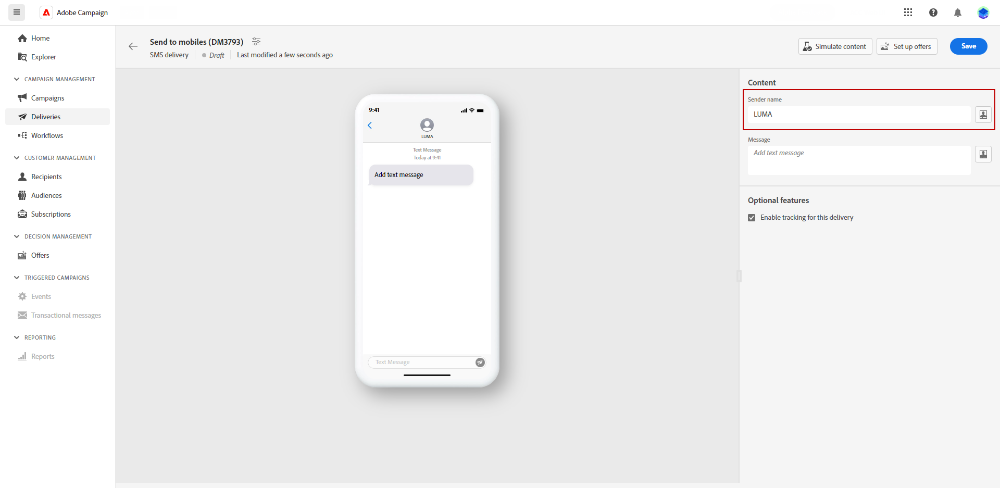
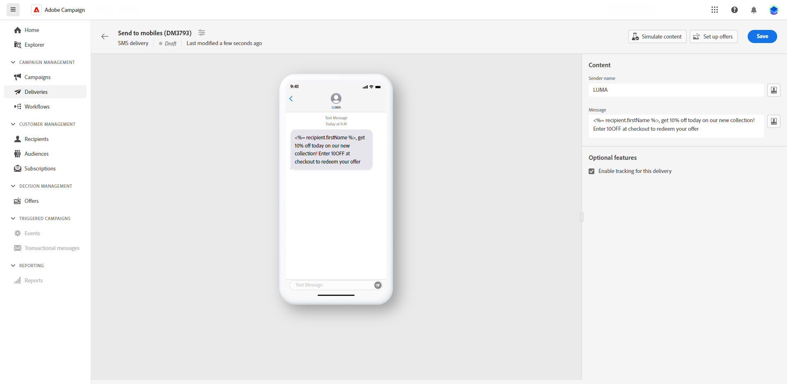

# 設計簡訊傳遞 {#design-sms}

>[!CONTEXTUALHELP]
>id="acw_deliveries_sms_content"
>title="簡訊內容"
>abstract="建立簡訊傳遞的內容，並使用個人化欄位、內容區塊和動態內容對其進行個人化設定。"

>[!CONTEXTUALHELP]
>id="acw_sms_preview_option_app_target"
>title="應用程式訂閱者"
>abstract="將應用程式訂閱者新增到主要目標，以預覽和測試訊息。"

若要設計SMS傳送的內容，請遵循下列步驟：

1. 在您的傳遞頁面上，按一下「**[!UICONTROL 編輯內容]**」按鈕，以設計簡訊內容。

1. 在「**[!UICONTROL 編輯內容]**」頁面上存取&#x200B;**[!UICONTROL 寄件者欄位]**，並輸入慣用名稱，即可自訂寄件者名稱。

   此外，按一下「**[!UICONTROL 開啟個人化對話框]**」，即可在訊息中包含個人化欄位、內容區塊和動態內容。

   

1. 在「**[!UICONTROL 訊息]**」欄位可輸入文字訊息，或按一下「**[!UICONTROL 開啟個人化對話框]**」選項，可定義內容和新增動態內容。[了解更多](../personalization/gs-personalization.md)

   

1. 依預設，傳遞會啟用追蹤。您可以從&#x200B;**[!UICONTROL 選擇性功能區段]**」停用此選項。

1. 存取 **[!UICONTROL 模擬內容]** 功能表以預覽您的個人化內容。 [了解更多](send-sms.md#preview-sms)

1. 按一下「**[!UICONTROL 儲存]**」並在預覽中查看您的訊息。

您現在可以檢閱您的簡訊訊息並將其傳送給您的對象。
