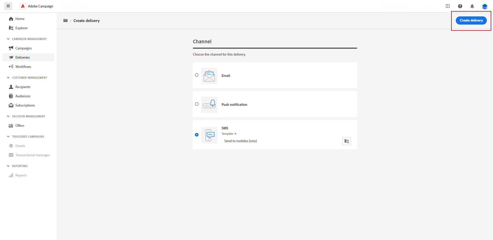
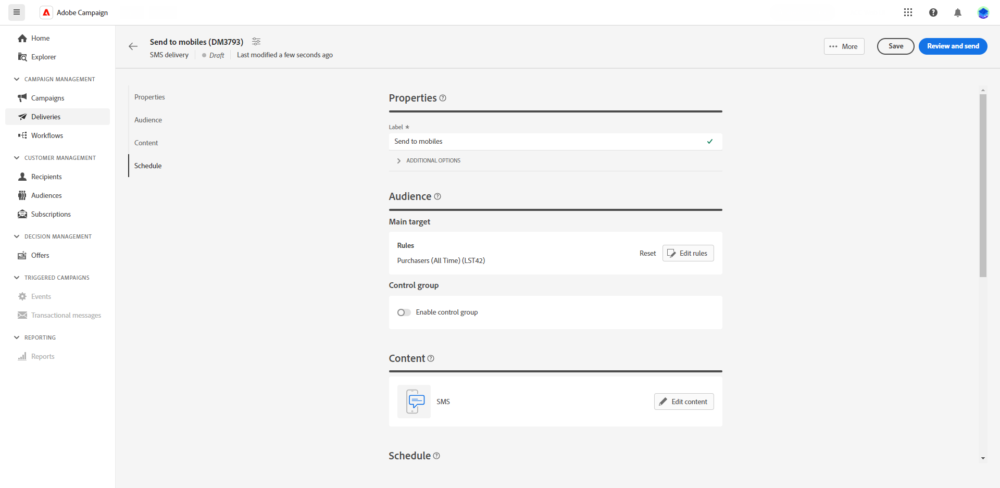
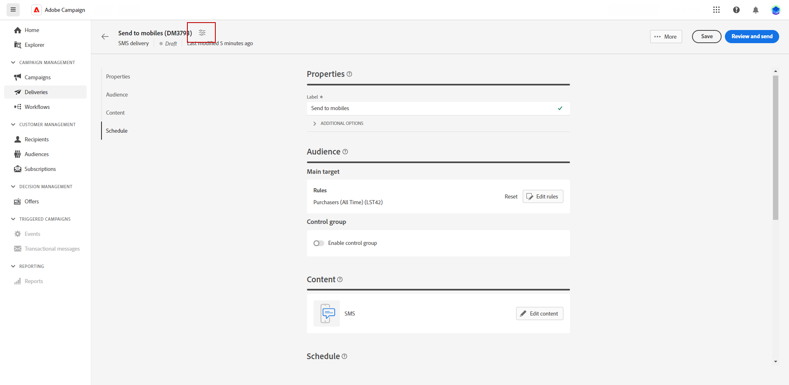

# 建立簡訊傳遞 {#create-sms}

>[!CONTEXTUALHELP]
>id="acw_deliveries_sms_properties"
>title="簡訊傳遞屬性"
>abstract="這些屬性包含常見的傳遞參數，可協助您對傳遞進行命名和分類。如果您的傳遞是根據擴充型結構描述完成的，可使用特定的自訂選項欄位。"

>[!CONTEXTUALHELP]
>id="acw_deliveries_sms_audience"
>title="定義簡訊對象"
>abstract="選取簡訊訊息的最佳對象。"

>[!CONTEXTUALHELP]
>id="acw_deliveries_sms_template_selection"
>title="簡訊範本選取"
>abstract="選取預先定義的範本，以開始進行簡訊傳遞。"

您可以建立獨立的SMS傳送，或在行銷活動工作流程的內容中建立SMS。 以下步驟詳細說明獨立（一次性） SMS傳送的程式。 如果您在行銷活動工作流程的內容中工作，建立步驟為中的詳細資訊 [本節](../workflows/activities/channels.md#create-a-delivery-in-a-campaign-workflow).

若要建立新的獨立SMS傳送，請遵循下列步驟：

1. 瀏覽至 **[!UICONTROL 傳遞]** 功能表，然後按一下  **[!UICONTROL 建立傳遞]** 按鈕。

1. 在「**[!UICONTROL 管道]**」區段下方，選擇簡訊作為管道並選取範本。[了解範本的詳細資訊](../msg/delivery-template.md)

1. 按一下「**[!UICONTROL 建立傳遞]**」按鈕以確認。

   

1. 進入一個傳遞的&#x200B;**[!UICONTROL 標籤]**，並存取「**[!UICONTROL 其他選項]**」下拉式清單。

   +++根據您的要求設定下列設定。
   * **[!UICONTROL 內部名稱]**：指派唯一識別碼給傳遞。
   * **[!UICONTROL 資料夾]**：將傳遞儲存在特定資料夾中。
   * **[!UICONTROL 傳遞代碼]**：使用您自己的命名慣例整理您的傳遞。
   * **[!UICONTROL 說明]**：提供傳遞的說明。
   * **[!UICONTROL 性質]**：指定電子郵件的性質以進行分類。
+++

1. 按一下「**[!UICONTROL 選取對象]**」按鈕，以鎖定現有對象或建立您自己的對象。[了解更多](../audience/about-recipients.md)。

   

1. 開啟&#x200B;**[!UICONTROL 啟用控制]**&#x200B;組選項，設定一個控制組來測量您的傳遞造成的影響，這可讓您將收到訊息的母體的行為和沒有收到訊息的聯絡人的行為進行比較。[了解更多](../audience/control-group.md)

1. 按一下「**[!UICONTROL 編輯內容]**」，開始設計您的簡訊訊息的內容。[了解更多](content-sms.md)

   

   在此畫面中，您也可以 [模擬您的內容](../preview-test/preview-test.md) 和 [設定優惠方案](../content/offers.md).

1. 若要將您的傳遞安排在特定的日期和時間，請開啟「**[!UICONTROL 啟用排程]**」選項。在您開始進行傳遞後，訊息將在您為收件者定義的確切日期和時間自動傳送。進一步瞭解中的傳送排程 [本節](../msg/gs-messages.md#gs-schedule).

1. 按一下 **[!UICONTROL 設定傳遞設定]** 以存取與傳送範本相關的進階選項。 [了解更多](../advanced-settings/delivery-settings.md)

   
