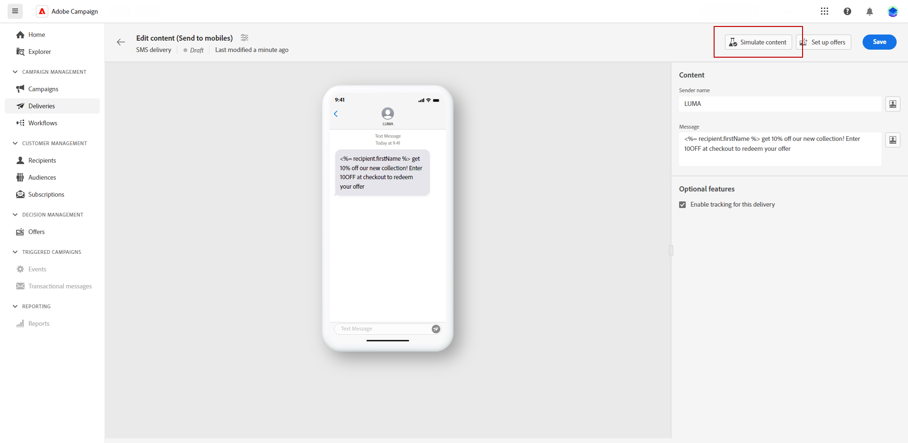
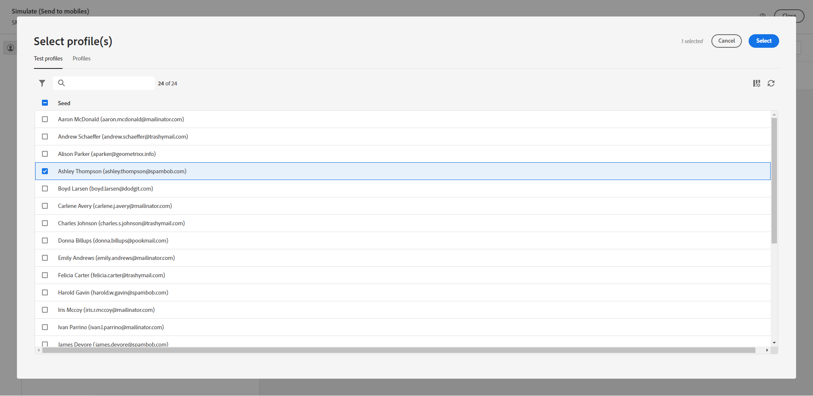
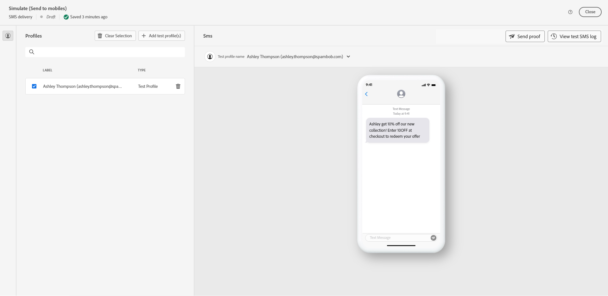
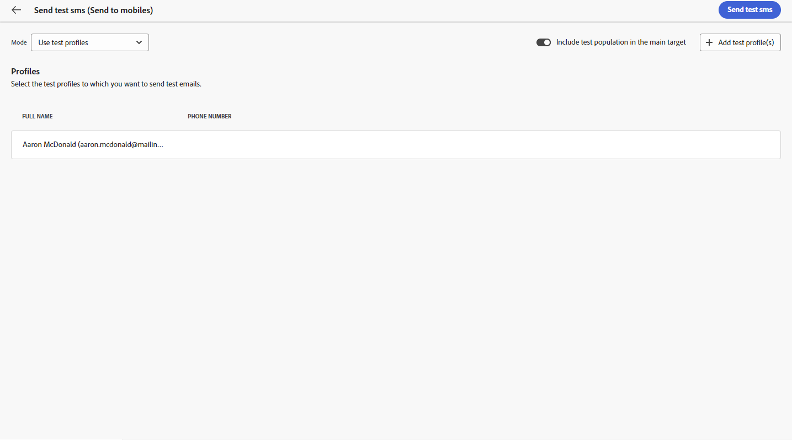
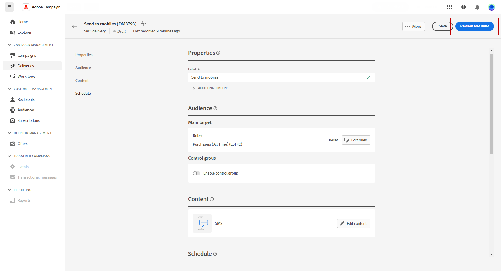
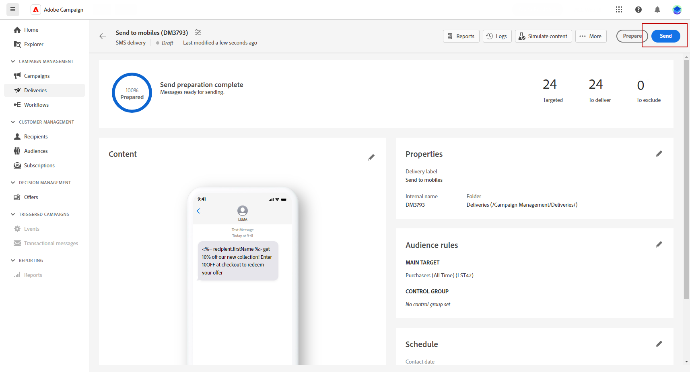

# 預覽並傳送簡訊傳遞 {#send-sms-delivery}

>[!CONTEXTUALHELP]
>id="acw_deliveries_metrics_newquarantines"
>title="新的隔離量度"
>abstract="傳遞失敗 (使用者未知、網域無效) 後被隔離的地址總數與要傳遞之訊息數量的關係。"

## 預覽您的SMS傳送{#preview-sms}

定義訊息內容後，您就可以使用測試設定檔來預覽及測試。 如果您已包含個人化內容，則可使用測試設定檔資料來檢查此內容在訊息中的顯示方式。 這可讓您確保訊息如預期顯示，且任何個人化資訊皆正確顯示。

預覽SMS傳送的主要步驟如下。 如需如何預覽傳送的詳細資訊，請參閱 [本節](../preview-test/preview-content.md).

1. 從您的傳遞內容頁面，使用 **[!UICONTROL 模擬內容]** 以預覽您的個人化內容。

   

1. 按一下「**[!UICONTROL 新增測試設定檔]**」，選取一個或多個測試設定檔或設定檔。

   <!--
    Once your test profiles are selected, click **[!UICONTROL Select]**.
    
    -->

1. 在右窗格中，您會找到SMS傳送的預覽，其中個人化元素會以所選設定檔的資料動態取代。

   

您現在可以檢閱您的簡訊訊息並將其傳送給您的對象。

## 測試您的SMS傳送 {#test-sms}

替換為 **Adobe Campaign**，您能夠先測試訊息，再將其傳送給主要對象，這是驗證電子郵件促銷活動及識別潛在問題的重要步驟。

傳送測試SMS是確保傳送品質和有效性的重要步驟。 測試收件者可檢閱連結、退出連結和影像等各種元素，並識別轉譯、內容、個人化設定和簡訊組態中的任何錯誤。 此程式可協助您在到達主要受眾之前完整評估及最佳化簡訊。

 瞭解如何在中傳送測試簡訊 [本節](../preview-test/test-deliveries.md).

## 傳送簡訊傳遞 {#send-sms}

1. 個人化SMS內容後，請按一下 **[!UICONTROL 檢閱並傳送]** 從您的 **[!UICONTROL 傳遞]** 頁面。

   

1. 按一下 **[!UICONTROL 準備]** 並監視提供的進度和統計資料。

   如果發生任何錯誤，請參考記錄檔功能表以取得有關失敗的詳細資訊。

1. 按一下以傳送訊息 **[!UICONTROL 傳送]** 以繼續進行最終的傳送程式。

   

   如果簡訊傳送已排程，請按一下 **[!UICONTROL 依排程傳送]** 按鈕。 進一步瞭解中的傳送排程 [本節](../msg/gs-messages.md#schedule-the-delivery-sending).

1. 按一下「 」以確認傳送動作 **[!UICONTROL 傳送]** 按鈕。

傳送傳遞後，您可以從傳遞頁面追蹤KPI（關鍵績效指標）資料，並從 **[!UICONTROL 記錄檔]** 功能表。

您現在可以使用內建報告來開始衡量訊息的影響。 [了解更多](../reporting/sms-report.md)
