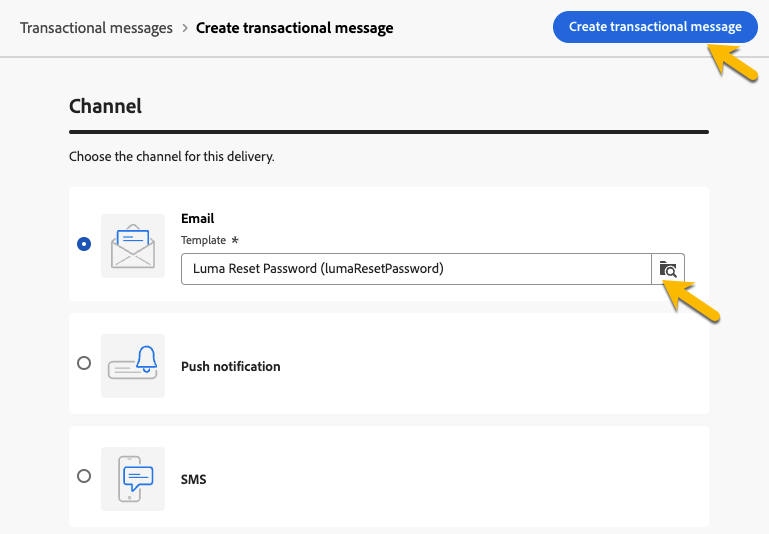

# 建立異動訊息

在交易式訊息中，事件會觸發個人化訊息的傳送。 若要啟用此功能，請為每個事件型別建立訊息範本。 這些範本包含個人化交易式訊息的所有必要資訊。

## 建立異動訊息範本 {#transactional-template}

在Campaign Web使用者介面中，交易式訊息設定的第一步是建立範本或直接建立訊息。 這與使用者端主控台[&#128279;](https://experienceleague.adobe.com/en/docs/campaign/campaign-v8/send/real-time/transactional)上的異動訊息組態不同。

交易式訊息範本可用於在設定檔收到的傳送內容到達最終對象之前進行預覽。 例如，管理員可以設定並設定範本，讓行銷使用者可以隨時使用。

若要建立異動訊息範本，請遵循下列步驟：

* 在&#x200B;**[!UICONTROL 觸發訊息]**&#x200B;區段中，移至&#x200B;**[!UICONTROL 異動訊息]**。 在&#x200B;**[!UICONTROL 範本]**&#x200B;標籤中，您可以看到異動訊息的所有傳遞範本。 按一下&#x200B;**[!UICONTROL 建立異動訊息範本]**&#x200B;按鈕，開始建立範本。

  {zoomable="yes"}

* 在顯示的新頁面中，選擇範本的頻道。 在此範例中，選取&#x200B;**[!UICONTROL 電子郵件]**&#x200B;頻道。 您也可以從其他訊息範本中工作，並在範本清單中選取它。

  {zoomable="yes"}

  再按一下&#x200B;**[!UICONTROL 建立交易式訊息]**&#x200B;按鈕，以驗證在選取的頻道上建立範本。

* 存取交易式訊息範本的設定。

  {zoomable="yes"}

### 交易型訊息屬性 {#transactional-properties}

>[!CONTEXTUALHELP]
>id="acw_transacmessages_properties"
>title="交易型傳訊屬性"
>abstract="填寫此表單，設定交易型傳訊屬性。"

>[!CONTEXTUALHELP]
>id="acw_transacmessages_email_properties"
>title="交易型傳訊電子郵件屬性"
>abstract="填寫此表單，設定交易型傳訊電子郵件屬性。"

>[!CONTEXTUALHELP]
>id="acw_transacmessages_sms_properties"
>title="交易型傳訊簡訊屬性"
>abstract="填寫此表單，設定交易型傳訊簡訊屬性。"

>[!CONTEXTUALHELP]
>id="acw_transacmessages_push_properties"
>title="交易型傳訊推播屬性"
>abstract="填寫此表單，設定交易型傳訊推播屬性。"

交易式訊息的&#x200B;**[!UICONTROL 屬性]**&#x200B;區段可協助您設定：

* **[!UICONTROL 標籤]**，即交易式訊息清單中顯示的名稱。 明確說明以供研究和未來使用。
* **[!UICONTROL 內部名稱]**，此唯一名稱可區分您的訊息與其他建立的訊息。
* 建立交易式訊息範本的&#x200B;**[!UICONTROL 資料夾]**。
* **[!UICONTROL 執行資料夾]**，在執行後儲存郵件。
* **[!UICONTROL 傳遞代碼]**，如有需要，此代碼可協助識別要報告的訊息。
* **[!UICONTROL 描述]**。
* **[!UICONTROL Nature]**，這是您傳送的性質，列於列舉&#x200B;*deliveryNature*&#x200B;中。 [進一步瞭解列舉](https://experienceleague.adobe.com/en/docs/campaign/campaign-v8/config/configuration/ui-settings#enumerations)。

{zoomable="yes"}

### 行動應用程式 {#mobile-app}

>[!CONTEXTUALHELP]
>id="acw_transacmessages_mobileapp"
>title="交易型傳訊行動應用程式"
>abstract="在此區段，您可以選取要推播訊息的應用程式。"

在此區段中，選取您要推送訊息的應用程式。

按一下搜尋圖示，存取Adobe Campaign例項中的行動應用程式清單。

{zoomable="yes"}

### 情境範例 {#context-sample}

>[!CONTEXTUALHELP]
>id="acw_transacmessages_context"
>title="交易型傳訊情境"
>abstract="情境範例可讓您建立測試事件，以預覽使用客戶設定檔個人化接收的交易型訊息。"

>[!CONTEXTUALHELP]
>id="acw_transacmessages_addcontext"
>title="交易型傳訊情境"
>abstract="情境範例可讓您建立測試事件，以預覽使用客戶設定檔個人化接收的交易型訊息。"

情境範例可讓您建立測試事件，以預覽使用客戶設定檔個人化接收的交易型訊息。

此步驟為選填。您可以使用沒有上下文範例的範本，但缺點在於您無法預覽個人化內容。

在設定密碼的範例中，事件會傳送使用者的名字、姓氏和個人化連結以重設其密碼。 可以設定上下文，如下所示。

內容的內容取決於您需要的個人化。

{zoomable="yes"}

### 交易型訊息範本內容 {#transactional-content}

>[!CONTEXTUALHELP]
>id="acw_transacmessages_content"
>title="交易型傳訊內容"
>abstract="了解如何建立交易型傳訊內容。"

>[!CONTEXTUALHELP]
>id="acw_transacmessages_personalization"
>title="交易型傳訊個人化"
>abstract="了解如何將交易型傳訊內容個人化。"

>[!CONTEXTUALHELP]
>id="acw_personalization_editor_event_context"
>title="事件內容"
>abstract="此選單提供來自觸發事件的變數，您可以利用這些變數個人化您的交易訊息內容。"

處理交易式訊息的內容類似於傳送的內容建立。 按一下&#x200B;**[!UICONTROL 開啟電子郵件設計工具]**&#x200B;或&#x200B;**[!UICONTROL 編輯電子郵件內文]**，然後選取範本內容或匯入您的HTML程式碼。

{zoomable="yes"}

若要新增個人化至內容，請按一下要新增的區段，然後選擇&#x200B;**[!UICONTROL 新增Personalization]**&#x200B;圖示。

{zoomable="yes"}

存取&#x200B;**[!UICONTROL 編輯個人化]**&#x200B;視窗。 若要從觸發程式事件新增變數，請按一下&#x200B;**[!UICONTROL 事件內容]**&#x200B;圖示。 瀏覽您為範本定義的前後關聯（[深入瞭解前後關聯](#context-sample)），然後按一下&#x200B;**[!UICONTROL +]**&#x200B;按鈕以插入必要的變數。

下圖顯示如何為名字新增個人化。

{zoomable="yes"}

在此範例中，新增名字、姓氏，並個人化&#x200B;**[!UICONTROL 重設密碼]**&#x200B;按鈕連結。

{zoomable="yes"}

### 預覽您的範本

在範本建立的這個階段，預覽範本內容並檢查個人化。

若要這麼做，請填入[內容範例](#context-sample)，然後按一下&#x200B;**[!UICONTROL 模擬內容]**&#x200B;按鈕。

{zoomable="yes"}

## 建立交易型訊息 {#transactional-message}

您可以直接或使用交易式訊息範本建立交易式訊息。 [瞭解如何建立異動訊息範本](#transactional-template)。

若要建立交易式訊息，請遵循下列步驟：

* 在&#x200B;**[!UICONTROL 觸發訊息]**&#x200B;區段中，移至&#x200B;**[!UICONTROL 異動訊息]**。 在&#x200B;**[!UICONTROL 瀏覽]**&#x200B;標籤中，您可以看到所有建立的交易式訊息。 按一下&#x200B;**[!UICONTROL 建立交易式訊息]**&#x200B;按鈕，開始建立您的訊息。

  {zoomable="yes"}

* 在顯示的新頁面中，選擇訊息的頻道，並選取您要使用的範本。 在此範例中，請選擇[先前建立的範本](#transactional-template)。

  {zoomable="yes"}

  再按一下&#x200B;**[!UICONTROL 建立交易式訊息]**&#x200B;按鈕，以驗證在選取的頻道上建立您的訊息。

* 存取交易式訊息的設定。 您的訊息會繼承範本的設定。 此頁面與異動訊息範本設定頁面幾乎相同，不同之處在於此頁面也包含事件型別設定。

  {zoomable="yes"}

  將訊息的設定填寫為範本：
   * [交易型訊息屬性](#transactional-properties)
   * [情境範例](#context-sample)
   * [訊息內容](#transactional-content)
和[設定事件型別](#event-type)，如下所述。

* 在[驗證您的交易式訊息](validate-transactional.md)之後，按一下&#x200B;**[!UICONTROL 檢閱並發佈]**&#x200B;按鈕以建立並發佈您的訊息。 觸發器現在可以推送交易式訊息的傳送。

### 關於事件類型 {#event-type}

>[!CONTEXTUALHELP]
>id="acw_transacmessages_event"
>title="交易型傳訊事件"
>abstract="事件類型的設定會將訊息連結至觸發事件。"

事件類型的設定會將訊息連結至觸發事件。

在Campaign Web使用者介面中，選取已建立的事件型別，或直接在此設定頁面中建立您的事件型別。

{zoomable="yes"}

>[!CAUTION]
>
>如果您選取另一個交易式訊息目前正在使用的事件型別，則會觸發這兩個訊息。 為求最佳實務，**只將ONE事件型別連結到ONE交易式訊息。**

## 將優惠方案新增至交易式訊息 {#transactional-offers}

您可以在交易式訊息中包含選件，讓您將相關提案呈現給一般使用者，即使訊息是事件觸發亦然。

此功能可在交易式訊息的內容編輯階段存取。 按一下&#x200B;**[!UICONTROL 設定選件]**&#x200B;按鈕以進行設定。

設定程式與設定標準傳遞的優惠方案相同。 [瞭解如何新增優惠方案至您的訊息](../msg/offers.md)。

{zoomable="yes"}