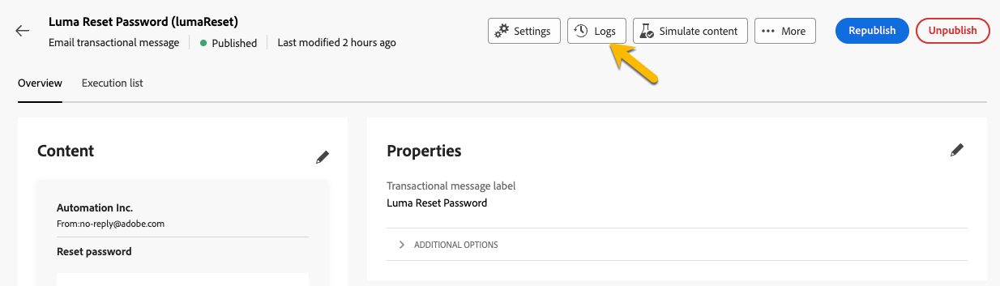
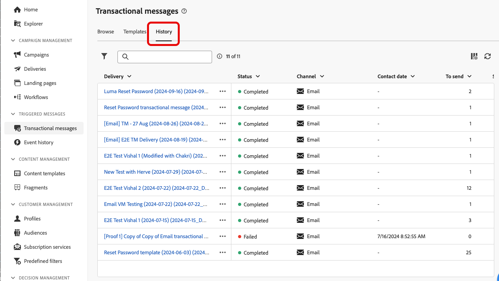

# 監視異動訊息

在發佈及傳送交易式訊息後，您可以擁有其相關報表和記錄。

## 異動訊息記錄 {#transactional-logs}

發佈訊息後，您可以按一下&#x200B;**[!UICONTROL 記錄檔]**&#x200B;按鈕來檢閱訊息的執行。

{zoomable="yes"}

這可讓您存取&#x200B;**[!UICONTROL 個記錄]**&#x200B;索引標籤中訊息發佈的詳細記錄。

{zoomable="yes"}

此外，您還可以在對應的索引標籤中檢視連同記錄一起傳送的&#x200B;**[!UICONTROL 校樣]**&#x200B;清單。

## 異動訊息歷史記錄 {#transactional-history}

在&#x200B;**[!UICONTROL 觸發訊息]**&#x200B;區段中，您可以檢視所有已執行交易式訊息的相關詳細資訊。 若要存取此專案，請瀏覽至&#x200B;**[!UICONTROL 異動訊息]**。 在&#x200B;**[!UICONTROL 歷程記錄]**&#x200B;標籤中，您可以檢視已執行的交易式訊息清單及其狀態和其他資訊。

{zoomable="yes"}

在該處進行研究以尋找您的訊息並按一下。
您可以在該處檢視詳細資訊。

{zoomable="yes"}

## 事件歷史記錄 {#event-history}

>[!CONTEXTUALHELP]
>id="acw_transacmessages_eventhistory"
>title="異動訊息事件歷史記錄"
>abstract="您可以檢視觸發交易式訊息的事件。"

>[!CONTEXTUALHELP]
>id="acw_transacmessages_eventhistory_preview"
>title="異動訊息事件歷史記錄預覽"
>abstract="您可以檢視觸發交易式訊息的事件。"

您也可以檢視觸發交易式訊息的事件。
若要檢視，請移至**[!UICONTROL 事件歷史記錄]**&#x200B;區段。

您可以使用事件型別名稱來檢視它們。

{zoomable="yes"}

按一下&#x200B;**[!UICONTROL Event]** ID即可取得詳細資訊，如下所示：

* 聯絡資訊
* 關於處理日期的一切

您甚至可以預覽透過&#x200B;**[!UICONTROL 預覽]**&#x200B;按鈕傳送的訊息，並使用&#x200B;**[!UICONTROL 檢視資料]**&#x200B;按鈕檢視所收到的觸發訊息的資料。

{zoomable="yes"}

**[!UICONTROL 更多]**&#x200B;按鈕可讓您刪除事件歷程記錄。
