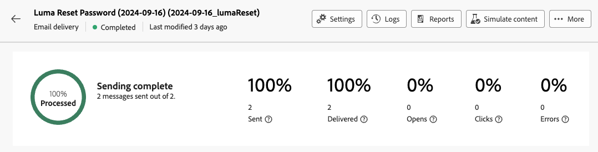
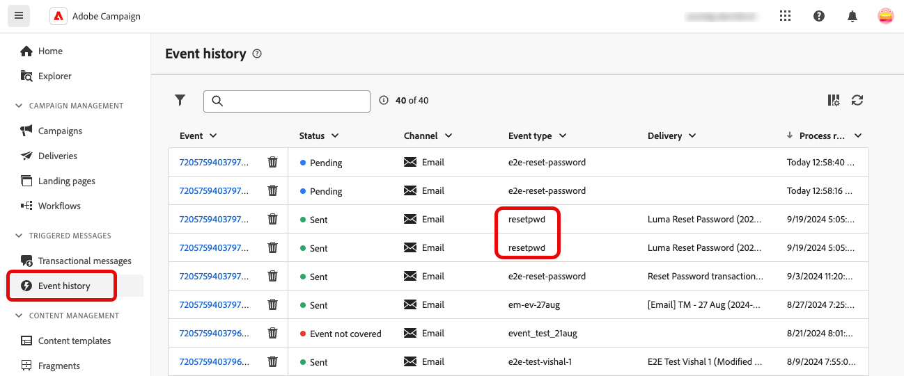
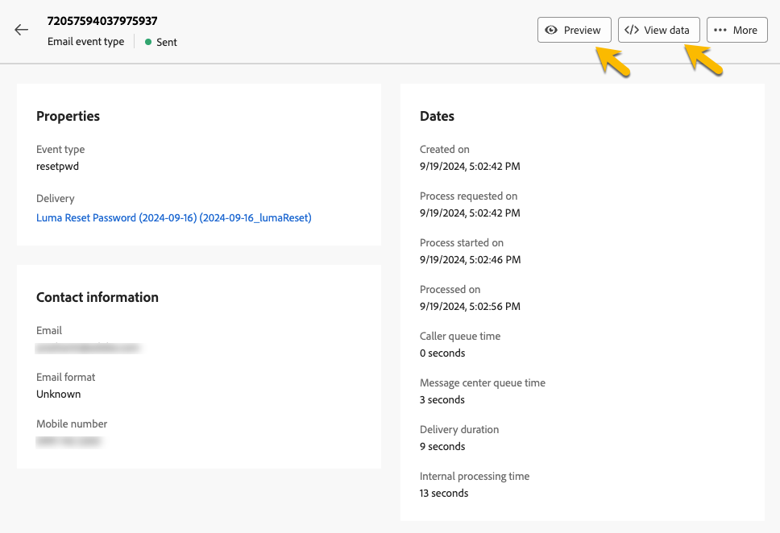

# 監視交易型訊息

發佈並傳送交易式訊息後，您可以存取與其相關的報表和記錄。

## 異動訊息記錄 {#transactional-logs}

發佈訊息後，按一下&#x200B;**[!UICONTROL 記錄檔]**&#x200B;按鈕以檢閱訊息的執行。

![在交易式訊息介面中顯示[記錄]按鈕的熒幕擷圖。](assets/transactional-logs.png){zoomable="yes"}

這可讓您存取&#x200B;**[!UICONTROL 記錄]**&#x200B;索引標籤中有關訊息發佈的詳細記錄。

![熒幕擷圖顯示[記錄]索引標籤中的詳細記錄清單。](assets/transactional-logslist.png){zoomable="yes"}

此外，在對應索引標籤中檢視連同記錄一起傳送的&#x200B;**[!UICONTROL 校樣]**&#x200B;清單。

## 異動訊息歷史記錄 {#transactional-history}

在&#x200B;**[!UICONTROL 觸發訊息]**&#x200B;區段中，檢視所有已執行交易式訊息的詳細資料。 若要存取此專案，請瀏覽至&#x200B;**[!UICONTROL 異動訊息]**。 在&#x200B;**[!UICONTROL 歷程記錄]**&#x200B;標籤中，檢視已執行的交易式訊息清單及其狀態和其他資訊。

![熒幕擷圖顯示[歷程記錄]索引標籤，其中包含已執行的交易式訊息清單。](assets/transactional-history.png){zoomable="yes"}

搜尋您的訊息，然後按一下該訊息以檢視其詳細資料。

{zoomable="yes"}

## 事件歷史記錄 {#event-history}

>[!CONTEXTUALHELP]
>id="acw_transacmessages_eventhistory"
>title="交易型傳訊事件歷史記錄"
>abstract="您可以檢視觸發交易型訊息的事件。"

>[!CONTEXTUALHELP]
>id="acw_transacmessages_eventhistory_preview"
>title="交易型傳訊事件歷史記錄預覽"
>abstract="您可以檢視觸發交易型訊息的事件。"

您可以檢視觸發交易式訊息的事件。 若要存取它們，請移至&#x200B;**[!UICONTROL 事件歷史記錄]**&#x200B;區段。

事件會顯示其事件型別名稱。

{zoomable="yes"}

按一下&#x200B;**[!UICONTROL Event]** ID以取得詳細資料，包括：

* 聯絡資訊
* 有關處理日期的資訊

使用&#x200B;**[!UICONTROL 預覽]**&#x200B;按鈕預覽傳送的訊息，並使用&#x200B;**[!UICONTROL 檢視資料]**&#x200B;按鈕檢視觸發訊息的已接收資料。

{zoomable="yes"}

**[!UICONTROL 更多]**&#x200B;按鈕可讓您刪除事件歷程記錄。