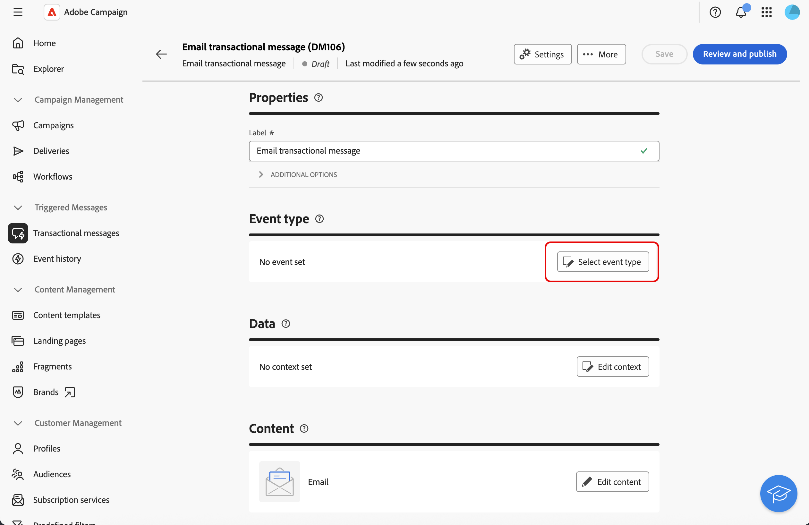
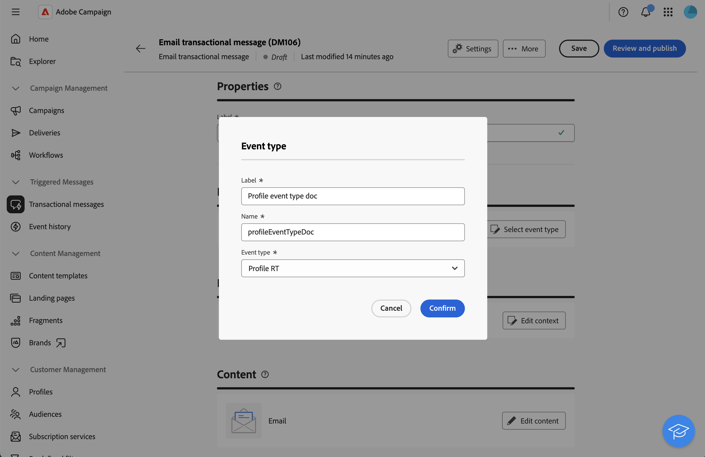
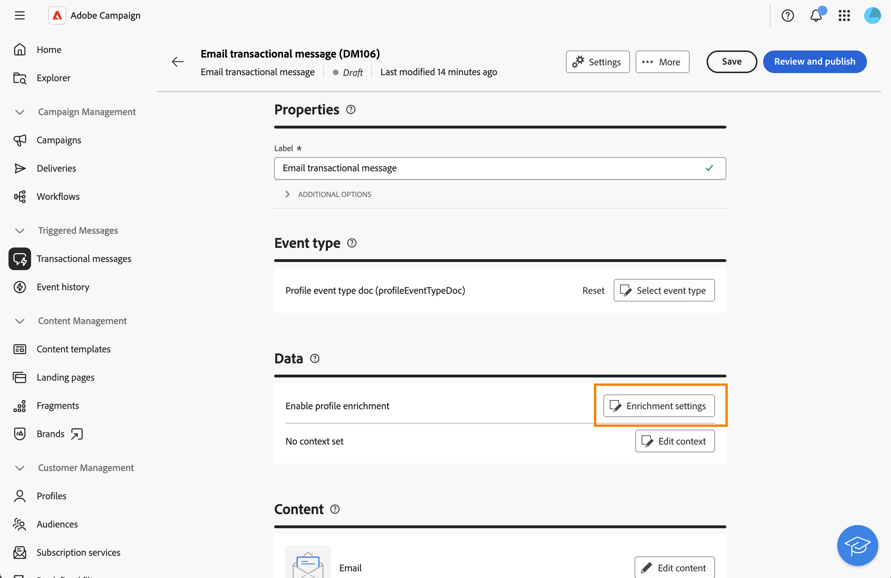
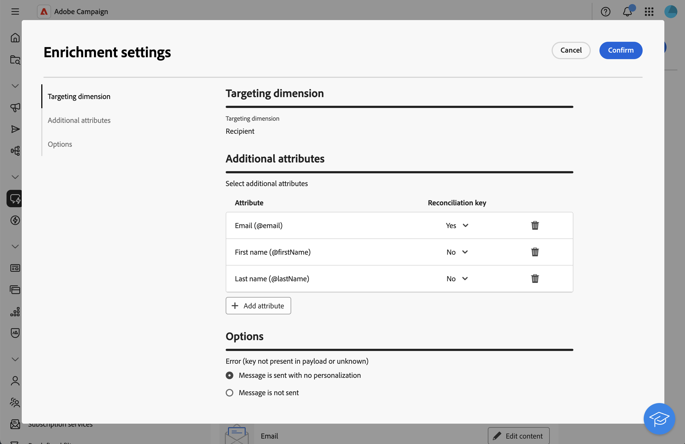
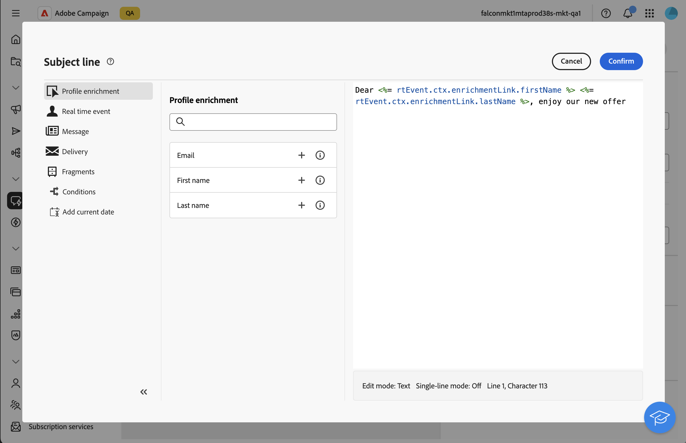

# 使用輪廓資料來擴充交易型訊息{#profile-enrichment}

>[!CONTEXTUALHELP]
>id="acw_homepage_welcome_rn2"
>title="輪廓擴充"
>abstract="您現在可以將Campaign資料庫欄位連結至內容，以個人化交易式訊息。 選取目標對應、擴充欄及調解金鑰，以精確即時個人化。"
>additional-url="https://experienceleague.adobe.com/docs/campaign-web/v8/release-notes/release-notes.html?lang=zh-hant" text="請參閱發行說明"

此功能可讓您將Adobe Campaign資料庫欄位連結至訊息內容，以個人化異動訊息。 您可以選取目標對應、擴充欄和調和索引鍵，以確保準確且即時的個人化，同時維持績效臨界值。

* 事件型交易式訊息會使用事件本身包含的資料。
* 設定檔交易式訊息使用Adobe Campaign資料庫中包含的資料。

若要設定設定檔擴充，請遵循下列主要步驟：

1. 建立交易式訊息，[瞭解詳情](#create-enrichment)
1. 定義事件型別，[瞭解詳情](#event-enrichment)
1. 設定擴充設定，[瞭解詳情](#settings-enrichment)
1. 定義內容，[瞭解詳情](#content-enrichment)
1. 驗證並傳送，[瞭解詳情](#send-enrichment)

>[!NOTE]
>
>您的伺服器必須升級至8.8.2或更新版本。
>
>此功能目前僅適用於電子郵件、簡訊和推播通知。

## 建立交易式訊息{#create-enrichment}

首先，您需要建立新的交易式訊息。

1. 在&#x200B;**[!UICONTROL 觸發訊息]**&#x200B;區段中，移至&#x200B;**[!UICONTROL 異動訊息]**&#x200B;並建立新的異動訊息。

   {zoomable="yes"}

1. 選擇範本並定義屬性。 如需關於此項目的詳細資訊，請參閱此[頁面](create-transactional.md#transactional-message)。

## 定義事件型別{#event-enrichment}

然後，您需要將事件定義為以設定檔為基礎，以定位Adobe Campaign資料庫中包含的資料。

1. 在&#x200B;**事件型別**&#x200B;區段中，選取&#x200B;**選取事件型別**，然後選擇您要使用現有的事件型別或是建立您自己的事件型別。

   >[!NOTE]
   >
   >您無法選擇已用於其他交易式訊息範本的事件型別。

   {zoomable="yes"}

1. 輸入事件型態資訊：

   * 若為現有事件型別，請從清單中選取它。
   * 若是新的標籤，請新增標籤和名稱。

1. 然後，在&#x200B;**事件型別**&#x200B;下拉式清單中選擇&#x200B;**設定檔RT**。

   {zoomable="yes"}

## 設定擴充設定{#settings-enrichment}

現在，讓我們新增欄位至事件，讓您個人化交易式訊息。

1. 在&#x200B;**資料**&#x200B;區段中，按一下&#x200B;**擴充設定**。

   {zoomable="yes"}

   >[!NOTE]
   >
   >此按鈕僅在您定義設定檔式事件時可用。

1. 在&#x200B;**其他屬性**&#x200B;區段中，按一下&#x200B;**新增屬性**&#x200B;並選取所需的欄位。

   {zoomable="yes"}

1. 定義將用作調解金鑰的屬性。

1. 選擇當承載中無法使用金鑰時應發生的情況。

   * 傳送的訊息沒有個人化
   * 訊息未傳送

## 定義內容{#content-enrichment}

然後，您需要定義交易式訊息的內容。

1. 在&#x200B;**內容**&#x200B;區段中，按一下&#x200B;**編輯內容**&#x200B;按鈕並定義您的訊息內容。 請參見此[頁面](create-transactional.md#transactional-content)。

   {zoomable="yes"}

1. 使用個人化時，例如在主旨列上，使用&#x200B;**設定檔擴充**&#x200B;功能表來新增先前定義的設定檔欄位。

   {zoomable="yes"}

## 驗證並傳送{#send-enrichment}

最後，您需要驗證並傳送傳遞。

1. 模擬內容和傳送校樣以驗證傳遞。 請參見此[頁面](validate-transactional.md)。

1. 按一下&#x200B;**[!UICONTROL 檢閱並發佈]**&#x200B;按鈕以建立並發佈訊息。 觸發器現在可以起始交易式訊息的傳送。

<!--
When creating the event configuration, select the Profile event targeting dimension (see Creating an event).

Add fields to the event, in order to be able to personalize the transactional message (see Defining the event attributes). You must add at least one field to create an enrichment. You do not need to create other fields such as First name and Last name as you will be able to use personalization fields from the Adobe Campaign database.

Create an enrichment in order to link the event to the Profile resource (see Enriching the event) and select this enrichment as the Targeting enrichment.

IMPORTANT
This step is mandatory for profile-based events.
Preview and publish the event (see Previewing and publishing the event).

When previewing the event, the REST API does not contain an attribute specifying the email address, mobile phone, or push notification specific attributes, as it will be retrieved from the Profile resource.

Once the event has been published, a transactional message linked to the new event is automatically created. In order for the event to trigger sending a transactional message, you must modify and publish the message that was just created…

Integrate the event into your website (see Integrate the event triggering).
-->
