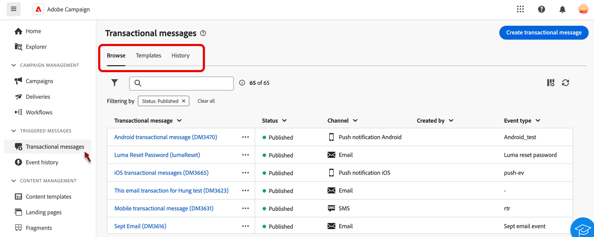

# 關於異動訊息傳送 {#transactional-messaging}

>[!CONTEXTUALHELP]
>id="acw_transacmessages"
>title="交易型訊息傳遞功能"
>abstract="異動訊息是Adobe Campaign中的專門模組，用於處理觸發式訊息。"

<!-- >>[!CONTEXTUALHELP]
>id="acw_transacmessages_exclusionlogs"
>title="Transactional messaging exclusion logs"
>abstract="Transactional messaging exclusion logs" -->

異動訊息是Adobe Campaign中的專門模組，用於處理觸發式訊息。 這些訊息會自動產生，以回應來自資訊系統的事件。 這類事件的常見範例包括按一下按鈕或連結、放棄購買、要求產品可用性警示、建立或修改帳戶等。

交易式訊息用於傳送：

* 重要通知，例如訂單確認或密碼重設
* 即時回應客戶動作（例如建立帳戶、完成購買），
* 對客戶互動至關重要的非促銷內容。

異動訊息模組可與您的資訊系統緊密整合。 事件（例如客戶動作）會推送至Adobe Campaign，以傳送相對應的個人化訊息。 這些訊息可以個別傳送，或透過電子郵件、簡訊或推播通知等各種通道批次傳送。

您可以在&#x200B;**[!UICONTROL 觸發訊息]**&#x200B;區段中找到&#x200B;**[!UICONTROL 交易式訊息]**&#x200B;模組。

{zoomable="yes"}

**[!UICONTROL 異動訊息]**&#x200B;頁面中有3個索引標籤：

* **[!UICONTROL 瀏覽]**&#x200B;您有交易式訊息清單及其狀態，
* **[!UICONTROL 範本]**，您可在此找到及建立異動訊息範本，
* **[!UICONTROL 歷程記錄]**，其中包含所有已執行之交易式訊息的詳細資料。

在本檔案中瞭解如何：

* [在範本的協助下建立異動訊息](create-transactional.md)，並學習所需的設定，
* [驗證交易式訊息的內容](validate-transactional.md)並模擬個人化，
* [監視您的異動訊息](monitor-transactional.md)。
