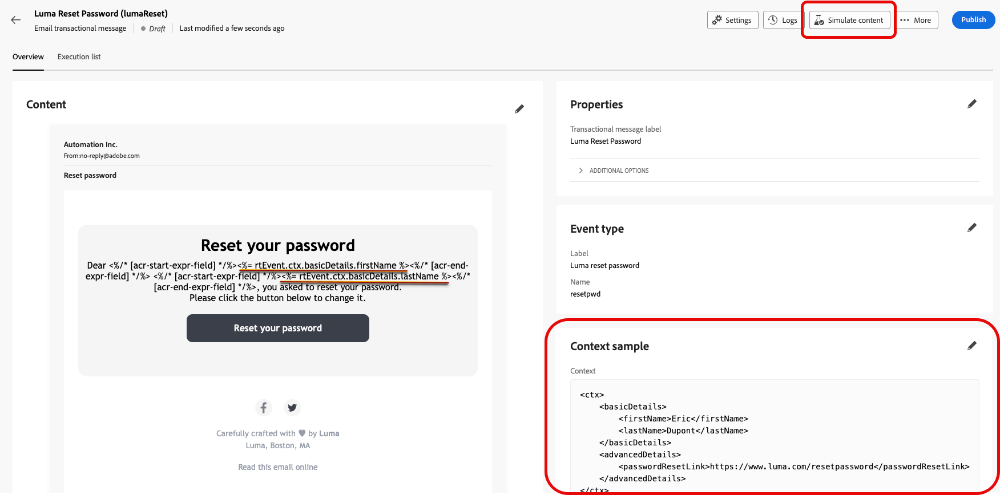
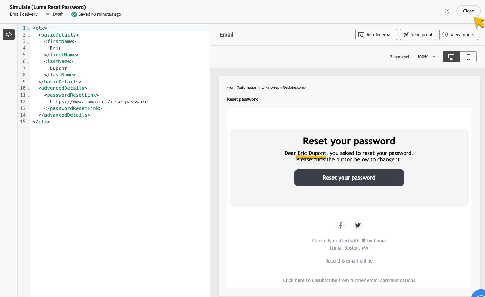
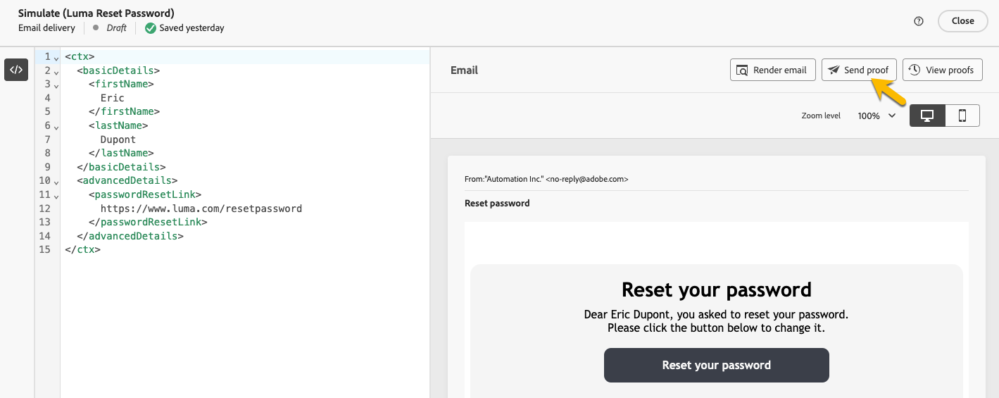
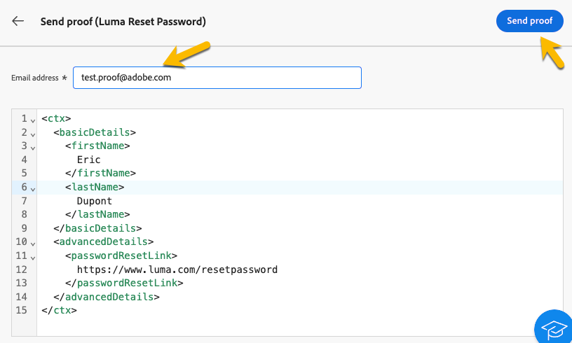

# 驗證異動訊息

在建立交易式訊息期間或之後，您可能會想要使用資料範例來驗證內容。

## 模擬內容 {#simulate-content}

請依照下列步驟模擬訊息的內容：

* 確保訊息內容中的個人化路徑符合內容範例。 在下列範例中，為了顯示測試設定檔的名字，我們使用路徑&#x200B;*rtEvent.ctx.basicDetails.firstName*

  您可以變更訊息內容或內容範例，使其對齊。

  {zoomable="yes"}

* 按一下&#x200B;**[!UICONTROL 模擬內容]**&#x200B;按鈕，使用您在內容範例中輸入的資料預覽交易式訊息。

  {zoomable="yes"}

  檢查內容後，按一下&#x200B;**[!UICONTROL 關閉]**&#x200B;按鈕。

* 如果您對內容進行任何變更，請勿忘記按一下&#x200B;**[!UICONTROL 重新發佈]**&#x200B;按鈕。

## 傳送校樣

如果您想要測試和體驗交易式訊息，就像透過您選擇的通道傳送一樣（例如電子郵件、簡訊或推播通知），則可以使用校樣功能。

在[模擬內容視窗](#simulate-content)中，按一下&#x200B;**[!UICONTROL 傳送校樣]**&#x200B;按鈕。

{zoomable="yes"}

在出現的新視窗中，輸入您要接收校樣的電子郵件地址（或電話號碼，視頻道而定）。 輸入想要的地址後，按一下&#x200B;**[!UICONTROL 傳送校樣]**&#x200B;和&#x200B;**[!UICONTROL 確認]**&#x200B;按鈕。 此動作可讓您傳送交易式訊息的範例，確保所有個人化、動態內容和格式正確顯示給一般使用者。

{zoomable="yes"}

這是在發佈交易式訊息之前識別任何潛在問題的必要步驟。
