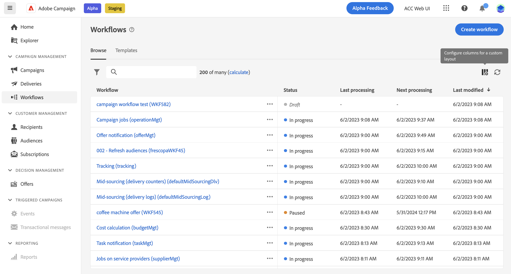

# 存取和管理工作流程 {#access-monitor}

>[!CONTEXTUALHELP]
>id="acw_targeting_workflow_list"
>title="工作流程"
>abstract="在此畫面中，您可以存取獨立工作流程和行銷活動工作流程的完整清單、檢查其目前狀態、上次/下次執行日期，以及建立新的工作流程。 瀏覽到「範本」索引標籤，以存取可用的工作流程範本。"

此 **[!UICONTROL 工作流程]** 功能表可讓您存取工作流程的完整清單。 此清單包含兩者 **獨立工作流程** 已從此畫面建立，以及 **行銷活動工作流程**，這些名稱已在行銷活動中建立。

清單中的每個工作流程都會顯示其目前的相關資訊 [狀態](#status)、上次執行或修改的時間，以及下一個排程的執行日期和時間。

您可以按一下 **[!UICONTROL 設定自訂配置的欄]** 圖示加以顯示。 這可讓您新增其他資訊至清單，例如每個工作流程出現錯誤的最後一個活動，或套用的目標維度。

此外，還提供搜尋列和篩選器，以便於在清單中輕鬆搜尋。 例如，您可以篩選工作流程，以僅顯示屬於某個行銷活動的工作流程，或顯示在特定日期範圍內處理的工作。

若要複製或刪除工作流程，請按一下省略符號按鈕，然後選取 **[!UICONTROL 複製]** 或 **[!UICONTROL 刪除]**.

>[!NOTE]
>
>您可以複製進行中的工作流程，但無法刪除它。

## 工作流程的狀態 {#status}

工作流程可以有多個狀態：

* **[!UICONTROL 草稿]**：工作流程已建立並儲存。
* **[!UICONTROL 進行中]**：工作流程目前正在執行。
* **[!UICONTROL 已完成]**：工作流程執行完成。
* **[!UICONTROL 已暫停]**：工作流程已暫停。
* **[!UICONTROL 錯誤]**：工作流程發生錯誤。 開啟工作流程並存取記錄檔和任務，以識別錯誤並加以解決。 [瞭解如何監視記錄檔和任務](start-monitor-workflows.md#logs-tasks)

有關如何開始和監控工作流程執行的詳細資訊，請參閱 [此頁面](start-monitor-workflows.md).

## 工作流程範本 {#templates}

此 **[!UICONTROL 範本]** 標籤會列出所有可用的工作流程範本。

工作流程範本包含預先設定的活動和整體屬性設定，可重複用於建立新工作流程。 從使用者端主控台建立。 [瞭解如何使用範本](https://experienceleague.adobe.com/docs/campaign/automation/workflows/introduction/build-a-workflow.html#workflow-templates)
