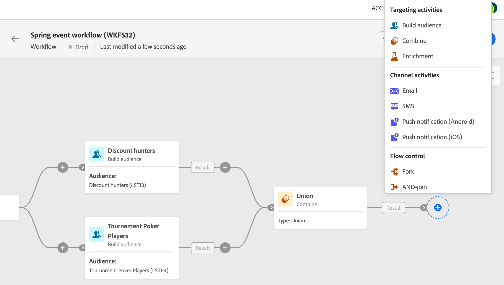

# 關於工作流程活動 {#workflow-activities}

工作流程活動可歸類為三個類別。可用的活動可能會依據內容而有所不同。

以下各節會詳細介紹所有活動：

* [目標定位活動](#targeting)
* [管道活動](#channel)
* [流程控制活動](#flow-control)

## 目標定位活動 {#targeting}

這些活動專門針對目標定位、操控和擴充母體資料。這些活動可讓您使用交集、聯合或排除作業定義對象並分割或結合這些對象，從而建置一個或多個目標。

* 此 [儲存對象](save-audience.md) 活動可讓您更新現有的對象，或是從工作流程中的母體運算上游建立新的對象。
* 「[建置對象](build-audience.md)」活動可讓您定義目標母體。您可以選取現有對象或使用規則產生器定義自己的查詢。
* 「[組合](combine.md)」活動則可讓您對傳入母體執行分段。您可以使用聯合、交集或排除。
* [分割](split.md)活動可讓您將傳入母體分割到幾個子集。
* 「[擴充](enrichment.md)」活動可讓您定義要在工作流程中處理的其他資料。透過此活動，您可以利用傳入轉變並設定活動，以使用其他資料完成傳出轉變。
* 此 [重複資料刪除](deduplication.md) 活動可讓您刪除入站活動結果中的重複專案。
* 此 [變更維度](change-dimension.md) 活動可讓您在建立工作流程時變更目標維度。

## 管道活動 {#channel}

Adobe Campaign Web 讓您能夠跨多個管道 (例如電子郵件、簡訊或推播) 自動執行行銷活動。您可以將管道活動組合到畫布中，建立可根據客戶行為觸發動作的跨管道工作流程。

下列「**管道**」活動已推出：

* 電子郵件
* 推播
* 簡訊

請參閱本[章節](channels.md)。

## 流程控制活動 {#flow-control}

>[!CONTEXTUALHELP]
>id="acw_orchestration_end"
>title="結束活動"
>abstract="「**結束**」活動可讓您以圖形方式標記工作流程的終點。此活動並不會造成任何功能性影響，因此為選用。"

下列活動僅限於整理和執行工作流程。這些活動的主要任務是協調其他活動：

* 此 [排程器](scheduler.md) 活動可讓您排程工作流程何時開始。
* [合併連結](and-join.md)活動可讓您同步處理工作流程的多個執行分支。
* 「**結束**」活動可讓您以圖形方式標記工作流程的終點。此活動並不會造成任何功能性影響，因此為選用。
* [分支](fork.md)活動可讓您建立傳出轉變，以同時啟動多個活動。
* [等待](wait.md)活動會短暫地暫停執行工作流程的一部分。

<!--
## Data management activities {#data-management}

overview: what they're used for
which use case you can perform with them

list available activites + short description + ref to section
-->

