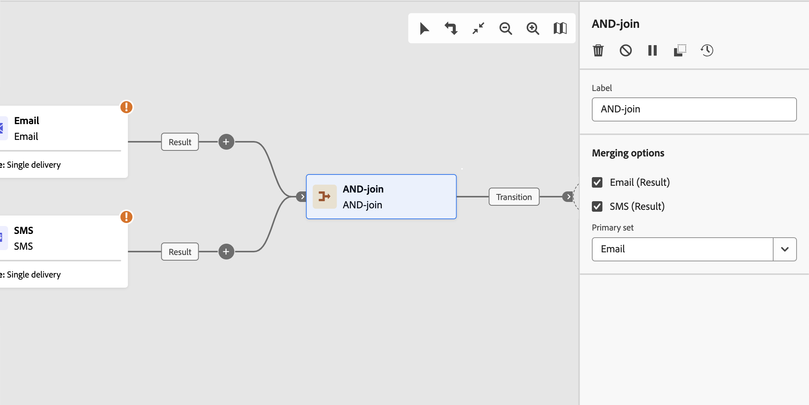

# 合併連結 {#join}

>[!CONTEXTUALHELP]
>id="acw_orchestration_and-join"
>title="合併連結活動"
>abstract="**合併連結**&#x200B;活動可讓您同步處理工作流程的多個執行分支。一旦所有前面的活動完成，就會觸發此活動。這樣能確保特定活動已完成後再繼續執行工作流程。"

「**合併連結**」活動是一種&#x200B;**流程控制**&#x200B;活動。它會同步工作流程的多個執行分支。

只有在啟動所有入站轉變後，此活動才會觸發其出站轉變。 換言之，它會在所有先前的活動完成後啟動。 這可確保在繼續執行工作流程之前已完成某些活動。

## 設定合併連結活動 {#and-join-configuration}

>[!CONTEXTUALHELP]
>id="acw_orchestration_and-join_merging"
>title="合併選項"
>abstract="選取您要參加的活動。在「**主要集合**」下拉選單中，選擇您要保留的傳入轉變群體。"

請按照以下步驟設定「**合併連結**」活動：

1. 新增多個活動（例如管道活動）以形成至少兩個不同的執行分支。
1. 新增「**合併連結**」活動至任何分支。
1. 在&#x200B;**合併選項**&#x200B;區段中，勾選所有先前要加入的活動。
1. 在&#x200B;**主要集**&#x200B;下拉式清單中，選擇要保留的入站轉變母體。 傳出轉變只能包含其中一個傳入轉變群體。

## 範例 {#and-join-example}

以下範例顯示兩個工作流程分支，各包含電子郵件和簡訊傳遞。同時啟用兩個入站轉變時，就會觸發AND — 聯結。 推播通知只會在兩個傳送完成後傳送。

{zoomable="yes"}