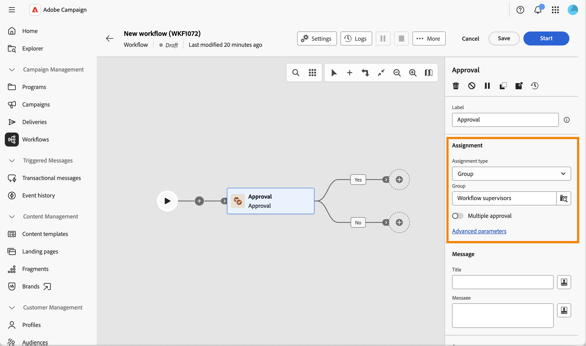

# 核准 {#approval}

>[!CONTEXTUALHELP]
>id="acw_orchestration_approval"
>title="核准活動"
>abstract="**核准**&#x200B;活動需要運運算元的參與。 將任務指派給群組或個別運運算元、自訂通知標題和訊息，並將可能的答案定義為輸出分支。"

**核准**&#x200B;工作流程活動可讓您將任務指派給群組或個別操作員、自訂通知電子郵件標題和訊息，並將可能的答案（例如「是/否」）定義為輸出分支。

工作流程中的步驟在繼續之前需要人為決策時，例如為了在工作流程繼續之前取得預算、目標對象或內容的簽核，請使用此活動。

## 核准流程的運作方式 {#process}

至少需要一位運運算元的參與。 此活動不會封鎖工作流程：其他工作可在工作流程等待回覆時執行。

在等待答案時，活動會在畫布上顯示為「擱置中」。 受指派人使用通知訊息中所包含的連結進行回應。

以下是核准工作流程：

1. 建立工作流程並設定&#x200B;**核准**&#x200B;活動。
1. 啟動工作流程。 當達到&#x200B;**核准**&#x200B;活動時，就會為受指派人建立任務。
1. 受分派者會收到通知訊息，按一下連結並選取答案。
1. 一旦受指派人回覆，工作流程就會繼續進行與其答案相符的轉變。

若要設定此活動，請遵循下列步驟：

1. 指派工作，[瞭解詳情](#assignment)
1. 定義通知訊息，[瞭解詳情](#message)
1. 定義可能的答案，[瞭解詳情](#answers)
1. 可選擇定義有效期，[瞭解詳情](#expiration)

## 指派任務 {#assignment}

將任務指定給群組或運運算元是必要的：在您指定前，系統會顯示警告。

{zoomable="yes"}之指派區段的熒幕擷圖

請依照下列步驟操作：

1. 在&#x200B;**[!UICONTROL 指派型別]**&#x200B;欄位中，選擇工作指派給&#x200B;**[!UICONTROL 群組]** （預設）或&#x200B;**[!UICONTROL 運運算元]**。

1. 然後選取&#x200B;**[!UICONTROL 群組]** （運運算元）或&#x200B;**[!UICONTROL 運運算元]** （單一運運算元）。

1. 若要讓每個受指派人在工作流程繼續之前回覆，請啟用&#x200B;**[!UICONTROL 多重核准]**。 無論指派型別為何，皆可使用此選項。 停用時，工作流程會在任何一位受指派人回覆時立即繼續，而該回覆是納入考量的回覆。

1. 按一下&#x200B;**[!UICONTROL 進階引數]**&#x200B;以選取用於通知的傳遞範本。 預設會使用內建範本，但您可以選取任何其他傳遞範本。

   {zoomable="yes"}

## 定義通知訊息 {#message}

您現在可以定義傳送給受指派人的通知訊息。

{zoomable="yes"}訊息區段的熒幕擷圖

請依照下列步驟操作：

1. 定義傳送給受指派人之通知的&#x200B;**[!UICONTROL 標題]**。

1. 定義傳送給受指派人之通知的&#x200B;**[!UICONTROL 訊息]**。

這兩個欄位都支援個人化：按一下個人化圖示以插入事件變數，例如已回覆&#x200B;]**的**[!UICONTROL &#x200B;運運算元和&#x200B;**[!UICONTROL 回應]**，您可以在工作流程的其他地方重複使用它們。

{zoomable="yes"}

## 定義可能的答案 {#answers}

此活動有兩個預設答案，**[!UICONTROL 是]**&#x200B;和&#x200B;**[!UICONTROL 否]**。 每個答案都對應到畫布上的輸出轉變。

![顯示[核准]活動](../assets/workflow-approval3.png){zoomable="yes"}之[回答]區段的熒幕擷圖

按一下&#x200B;**[!UICONTROL 新增答案]**&#x200B;以定義其他選項。

當受指派人回答時，工作流程會繼續透過與其選擇相符的轉變。

## 定義有效期 {#expiration}

最後，您可以定義核准任務的到期日。 就像答案一樣，如果受指派人未在截止日期前回覆，則過期會觸發自己的輸出轉換。

{zoomable="yes"}到期區段的熒幕擷圖

1. 按一下&#x200B;**[!UICONTROL 新增到期日]**。

1. 為對應的輸出轉變定義&#x200B;**[!UICONTROL 標籤]**。

1. 在&#x200B;**[!UICONTROL 到期型別]**&#x200B;下拉式清單中，選擇下列其中一個選項：

   * **[!UICONTROL 工作開始後的延遲]**：定義核准工作開始後的延遲。
   * **[!UICONTROL 在日期之後延遲]**：定義在特定日期之後等待的延遲。
   * **[!UICONTROL 在日期之前延遲]**：定義在特定日期之前等待的延遲。
   * 由指令碼計算的&#x200B;**[!UICONTROL 有效期]**：使用指令碼計算有效期。

1. 啟用&#x200B;**[!UICONTROL 如果您希望在不結束核准任務的情況下啟動到期轉換，則不要終止任務]**，這樣受指派人仍然可以在之後回覆。

您可以為相同的核准任務定義多個有效期。

接著，您就可以啟動工作流程。 一旦受指派人回覆，工作流程就會繼續進行與其答案相符的轉變。 [閱讀更多](#process)

## 相關主題 {#related}

* [關於工作流程活動](about-activities.md)
* [設定及管理核准流程](../../campaigns/campaign-approvals.md)
